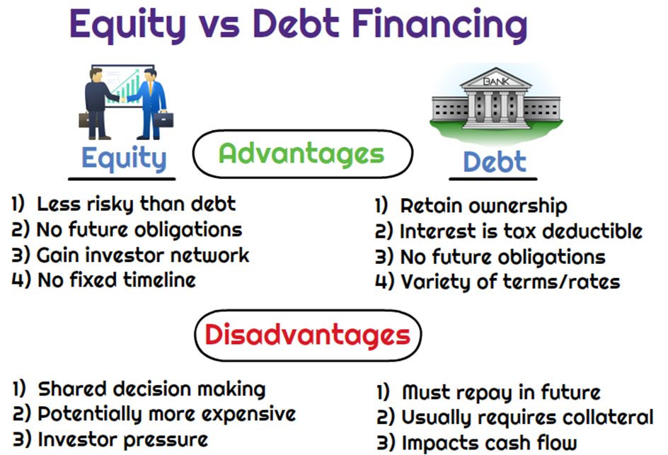

## Table of Contents

## What is equity financing?

Equity financing is when a company raises money by selling shares of its business to investors. Instead of borrowing money that needs to be paid back, the company gives a portion of ownership to the people who buy the shares. These investors become part-owners of the company and can benefit if the company does well, but they also share the risk if the company doesn't perform as expected.

This type of financing is often used by startups and growing businesses that may not have enough assets or steady income to borrow money from a bank. By selling shares, these companies can get the cash they need to grow without taking on debt. However, giving up some control and ownership can be a downside for the original owners, as they now have to share decision-making with the new shareholders.

## What is debt financing?

Debt financing is when a company borrows money that it needs to pay back over time, usually with interest. This is like taking out a loan from a bank or issuing bonds to investors. The company agrees to pay back the borrowed amount, plus interest, on a set schedule. This way, the company gets the money it needs without giving up any ownership.

The main advantage of debt financing is that the company keeps full control because it doesn't have to share ownership with investors. However, it also means the company has to make regular payments, which can be tough if the business isn't doing well. If the company can't pay back the debt, it could face serious problems, like going bankrupt. So, while debt financing can help a company grow, it also comes with risks.

## What are the basic differences between equity and debt financing?

Equity financing and debt financing are two different ways for a company to get money. With equity financing, a company sells shares of its business to investors. This means the investors become part-owners of the company. They don't get their money back directly, but they can make money if the company does well. The company doesn't have to pay them back, but it does have to share profits and decision-making with the new owners.

On the other hand, debt financing is like taking out a loan. The company borrows money and has to pay it back with interest over time. The company keeps full control and doesn't have to share ownership with anyone. But, it has to make regular payments, which can be hard if the business isn't doing well. If the company can't pay back the loan, it could face serious problems, like going bankrupt.

In simple terms, equity financing is about sharing ownership and profits, while debt financing is about borrowing money and paying it back with interest. Each has its own advantages and risks, and companies choose based on what's best for their situation.

## How does equity financing impact company ownership?

When a company uses equity financing, it sells shares to investors. This means the investors get a piece of the company. They become part-owners, which changes who owns the company. Before, maybe just a few people owned the whole business. Now, there are more owners because of the new shareholders.

This change in ownership can affect how the company is run. The original owners might have to share big decisions with the new shareholders. They might not have as much control as before. But, the good thing is, the company doesn't have to pay back the money it got from selling shares. Instead, the new owners hope to make money if the company does well.

## What are the interest obligations associated with debt financing?

When a company uses debt financing, it borrows money and has to pay it back with extra money called interest. The interest is like a fee for borrowing the money. The company agrees to make regular payments, which include both the money they borrowed and the interest. These payments are usually made every month or every year, depending on the agreement with the lender.

If the company doesn't make these payments on time, it can get into big trouble. The lender might take away things the company owns, like buildings or equipment, to get their money back. This is called defaulting on the loan. It's a big risk because it can lead to the company going bankrupt if they can't pay back what they owe. So, debt financing means the company must be sure it can make those interest payments to avoid serious problems.

## What are the advantages of using equity financing for a startup?

One big advantage of using equity financing for a startup is that it doesn't have to pay back the money it gets from investors. This can be a huge help for a new business that might not have a lot of money coming in yet. Instead of worrying about making loan payments, the startup can use all its money to grow and build the business. This can be a lot less stressful than trying to pay back a loan every month.

Another advantage is that investors who buy shares often bring more than just money to the table. They might have experience and connections that can help the startup succeed. These investors can give advice, introduce the startup to important people, and help it grow faster. So, by using equity financing, a startup not only gets the money it needs but also valuable support and guidance from its new shareholders.

## How does debt financing affect a company's credit rating?

When a company uses debt financing, it borrows money and has to pay it back with interest. This can affect the company's credit rating, which is like a score that shows how good the company is at paying back what it owes. If the company makes all its payments on time, its credit rating might go up. A good credit rating can help the company get more loans in the future with better terms, like lower interest rates.

But, if the company misses payments or can't pay back the debt, its credit rating can go down. A lower credit rating makes it harder for the company to borrow money later. Lenders might see the company as a bigger risk and might charge higher interest rates or not lend money at all. So, debt financing can help a company grow, but it also comes with the risk of hurting its credit rating if things don't go well.

## What are the tax implications of choosing debt over equity financing?

When a company chooses debt financing, it has to pay interest on the money it borrows. The good thing is, the company can usually deduct this interest from its taxes. This means the company pays less in taxes because the interest payments lower its taxable income. So, debt financing can save the company some money on taxes, which can be a big help.

On the other hand, with equity financing, the company doesn't pay interest. Instead, it might pay dividends to its shareholders. But, the company can't deduct these dividends from its taxes like it can with interest payments. So, equity financing doesn't give the company the same tax break that debt financing does. This is something companies think about when deciding which type of financing to use.

## How do equity and debt financing influence a company's financial leverage?

When a company uses debt financing, it borrows money and has to pay it back with interest. This increases the company's financial leverage, which means it's using borrowed money to try to make more money. More debt means more risk because the company has to make regular payments. If the company can't pay back the debt, it could face big problems like going bankrupt. But, if the company does well, using debt can make its profits grow faster because it's using other people's money to expand.

On the other hand, equity financing doesn't increase a company's financial leverage in the same way. When a company sells shares, it gets money without having to pay it back. Instead, the investors become part-owners and share in the company's profits and losses. This means the company isn't taking on more debt, so it's not increasing its financial risk in the same way. But, it does mean the original owners have to share control and profits with the new shareholders. So, equity financing can help a company grow without adding more debt, but it changes who owns the company.

## What role do covenants play in debt financing agreements?

Covenants are rules that a company has to follow when it borrows money through debt financing. These rules are put in place by the lender to make sure the company doesn't do anything too risky with the borrowed money. For example, a covenant might say the company can't take on more debt or has to keep a certain amount of cash on hand. These rules help protect the lender's money and make sure the company can pay back the loan.

If the company breaks a covenant, it's called a covenant breach. This can be a big problem because the lender might ask for their money back right away or even take away things the company owns to get their money back. So, covenants are important because they help keep the company and the lender safe, but they can also limit what the company can do while it has the loan.

## How can the choice between equity and debt financing affect a company's valuation?

When a company chooses equity financing, it sells shares to investors. This means more people own a part of the company. If investors think the company is worth a lot, they might pay a high price for the shares. This can make the company's valuation go up because it shows people believe in the company's future. But, if the company gives away too many shares, the value of each share might go down. So, the company has to be careful about how much ownership it gives up. 

On the other hand, debt financing means the company borrows money and has to pay it back with interest. This doesn't change who owns the company, but it does add debt to the company's books. If the company can handle the debt well, it might not affect the valuation much. But, if the company has too much debt, it can look riskier to investors. This might make them think the company is worth less because they're worried about the company's ability to pay back the debt. So, the choice between equity and debt financing can really impact how investors see the company's value.

## What advanced strategies involve using a mix of equity and debt financing, and what are their potential benefits and risks?

One advanced strategy that companies use is called "hybrid financing," which mixes both equity and debt. A common example of this is issuing convertible bonds. These are bonds that can be changed into shares of the company's stock later on. This gives the company the money it needs now without giving up ownership right away. If the company does well, the bondholders might choose to convert their bonds into shares, which can help the company raise more money without taking on more debt. But, if the company doesn't do well, the bondholders might not want to convert, and the company will have to pay back the bonds with interest, just like regular debt.

The benefits of using a mix of equity and debt financing can be big. It lets a company be flexible. It can use debt to get money without giving up ownership, and it can use equity to bring in investors who might help the company grow. This mix can also help balance the company's financial risk. By using some debt, the company can take advantage of tax breaks on interest payments. And by using some equity, the company can share the risk with new shareholders. But, there are risks too. If the company can't pay back its debt, it might have to give up more ownership to raise money quickly. And if the company gives away too many shares, the value of each share might go down, which can hurt the company's valuation. So, finding the right mix is important and can be tricky.

## What are the key aspects of exploring debt financing?

Debt financing involves acquiring capital by borrowing funds that must be repaid over an agreed period, usually with interest. This method of financing is crucial for both startups and established businesses seeking to cover various operational or expansion costs without sacrificing ownership control.

Several instruments are utilized in debt financing. **Term loans** represent a prevalent form, where businesses borrow a specific sum for a predetermined repayment schedule. Interest rates on these loans can be fixed or floating. **Business lines of credit** offer more flexibility, allowing companies to borrow funds up to a predefined limit, similar to how credit cards function. This flexibility can aid in managing cash flow, particularly with non-recurring expenses. Lastly, **bonds** serve as another common tool, mostly used by larger corporations. Through bonds, companies borrow funds from investors, promising to pay back the principal amount on a specific maturity date while making periodic interest payments.

The foremost advantage of debt financing is retaining ownership. Unlike equity financing, where the issuance of shares can dilute ownership and influence, debt does not erode stakeholder control over business operations. This [factor](/wiki/factor-investing) is particularly appealing to entrepreneurs who prefer maintaining managerial autonomy.

However, the obligation of regular repayments poses significant challenges. The necessity to meet these financial commitments can place considerable stress on cash flow, especially for startups or businesses with inconsistent revenue streams. Failing to meet these obligations can lead to adverse consequences, including diminished credit ratings and potential insolvency.

On the upside, interest payments on debt instruments are typically tax-deductible. This tax advantage can alleviate some of the financial burden as the effective cost of borrowing becomes lower due to these deductions. For instance, if the corporate tax rate is $t$, the after-tax cost of debt $r_d$ can be computed using:

$$
r_d = r \times (1 - t)
$$

where $r$ is the interest rate. This formula implies that the higher the corporate tax rate, the more beneficial the tax deductibility of interest becomes.

In summary, while debt financing offers the significant advantage of ownership retention, it requires disciplined financial management to meet repayment obligations. Its appropriateness largely depends on the business's cash flow stability and its ability to leverage the tax advantages effectively.

## References & Further Reading

[1]: ["Advances in Financial Machine Learning"](https://www.amazon.com/Advances-Financial-Machine-Learning-Marcos/dp/1119482089) by Marcos Lopez de Prado

[2]: ["Evidence-Based Technical Analysis: Applying the Scientific Method and Statistical Inference to Trading Signals"](https://www.amazon.com/Evidence-Based-Technical-Analysis-Scientific-Statistical/dp/0470008741) by David Aronson

[3]: ["Machine Learning for Algorithmic Trading"](https://github.com/stefan-jansen/machine-learning-for-trading) by Stefan Jansen

[4]: ["Quantitative Trading: How to Build Your Own Algorithmic Trading Business"](https://www.amazon.com/Quantitative-Trading-Build-Algorithmic-Business/dp/1119800064) by Ernest P. Chan

[5]: Berk, J. and DeMarzo, P. (2020). ["Corporate Finance"](https://www.pearson.com/en-us/subject-catalog/p/corporate-finance/P200000005829/9780135635926) (5th Edition). Pearson Education.

[6]: Brigham, E. F., & Houston, J. F. (2018). ["Fundamentals of Financial Management"](https://books.google.com/books/about/Fundamentals_of_Financial_Management.html?id=9uUXEAAAQBAJ) (15th Edition). Cengage Learning.

[7]: Hull, J. C. (2017). ["Options, Futures, and Other Derivatives"](https://www.semanticscholar.org/paper/Options%2C-Futures%2C-and-Other-Derivatives-Hull/89bdee500c8623864fc9eb7a471546aa713acc44) (9th Edition). Pearson.