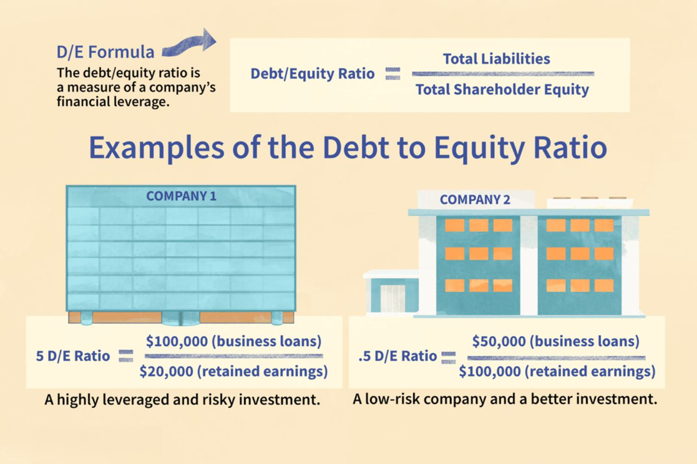

Alternative investments have become an increasingly significant component of modern investment portfolios, offering various avenues for growth beyond traditional stocks and bonds. These investments include equity investments, real estate crowdfunding, debt investments, and algorithmic trading, each presenting unique advantages and challenges. 

Equity investments traditionally involve acquiring ownership in companies through shares, providing potential dividends and capital appreciation. With the emergence of equity crowdfunding, investors can now directly fund startups and innovative projects, democratizing access to investment opportunities that were once limited to affluent individuals or institutional investors.



Real estate crowdfunding serves as a bridge between equity and debt investments, allowing individuals to invest in properties with minimal capital compared to traditional real estate investments. This model has gained traction due to platforms like Fundrise and CrowdStreet, which offer diversified real estate portfolios and access to high-quality deals through fractional ownership.

Debt investments, on the other hand, involve lending money to businesses or individuals in exchange for interest payments. This approach is generally perceived as lower risk than equity, with fixed returns and shorter holding periods. However, the advent of debt crowdfunding is changing the landscape, broadening access to various real estate and business loans.

Algorithmic trading represents the cutting edge of investment strategies, utilizing computer algorithms to execute trades with precision and speed. This technology-driven approach attempts to minimize emotional decision-making, optimize returns, and effectively manage investment risk. While promising, algorithmic trading requires a deep understanding of both technology and financial markets, posing challenges for those new to this method.

Understanding how these diverse financial strategies can enhance an investment portfolio is crucial. Each option has its own set of risks and potential rewards, requiring thorough research and due diligence. This article will provide insights into the fundamentals and complexities of each investment approach, equipping potential investors with the knowledge to navigate alternative investments and identify opportunities for portfolio growth.

## Table of Contents

## Equity Investments: A Basic Overview

Equity investments typically involve acquiring ownership stakes in a company, represented by purchasing shares. This form of investment provides investors with the potential for dividends and capital appreciation, as the value of shares may increase over time. Traditional equity investments offer the allure of unlimited potential returns, driven by a company's growth and profitability. Additionally, equity investments can offer tax advantages, such as tax-free growth within certain accounts or favorable treatment of long-term capital gains.

Equity crowdfunding, a more recent innovation in this space, is reshaping how individuals can engage in equity investments. Unlike traditional methods that often require substantial capital, equity crowdfunding platforms allow investors to fund startups and real estate projects directly with smaller amounts of money. This democratizes access to investment opportunities that were previously available only to accredited investors or institutional players.

While equity investments can be highly lucrative, they also come with inherent risks. One of the main risks associated with equity investments is market [volatility](/wiki/volatility-trading-strategies). Stock markets can fluctuate due to economic factors, company performance, and global events, impacting the value of shares. Another consideration is the longer hold periods typically associated with equity investments; unlike some other asset classes, realizing gains may require maintaining positions over several years to capitalize on growth potential fully.

Investors considering equity crowdfunding should also be aware of unique risks, such as the potential for startup failures and the illiquidity of shares in early-stage companies. Despite these risks, equity investments remain a core component of many investment portfolios, offering a blend of potential high returns and strategic tax benefits that can enhance overall financial strategies.

## Understanding Debt Investments

Debt investments, a fundamental component of financial markets, generally entail lending capital in exchange for interest returns. These investments are typically perceived as lower-risk alternatives to equity investments due to their structured interest income and priority in payment hierarchies. Investors in debt instruments can include individuals, institutions, and governments, who can provide funds to businesses, real estate projects, or other entities needing capital.

### Key Attributes of Debt Funds

Debt investments are characterized by several essential features that attract investors:

1. **Fixed Interest Returns**: Investors receive a predetermined interest rate, providing a predictable income stream. This fixed nature of returns is especially appealing in volatile market conditions, where equity returns can fluctuate significantly.

2. **Shorter Hold Periods**: Debt investments usually have shorter maturity periods than equity investments. This means investors can realize returns in a relatively quicker timeframe, providing enhanced liquidity.

3. **Capped Profit Potential**: While debt investments offer stability, their returns are capped at the interest rate agreed upon during the investment's initiation. Unlike equity investments, there is no potential for capital appreciation beyond the set interest payments.

### Debt Crowdfunding: Broadening Access

The advent of debt crowdfunding has significantly broadened access to debt investments. This innovative approach enables individuals to participate in funding ventures such as real estate developments and business expansions without the traditional barriers to entry. Platforms like LendingClub and Prosper have democratized lending, allowing investors to pool resources and provide loans to various projects.

Debt crowdfunding offers several advantages:

- **Diversification Opportunities**: By participating in multiple crowdfunding projects, investors can diversify their portfolios within the debt investment space, spreading risk across different ventures.

- **Accessible Entry Points**: Unlike traditional debt investments, which may require substantial capital, crowdfunding allows investors to contribute smaller amounts across numerous projects.

- **Direct Connections**: Investors have the opportunity to connect directly with borrowers, gaining insights into how their funds are being utilized, which may provide additional reassurance and engagement in the investment process.

Debt crowdfunding platforms also facilitate rigorous assessment processes, often evaluating potential borrowers through sophisticated algorithms, which may include credit history, business plans, and other relevant metrics. This detailed analysis helps mitigate some of the inherent risks associated with lending.

### Potential Risks

Despite their relative stability, debt investments come with inherent risks. Credit risk is a primary concern, as borrowers may default on interest payments or principal repayment. Additionally, economic factors such as rising interest rates can impact the attractiveness and performance of existing debt securities, as new issues may offer higher returns. Investors must carefully assess these risks and diversify accordingly.

Overall, debt investments present a stable component within an investment portfolio. Their structured returns, shorter hold periods, and the advent of crowdfunding platforms make them an accessible and appealing option for many investors seeking income generation and risk mitigation.

## Real Estate Crowdfunding: Bridging the Gap Between Equity and Debt

Real estate crowdfunding has emerged as an innovative investment model that provides individuals with access to real estate opportunities previously reserved for larger investors. By allowing investors to pool resources and invest in real estate projects, this approach offers both equity and debt investment options within the real estate sector.

One of the primary benefits of real estate crowdfunding is the ability for investors to enter the real estate market with a smaller capital investment compared to traditional real estate transactions, which typically require significant financial commitments. This aspect democratizes real estate investing, making it accessible to a broader range of investors. For example, instead of needing tens or hundreds of thousands of dollars to purchase a property outright, investors can participate with smaller amounts, sometimes as little as a few hundred dollars, through crowdfunding platforms.

Platforms like Fundrise and CrowdStreet play a crucial role in this democratization by acting as intermediaries that connect investors to real estate projects. These platforms provide a marketplace where various property investments are listed, allowing investors to browse and choose according to their preferences and risk appetites. Fundrise often focuses on offering diversified portfolios of both equity and debt investments in real estate, appealing to investors looking for gradual appreciation alongside income generation. Conversely, CrowdStreet primarily targets accredited investors with the possibility of direct investments in individual commercial real estate projects, often highlighting potential higher returns accompanied by higher risks.

Through such platforms, investors gain not only accessibility but also a level of convenience in terms of managing their investments. They benefit from professional management of the properties, potential tax advantages, and, in the case of equity investments, possible appreciation in value over time. Furthermore, the diversification offered by these investment opportunities helps mitigate the risk compared to investing in a single property, while the debt investment model provides regular interest income, akin to traditional debt securities but often with higher yield potential due to the nature of real estate.

The flexibility to choose between equity and debt investments allows investors to tailor their portfolios according to personal financial goals and risk levels. For instance, those seeking regular income might incline towards debt securities, while those looking for long-term value growth may prefer equity stakes. This dual approach effectively bridges the gap between the high-risk, high-reward potential of equity investing and the steady, predictable returns associated with debt investing.

## Risks and Rewards in Real Estate Crowdfunding

Real estate crowdfunding presents a compelling investment opportunity by offering a hybrid model that merges characteristics of both equity and debt investments. However, while it opens doors to potentially high returns and the ability to participate in real estate projects with minimal upfront capital, it also carries a unique set of risks and rewards.

### Potential Risks

**Market Volatility**: Much like traditional real estate investments, real estate crowdfunding is susceptible to market fluctuations. Economic downturns can adversely affect property values and rents, potentially impacting the returns expected from the investment. Investors must remain cognizant of economic indicators and real estate market trends.

**Liquidity Constraints**: A notable risk associated with real estate crowdfunding is the lack of liquidity. Unlike publicly traded stocks, where shares can be bought and sold with relative ease, real estate crowdfunding typically involves longer lock-in periods. Investors may find themselves unable to liquidate their positions quickly, resulting in reduced flexibility in response to changing financial circumstances.

**Platform Reliability**: The reliability and credibility of the crowdfunding platform play a critical role in the success of an investment. A robust platform ensures thorough vetting of projects, transparency, and reliable payment of returns. Conversely, platform mismanagement or malfeasance can result in significant financial loss for investors. It is essential to research and choose platforms with a proven track record and positive investor feedback.

### Blending Equity with Debt

Real estate crowdfunding is unique in its ability to incorporate the potential high returns of equity investments and the relative safety of debt investments. This blend is achieved through two primary investment structures:

1. **Equity Investments**: Investors can earn dividends from rental income and appreciation in property value. The unlimited upside potential is a significant attraction. However, this comes with higher risk as returns are contingent on the performance of the property and market conditions.

2. **Debt Investments**: Conversely, debt-style investments in real estate crowdfunding involve lending capital to project developers in exchange for fixed interest payments. This structure generally offers lower risk compared to equity investments, with returns being less affected by market fluctuations. However, it also limits the profit potential, as the returns are typically capped by the interest rate agreed upon.

The strategic combination of these two investment styles allows investors to tailor their portfolios in accordance with their risk tolerance and income expectations. By integrating both equity and debt investments within real estate crowdfunding, investors can potentially achieve a balanced approach that mitigates some risks while maximizing potential rewards.

In summary, while real estate crowdfunding offers a novel and accessible entry into property investment with the dual benefits of equity and debt, understanding and navigating its associated risks is crucial for maximizing its rewards. Careful consideration of market conditions, platform integrity, and investment structure is essential for a well-rounded investment strategy.

## Algorithmic Trading: The Future of Investing

Algorithmic trading utilizes sophisticated computer algorithms to execute trades based on predefined criteria, optimizing execution speed and efficiency. This method of trading is increasingly popular due to its ability to process large volumes of data rapidly and execute orders in multiple markets almost simultaneously, which is significantly faster than human traders. 

One of the primary advantages of [algorithmic trading](/wiki/algorithmic-trading) is its potential to mitigate human emotion from trading decisions. Emotional biases, such as overconfidence or fear of loss, are common pitfalls for individual traders but can be minimized with algorithmic strategies. By adhering strictly to algorithmic criteria, trades are executed based solely on data-driven signals, ensuring a consistent approach regardless of market volatility or investor sentiment.

Risk management is another area where algorithmic trading excels. Algorithms can be programmed to incorporate stringent risk management techniques, such as stop-loss orders and real-time data analysis. This allows for quick adjustment to changing market conditions, potentially reducing exposure to adverse price movements. Furthermore, algorithms can backtest strategies on historical data to evaluate their effectiveness before deploying them in live markets, enhancing decision-making and strategy optimization.

Despite its advantages, algorithmic trading presents complexities that require technical knowledge and resources. Developing effective algorithms involves computer programming skills, often in languages such as Python, R, or C++. Here's a simple example of how a basic algorithmic trading strategy might look in Python using libraries like Pandas and NumPy for data manipulation:

```python
import pandas as pd
import numpy as np

def moving_average_strategy(data, short_window=40, long_window=100):
    signals = pd.DataFrame(index=data.index)
    signals['price'] = data['price']
    signals['short_mavg'] = data['price'].rolling(window=short_window, min_periods=1).mean()
    signals['long_mavg'] = data['price'].rolling(window=long_window, min_periods=1).mean()

    signals['signal'] = np.where(signals['short_mavg'] > signals['long_mavg'], 1.0, 0.0)

    signals['positions'] = signals['signal'].diff()
    return signals

market_data = pd.DataFrame({
    'price': [100, 101, 102, 103, 102, 101, 105, 108, 107, 109]  # Example data
})

strategy_signals = moving_average_strategy(market_data)
print(strategy_signals)
```

Such algorithms require continuous monitoring and fine-tuning in response to market dynamics. Additionally, deploying these strategies effectively necessitates robust computational infrastructure capable of handling vast amounts of data efficiently. Investors also face the challenge of ensuring their algorithms can adapt to various market conditions, necessitating ongoing testing and strategy refinement.

In conclusion, algorithmic trading represents the future of investing by offering enhanced efficiency, speed, and a disciplined approach to trading. However, the complexities involved demand a substantial investment in expertise and technology. Investors considering this approach should be prepared to commit resources to develop, test, and maintain their algorithmic strategies.

## Strategic Integration for a Robust Portfolio

Integrating various types of investments into a single portfolio can significantly enhance diversification and manage risk more effectively. The combination of equity, debt, and algorithmic trading offers a balanced approach that can help in achieving a robust portfolio structure.

### Diversification and Risk Management

Diversification involves spreading investments across different asset classes to reduce exposure to any single asset or risk. By incorporating equity investments, which often promise higher returns albeit with increased volatility, along with debt investments that provide fixed, albeit lower returns, and algorithmic trading, which leverages technological advancements for potentially higher efficiency, investors can achieve a harmonious blend that balances risk and return.

Equity investments, with their unlimited upside potential, can be counterbalanced by the steady, predictable returns from debt investments. Algorithmic trading offers an additional layer of diversification by potentially enhancing market timing and execution. This blend mitigates individual market risks and optimizes overall portfolio performance.

### Balancing Strategies

The balance between these investment types should align with an individual's risk tolerance and financial goals. For instance, younger investors with a higher risk appetite might allocate a larger portion of their portfolio to equities and algorithmic trading. Conversely, individuals nearing retirement age might prefer a greater emphasis on debt investments for their relative safety.

Here is a simplified approach to balancing these investments:

```python
# Hypothetical portfolio balancing example
def allocate_portfolio(age, risk_tolerance):
    # Percentages for a balanced portfolio based on age and risk tolerance
    if risk_tolerance == 'high':
        equity_allocation = 0.6 if age < 40 else 0.4
        debt_allocation = 0.2
        algo_trading_allocation = 0.2 if age < 40 else 0.4
    elif risk_tolerance == 'medium':
        equity_allocation = 0.5
        debt_allocation = 0.3
        algo_trading_allocation = 0.2
    else:
        equity_allocation = 0.3
        debt_allocation = 0.5
        algo_trading_allocation = 0.2

    return {
        'Equity': equity_allocation,
        'Debt': debt_allocation,
        'Algorithmic Trading': algo_trading_allocation
    }

# Example: A 30-year-old with high risk tolerance
print(allocate_portfolio(30, 'high'))
```

### Practical Advice for Investors

1. **Assess Current Portfolio**: Investors should begin by analyzing their current portfolio to identify areas of concentration and potential risks. Tools like the Sharpe ratio or standard deviation can be useful in quantifying risk and return dynamics.

2. **Diversify Within Each Type**: Within equity and debt, consider sector and geographic diversification. For algorithmic trading, ensure diversification across strategies and time frames.

3. **Dynamic Adjustments**: Regularly review and adjust portfolio allocations to reflect changes in market conditions and personal financial circumstances. Algorithms can further assist in these adjustments by providing real-time analysis and alerts.

### Identifying Growth Opportunities

Investors should stay informed about market trends and emerging technologies that might influence their chosen investment strategies. Innovations in financial technology, changes in interest rates, and evolving economic conditions can create new opportunities. Meanwhile, platforms facilitating real estate and debt crowdfunding can offer practical avenues for entering investments previously restricted to large institutional investors.

In summary, strategic integration of equity, debt, and algorithmic trading within an investment portfolio can foster diversification, optimize returns, and mitigate risks. By considering personal risk tolerance and making informed adjustments, investors can navigate the complex landscape of alternative investments effectively.

## Conclusion

Alternative investments present a compelling opportunity for diversification, potentially enhancing an investment portfolio by spreading risk across different asset classes. Engaging in equity investments, real estate crowdfunding, debt investments, and algorithmic trading can offer unique benefits and challenges, which investors must thoroughly understand.

Potential investors should be vigilant in their research and conduct comprehensive due diligence prior to committing to alternative investments. This involves evaluating each option's historical performance, market conditions, and potential returns relative to risk. For instance, equity investments might offer high returns but [carry](/wiki/carry-trading) the weight of market volatility and longer holding periods. Conversely, debt investments may present lower risks and shorter holds but have limited profit potential.

Understanding the dual nature of risks and rewards in real estate crowdfunding is crucial, especially its ability to bridge equity and debt characteristics. Investors should investigate the reliability of platforms such as Fundrise or CrowdStreet, as well as underlying property markets. Algorithmic trading necessitates proficiency in technology and a grasp of market dynamics, as it relies on computer algorithms to make quick trading decisions.

By integrating various alternative investments, investors can achieve greater diversification and improved risk management. Assessing personal risk tolerance and aligning financial goals with investment strategies are essential to maximize rewards while minimizing exposures.

In conclusion, while alternative investments hold the promise of a richer, more diversified portfolio, they require a deep understanding and strategic approach. Investors are advised to not only target opportunities but also remain wary of potential pitfalls. Engaging with these complex financial instruments without adequate preparation and insight may lead to unfavorable outcomes, highlighting the importance of informed decision-making in any investment strategy.

## References & Further Reading

[1]: "The Little Book of Common Sense Investing" by John C. Bogle

[2]: "Rich Dad's Guide to Investing: What the Rich Invest in, That the Poor and the Middle Class Do Not!" by Robert T. Kiyosaki

[3]: Steiger, E. M., Drexler, M., & Spieckerman, S. (2016). "Emerging Trends in Real Estate Europe." Urban Land Institute. Retrieved from https://uli.org/emerging-trends-in-real-estate-europe

[4]: Crowdfunding for Real Estate Investment: Understanding the Risks and Returns (2017) by David Gustafsson

[5]: Lopez de Prado, M. (2018). "Advances in Financial Machine Learning." Wiley.