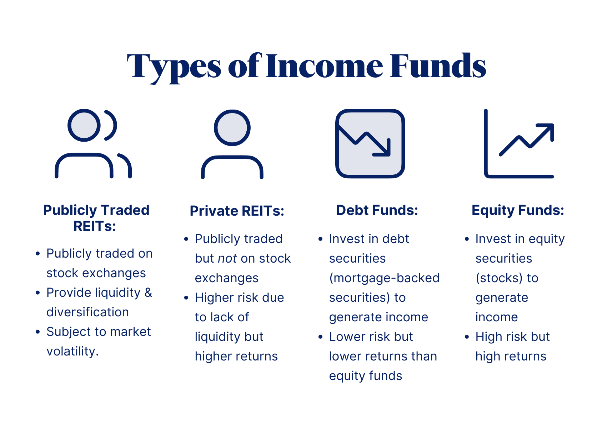

Understanding different types of investment funds is crucial for effective portfolio management. In an increasingly complex financial environment, selecting the right investment vehicles is essential for achieving specific financial goals. This article focuses on exploring and comparing equity funds and income funds, two fundamental investment categories that cater to different investor needs and risk appetites. Equity funds primarily invest in stocks, aiming for capital growth through market appreciation and dividends. In contrast, income funds prioritize generating consistent income through investments in bonds and other fixed-income securities.

The financial industry has witnessed significant advancements with the integration of technology, notably algorithmic trading, which plays a vital role in modern investment strategies. Algorithmic trading refers to the use of computer programs and pre-set rules to execute trades, significantly improving speed and accuracy while minimizing human error and emotional biases. This technology offers the potential to enhance decision-making and investment performance in both equity and income funds by optimizing asset allocation and risk management.

This comprehensive guide is designed to assist both novice and experienced investors in making informed investment choices. By understanding the unique features, benefits, and limitations of equity and income funds, as well as the potential advantages of algorithmic trading, readers will be better equipped to navigate the investment landscape. Whether your preference is towards growth-oriented strategies or stable income generation, the insights provided will contribute to crafting a well-balanced portfolio aligned with your financial objectives.

## Table of Contents

## Equity Funds: An Overview

Equity funds are investment vehicles designed to pool capital from multiple investors and allocate it primarily across a diversified selection of stocks. By investing in these funds, investors gain ownership in a portfolio composed of shares from various companies, reducing individual risk through diversification. The predominant aim of equity funds is capital appreciation, which is achieved through the escalation of stock prices and the dividends paid out by these equities. 

There are several varieties of equity funds, each with distinct investment strategies and goals. Growth funds target stocks anticipated to expand at an above-average rate compared to other companies. These funds typically reinvest profits rather than distributing dividends, focusing on maximizing capital gains. Value funds, conversely, invest in undervalued stocks believed to be priced lower than their intrinsic values, offering potential for appreciation as market perceptions adjust. Index funds are another category, and they aim to mirror the performance of a specific market index like the S&P 500 by holding a portfolio that replicates the index's composition. 

Equity funds generally exhibit higher volatility due to the inherent fluctuations of stock markets. However, this volatility is accompanied by the prospect of substantial long-term returns, making these funds attractive for investors with a higher risk tolerance and a focus on growth. The risk-return trade-off presented by equity funds is a critical consideration for investors seeking to optimize their investment portfolios.

## Income Funds: An Overview

Income funds are structured to offer investors a steady and reliable stream of income, predominantly through investments in bonds and other fixed-income securities. These funds emphasize generating regular interest payments, which are typically sourced from assets such as corporate bonds, government securities, and dividend-paying stocks. 

Corporate bonds are debt securities issued by companies and provide fixed interest payments to the fund, contributing to the income objective. Government securities, such as Treasury bonds and notes, offer a safer investment with regular income, backed by the government’s creditworthiness. Dividend-paying stocks, while variable, add an equity component to the income stream, potentially enhancing returns when markets perform well.

Income funds generally appeal to conservative investors seeking stability and lower risk compared to equity funds. This is due to the typically reduced [volatility](/wiki/volatility-trading-strategies) of income funds, which aims to preserve capital while providing consistent income, making them especially attractive in uncertain market conditions. This characteristic makes income funds suitable for individuals prioritizing a steady cash flow over significant capital appreciation, such as retirees or those requiring regular income streams.

The performance of income funds is typically less volatile because the underlying assets, such as bonds, are less sensitive to market fluctuations than stocks. This makes them appealing to investors wishing to mitigate exposure to market instability while still benefiting from predictable income returns.

## Comparing Equity and Income Funds

When comparing equity and income funds, several key factors must be considered—namely, risk levels, returns, and investor objectives. Equity funds are tailored for investors seeking substantial capital growth. They primarily invest in stocks, which are subject to market volatility. This volatility can result in significant price fluctuations over the short term. However, the potential reward for accepting this risk is higher long-term gains. Stocks, for instance, have historically outperformed other asset classes over extended periods. Therefore, investors in equity funds should have a long-term horizon and a higher risk tolerance.

Conversely, income funds prioritize generating consistent income through interest or dividends, primarily investing in bonds and fixed-income securities. These securities typically offer stable returns with lower risk compared to stocks. Income funds are therefore suitable for investors who prioritize regular income and are risk-averse, seeking stability over the possibility of high returns. Additionally, income funds often appeal to retirees or those who rely on portfolio-generated cash flow.

Beyond individual risk appetite and investment goals, cost structures and management styles also significantly impact fund performance. For instance, actively managed equity funds may involve higher management fees compared to passive income funds, potentially affecting net returns. Moreover, market conditions can influence the suitability of equity versus income funds. In a bullish market, equity funds generally perform better, whereas income funds may offer refuge during bearish periods due to their stable income streams.

Finally, personal financial goals and risk tolerance are crucial when selecting between equity and income funds. A comprehensive assessment of an individual's financial situation, including current assets, liabilities, income needs, and future goals, enables better alignment with the appropriate fund type. By evaluating these aspects, investors can make informed decisions, balancing potential growth with income and stability considerations to optimize their portfolio outcomes.

## Role of Algorithmic Trading in Investments

Algorithmic trading, also known as automated trading, utilizes computer programs to execute trades based on pre-defined criteria. This method employs algorithms designed to assess variables such as timing, price, or [volume](/wiki/volume-trading-strategy) and execute trades automatically. The primary advantage of [algorithmic trading](/wiki/algorithmic-trading) lies in its ability to enhance trading processes regarding efficiency and precision, minimizing human errors and emotional biases. 

Algorithmic trading is particularly valuable for both equity and income fund investments. In equity funds, where the aim is usually capital appreciation, algorithms enable real-time data analysis and trend identification, allowing timely execution of entry and [exit](/wiki/exit-strategy) points. This can optimize asset allocation by continuously balancing the portfolio and mitigating risk. In the context of income funds, which prioritize steady income over growth, algorithmic trading assists in maintaining the desired income levels. Algorithms can be structured to keep a balance in bond maturities and coupon rates, ensuring stability in income inflow.

Technological innovations have made algorithmic trading accessible to a broader range of investors, including retail investors who traditionally lacked the resources of institutional brokers and hedge funds. Platforms and tools are available that allow individual investors to implement algorithmic strategies tailored to their investment objectives and risk preferences.

Despite these advantages, algorithmic trading demands sophisticated technology infrastructure and constant oversight. Effective implementation requires robust systems capable of handling vast amounts of data and executing transactions at high speed. Moreover, traders must maintain an acute awareness of market dynamics, as unexpected events can lead to significant losses if algorithms are not updated accordingly. This makes the understanding of the underlying logic and continuous monitoring of algorithms essential.

In conclusion, while algorithmic trading offers significant benefits in terms of efficiency and accuracy, successful implementation necessitates a combination of advanced technology, market knowledge, and dedicated supervision.

## Integrating Algo Trading with Equity and Income Funds

Algorithmic trading has emerged as a transformative approach in the management of both equity and income funds, offering precision, speed, and data-driven decision-making to enhance investment outcomes. By employing sophisticated computer algorithms, fund managers can optimize trading strategies that align with the specific objectives of these investment vehicles.

For equity funds, algorithmic trading proves invaluable in identifying emerging market trends through advanced data analytics and [machine learning](/wiki/machine-learning) models. Algorithms can handle vast amounts of historical and real-time data to forecast price movements and detect patterns that human investors might miss. As a result, they can determine the optimal entry and exit points for trades, maximizing the potential for growth. Moreover, algorithms facilitate the regular rebalancing of portfolios, ensuring that the allocation of assets continues to match the fund's investment strategy and risk appetite. This continuous optimization can lead to improved fund performance by capitalizing on transient market inefficiencies.

Income funds also benefit significantly from algorithmic trading strategies. These algorithms can automate the selection of securities to maintain a desired income level, taking into account factors such as interest rates, yield curves, and credit ratings. By continuously assessing these factors, algorithms can adjust the composition of the portfolio to optimize income generation while mitigating risk. For instance, in a rising [interest rate](/wiki/interest-rate-trading-strategies) environment, an algorithm could shift investments from long-duration bonds to shorter-dated securities to reduce interest rate risk.

Real-time data analysis stands as a key advantage of integrating algorithmic trading into both equity and income funds. This capability ensures that decision-making processes are always informed by the latest market developments and ensures quick adaptability to changing conditions. Furthermore, algorithmic systems reduce the cognitive biases and emotional influences that often affect human traders, leading to more consistent and objective decision-making.

However, to effectively leverage the benefits of algorithmic trading, investors and fund managers must develop a deep understanding of algorithm-based investments. This involves not only grasping the technical aspects of algorithm design and implementation but also staying abreast of ongoing advancements in technology and data science. Additionally, the operation of these algorithms necessitates robust infrastructure and cybersecurity measures to protect sensitive financial data and trading strategies.

In sum, the integration of algorithmic trading provides a powerful toolset for both equity and income funds, enabling more accurate and beneficial investment decisions. By deploying tailored trading strategies and real-time analysis, algorithmic trading enhances the ability to achieve specific fund objectives, whether focused on growth or income stability, ultimately optimizing the investment process.

## Conclusion

Choosing between equity funds and income funds is fundamentally driven by an individual's financial objectives and risk tolerance. If an investor seeks significant capital appreciation and is comfortable with greater volatility, equity funds may align well with their goals. Conversely, those prioritizing stability and a steady income stream might find income funds more suitable. The decision reflects a balance between potential returns and acceptable risk levels, emphasizing the importance of personal financial planning and self-assessment.

Algorithmic trading introduces a dynamic component to investment strategies by offering precision, speed, and the ability to process large datasets effectively. It allows investors and fund managers to implement strategies that can enhance fund performance and meet specific financial targets. For growth-focused equity funds, algorithms can exploit market trends and optimize portfolio adjustments. In the case of income funds, they can ensure a consistent income flow while managing risk exposure.

To stay competitive and maximize investment potential, investors must remain cognizant of market trends and technological innovations. Algorithmic trading, while advantageous, requires a thorough understanding of financial markets and the technical proficiency to implement robust trading systems. It demands continuous learning and adaptation to evolving landscapes.

Regardless of whether one's preference leans towards growth or income, incorporating algorithmic tools into investment practices can enhance the investment journey. These tools provide a strategic advantage, offering insights that can lead to more informed decisions and better adaptability to market changes. 

In conclusion, achieving optimal investment results necessitates a well-rounded approach. Considering both equity and income funds, alongside the integration of algorithmic strategies, can lead to a diversified and resilient portfolio. By weighing all available options and continuously refining one's strategy, investors can position themselves for success in a constantly shifting financial environment.

## References & Further Reading

[1]: ["The Intelligent Investor: The Definitive Book on Value Investing"](https://www.amazon.com/Intelligent-Investor-Definitive-Investing-Essentials/dp/0060555661) by Benjamin Graham

[2]: ["Common Stocks and Uncommon Profits and Other Writings"](https://www.amazon.com/Common-Stocks-Uncommon-Profits-Writings/dp/0471445509) by Philip A. Fisher

[3]: ["The Little Book of Common Sense Investing: The Only Way to Guarantee Your Fair Share of Stock Market Returns"](https://www.amazon.com/Little-Book-Common-Sense-Investing/dp/1119404509) by John C. Bogle

[4]: Allen, F., & Karjalainen, R. (1999). ["Using Genetic Algorithms to Find Technical Trading Rules."](https://www.sciencedirect.com/science/article/pii/S0304405X9800052X) Journal of Financial Economics, 51(2), 245-271.

[5]: BlackRock. (2021). ["Understanding Equity Funds."](https://www.msn.com/en-us/money/other/blackrock-marks-down-its-investment-in-automattic-by-10/ar-AA1v7EDw) Retrieved from BlackRock website.

[6]: Clifford, S. (2007). ["A Random Walk Down Wall Street: The Time-Tested Strategy for Successful Investing"](https://www.tandfonline.com/doi/full/10.1080/14697688.2016.1256598) by Burton G. Malkiel

[7]: Hasbrouck, J., & Saar, G. (2013). ["Low-latency Trading."](https://papers.ssrn.com/sol3/papers.cfm?abstract_id=1695460) Journal of Financial Markets, 16(4), 646-679.