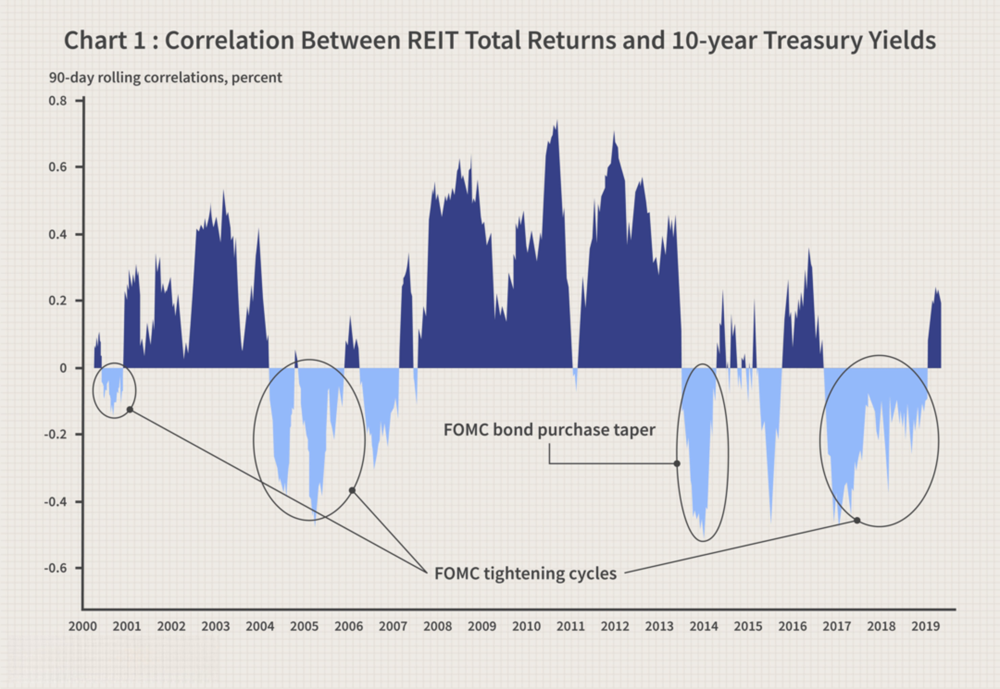

Real Estate Investment Trusts (REITs) play a pivotal role in the real estate market by enabling investors to access large-scale real estate portfolios while avoiding the complexities associated with direct property ownership. As an investment vehicle, REITs provide a means to gain exposure to real estate assets in a manner akin to stock investing. Investors benefit not only from potential capital appreciation but also from the income derived from rents or mortgage interests. 

There are primarily two types of REITs, each addressing distinct investor objectives and fulfilling unique economic functions: Equity REITs and Mortgage REITs. Equity REITs focus on acquiring and operating income-generating real estate, such as office buildings, shopping malls, and apartments. They generate revenue through leasing spaces and collecting rents. Conversely, Mortgage REITs specialize in holding and trading real estate debt by investing in mortgages or mortgage-backed securities, earning income from the interest on these financial instruments. As such, Equity REITs are typically sought by those aiming for long-term growth and income stability, whereas Mortgage REITs attract investors who prioritize high yields and short-term income potential.



The advent of algorithmic trading has transformed modern financial markets, including investments in REITs. This technological breakthrough employs computer algorithms to automate the trading of securities, facilitating decisions based on vast amounts of data with unparalleled speed and precision. Recognizing and understanding the integration of such algorithms in REIT investments is gaining significance as it can potentially enhance investment returns and manage risk effectively. This article examines the distinctions and risks of Equity and Mortgage REITs while highlighting how algorithmic trading strategies could optimize REIT investments to align with specific investor goals.

## Table of Contents

## What Are Equity and Mortgage REITs?

Equity Real Estate Investment Trusts (REITs) and Mortgage REITs are two distinct financial instruments that offer investors different avenues for participating in the real estate sector. 

Equity REITs are entities that own and manage income-producing real estate. These entities generate revenue primarily by leasing space and collecting rent from their properties, which may include commercial spaces, residential buildings, or industrial facilities. The focus of Equity REITs is on acquiring and managing real estate assets that align with their strategies to maximize rental income and, ultimately, return on investment. Investors in Equity REITs typically benefit from long-term capital appreciation and the steady stream of rental income, making this investment suitable for those seeking both income and growth over time.

Conversely, Mortgage REITs function differently. Instead of owning properties, Mortgage REITs invest in real estate debt by acquiring mortgages or mortgage-backed securities. These trusts primarily earn income from the interest generated on these mortgage loans. Mortgage REITs play a crucial role in the real estate financing market by providing liquidity. They are particularly attractive to investors focused on generating high yields and short-term income, given that they often offer substantial dividend payouts, a result of higher interest returns compared to typical rent yields from Equity REITs.

The key distinction between Equity REITs and Mortgage REITs lies in their investment focus—physical properties versus property mortgages—and the nature of the returns they provide. This intrinsic difference influences their risk and return profile, making each type suitable for different investor objectives. While Equity REITs offer the potential for both income and capital growth, Mortgage REITs are typically pursued by investors who prioritize immediate income through interest earnings.

## Algorithmic Trading in REITs

Algorithmic trading in Real Estate Investment Trusts (REITs) employs sophisticated computer algorithms to automate and optimize the acquisition and disposal of REIT shares. By leveraging technology, these algorithms analyze vast datasets to recognize patterns, trends, and market signals, allowing trades at speeds and frequencies that far surpass human capabilities. 

The deployment of algorithmic systems in trading REITs fundamentally enhances decision-making processes. These systems can systematically evaluate numerous variables, such as historical price movements, [volume](/wiki/volume-trading-strategy) data, and external market factors, to generate superior trading strategies. For example, algorithms may use statistical [arbitrage](/wiki/arbitrage) methods or trend-following models to predict price movements. 

Consider a basic Python script that uses moving averages to signal trading actions:

```python
def moving_average_strategy(prices, short_window=40, long_window=100):
    signals = pd.DataFrame(index=prices.index)
    signals['price'] = prices
    signals['short_mavg'] = prices.rolling(window=short_window, min_periods=1).mean()
    signals['long_mavg'] = prices.rolling(window=long_window, min_periods=1).mean()
    signals['signal'] = 0.0  
    signals['signal'][short_window:] = np.where(signals['short_mavg'][short_window:] > signals['long_mavg'][short_window:], 1.0, 0.0)   
    signals['positions'] = signals['signal'].diff()
    return signals
```

This strategy generates buy signals when the short-term moving average exceeds the long-term moving average and sell signals when the opposite occurs. Such techniques are integral in [algorithmic trading](/wiki/algorithmic-trading) to seize profitable opportunities.

Algorithmic trading also significantly reduces transaction costs. By automating order execution, algorithms can strategically place trades to capitalize on the bid-ask spread or disburse large orders across time to minimize market impact, a process known as order slicing. Additionally, the automation reduces the risk of human errors inherent in manual trading, thereby increasing the reliability and efficiency of transactions.

The risk mitigation capabilities of algorithmic trading in REITs include automatic stop losses that can prevent excessive losses during volatile market movements. Additionally, advanced algorithms can incorporate [machine learning](/wiki/machine-learning) models to continuously improve trading strategies and adapt to evolving market conditions.

Algorithmic trading provides a layer of sophistication and precision in trading REITs that is unattainable through manual methods, offering a robust framework for enhancing portfolio performance while controlling associated risks.

## Benefits of Combining REITs and Algorithmic Trading

Combining algorithmic trading with REIT investments presents significant opportunities for enhancing portfolio performance, primarily through the incorporation of data-driven insights. Algorithmic trading, by employing advanced computational techniques, enables investors to analyze large datasets, identifying patterns and trends that may not be immediately apparent through manual analysis. This analytic capability forms the foundation for making more informed, timely decisions in the volatile real estate investment market.

One of the primary advantages of algorithmic trading is the enhancement of [liquidity](/wiki/liquidity-risk-premium). By automating trading processes, transactions can be executed at much greater speeds compared to manual trading, facilitating prompt response to market fluctuations. This swift execution is crucial in markets where timing can significantly impact investment returns. For instance, algorithms can be programmed to execute buy or sell orders when certain conditions are met, such as price thresholds or volume changes, ensuring that trades occur precisely when intended without the delay associated with human intervention.

Moreover, algorithmic trading offers robust mechanisms for risk assessment and management. By systematically analyzing historical data and applying predictive models, trading algorithms can assess potential risks and forecast future market behavior. This capability allows for a more systematic evaluation of risk factors, enabling investors to align trading strategies more closely with their risk tolerance and investment objectives. Additionally, algorithms can be designed to ensure compliance with established investment strategies and regulatory requirements, maintaining discipline in trading activities.

For example, a Python-based algorithm might employ machine learning techniques to predict price movements of REIT shares. By training a model using historical price data, the algorithm could forecast future trends, providing actionable insights for buy or sell decisions. This approach reduces the likelihood of human error, optimizes transaction costs, and enhances overall investment strategy execution.

```python
# Sample Python code for a basic algorithmic trading strategy
import pandas as pd
from sklearn.ensemble import RandomForestRegressor

# Load historical REIT data
data = pd.read_csv('REIT_historical_data.csv')

# Feature selection
features = data[['Previous_Close', 'Day_Volume', 'Market_Index']]

# Target variable
target = data['Next_Day_Close']

# Train the model
model = RandomForestRegressor()
model.fit(features, target)

# Predict future price
future_data = pd.DataFrame({'Previous_Close': [120], 'Day_Volume': [1000], 'Market_Index': [1500]})
predicted_price = model.predict(future_data)
print(f"Predicted Future Price: {predicted_price[0]}")
```

In summary, the integration of algorithmic trading with REIT investments not only enhances liquidity and ensures quick market responses but also facilitates systematic risk assessment and compliance. This strategic combination can markedly improve portfolio performance, making it an attractive approach for investors seeking to optimize their real estate portfolios.

## Potential Risks and Challenges

Equity Real Estate Investment Trusts (REITs) are particularly prone to the vagaries of market cycles. During economic downturns, the value of equity REITs can decline as property values decrease and tenant demand wanes. These fluctuations underscore the importance of understanding macroeconomic indicators and their potential impact on real estate values. Notably, revenue from leasing can suffer during recessions, leading to decreased dividends, which are a primary lure for investors. Consequently, investors must scrutinize the diversification of property types and geographic locations within their REIT portfolios to mitigate such risks.

Mortgage REITs, by contrast, are susceptible primarily to [interest rate](/wiki/interest-rate-trading-strategies) fluctuations. Given their investment in property mortgages, rising interest rates can adversely affect the profitability of these entities. As interest rates increase, the cost of borrowing rises, potentially squeezing profit margins if the rates on existing mortgages do not adjust accordingly. This scenario can lead to a mismatch between income generated through interest receipts and the cost of financing, thus impacting net income. Predictive modeling and interest rate hedging strategies are essential tools for investors to navigate the volatile interest landscape.

While algorithmic trading presents opportunities for optimizing REIT investments, it is not without its challenges. Technological failures, such as software bugs or hardware malfunctions, can disrupt trading operations and lead to unforeseen losses. Moreover, the speed and scale of algorithmic trading can exacerbate market [volatility](/wiki/volatility-trading-strategies), particularly if algorithms are based on similar market signals across different trading entities. To manage these risks, it is imperative to employ robust testing and validation procedures for trading algorithms. Moreover, incorporating safeguards, such as circuit breakers or kill switches, can prevent runaway trading scenarios and secure financial stability. 

In summary, while REIT investments and algorithmic trading offer substantial benefits, acknowledging and managing the associated risks is essential for successful investment outcomes.

## Conclusion

Equity and Mortgage Real Estate Investment Trusts (REITs) provide investors with distinctive paths to participate in the real estate sector, each catering to specific financial aspirations and tolerance for risk. Equity REITs primarily generate income through the ownership and leasing of properties, offering the potential for long-term growth and a steady source of income. Conversely, Mortgage REITs focus on acquiring property mortgages, profiting predominantly from the interest payments, thus appealing to investors seeking high yields and short-term income streams.

Incorporating algorithmic trading into REIT investments represents a contemporary strategy for enhancing portfolio management. This technology enables investors to harness vast amounts of data to make informed decisions, execute trades with high precision, and optimize their investment outcomes. The efficiencies gained through algorithmic processes—such as faster trade execution, reduced transaction costs, and minimized human error—surpass what is achievable through conventional trading methods.

However, it is crucial for investors to carefully evaluate the benefits that algorithmic trading may offer against the inherent risks it carries. These include potential technological failures, increased market volatility, and the need for robust risk management frameworks. Ultimately, the decision to integrate algorithmic trading into a REIT investment strategy should align with the investor's overall financial goals and risk management strategies, ensuring that it adds value to their investment portfolio.

## FAQs

### What is a REIT and how does it work?

A Real Estate Investment Trust (REIT) is a company that owns, operates, or finances income-producing real estate. Modeled after mutual funds, REITs provide investors the chance to invest in large-scale, income-producing real estate without the need to buy and manage properties themselves. REITs operate by pooling capital from numerous investors, allowing individuals to earn dividends from real estate investments without having to buy or manage any properties themselves. Typically, REITs must distribute at least 90% of taxable income as dividends to maintain their tax-advantaged status.

### How can algorithmic trading be applied to REIT investments?

Algorithmic trading in REIT investments involves the use of computer-based algorithms in executing trades to optimize the buying and selling process of REIT shares. These algorithms analyze large datasets to identify patterns, trends, and even predictive indicators that can guide trading decisions. For example, certain algorithms can process market data to detect when REIT shares are undervalued or overvalued, allowing for timely trades. Additionally, algorithmic trading can assist in adjusting investment portfolios in response to shifts in interest rates or real estate markets.

### What are the main differences between Equity and Mortgage REITs?

Equity REITs invest directly in properties and derive income from leasing those assets to tenants. Their main source of income comes from the rents collected, and they are generally focused on long-term growth. Conversely, Mortgage REITs do not own properties but instead invest in mortgages or mortgage-backed securities. They earn income primarily through the interest on the mortgages they hold, thus making them more sensitive to interest rate changes. Equity REITs are typically favored for their stable income and growth potential, while Mortgage REITs attract those seeking higher immediate yields.

### What are the potential risks associated with algorithmic trading in REITs?

While algorithmic trading offers advantages, it also poses certain risks. Technological failures, such as software glitches or network outages, can disrupt trading operations. Furthermore, the high-speed nature of algorithmic trading can contribute to increased market volatility, sometimes triggering rapid price fluctuations. There is also the risk that algorithms may be based on erroneous assumptions or data, leading to suboptimal trading decisions. Finally, external events like regulatory changes can affect how algorithms perform in the market, impacting profitability and compliance.

### Can algorithmic trading improve the profitability of REIT investments?

Yes, algorithmic trading has the potential to enhance the profitability of REIT investments by allowing for more efficient and timely trades based on sophisticated data analysis. Algorithms can optimize entry and [exit](/wiki/exit-strategy) points for trades, thereby capturing more favorable market conditions. They can also minimize transaction costs and help manage risks by diversifying strategies across multiple REIT sectors and regions. While these benefits can lead to improved profitability, it is important for investors to continually update and validate their trading algorithms to adapt to changing market environments.

## References & Further Reading

[1]: Bergstra, J., Bardenet, R., Bengio, Y., & Kégl, B. (2011). ["Algorithms for Hyper-Parameter Optimization."](https://papers.nips.cc/paper/4443-algorithms-for-hyper-parameter-optimization) Advances in Neural Information Processing Systems 24.

[2]: ["Advances in Financial Machine Learning"](https://www.amazon.com/Advances-Financial-Machine-Learning-Marcos/dp/1119482089) by Marcos Lopez de Prado

[3]: ["Evidence-Based Technical Analysis: Applying the Scientific Method and Statistical Inference to Trading Signals"](https://www.wiley.com/en-us/Evidence+Based+Technical+Analysis%3A+Applying+the+Scientific+Method+and+Statistical+Inference+to+Trading+Signals-p-9780470008744) by David Aronson

[4]: ["Machine Learning for Algorithmic Trading"](https://github.com/PacktPublishing/Machine-Learning-for-Algorithmic-Trading-Second-Edition) by Stefan Jansen

[5]: ["Quantitative Trading: How to Build Your Own Algorithmic Trading Business"](https://www.amazon.com/Quantitative-Trading-Build-Algorithmic-Business/dp/1119800064) by Ernest P. Chan