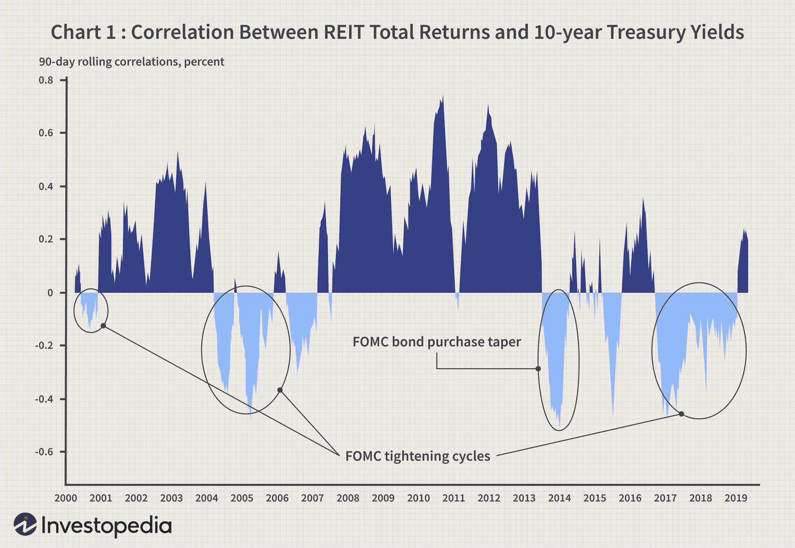

In the evolving landscape of real estate investment, two prominent players—Mortgage Real Estate Investment Trusts (mREITs) and Equity Real Estate Investment Trusts (Equity REITs)—stand out. These investment vehicles provide unique opportunities and challenges for investors seeking exposure to real estate markets. Mortgage REITs primarily invest in mortgage loans and mortgage-backed securities, generating income through interest, whereas Equity REITs focus on owning and managing physical properties, deriving revenue from leasing space and operating these real estate assets.

Algorithmic trading, a modern approach to trading, is increasingly applied to enhance performance in REIT investments. This technology leverages computer algorithms to execute trades based on specific criteria, harnessing the potential to process large volumes of data rapidly and efficiently. In the context of REITs, algorithmic trading can improve trade efficiency, reduce market impact, and optimize investment strategies by identifying opportunities faster than traditional methods can.



This article explores the distinct characteristics of Mortgage REITs and Equity REITs and discusses the role of algorithmic trading in this sector. By understanding these dynamics, investors can better navigate the complexities of real estate investment. The intersection of these elements presents potential pathways for enhancing portfolio performance and adapting to evolving market conditions.

## Table of Contents

## Understanding Mortgage REITs

Mortgage REITs (Real Estate Investment Trusts), commonly referred to as mREITs, focus primarily on investing in mortgage loans and mortgage-backed securities (MBS). These entities do not own physical real estate properties; instead, they generate income through the interest earned on the mortgages and MBS they hold. This fundamental characteristic sets them apart from Equity REITs, which invest directly in physical real estate assets.

The profitability and risk profile of mREITs are significantly influenced by interest rate fluctuations. For instance, when interest rates rise, the cost of borrowing increases, which can reduce the profit margins for mREITs due to the higher interest expenses on leveraged positions. Conversely, when interest rates decline, mREITs might enjoy enhanced profitability due to cheaper borrowing costs, provided that the yield spread between their assets and liabilities remains favorable.

Despite these risks, mREITs are appealing to income-focused investors because they typically offer high dividend yields. This is primarily due to the legal requirement for REITs to distribute at least 90% of their taxable income to shareholders as dividends. The high payout ratios make mREITs an attractive option for those seeking steady income streams. However, the high dividends can also be a double-edged sword, as they may indicate higher risk levels due to potential exposure to interest rate and credit risks.

Investors considering mREITs should carefully analyze the prevailing [interest rate](/wiki/interest-rate-trading-strategies) environment and assess credit risks. These factors are crucial in evaluating the potential returns and associated risks of mREIT investments. Understanding the yield curve, which reflects the relationship between interest rates and different maturities, can be particularly beneficial. For example, a steepening yield curve might boost the profitability of mREITs, as it could widen the spread between long-term asset yields and short-term borrowing costs.

To illustrate interest rate impacts using Python, one could simulate the net interest margin of an mREIT based on various interest rate scenarios:

```python
# Example Python code to simulate impact of interest rate changes on mREIT profitability

class mREIT:
    def __init__(self, asset_yield, borrowing_rate, leverage):
        self.asset_yield = asset_yield   # yield on mortgage-backed securities
        self.borrowing_rate = borrowing_rate   # cost of borrowing
        self.leverage = leverage   # leverage ratio

    def net_interest_margin(self):
        return self.leverage * (self.asset_yield - self.borrowing_rate)

# Simulate mREIT profitability in different interest rate environments
scenarios = [
    {'asset_yield': 4.0, 'borrowing_rate': 1.5, 'leverage': 6},
    {'asset_yield': 4.0, 'borrowing_rate': 3.0, 'leverage': 6},
    {'asset_yield': 5.0, 'borrowing_rate': 2.0, 'leverage': 6},
]

for scenario in scenarios:
    m_reit = mREIT(**scenario)
    print(f"Net Interest Margin: {m_reit.net_interest_margin():.2f}%")
```

This code calculates the net interest margin for an mREIT under different scenarios of asset yields and borrowing rates, showcasing how interest rate changes can affect profitability. Such simulations can be critical tools for investors in assessing potential investment outcomes in Mortgage REITs.

## Equity REITs: A Closer Look

Equity REITs own and manage income-generating real estate assets, including shopping malls, office buildings, and residential apartments. Their primary source of revenue is derived from leasing these properties, providing a steady stream of rental income. This structure fundamentally differentiates them from Mortgage REITs, which focus on mortgage loans and mortgage-backed securities as their main revenue sources. 

One of the significant advantages of Equity REITs is their ability to offer diversification benefits to investors. By investing in a variety of property types and geographical locations, Equity REITs can spread risk, potentially stabilizing returns. Additionally, their holdings in tangible assets provide a natural hedge against inflation. As inflation rises, property values and rental income tend to increase, protecting investors' purchasing power.

Equity REITs typically perform well in low-interest-rate environments. When interest rates are low, the cost of borrowing decreases, encouraging real estate investment and development. This can lead to an appreciation in property values and an increase in rental income, enhancing the performance of Equity REITs. Moreover, lower interest rates often make the dividend yields of Equity REITs more attractive compared to fixed-income securities.

Investors interested in Equity REITs should carefully analyze current property market trends and management's ability to effectively operate and expand the real estate portfolio. Key considerations include the health of the real estate market, vacancy rates, rental demand, and the REIT's strategies for growth and asset management. A skilled management team can optimize property operations, negotiate favorable lease terms, and strategically acquire or divest properties to enhance shareholder value.

For a robust evaluation, investors might analyze financial metrics such as funds from operations (FFO), which provides insight into cash flows generated by the REIT's operations. Additionally, market indicators such as capitalization rates, property yield comparisons, and sector-specific trends should be examined to assess potential risks and returns. By thoroughly understanding these dynamics, investors can make informed decisions when selecting Equity REITs for their portfolio.

## Algorithmic Trading in REITs

Algorithmic trading employs sophisticated computer algorithms to execute trades based on specific, predetermined criteria. This methodology enhances trade efficiency, reduces market impact, and optimizes investment strategies. The application of [algorithmic trading](/wiki/algorithmic-trading) in the Real Estate Investment Trusts (REITs) sector presents notable advantages, particularly amidst volatile market conditions.

In the context of REITs, algorithmic trading systems can process large datasets, enabling them to identify investment opportunities at a pace significantly faster than human analysts. These algorithms are driven by quantitative models that analyze price trends, interest rate fluctuations, and other market indicators. The rapid processing and execution capability in high-frequency trading scenarios can provide a competitive edge, especially for active traders looking to capitalize on short-term market inefficiencies.

Moreover, algorithmic trading can be tailored to manage the distinctive characteristics of both Mortgage REITs and Equity REITs. For instance, while Mortgage REITs may be sensitive to interest rate changes, algorithms can be designed to monitor and predict interest rate trends, thereby optimizing buy and sell decisions. Conversely, Equity REITs, which are affected more by property market trends, can benefit from algorithms focused on real estate valuation models and occupancy rates.

In volatile markets, algorithmic trading systems help reduce slippage—the difference between the expected price of a trade and the actual price. This is achieved by executing sizable orders in smaller pieces or at opportune moments to lessen the market impact. Investors using these systems can employ techniques like mean reversion, [momentum](/wiki/momentum) strategies, or statistical [arbitrage](/wiki/arbitrage) to enhance their investment outcomes.

For successful deployment, investors must understand market dynamics and algorithm design intricacies. This involves configuring algorithms with precise trading rules and [backtesting](/wiki/backtesting) these against historical data to ensure robustness in various market conditions. The implementation of [machine learning](/wiki/machine-learning) techniques can further enhance prediction accuracy and adaptability to evolving market landscapes.

Here is a Python code snippet illustrating a simple algorithmic trading strategy using moving averages, which can be adapted for REIT trading:

```python
import pandas as pd

# Load historical price data for a REIT
data = pd.read_csv('reit_data.csv')
data['SMA_20'] = data['Close'].rolling(window=20).mean()
data['SMA_50'] = data['Close'].rolling(window=50).mean()

# Generate buy/sell signals
data['Signal'] = 0  # Default to no signal
data.loc[data['SMA_20'] > data['SMA_50'], 'Signal'] = 1  # Buy signal
data.loc[data['SMA_20'] < data['SMA_50'], 'Signal'] = -1  # Sell signal

# Calculate returns based on the signals
data['Returns'] = data['Close'].pct_change() * data['Signal'].shift(1)

# Print summary statistics of the strategy
print(data['Returns'].describe())
```

This code calculates simple moving averages and generates buy/sell signals when a shorter-term average crosses a longer-term average. By fine-tuning such models, investors can enhance efficiencies in the REIT market through algorithmic trading.

## Comparative Analysis: Mortgage REITs vs. Equity REITs

Mortgage REITs (mREITs) and Equity REITs are central to the diverse landscape of real estate investment trusts, each serving distinct investor purposes. mREITs primarily focus on generating income through interest from mortgage loans and mortgage-backed securities. Their performance and return potential are tightly coupled with interest rate fluctuations. A change in interest rates can significantly impact their profitability, given their reliance on the spread between borrowing costs and income generated from lending.

In contrast, Equity REITs invest in and manage income-producing physical properties such as commercial offices, residential buildings, and industrial spaces. They inherently offer potential for growth due to their direct tie to real estate market dynamics, including property values and rental income trends. Unlike mREITs, Equity REITs demonstrate greater resilience in low interest rate environments, thriving on the appreciation of property assets and increasing rental rates.

From a diversification standpoint, both mREITs and Equity REITs contribute unique exposures. While mREITs pose credit risks, particularly under deteriorating economic conditions that may affect borrowers' ability to repay, Equity REITs present property market risks, such as vacancy rates and declining property values in a soft market. Consequently, the decision to invest in either type of REIT should be informed by the investor's risk tolerance, income needs, and specific market expectations.

Strategically, a well-balanced investment portfolio may integrate both mREITs and Equity REITs, leveraging their differing strengths to achieve a blend of income stability and growth potential. Additionally, the incorporation of algorithmic trading strategies can further refine portfolio management by optimizing trade execution and identifying investment opportunities that maximize returns. Such strategies can automatically adjust portfolio allocations in response to data-driven insights, considering both interest rate movements and property market indicators.

In conclusion, the choice between Mortgage and Equity REITs should align with an investor's broader financial goals, taking into account risk preferences and anticipated market trends. By considering these factors and employing advanced trading techniques, investors can effectively enhance their real estate investment portfolios.

## Conclusion

Mortgage REITs and Equity REITs are integral to the real estate investment landscape, each offering distinct benefits tailored to diverse investor objectives. Mortgage REITs, with their focus on generating income from mortgage loans and securities, cater primarily to income-seeking investors, while Equity REITs, by owning and managing tangible property assets, provide growth opportunities and serve as a hedge against inflation. These traits highlight their complementary roles in an investment portfolio.

Algorithmic trading has emerged as an innovative approach to enhancing investment strategies within the REIT sector. By utilizing sophisticated computer algorithms to execute trades based on predefined criteria, investors can achieve greater efficiency, minimize market impact, and optimize their investment outcomes. This technology's capability to process vast amounts of data rapidly allows investors to identify opportunities and respond swiftly to market changes, which is particularly advantageous in volatile or fast-moving market conditions.

For investors, staying informed about prevailing interest rate trends, shifts in property markets, and advancements in trading technology is essential. Interest rate fluctuations can significantly impact the performance of Mortgage REITs, while Equity REITs are more sensitive to changes in property market dynamics. Understanding these factors allows investors to make informed decisions, aligning their investment choices with personal risk tolerance and income requirements.

The convergence of REITs and algorithmic trading introduces intriguing possibilities for the future of real estate investing. This intersection offers not only a means to optimize returns but also a strategic advantage for navigating complex market environments. By embracing these tools and insights, investors can enhance their success in the real estate investment sector, capitalizing on both existing opportunities and emerging trends.

## References & Further Reading

[1]: Geltner, D., Miller, N. G., Clayton, J., & Eichholtz, P. (2006). ["Commercial Real Estate Analysis and Investments"](https://www.researchgate.net/publication/245702364_Commercial_Real_Estate_Analysis_and_Investments). South-Western Educational Publishing.

[2]: Fabozzi, F. J., & Mann, S. V. (2012). ["Introduction to Mortgage-Backed Securities"](https://onlinelibrary.wiley.com/doi/pdf/10.1002/9780470404324.hof001036). Wiley Finance.

[3]: Pagliari, J. L. (1995). ["The Analysis of Real Estate Investment Trusts"](https://www.researchgate.net/publication/4917677_Public_Versus_Private_Real_Estate_Equities_A_More_Refined_Long-Term_Comparison). Urban Land Institute.

[4]: Chan, E. (2009). ["Quantitative Trading: How to Build Your Own Algorithmic Trading Business"](https://github.com/ftvision/quant_trading_echan_book). Wiley.

[5]: Hasbrouck, J. (2007). ["Empirical Market Microstructure: The Institutions, Economics, and Econometrics of Securities Trading"](https://academic.oup.com/book/52241). Oxford University Press.

[6]: ["Advances in Financial Machine Learning"](https://www.amazon.com/Advances-Financial-Machine-Learning-Marcos/dp/1119482089) by Marcos Lopez de Prado