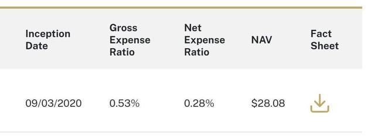

## Table of Contents

## What is an ETF?

An ETF, or Exchange-Traded Fund, is a type of investment that lets you buy a bunch of different stocks, bonds, or other assets all at once. It's like a basket where you can put many different things inside. When you buy one share of an ETF, you're actually buying a small piece of all the things that are in that basket. This makes it easier for you to invest in a lot of different companies or types of investments without having to buy each one separately.

ETFs are traded on stock exchanges, just like regular stocks. This means you can buy and sell them anytime during the trading day at the current market price. They are popular because they offer a way to diversify your investments, which can help reduce risk. Plus, they often have lower fees than other types of funds, making them a cost-effective choice for many investors.

## What are expense ratios in ETFs?

Expense ratios in ETFs are the fees that you pay for owning the ETF. They are shown as a percentage of the total amount you have invested in the ETF. For example, if an ETF has an expense ratio of 0.10%, you will pay $0.10 every year for every $100 you have invested in that ETF. These fees cover the costs of managing the ETF, like paying the people who run it and other operational expenses.

These expense ratios are important because they can affect how much money you make from your investment over time. A lower expense ratio means you keep more of your investment returns. For example, if you invest $10,000 in an ETF with a 0.20% expense ratio, you'll pay $20 in fees each year. But if you choose an ETF with a 0.05% expense ratio, you'll only pay $5 in fees. Over many years, those savings can add up and make a big difference in your investment growth.

## What is the difference between gross and net expense ratios?

The gross expense ratio is the total cost of running an ETF before any fee waivers or reimbursements. It includes all the expenses like management fees, administrative costs, and other operational costs. This number shows you the full price of the ETF without any discounts.

The net expense ratio is what you actually pay after any fee waivers or reimbursements are applied. Sometimes, the people who run the ETF might decide to lower the fees for a while to make the ETF more attractive to investors. So, the net expense ratio is usually lower than the gross expense ratio. This is the number that matters most to you because it's what comes out of your pocket.

## How are gross expense ratios calculated?

Gross expense ratios are calculated by adding up all the costs of running an ETF and then dividing that total by the ETF's total assets. These costs can include things like management fees, which are what the fund managers get paid, and other expenses like paying for the office, computers, and other stuff needed to keep the ETF going. The total of these costs is then divided by the total value of all the money invested in the ETF to get the gross expense ratio.

For example, if an ETF has total annual costs of $100,000 and the total value of all the money invested in the ETF is $100 million, the gross expense ratio would be 0.10%. This means that before any discounts or waivers, the ETF costs 0.10% of the total assets each year to run. This number gives you an idea of how much it costs to keep the ETF going without any reductions.

## How are net expense ratios calculated?

Net expense ratios are what you actually pay for owning an ETF after any discounts or waivers are taken off. To find the net expense ratio, you start with the gross expense ratio, which is all the costs of running the ETF. Then, you subtract any fee waivers or reimbursements that the people who run the ETF might offer. These waivers can make the ETF cheaper for a while to attract more investors.

For example, if the gross expense ratio of an ETF is 0.50% but the managers decide to waive 0.20% of the fees for a year, the net expense ratio would be 0.30%. This means you only pay 0.30% of your investment in fees each year, instead of the full 0.50%. The net expense ratio is important because it shows you the real cost of owning the ETF, which can affect how much money you keep from your investment.

## Why might an ETF have a lower net expense ratio than its gross expense ratio?

An ETF might have a lower net expense ratio than its gross expense ratio because the people who run the ETF decide to give investors a discount. They do this by waiving or reimbursing some of the fees. This makes the ETF cheaper to own for a while, which can attract more people to invest in it. The gross expense ratio is the total cost of running the ETF without any discounts, but the net expense ratio is what you actually pay after those discounts are applied.

These discounts or waivers are usually temporary. The people who manage the ETF might offer them to make the fund more appealing, especially when it's new or when they want to grow the amount of money invested in it. So, even though the gross expense ratio shows the full cost, the net expense ratio is what matters most to you as an investor because it's the real amount you'll pay each year.

## What are the typical ranges for ETF gross and net expense ratios?

ETF gross expense ratios can vary a lot, but they usually fall between 0.03% and 1.00%. The lower end is often for ETFs that track big, well-known indexes like the S&P 500. These ETFs are simple to manage, so they don't cost much to run. On the higher end, you might find ETFs that focus on specific industries or smaller companies, which can be more expensive to manage.

Net expense ratios are what you actually pay after any discounts or waivers. They can be even lower, sometimes as low as 0.00% if the managers are waiving all the fees for a while. Usually, net expense ratios range from 0.00% to around 0.90%. These lower costs can make a big difference in how much money you keep from your investment over time.

## How do expense ratios impact the overall return of an ETF?

Expense ratios are important because they affect how much money you make from your ETF over time. When you invest in an ETF, you pay a fee every year based on the expense ratio. This fee comes out of your investment, so the higher the expense ratio, the less money you keep. For example, if you invest $10,000 in an ETF with a 0.50% expense ratio, you'll pay $50 in fees each year. That's $50 less that could be growing in your investment.

Over many years, these fees can add up and make a big difference in your overall return. If you have two ETFs that perform the same but one has a lower expense ratio, the one with the lower fee will give you more money in the end. That's why it's a good idea to look at the expense ratio when you're choosing an ETF. A small difference in fees can lead to a lot more money in your pocket over time.

## Can you provide examples of ETFs with significant differences between their gross and net expense ratios?

The Vanguard FTSE Emerging Markets ETF (VWO) is a good example of an ETF with a difference between its gross and net expense ratios. The gross expense ratio for VWO is around 0.10%, but the net expense ratio is lower at about 0.08%. This difference happens because Vanguard decides to waive some of the fees to make the ETF cheaper for investors. So, if you invest in VWO, you only pay the lower net expense ratio, which means more of your money stays in your investment.

Another example is the iShares MSCI EAFE Small-Cap ETF (SCZ). The gross expense ratio for SCZ is around 0.40%, but the net expense ratio is reduced to about 0.39%. Even though the difference might seem small, it's still important because it means you pay less in fees. These waivers can make a big difference over time, especially if you're investing a lot of money or keeping your money in the ETF for many years.

## How do regulatory requirements affect the reporting of gross and net expense ratios?

Regulatory requirements make sure that ETF companies tell investors about both gross and net expense ratios. This is important because it helps investors understand the real costs of owning an ETF. The rules say that ETF companies have to show the gross expense ratio, which is all the costs before any discounts, and the net expense ratio, which is what you actually pay after those discounts. This way, investors can see the full price and the price they will really pay.

These rules are set by groups like the Securities and Exchange Commission (SEC) in the United States. They want to make sure that investors get clear and honest information about their investments. By showing both gross and net expense ratios, ETF companies follow these rules and help investors make better choices. Knowing the difference between these two numbers can help investors pick ETFs that fit their budget and investment goals.

## What strategies can investors use to minimize the impact of expense ratios on their investments?

Investors can minimize the impact of expense ratios by choosing ETFs with lower fees. A good way to do this is to look for ETFs that track big, well-known indexes like the S&P 500. These ETFs usually have lower expense ratios because they are simple to manage. Another strategy is to compare the net expense ratios of different ETFs. Since the net expense ratio is what you actually pay after any discounts, [picking](/wiki/asset-class-picking) ETFs with lower net expense ratios can save you money over time.

Another approach is to keep an eye on the expense ratios of the ETFs you already own. Sometimes, the people who run the ETF might change the fees, so it's a good idea to check them every now and then. If you find that the expense ratio of an ETF you own has gone up a lot, you might want to switch to a similar ETF with a lower fee. By being smart about which ETFs you choose and keeping an eye on their costs, you can keep more of your investment returns and grow your money faster.

## How do expense waivers and reimbursements influence the difference between gross and net expense ratios?

Expense waivers and reimbursements make the difference between gross and net expense ratios. The gross expense ratio is the total cost of running an ETF, without any discounts. But sometimes, the people who manage the ETF decide to give investors a break by waiving or reimbursing some of these costs. This means they lower the fees you have to pay for a while. When they do this, the net expense ratio, which is what you actually pay, becomes lower than the gross expense ratio.

These waivers and reimbursements can make a big difference in how much you pay to own an ETF. For example, if an ETF has a gross expense ratio of 0.50% but the managers decide to waive 0.20% of the fees, the net expense ratio you pay would be 0.30%. This makes the ETF cheaper for you, which can help you keep more of your investment returns. These discounts are usually temporary, used to attract more investors or make the ETF more competitive, but they can really help lower your costs while they last.

## What is the process of deciphering the Net Expense Ratio?

The net expense ratio is a crucial financial metric for evaluating the cost-efficiency of investment funds, including exchange-traded funds (ETFs). It represents the annual fee that investors pay for management and operational expenses as a percentage of the fund’s average net assets. The net expense ratio is calculated by adjusting the gross expense ratio, which includes all fund operating costs, by subtracting any fee waivers or reimbursements offered by the fund management.

The calculation of the net expense ratio can be succinctly expressed as:

$$
\text{Net Expense Ratio} = \text{Gross Expense Ratio} - \text{Fee Waivers or Reimbursements}
$$

Understanding the net expense ratio is fundamental for investors seeking to make informed decisions. A lower net expense ratio generally indicates a more cost-effective fund, allowing a greater portion of returns to be retained by investors rather than being eroded by fees. This metric’s relevance is particularly significant over long-term investment horizons, where even small differences in expense ratios can compound into substantial disparities in overall returns.

The impact of the net expense ratio on [ETF](/wiki/etf-trading-strategies) performance is profound. ETFs with higher net expense ratios must achieve higher returns to reach the same net returns as those with lower ratios. Consequently, investors often prioritize funds with lower net expense ratios to maximize their potential gains. For instance, an ETF with a 0.10% net expense ratio will generally outperform, ceteris paribus, a similar ETF with a 0.50% net expense ratio, assuming identical gross returns.

Comparative analysis of net expense ratios among different ETFs vividly illustrates their influence on investment outcomes. A high net expense ratio reduces the effective compounding of returns over time, presenting a significant barrier to accumulating wealth. Conversely, low net expense ratios enhance the compounding process, amplifying the growth of invested capital. Investors are thus inclined to seek ETFs with minimal net expenses to optimize their portfolio's performance and cost-effectiveness.

In summary, grasping the net expense ratio's nuances enables investors to identify more economically favorable ETFs, manage investment costs efficaciously, and potentially enhance the long-term growth of their portfolios.

## References & Further Reading

[1]: ["Exchange-Traded Funds: Structure, Regulation, and Applications of a Growing Investment Vehicle"](https://www.investopedia.com/terms/e/etf.asp) by Richard Comizio

[2]: ["Common Sense on Mutual Funds"](https://www.amazon.com/Common-Sense-Mutual-Funds-Anniversary/dp/0470138130) by John C. Bogle

[3]: ["A Survey of Algorithmic Trading Strategies"](https://wjaets.com/sites/default/files/WJAETS-2024-0054.pdf) by Belvedere Trading

[4]: ["Understanding ETF Strategies and Performance"](https://www.etf.com/sections/etf-basics/10-etf-investment-strategies-and-how-they-work) by CFA Institute Research Foundation

[5]: Sharpe, W. F. (1994). ["The Sharpe Ratio."](https://web.stanford.edu/~wfsharpe/art/sr/SR.htm) The Journal of Portfolio Management, Fall 1994, 49-58.