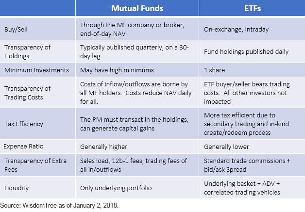

## Table of Contents

## What is an ETF and how does it differ from a mutual fund?

An ETF, or Exchange-Traded Fund, is a type of investment that holds a collection of assets like stocks, bonds, or commodities. You can buy and sell ETFs on a stock exchange, just like you would buy and sell individual stocks. This means you can trade ETFs throughout the day at market prices that change constantly. ETFs often aim to track the performance of a specific index, such as the S&P 500, making it easier for investors to gain exposure to a broad market or sector without having to buy each asset individually.

A mutual fund, on the other hand, is also a pooled investment vehicle that collects money from many investors to buy a diversified portfolio of stocks, bonds, or other securities. Unlike ETFs, mutual funds are not traded on an exchange. Instead, you buy and sell mutual fund shares directly from the fund company at the end of each trading day, based on the fund's net asset value (NAV). This means you can't trade mutual funds throughout the day, and you'll get the price calculated after the market closes. Additionally, mutual funds are often actively managed, meaning a fund manager makes decisions about which securities to buy and sell, which can lead to higher fees compared to the typically lower-cost, passively managed ETFs.

## What are the typical fee structures for ETFs?

ETFs usually have lower fees than mutual funds. The main fee for an ETF is called the expense ratio. This is a yearly fee that is a percentage of the money you have invested in the ETF. For example, if an ETF has an expense ratio of 0.10%, you will pay $10 every year for every $10,000 you have invested. Many ETFs that track broad market indexes like the S&P 500 have very low expense ratios, often around 0.03% to 0.10%.

There can be other costs too. If you buy or sell an ETF through a broker, you might have to pay a commission, though many brokers now offer commission-free trading for ETFs. Also, some ETFs, especially those that are more specialized or actively managed, might have higher expense ratios, sometimes up to 1% or more. It's important to look at all these costs to understand how much you will be paying to invest in an ETF.

## What are the typical fee structures for mutual funds?

Mutual funds also charge fees, but they can be higher than those for ETFs. The main fee for a mutual fund is the expense ratio, which is a yearly fee based on the amount of money you have invested. For example, if a mutual fund has an expense ratio of 0.75%, you will pay $75 every year for every $10,000 you have invested. Many mutual funds, especially those that are actively managed, have higher expense ratios than ETFs, often ranging from 0.50% to 1.50% or even higher.

In addition to the expense ratio, mutual funds can have other fees. One common fee is the sales load, which is a commission you pay when you buy or sell shares of the fund. There are front-end loads, which you pay when you buy the fund, and back-end loads, which you pay when you sell. Some mutual funds also charge other fees like redemption fees or account maintenance fees. It's important to look at all these fees to understand the total cost of investing in a mutual fund.

## How do expense ratios impact the returns of ETFs and mutual funds?

Expense ratios are fees that you pay each year for owning an ETF or a mutual fund. These fees are taken out of the fund's assets, so they directly reduce the returns you get from your investment. If an ETF or mutual fund has a high expense ratio, it means you are paying more in fees, and this can eat into your profits over time. For example, if you invest $10,000 in a fund with a 1% expense ratio, you will pay $100 in fees each year, which reduces the amount of money that can grow for you.

The impact of expense ratios can be big over many years. Let's say you have two funds that both earn 6% a year before fees, but one has an expense ratio of 0.1% and the other has an expense ratio of 1%. Over 20 years, the fund with the lower fee would grow more because you are keeping more of your returns. This shows why it's important to look at expense ratios when choosing ETFs or mutual funds. Lower fees can help your investments grow more over time.

## What are the hidden costs associated with ETFs and mutual funds?

When you invest in ETFs and mutual funds, there are some hidden costs that you might not see right away. One of these costs is called the bid-ask spread. This is the difference between the price someone is willing to pay for an ETF (the bid) and the price someone is willing to sell it for (the ask). When you buy or sell an ETF, you might end up paying more than the current market price because of this spread. This cost can add up, especially if you trade a lot. Another hidden cost is called tracking error. This happens when an ETF or mutual fund doesn't follow the index it's supposed to track perfectly. This can cause your returns to be lower than expected.

For mutual funds, one hidden cost is called turnover. This is how often the fund manager buys and sells securities inside the fund. High turnover can lead to more transaction costs and taxes, which can lower your returns. Another hidden cost is called cash drag. This happens when a mutual fund keeps some of its money in cash instead of investing it all. Cash doesn't grow as fast as stocks or bonds, so this can slow down your investment growth. Both ETFs and mutual funds can have these hidden costs, so it's good to know about them when you choose where to invest your money.

## How can trading costs affect the overall expense of owning ETFs?

Trading costs can make owning ETFs more expensive than you might think at first. When you buy or sell an ETF, you might have to pay a commission to your broker. Even though many brokers now offer commission-free trading, some might still charge for certain ETFs. Also, there's something called the bid-ask spread, which is the difference between what someone is willing to pay for an ETF and what someone is willing to sell it for. If you buy or sell an ETF, you might end up paying a bit more than the current price because of this spread. If you trade a lot, these costs can add up and make your investment more expensive.

These trading costs can eat into your returns over time. Let's say you trade an ETF often because you're trying to time the market or make quick profits. Each time you trade, you're paying a bit more because of the bid-ask spread and maybe a commission. These little costs can add up and take away from the money you could be [earning](/wiki/earning-announcement) from the ETF. So, when you're thinking about the total cost of owning an ETF, you need to consider not just the expense ratio but also how much you'll be paying in trading costs.

## What role do management fees play in the performance of mutual funds?

Management fees are a big deal when it comes to how well your mutual fund does. These fees are part of the expense ratio, which is like a yearly charge you pay for having your money in the fund. The more you pay in fees, the less money you have left to grow. If a mutual fund has a high management fee, it can eat into your profits over time. For example, if you invest $10,000 in a fund with a 1% management fee, you'll pay $100 every year just for the fund to be managed. That's $100 less that could be earning you money.

Over many years, these fees can make a big difference. Let's say you have two funds that both make 6% a year before fees. One fund has a management fee of 0.5%, and the other has a fee of 1.5%. After 20 years, the fund with the lower fee will have grown a lot more because you're keeping more of your returns. So, when you're [picking](/wiki/asset-class-picking) a mutual fund, it's smart to look at the management fee. A lower fee can help your investment grow more over time.

## How do the tax implications of ETFs compare to those of mutual funds?

ETFs and mutual funds can both have tax implications, but they work a bit differently. ETFs are usually more tax-efficient than mutual funds. This is because of how they are structured. When you buy or sell an ETF, you're usually trading with other investors on the stock market, not with the fund itself. This means that when someone else sells their ETF shares, it doesn't force the fund to sell its holdings, which can trigger capital gains taxes. ETFs also use a process called "in-kind" transactions, where they can swap securities instead of selling them, which helps avoid those taxes.

Mutual funds, on the other hand, can be less tax-efficient. When other investors in the fund decide to sell their shares, the fund might have to sell some of its holdings to give them their money back. This can create capital gains, and those gains are passed on to all the investors in the fund, even if they didn't sell anything themselves. So, even if you're holding onto your mutual fund shares, you might still have to pay taxes on those gains. This is why ETFs are often a better choice if you're looking to keep your tax bill lower.

## What are the differences in fee transparency between ETFs and mutual funds?

ETFs and mutual funds both have fees, but how clear these fees are can be different. With ETFs, the main fee you see is the expense ratio, which is a yearly cost based on how much money you have invested. This fee is usually pretty easy to find because it's listed right on the ETF's information page. Sometimes, there are also trading costs like commissions and bid-ask spreads, but these can be a bit trickier to figure out because they depend on how often you trade and which broker you use.

Mutual funds also have an expense ratio, but they can have other fees too, like sales loads and redemption fees. These extra fees can make it harder to see the total cost of owning a mutual fund. You might need to read the fund's prospectus or look at other documents to find out about all the fees. This can make mutual funds seem less transparent than ETFs, where the main fee is usually more straightforward.

## How do commission-free ETFs influence investor decisions?

Commission-free ETFs can make a big difference in what investors choose to buy. When you don't have to pay a commission to buy or sell an ETF, it can save you money. This means you might be more likely to pick these ETFs because they cost less to trade. It's like getting a discount on your investment, so you keep more of your money to grow over time. This can be really helpful if you're someone who likes to trade often or if you're just starting out and want to keep your costs low.

But there's more to think about than just the commission. Even if an ETF is commission-free, it might still have other costs like the expense ratio or the bid-ask spread. So, while commission-free ETFs can make investing cheaper, you need to look at all the fees to see if it's really the best choice for you. It's important to do your homework and understand the total cost of owning an ETF, not just the part that's free.

## What advanced strategies can be used to minimize fees in both ETFs and mutual funds?

One advanced strategy to minimize fees in both ETFs and mutual funds is to focus on low-cost index funds. These funds aim to match the performance of a specific market index, like the S&P 500, and they usually have lower expense ratios than actively managed funds. By choosing these funds, you can save a lot of money over time. Another way is to use a technique called tax-loss harvesting. This means selling investments that have lost value to offset gains from other investments, which can lower your tax bill. By doing this, you keep more of your money to grow in your investments.

Another strategy is to use commission-free trading platforms for ETFs. Many brokers now offer ETFs that you can buy and sell without paying a commission, which can save you money if you trade often. You should also pay attention to the bid-ask spread, which is the difference between what someone is willing to pay for an ETF and what someone is willing to sell it for. If you trade smart and avoid buying or selling when the spread is high, you can keep your trading costs down. By combining these strategies, you can minimize the fees you pay and make your investments grow more over time.

## How do the fee structures of ETFs and mutual funds impact long-term investment strategies?

The fee structures of ETFs and mutual funds can really change how your long-term investment strategies work out. When you pick an ETF or a mutual fund, the fees you pay every year, like the expense ratio, take a bit of your money away. If these fees are high, they can eat into your profits a lot over many years. For example, if you invest in a fund with a high expense ratio, you're giving up a bigger piece of your returns each year. This means less money for you to grow over time. So, if you want to keep more of your money, it's smart to look for ETFs and mutual funds with low fees. This way, more of your money can stay in your pocket and grow over the long term.

Another thing to think about is how often you trade and the other costs that come with it. If you're trading ETFs a lot, you might have to pay commissions and deal with the bid-ask spread, which can add up. For mutual funds, high turnover inside the fund can lead to more transaction costs and taxes, which can also lower your returns. These extra costs can make a big difference over many years. So, when you're planning your long-term investment strategy, it's good to think about how these fees and costs might affect your money. By choosing low-cost funds and trading smart, you can keep more of your returns and help your investments grow better over time.

## What are the components of ETF fees?

Exchange-Traded Funds (ETFs) have become a staple in many investors' portfolios, primarily due to their lower cost structure when compared to mutual funds. One of the primary reasons for the cost-effectiveness of ETFs is their management style. Most ETFs are passively managed, meaning they aim to replicate the performance of an underlying index rather than attempting to outperform it through active management. This passive strategy typically incurs fewer management fees which contribute to lower overall expenses.

[ETF](/wiki/etf-trading-strategies) fees are predominantly captured in the form of an expense ratio. This is a measure of what it costs an investment company to operate an ETF as a percentage of the fund's average net assets. These costs are generally lower for ETFs because they do not involve the same degree of active management as mutual funds. The expense ratio encompasses various operational costs, including management fees, administrative costs, and other associated expenses.

A significant advantage of ETFs over mutual funds is the absence of 12b-1 fees. These are marketing and distribution fees permitted under the Investment Company Act of 1940, which can be charged by mutual funds. The lack of 12b-1 fees in ETFs translates into lower long-term costs for investors.

ETF fees are deducted from the fund's net asset value (NAV) daily. This process happens seamlessly without explicit charges appearing to the investor, as they are factored into the NAV itself. Consequently, there are no upfront sales charges, commonly known as loads, which are often associated with mutual funds.

To illustrate the fee impact quantitatively, consider an ETF with a 0.10% expense ratio and $10,000 invested for one year:

$$
\text{Annual Cost} = \text{Investment Amount} \times \text{Expense Ratio} = \$10,000 \times 0.001 = \$10
$$

This calculation shows the annual cost to the investor, stemming purely from the expense ratio. Given that most ETF fee rates are much lower than those of mutual funds, they are often favored by cost-conscious investors seeking efficient market exposure.

In summary, the lower fee structure of ETFs, largely driven by passive management and the absence of certain costs like 12b-1 fees, enhances their appeal. This cost efficiency, combined with ease of trading and tax benefits, underscores why ETFs have surged in popularity among retail and institutional investors alike.

## What are the differences between Mutual Fund and ETF fees?

When evaluating investment vehicles such as mutual funds and Exchange-Traded Funds (ETFs), fee structures significantly influence investor decision-making. Both options present viable avenues for portfolio growth, yet disparities in cost can heavily impact net returns.

ETFs often provide a cost advantage due to their inherently passive management style. Passive management involves tracking a specific index, such as the S&P 500, which typically requires less frequent trading and research—resulting in lower operational costs. This is reflected in the common lower expense ratios for ETFs compared to mutual funds. Additionally, ETFs lack certain fees prevalent in mutual funds, including 12b-1 fees, which are marketing and distribution costs.

In contrast, mutual funds, particularly those that are actively managed, tend to have higher expense ratios. This is attributable to the active management strategy, which necessitates regular trading and intensive research to outperform a benchmark index. Active managers incur additional costs, including management fees that can significantly affect the fund’s overall expense ratio. Moreover, some mutual funds impose a load fee, either as a front-end (upfront charge when buying) or back-end load (a fee upon selling).

Understanding these cost structures is crucial as they directly reduce the potential returns on investment. The following formula can be used to compute the impact of expense ratios on returns:

$$
\text{Net Return} = \text{Gross Return} - \left(\text{Expense Ratio} \times \text{Asset Value}\right)
$$

For example, if two funds each achieve a gross return of 8% annually, a fund with a 0.1% expense ratio, typical for an ETF, will yield a higher net return compared to a mutual fund with a 1% expense ratio.

Moreover, ETFs offer additional flexibility in trading. They can be bought and sold on an exchange throughout the trading day at market prices, similar to stocks. This also helps mitigate the hidden costs associated with mutual fund trading at net asset value only at the closing price.

In summary, investors need to weigh these cost considerations seriously. ETFs provide a more cost-effective option due to their passive nature and absence of certain fees, whereas mutual funds, while potentially offering higher returns through active management, come with increased costs that could erode those returns. Understanding these differences can aid investors in making more strategic financial decisions based on personal goals and investment horizons.

## References & Further Reading

[1]: "Understanding Mutual Fund Fees and Expenses." U.S. Securities and Exchange Commission. Available at: https://www.sec.gov/investor/pubs/sec-guide-to-mutual-fund-fees.pdf

[2]: Johnson, R. (2020). "Mutual Fund Fee Structures and Their Impact on Returns." Journal of Investment Management, 18(1), 20-35.

[3]: "Exchange-Traded Funds: A Guide to Understanding ETFs." Investment Company Institute. Available at: https://www.ici.org/system/files/attachments/pdf/bro_etf.pdf

[4]: Fabozzi, F. J., & Markowitz, H. M. (2011). "Theory and Practice of Investment Management: Asset Allocation, Valuation, Portfolio Construction, and Strategies." John Wiley & Sons.

[5]: Hasbrouck, J. (2003). "Intraday Price Formation in U.S. Equity Index Markets." The Journal of Finance, 58(6), 2375-2400.

[6]: "Algorithmic Trading: Pros and Cons." FINRA. Available at: https://www.finra.org/investors/insights/algorithmic-trading

[7]: Treynor, J. L. (1965). "How to Rate Management of Investment Funds." Harvard Business Review, 43(4), 63-75.

[8]: "A Guide to ETFs." CFA Institute. Available at: https://www.cfainstitute.org/en/research/foundation/2013/a-guide-to-etfs

[9]: López de Prado, M. (2018). "Advances in Financial Machine Learning." Wiley.

[10]: Chan, E. P. (2013). "Algorithmic Trading: Winning Strategies and Their Rationale." Wiley. 

[11]: Korajczyk, R. A. (1999). "A Measure of Stock Market Integration for Developed and Emerging Markets." World Bank Publications.