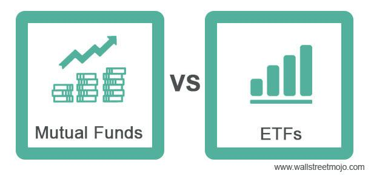

Investment vehicles are diverse financial products available to investors, each offering unique risk-return profiles and strategic advantages. They include stocks, bonds, real estate, and various funds, each serving distinct financial goals. Among these, index mutual funds, exchange-traded funds (ETFs), and algorithmic trading stand out for their unique characteristics and widespread adoption.

Understanding different investment options is key to managing financial portfolios effectively. Investors are faced with choices that impact their risk exposure, returns, and overall financial health. Knowing the characteristics and performance metrics of each vehicle helps in crafting strategies tailored to individual needs, financial goals, and risk tolerance.

Index mutual funds, ETFs, and algorithmic trading represent modern investment strategies that cater to diverse investor preferences. Index mutual funds aim to replicate the performance of specific indices, offering investors exposure to broad market segments with minimal costs. ETFs share similar goals but trade like stocks on exchanges, providing liquidity and flexibility. Algorithmic trading, on the other hand, utilizes robotic algorithms to make investment decisions without human intervention. It leverages data and computational power to execute trades at speeds and frequencies unachievable by manual trading.

This article aims to compare these investment options by evaluating their structures, benefits, and risks. It focuses on aiding investors, whether new or experienced, in diversifying or optimizing their portfolios through informed decisions. Understanding these vehicles can illuminate paths to achieving greater portfolio efficiency and adapting to changing market conditions.

The primary audience for this analysis includes investors keen on expanding their knowledge and investment strategies. By exploring and contrasting index mutual funds, ETFs, and algorithmic trading, this piece seeks to equip readers with insights that can guide them toward better financial outcomes within their investment journey.

## Table of Contents

## Understanding Index Mutual Funds

Index mutual funds are investment vehicles designed to replicate the performance of a specific market index. These funds aim to match the returns of the index they track by holding all or a representative sample of the securities included in the index. This is achieved through a passive management strategy, minimizing frequent buying and selling activities.

Index mutual funds possess several key characteristics:
1. **Diversification**: By tracking a broad market index, such as the S&P 500, index mutual funds offer investors exposure to a wide range of securities, promoting risk mitigation.
2. **Low Costs**: With a passive management approach, index mutual funds typically incur lower fees than actively managed funds. This is due to reduced management overhead and lower transaction costs.
3. **Transparency**: Investors can easily track the performance of an index mutual fund against the index it seeks to replicate.

The operation of index mutual funds involves matching the composition of a target index. Fund managers either replicate the index fully by purchasing all constituent securities in proportion to their index weights or use a sampling method for cost-efficiency. By doing so, the fund's returns should closely mirror those of the index, minus fees and expenses.

Investing in index mutual funds offers several benefits:
- **Cost-Effectiveness**: As mentioned, passive management typically results in lower expense ratios compared to actively managed funds.
- **Simplicity**: Index funds provide an easy entry point to market participation without the need for extensive research or analysis by the investor.
- **Predictability**: Due to their passive nature, index mutual funds offer predictable performance aligned with their benchmark indexes.

However, risks accompany index mutual funds:
- **Market Risk**: The value of an index mutual fund fluctuates based on the performance of its underlying index. During market downturns, these funds will reflect losses parallel to the market's decline.
- **Lack of Flexibility**: Because index mutual funds are tied to a specific index, they lack the flexibility to adjust to changing market conditions or capitalize on market opportunities.

Popular index mutual funds can vary depending on investor interest and market conditions, but some have remained consistently favorable due to their robust performance and efficiency. Examples include:
- **Vanguard 500 Index Fund**: One of the largest and most widely recognized index funds, tracking the S&P 500.
- **Fidelity ZERO Total Market Index Fund**: Offers exposure to the entire U.S. stock market and boasts zero expense ratio fees.
- **Schwab S&P 500 Index Fund**: Known for its low fees and alignment with the S&P 500.

By understanding the workings and characteristics of index mutual funds, investors can make informed decisions about incorporating them into their portfolios to achieve broad market exposure at a low cost.

## Exploring Exchange-Traded Funds (ETFs)

Exchange-Traded Funds (ETFs) represent a type of investment fund and exchange-traded product, meaning they are traded on stock exchanges, similar to stocks. Generally, ETFs hold assets such as stocks, commodities, or bonds, and they endeavor to track an index's performance. Unlike mutual funds which are priced once daily, ETFs trade at market prices throughout the trading day, which can differ from the net asset value (NAV).

### Definition of ETFs and How They Differ from Mutual Funds

ETFs are structured to offer investors returns reflective of the performance of an index, a commodity, or a basket of assets. They are designed to mimic the performance of these collections without active management. This distinguishes them from mutual funds, which generally involve active management and aim to outperform a specific benchmark.

Mutual funds are bought and sold based on their closing market price, requiring investors to deal directly with the fund. Conversely, ETFs are traded on an exchange, which facilitates the real-time buying and selling of shares at varying prices throughout the trading day. This feature provides ETFs with [liquidity](/wiki/liquidity-risk-premium) and transparent pricing that mutual funds lack.

### Advantages of Investing in ETFs

The appeal of ETFs lies in several key advantages:

1. **Liquidity and Flexibility**: ETFs can be bought or sold at any time during the trading day at current market prices, offering flexibility not found in mutual funds.

2. **Cost-Effectiveness**: Typically, ETFs come with lower expense ratios compared to mutual funds because they are passively managed. They do not incur costs related to active management.

3. **Tax Efficiency**: ETFs are generally more tax-efficient than mutual funds. Most ETFs use an "in-kind" creation and redemption process which minimizes capital gains distributions.

4. **Diversification**: By holding a collection of assets, ETFs provide diversification, reducing risk by spreading investments across multiple instruments.

### Risks Related to ETF Investments

Despite their advantages, ETFs come with certain risks:

1. **Market Risk**: Being traded on public exchanges, ETFs are subject to market risks and price fluctuations that can result from events affecting the entire market.

2. **Liquidity Risk**: Some ETFs, particularly those based on less liquid securities, can experience liquidity issues, especially during volatile market conditions.

3. **Tracking Error**: ETFs may not perfectly follow their index or asset class, resulting in tracking errors which can affect returns.

### Notable ETFs for Investment

Investors looking to invest in ETFs can consider the following:

- **SPDR S&P 500 ETF (SPY)**: Tracks the S&P 500 Index, offering exposure to large-cap U.S. stocks.
- **Vanguard Total Stock Market ETF (VTI)**: Provides broad exposure to the entire U.S. equity market.
- **iShares MSCI Emerging Markets ETF (EEM)**: Consists of stocks from emerging market countries.

### Comparison of ETFs and Index Mutual Funds

Both ETFs and index mutual funds aim to replicate the performance of an index. However, the investments differ in several behavioral and structural aspects:

- **Trading and Pricing**: ETFs trade throughout the day with real-time pricing, while index mutual funds are priced once at the end of the trading day.
- **Costs**: ETFs generally have lower expense ratios but incur brokerage commissions with each buy/sell transaction, which can add costs for active traders.
- **Flexibility and Usage**: ETFs offer greater flexibility in trading strategies, including options trading and short selling, compared to index mutual funds.

In concluding, while both ETFs and index mutual funds offer index-based returns, ETFs provide greater liquidity and trading flexibility, making them appealing to a different set of investors compared to traditional mutual funds.

 to Algorithmic Trading

Algorithmic trading, often referred to as algo trading or automated trading, utilizes computer programs to execute trading decisions with minimal human intervention. These programs follow a set of predefined instructions, known as algorithms, which consider variables like timing, price, and quantity. The core purpose is to leverage technology to enhance speed, accuracy, and efficiency in financial markets.

Applications of [algorithmic trading](/wiki/algorithmic-trading) are diverse, ranging from simple strategies like [market making](/wiki/market-making) and [arbitrage](/wiki/arbitrage) to more complex ones involving [statistical arbitrage](/wiki/statistical-arbitrage) and trend analysis. Market making strategies ensure liquidity by continuously providing buy and sell quotes, thereby allowing traders to profit from the bid-ask spread. Arbitrage exploits price discrepancies of the same asset across different markets. On a more advanced level, statistical arbitrage involves complex mathematical models to identify transient mispricings among assets, while trend-following algorithms analyze historical data to make predictions on future price movements.

Algorithmic trading is reshaping the investment landscape by providing unprecedented levels of speed and precision. Trades that previously took minutes or even hours for human traders to execute can now be performed in fractions of a second. This increase in execution speed reduces transaction costs and allows for better price execution—a significant advantage in highly competitive markets.

Despite the advantages, algorithmic trading has its disadvantages. Its reliance on electronic infrastructure makes it vulnerable to technical failures and system outages. Additionally, poorly designed algorithms can lead to market disruptions, as evidenced by the infamous "Flash Crash" of 2010, where the Dow Jones Industrial Average dropped nearly 1,000 points in minutes due to an erroneous algorithm.

Several types of algorithms are utilized in trading. Basic algorithms include pairs trading, which involves taking offsetting positions in two related securities to exploit relative price movements. More sophisticated algorithms incorporate [machine learning](/wiki/machine-learning) techniques to adapt to new data inputs and evolving market conditions. These adaptive algorithms, often powered by [artificial intelligence](/wiki/ai-artificial-intelligence), can learn from past trading patterns to predict future trends—a method increasingly used in high-frequency trading environments.

The potential risks associated with algorithmic trading are significant. Besides technology-related risks, the sheer speed of execution can exacerbate market [volatility](/wiki/volatility-trading-strategies). However, the potential rewards, such as higher returns and improved market efficiency, are compelling factors driving the adoption of this technology.

In conclusion, algorithmic trading offers a powerful tool for executing trades with speed and precision, though it comes with associated risks. Understanding its types and applications is crucial for market participants aiming to optimize their investment strategies.

## Comparing Investment Options

When choosing between index mutual funds, exchange-traded funds (ETFs), and algorithmic trading, several criteria can guide investors to select the appropriate option based on their financial goals and risk tolerances. This section examines these investment vehicles through the lenses of cost, risk, return potential, time horizon, liquidity, transparency, and investor suitability.

**Comparative Analysis: Cost, Risk, and Return Potential**

1. **Cost:**  
   - **Index Mutual Funds:** Typically incur management fees, expressed as an expense ratio, which can range from 0.05% to 0.25% annually. These fees cover administrative costs and the expertise of fund managers.
   - **ETFs:** Generally have lower expense ratios than index mutual funds, often falling below 0.10%, as they passively track indices. Brokerage commissions may apply, although many brokers offer commission-free ETFs.
   - **Algorithmic Trading:** Costs involve transaction fees, data fees, and potential technological infrastructure expenses. Algorithms might seek trade cost minimization, employing strategies that consider slippage and market impact.

2. **Risk:**  
   - **Index Mutual Funds:** Offer diversified exposure, which mitigates unsystematic risk. They mirror the risk profile of the underlying index.
   - **ETFs:** Similarly, provide diversification and are subject to market risk. Sector or thematic ETFs may carry additional concentration risks.
   - **Algorithmic Trading:** Risks include model risk, market risk, and operational risk. Algorithms may expose investors to high-frequency trading concerns and flash crashes.

3. **Return Potential:**  
   - **Index Mutual Funds and ETFs:** Typically provide returns aligned with market indices. The return potential is tied to the broader market performance.
   - **Algorithmic Trading:** Can offer superior returns through advanced strategies and exploitation of market inefficiencies. However, past performance is no guarantee of future results.

**Time Horizon and Investment Goals**

- **Index Mutual Funds and ETFs:** Suitable for long-term investors seeking stable, market-linked returns. They are apt choices for retirement funds or achieving specific financial milestones over decades.
- **Algorithmic Trading:** May appeal to those with short-term goals, seeking to capitalize on pricing discrepancies or volatility. It requires continuous monitoring and strategy adjustments, aligning it with active traders rather than passive investors.

**Liquidity and Transparency Issues**

- **ETFs:** Highly liquid, tradeable like stocks, allowing for intraday buy and sell transactions. Their transparency is notable, with daily disclosures of portfolio holdings.
- **Index Mutual Funds:** While highly transparent, they are liquidated at the end of the trading day and may have minimum holding periods or redemption fees.
- **Algorithmic Trading:** Liquidity can vary by strategy and market; high-frequency trading increases liquidity needs. Transparency is often lower, with proprietary models and strategies shrouded in secrecy.

**Investor Profiles Suited for Each Investment Type**

- **Index Mutual Funds and ETFs:** Best suited for risk-averse investors, retirees, or those prioritizing a diversified, hands-off approach.
- **Algorithmic Trading:** Attractive to technologically savvy investors, quantitative analysts, or those with a higher risk tolerance and active trading ambitions. It is often part of institutional investment strategies rather than individual investors due to its complexity.

In conclusion, determining the best investment option requires balancing these factors against personal financial aspirations and risk tolerance. A clear understanding of one's investment profile and market conditions enables informed decisions in selecting index mutual funds, ETFs, or algorithmic trading as a path toward financial success.

## Case Studies and Examples

## Case Studies and Examples

### Successful Index Mutual Fund Investments

One notable example of a successful index mutual fund investment is the Vanguard 500 Index Fund (VFIAX). Launched in 1976, this fund aims to mirror the performance of the S&P 500 Index by investing in a diverse range of stocks included in the index. Over the years, VFIAX has delivered consistent returns, benefiting from the overall growth of the U.S. stock market. For instance, from its inception to 2021, the fund has averaged around a 10% annual return, closely aligning with the historical average of the S&P 500 itself.

Investors benefit from the broad diversification and lower expense ratios associated with index mutual funds. This example illustrates the power of passive investing strategies, where minimal intervention allows the market's natural growth trajectory to work for investors over the long term.

### ETF Case Scenarios and Outcomes

The SPDR S&P 500 [ETF](/wiki/etf-trading-strategies) Trust (SPY) is among the most recognizable ETFs, closely tracking the S&P 500 Index similar to VFIAX but offering distinct advantages such as intraday trading. An interesting scenario can be seen during the 2020 COVID-19 pandemic when markets experienced significant volatility. While many individual stocks were severely impacted, SPY provided investors with a versatile tool for capitalizing on market recoveries. As the market regained value post-March 2020, SPY witnessed a substantial recovery, demonstrating resilience and providing investors with liquidity during uncertain times.

### Algorithmic Trading: Successes and Failures

Algorithmic trading has revolutionized investment strategies by utilizing complex algorithms to make trading decisions at speeds unimaginable for human traders. Renaissance Technologies, a prominent [hedge fund](/wiki/hedge-fund-trading-strategies), exemplifies success in this domain. Their Medallion Fund, renowned for its proprietary algorithms, has consistently delivered exceptionally high returns, with average annual gains of 35% from 1988 to 2018, net of fees.

Conversely, Knight Capital Group experienced a significant failure in 2012 when a software glitch resulted in an unexpected $440 million loss. This incident underscores the potential pitfalls of algorithmic trading, where programming errors or unforeseen market conditions can lead to substantial financial damage.

### Lessons to Be Learned

Real-world examples provide several critical lessons:

1. **Diversification and Passive Management**: As demonstrated by index mutual funds like VFIAX, diversification across a wide array of assets reduces risk while harnessing market growth. Passive management minimizes costs and avoids potential pitfalls associated with frequent trading decisions.

2. **ETFs for Liquidity and Flexibility**: The versatility and liquidity of ETFs, such as SPY, offer investors the advantage of real-time trading to adapt quickly to market changes. This flexibility is particularly beneficial during periods of volatility.

3. **Algorithmic Trading Vigilance**: While algorithmic trading can yield substantial returns, it necessitates robust oversight, constant monitoring, and diligent testing to prevent catastrophic failures, as illustrated by Knight Capital's mishap.

### Practical Insights for Decision-Making

When choosing between these investment options, investors should focus on their risk tolerance, investment goals, and preference for trading flexibility versus stability. Broad index funds suit those seeking long-term growth with minimal management effort, while ETFs offer a middle ground with added liquidity benefits. Algorithmic trading, meanwhile, is best suited for sophisticated investors comfortable with technological and financial complexities. A comprehensive understanding of each method's benefits and limitations enables informed decision-making, helping investors align their portfolios with their financial objectives.

## Conclusion

The article has explored three prominent investment vehicles: index mutual funds, exchange-traded funds (ETFs), and algorithmic trading. Each option presents distinct characteristics, benefits, and risks that cater to different investor needs and profiles.

Index mutual funds offer a low-cost, diversified investment approach that requires minimal active management. These funds track specific market indices, facilitating broad market exposure with the potential for long-term growth. They are particularly well-suited for investors who prefer a passive investment strategy with reduced costs.

Exchange-traded funds (ETFs) combine the diversification benefits of mutual funds with the trading flexibility of individual stocks. They provide exposure to a wide variety of asset classes and sectors. ETFs tend to have lower expense ratios compared to mutual funds and offer enhanced liquidity. However, investors should be mindful of trading costs and potential tracking errors.

Algorithmic trading employs advanced technologies to execute trades based on predetermined conditions and market analysis. While this method can optimize trading efficiency and precision, it requires substantial technical expertise and risk management strategies. Algorithmic trading is ideal for technologically savvy investors who seek to capitalize on short-term market movements.

Selecting the right investment strategy depends on understanding personal financial goals, risk tolerance, time horizon, and the level of involvement desired in portfolio management. It is crucial for investors to remain adaptable and informed, as the financial landscape continuously evolves. Regularly reviewing investments and staying updated with market trends can provide better alignment with changing objectives and risk profiles.

Engaging with financial advisors can provide personalized advice, ensuring that investment choices align with individual goals and market conditions. Advisors can help navigate complexities, offer insights on diversification, and aid in optimizing investment strategies.

Readers are encouraged to share their experiences and insights regarding these investment options. Collective experiences can foster a deeper understanding of various strategies and broaden perspectives on effective investment practices.

## References & Further Reading

[1]: Bogle, J. C. (2017). ["The Little Book of Common Sense Investing: The Only Way to Guarantee Your Fair Share of Stock Market Returns."](https://www.amazon.com/Little-Book-Common-Sense-Investing/dp/1119404509) Wiley.

[2]: Malkiel, B. G. (2020). ["A Random Walk Down Wall Street: The Time-Tested Strategy for Successful Investing."](https://www.amazon.com/Random-Walk-Down-Wall-Street/dp/0393358380) W. W. Norton & Company.

[3]: Ferri, R. A. (2012). ["All About Index Funds: The Easy Way to Get Started."](https://rickferri.com/books/all-about-index-funds/) McGraw-Hill.

[4]: Ferri, R. A., & Bogle, J. C. (2011). ["The ETF Book: All You Need to Know About Exchange-Traded Funds."](https://www.amazon.com/ETF-Book-About-Exchange-Traded-Funds/dp/0470537469) Wiley.

[5]: Write, K. J. & Douvogiannis, N. (2018). ["Algorithmic Trading: Winning Strategies and Their Rationale."](https://www.wiley.com/en-us/Algorithmic+Trading%3A+Winning+Strategies+and+Their+Rationale-p-9781118746912) Wiley Trading.

[6]: Rosenbaum, J., & Pearl, J. (2018). ["Investment Banking: Valuation, Leveraged Buyouts, and Mergers & Acquisitions."](https://books.google.com/books/about/Investment_Banking.html?id=j2JSCAAAQBAJ) Wiley Finance. 

[7]: ["Exchange-Traded Funds and the New Dynamics of Investing"](https://academic.oup.com/book/3366) by Ananth N. Madhavan.

[8]: ["Common Stocks and Uncommon Profits and Other Writings"](https://www.amazon.com/Common-Stocks-Uncommon-Profits-Writings/dp/0471445509) by Philip A. Fisher.