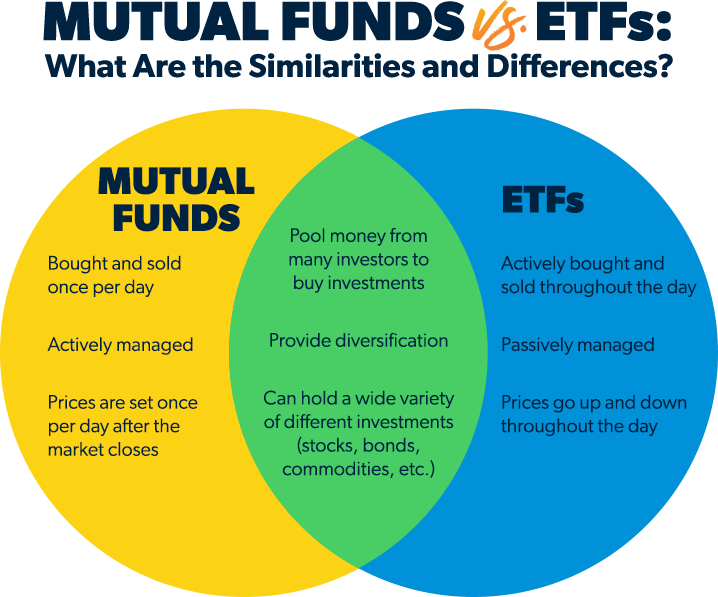

## Table of Contents

## What are ETFs?

ETFs, or Exchange-Traded Funds, are a type of investment that works like a mix of stocks and mutual funds. They are traded on stock exchanges, just like individual stocks, which means you can buy and sell them throughout the trading day at market prices. ETFs typically track an index, like the S&P 500, a commodity, bonds, or a basket of assets. This makes them a popular choice for investors looking to diversify their portfolios without having to buy each asset individually.

One of the main benefits of ETFs is their lower cost compared to many other investment options. They often have lower expense ratios than mutual funds because they are passively managed, meaning they follow an index rather than trying to beat the market through active management. This can save investors a lot of money over time. Additionally, ETFs offer flexibility and transparency, as investors can see the holdings of the ETF at any time and can trade them whenever the market is open.

## What are Index Mutual Funds?

Index mutual funds are a type of investment that aims to match the performance of a specific market index, like the S&P 500. Instead of trying to pick individual stocks that will do better than the market, these funds simply hold all the stocks in the index they are tracking. This makes them a good choice for people who want to invest in the overall market without having to choose specific stocks.

One big advantage of index mutual funds is that they usually have lower costs than actively managed funds. Because they don't need a team of experts to pick stocks, the fees are often much smaller. This means more of your money stays invested and working for you. Index mutual funds are also easy to buy and hold, making them a popular choice for people saving for long-term goals like retirement.

## How do ETFs and Index Mutual Funds differ in terms of structure?

ETFs and index mutual funds both aim to track the performance of a specific index, but they have different structures. ETFs are traded on stock exchanges, similar to individual stocks. This means you can buy and sell them throughout the trading day at the current market price. They often use a creation and redemption process involving authorized participants, which helps keep the ETF's price closely aligned with its underlying assets. This structure makes ETFs very flexible and liquid, allowing investors to trade them easily.

On the other hand, index mutual funds are not traded on stock exchanges. Instead, they are bought and sold directly through the fund company at the end of the trading day, based on the fund's net asset value (NAV). This means you can't trade them during the day, and you'll get the price calculated after the market closes. The structure of index mutual funds is simpler, as they do not involve the creation and redemption process used by ETFs, making them a straightforward option for long-term investors who do not need to trade frequently.

## What are the typical costs associated with ETFs and Index Mutual Funds?

ETFs and index mutual funds both have costs, but they can be different. ETFs usually have an expense ratio, which is a yearly fee based on the amount of money you have invested in the fund. This fee is often very low, sometimes less than 0.1%. ETFs may also have trading costs, like commissions and bid-ask spreads, which are the differences between the price someone is willing to buy and sell the ETF. These costs can add up if you trade a lot.

Index mutual funds also have an expense ratio, which is similar to ETFs and is usually low, often around 0.05% to 0.2%. Unlike ETFs, index mutual funds don't have trading costs because you buy and sell them directly from the fund company at the end of the day. But, some index mutual funds might have other fees, like purchase or redemption fees, though these are not common in index funds. Overall, both ETFs and index mutual funds are known for being cost-effective investment options.

## How does the trading flexibility of ETFs compare to Index Mutual Funds?

ETFs give you more freedom to trade than index mutual funds. You can buy and sell ETFs anytime during the trading day, just like you would with regular stocks. This means you can quickly react to changes in the market or take advantage of short-term opportunities. If you want to sell your ETFs and get your money right away, you can do that because they are very liquid.

On the other hand, index mutual funds are not as flexible. You can only buy or sell them at the end of the trading day, based on the fund's net asset value. This means you have to wait until the market closes to know the exact price you'll get. If you need your money fast, index mutual funds might not be the best choice because you can't trade them during the day.

## What are the tax implications of investing in ETFs versus Index Mutual Funds?

When it comes to taxes, ETFs can be a bit more tax-friendly than index mutual funds. ETFs often have lower capital gains distributions because of how they are structured. When people buy and sell ETFs, it usually doesn't force the fund to sell its holdings, which can trigger taxes. This means you might not have to pay as much in taxes each year if you invest in ETFs.

On the other hand, index mutual funds can sometimes lead to higher tax bills. When other investors in the fund sell their shares, the fund might need to sell some of its holdings to pay them out. This can create capital gains that get passed on to all the fund's investors, even if you didn't sell any of your shares. So, if you're worried about taxes, ETFs might be a better choice for keeping your tax bill lower.

## How do the investment minimums for ETFs compare to those of Index Mutual Funds?

ETFs usually don't have a minimum investment amount. This means you can buy just one share of an ETF if you want to. The price of one share can be different for each ETF, but it's often around the same as the price of a single stock. So, if you have a little bit of money to invest, you can start with ETFs without needing a lot of cash upfront.

Index mutual funds can have minimum investment amounts. Some funds might ask you to put in at least $1,000 or even more to start investing. But, there are also some index mutual funds that let you start with less money, sometimes as low as $100 or even no minimum if you set up automatic investments. If you want to invest a small amount of money, you might need to look for these funds with lower or no minimums.

## What are the diversification benefits of ETFs and Index Mutual Funds?

Both ETFs and index mutual funds offer great ways to spread your money across many different investments, which is called diversification. This means you're not putting all your eggs in one basket. By investing in an ETF or an index mutual fund, you get a piece of a whole bunch of stocks or other assets at once. This can help lower your risk because if one company or asset does badly, it won't hurt your whole investment as much.

ETFs and index mutual funds do this diversification in a similar way. They both track a specific index, like the S&P 500, which includes a lot of different companies. This means you're investing in a wide range of industries and companies without having to pick each one yourself. Both types of funds give you an easy way to have a diversified portfolio, which can help protect your money and help it grow over time.

## How do ETFs and Index Mutual Funds perform in different market conditions?

ETFs and index mutual funds usually do pretty well in good market conditions. When the stock market is going up, these funds follow the market because they hold a lot of the same stocks that are doing well. Since they track indexes like the S&P 500, if those indexes go up, your investment in ETFs or index mutual funds will likely go up too. This makes them a good choice for people who want to grow their money when the market is strong.

In bad market conditions, like when the stock market goes down, ETFs and index mutual funds will also go down. They can't avoid the drop because they are tied to the market's performance. But, because they are diversified, they might not fall as much as a single stock that's doing really badly. So, while they won't protect you completely from a market downturn, they can help cushion the blow a bit because your money is spread out across many different investments.

## What are the strategies for using ETFs and Index Mutual Funds in a portfolio?

One strategy for using ETFs and index mutual funds in your portfolio is to build a core and satellite approach. The core part of your portfolio can be made up of broad market ETFs or index mutual funds, like those that track the S&P 500 or the total stock market. These funds give you a solid base because they cover a lot of different companies and industries. Then, you can use satellite investments to add a bit more spice to your portfolio. These could be sector-specific ETFs or funds that focus on certain themes, like technology or green energy. This way, you get the stability of the broad market with the chance to gain a bit more from specific areas that you think will do well.

Another strategy is to use ETFs and index mutual funds for asset allocation. You can split your money between different types of investments, like stocks, bonds, and maybe even real estate or commodities. For example, you might put 60% of your money in stock ETFs or index mutual funds and 40% in bond ETFs or index mutual funds. This helps balance your risk and reward. As you get closer to your goals, like retirement, you can shift more of your money into safer investments, like bond funds, to protect what you've saved. This strategy helps you stay on track and manage your risk over time.

## How do the tracking errors of ETFs compare to those of Index Mutual Funds?

Tracking error is how much an ETF or an index mutual fund's performance differs from the index it's trying to copy. Both ETFs and index mutual funds can have tracking errors, but they might happen for different reasons. ETFs might have tracking errors because of the costs of trading the stocks in the fund, the difference between the ETF's price and its net asset value, and the fees you pay to own the ETF. Index mutual funds can have tracking errors too, often because of the fees they charge and the way they manage their cash.

In general, ETFs might have slightly higher tracking errors than index mutual funds. This is because ETFs are traded throughout the day, and the price can move a bit away from the value of the stocks they hold. But, many ETFs are very good at keeping their tracking errors low, especially the big and popular ones. Index mutual funds, on the other hand, might have smaller tracking errors because they are bought and sold at the end of the day based on their net asset value, which can help them stay closer to the index they're tracking.

## What advanced techniques can be used to optimize returns from ETFs and Index Mutual Funds?

One advanced technique to optimize returns from ETFs and index mutual funds is called tax-loss harvesting. This means selling investments that have gone down in value to get a tax break, and then using that money to buy similar but not identical investments. For example, if you have an ETF that has lost value, you can sell it, take the tax loss, and then buy a different ETF that tracks a similar index. This can help lower your taxes and keep your money growing. It's a bit tricky, but it can really help if you do it right.

Another technique is using leverage or inverse ETFs to try and boost your returns. Leveraged ETFs aim to give you double or even triple the daily return of an index, while inverse ETFs try to give you the opposite return. These can be very risky, but if you think the market will go up or down a lot, they might help you make more money. Just remember, these ETFs are for short-term moves and can be hard to handle, so they're not for everyone. If you're going to use them, make sure you know what you're doing and are ready for the risk.

## References & Further Reading

[1]: Bogle, J. C. (2017). ["The Little Book of Common Sense Investing: The Only Way to Guarantee Your Fair Share of Stock Market Returns."](https://www.amazon.com/Little-Book-Common-Sense-Investing/dp/1119404509) Wiley.

[2]: Malkiel, B. G. (2020). ["A Random Walk Down Wall Street: The Time-Tested Strategy for Successful Investing."](https://www.amazon.com/Random-Walk-Down-Wall-Street/dp/0393358380) W. W. Norton & Company.

[3]: Ferri, R. A. (2012). ["All About Index Funds: The Easy Way to Get Started."](https://rickferri.com/books/all-about-index-funds/) McGraw-Hill.

[4]: Ferri, R. A., & Bogle, J. C. (2011). ["The ETF Book: All You Need to Know About Exchange-Traded Funds."](https://www.amazon.com/ETF-Book-About-Exchange-Traded-Funds/dp/0470537469) Wiley.

[5]: Write, K. J. & Douvogiannis, N. (2018). ["Algorithmic Trading: Winning Strategies and Their Rationale."](https://www.wiley.com/en-us/Algorithmic+Trading%3A+Winning+Strategies+and+Their+Rationale-p-9781118746912) Wiley Trading.

[6]: Rosenbaum, J., & Pearl, J. (2018). ["Investment Banking: Valuation, Leveraged Buyouts, and Mergers & Acquisitions."](https://books.google.com/books/about/Investment_Banking.html?id=j2JSCAAAQBAJ) Wiley Finance. 

[7]: ["Exchange-Traded Funds and the New Dynamics of Investing"](https://academic.oup.com/book/3366) by Ananth N. Madhavan.

[8]: ["Common Stocks and Uncommon Profits and Other Writings"](https://www.amazon.com/Common-Stocks-Uncommon-Profits-Writings/dp/0471445509) by Philip A. Fisher.