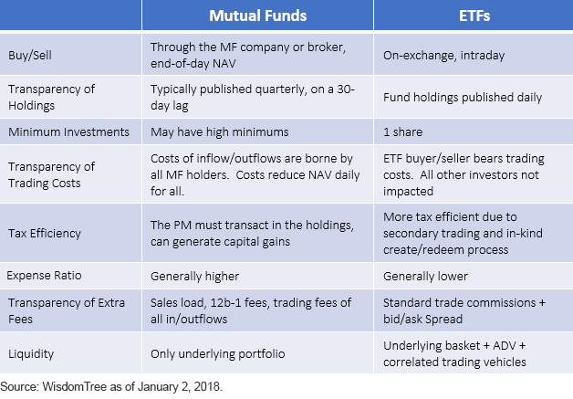

## Table of Contents

## What are ETFs and how do they work?

ETFs, or Exchange-Traded Funds, are a type of investment that combines features of mutual funds and stocks. They are designed to track the performance of a specific index, like the S&P 500, a commodity, bonds, or a basket of assets. You can buy and sell ETFs on a stock exchange, just like you would with individual stocks. This makes them easy to trade throughout the day at market prices, which can change from moment to moment.

When you invest in an ETF, you're essentially buying a small piece of all the assets that the ETF holds. For example, if you buy an ETF that tracks the S&P 500, your investment is spread across all the companies in that index. This diversification can help reduce risk compared to investing in single stocks. ETFs are popular because they offer a simple way to invest in a broad market or specific sector without having to buy each asset individually. Plus, they usually have lower fees than actively managed mutual funds.

## What are mutual funds and how do they work?

Mutual funds are investment vehicles that pool money from many investors to buy a diversified portfolio of stocks, bonds, or other securities. When you invest in a mutual fund, you're buying shares of the fund, which represent a part of the overall portfolio. A professional manager oversees the fund, making decisions about which securities to buy and sell to meet the fund's investment goals. This makes mutual funds a popular choice for people who want to invest but don't have the time or expertise to manage their investments themselves.

The price of a mutual fund share, known as its net asset value (NAV), is calculated at the end of each trading day based on the total value of the securities the fund owns, minus any liabilities, divided by the number of shares outstanding. Unlike stocks or ETFs, you can't buy or sell mutual fund shares throughout the day; you can only trade them at the end of the day at the NAV price. Mutual funds often come with various fees, including management fees and other expenses, which can affect your overall returns. Despite these costs, many investors find mutual funds appealing because they offer a convenient way to achieve diversification and professional management.

## What are the main differences between ETFs and mutual funds?

ETFs and mutual funds are both popular investment options, but they have some key differences. One big difference is how you can buy and sell them. ETFs trade on stock exchanges like individual stocks, so you can buy and sell them throughout the day at market prices that can change from moment to moment. On the other hand, mutual funds can only be bought or sold at the end of the trading day at a price called the net asset value (NAV), which is calculated after the market closes.

Another difference is how they are managed. ETFs usually aim to track the performance of a specific index, like the S&P 500, without trying to beat it. This means they often have lower fees because they don't need a lot of active management. Mutual funds, on the other hand, are often actively managed by a professional who tries to pick the best securities to outperform the market. This active management can lead to higher fees, but some investors are willing to pay for the potential to do better than the market.

Lastly, ETFs and mutual funds also differ in terms of minimum investment requirements. ETFs can be bought for the price of a single share, which can be as low as a few dollars, making them accessible to many investors. Mutual funds, however, often require a minimum investment that can be several thousand dollars, though some funds offer lower or no minimums. These differences can affect which type of investment might be better for your financial goals and budget.

## How do the costs of ETFs compare to mutual funds?

ETFs generally have lower costs than mutual funds. The main reason is that ETFs usually track an index, like the S&P 500, and don't need a lot of active management. This means they have lower expense ratios, which are the annual fees you pay to own the fund. For example, an ETF might have an expense ratio of 0.05% to 0.20%, while a mutual fund's expense ratio can be 0.50% to 1.50% or more. Lower costs can make a big difference over time because they eat into your returns less.

Mutual funds often have higher costs because they are actively managed by professionals who try to pick the best investments to beat the market. This active management requires more work and research, which is why mutual funds charge higher fees. Besides the expense ratio, mutual funds can also have other costs like sales loads or redemption fees, which are less common with ETFs. So, if you're looking to keep your investment costs down, ETFs might be a better choice.

## What are the tax implications of investing in ETFs versus mutual funds?

When it comes to taxes, ETFs often have a big advantage over mutual funds. ETFs are usually more tax-efficient because of how they are structured. When an ETF needs to sell assets to meet investor redemptions, it can do this in a way that doesn't trigger capital gains taxes for the investors. This is called "in-kind" transactions. On the other hand, mutual funds often have to sell assets to meet redemptions, which can lead to capital gains being distributed to all the fund's investors, even if they didn't sell their shares. This can mean you have to pay taxes on gains you didn't directly benefit from.

That said, not all mutual funds are less tax-efficient than ETFs. Some mutual funds are designed to minimize capital gains distributions and can be quite tax-efficient. However, on average, ETFs tend to be better at keeping your tax bill lower. If you're investing in a taxable account, the tax benefits of ETFs might make them a smarter choice. But if you're investing in a tax-deferred account like an IRA or 401(k), the tax differences between ETFs and mutual funds don't matter as much, because you won't pay taxes on your investments until you withdraw the money.

## How does the trading flexibility of ETFs compare to mutual funds?

ETFs give you more freedom to trade than mutual funds. With ETFs, you can buy and sell them anytime during the trading day, just like stocks. This means you can react quickly to market changes or news that might affect your investments. If you see a good opportunity or want to get out of an investment fast, ETFs let you do that. They also let you use trading strategies like limit orders and stop-loss orders, which can help you control when and at what price you buy or sell.

Mutual funds, on the other hand, are less flexible. You can only buy or sell them at the end of the trading day, at a price called the net asset value (NAV). This means you can't respond to market changes as they happen. If something big happens in the market, you have to wait until the end of the day to make your move. This can be frustrating if you want to act quickly, but it might be okay if you're planning to hold your investments for a long time and don't need to trade often.

## What are the minimum investment requirements for ETFs and mutual funds?

ETFs usually have a low minimum investment. You can buy them for the price of just one share, which can be as little as a few dollars. This makes ETFs easy for almost anyone to start investing, even if you don't have a lot of money to begin with. You can also buy more shares over time as you save up more money.

Mutual funds often have a higher minimum investment. Many mutual funds require you to put in at least $1,000 or even more to start. This can make it harder for people with less money to invest in them. But some mutual funds have lower or no minimums, especially if you set up automatic monthly investments. So it's good to check the details of each fund before you decide.

## How do the diversification benefits of ETFs compare to mutual funds?

Both ETFs and mutual funds offer good ways to spread out your investments, which is called diversification. This means you're not putting all your eggs in one basket. When you buy an ETF or a mutual fund, you're getting a piece of a bunch of different stocks, bonds, or other assets all at once. This can help lower your risk because if one company does badly, it won't hurt your whole investment as much.

ETFs and mutual funds are pretty similar when it comes to diversification. They both let you invest in a wide range of assets, which can be from different industries or even different countries. The main difference is in how they're managed. ETFs usually follow an index, like the S&P 500, which means they hold the same stocks as the index. Mutual funds are often managed by a person who picks the stocks, trying to do better than the market. But at the end of the day, both can give you a good spread of investments.

## What are the performance differences between ETFs and mutual funds?

When it comes to performance, ETFs and mutual funds can be pretty similar, but there are some differences. ETFs often try to match the performance of an index, like the S&P 500. This means they won't beat the market, but they also won't do worse than it, except for the small fees they charge. Mutual funds, on the other hand, are often managed by people who try to pick the best stocks to do better than the market. But this doesn't always work out. Studies show that over time, most actively managed mutual funds don't beat the market after you take out their fees. So, ETFs might give you more steady returns because they follow the market closely.

Another thing to think about is costs. ETFs usually have lower fees than mutual funds because they don't need as much work to manage. Lower fees mean more of your money stays in your pocket, which can make a big difference over time. If you're looking at long-term performance, the lower costs of ETFs can help them do better than mutual funds, even if the mutual fund's manager is trying to pick winning stocks. So, when choosing between ETFs and mutual funds, think about what you want: steady returns that match the market with lower fees, or the chance to beat the market but with higher costs and more risk.

## How do ETFs and mutual funds handle dividends and capital gains?

When it comes to dividends, both ETFs and mutual funds work in a similar way. If the stocks or bonds inside the fund pay dividends, the fund collects those dividends. Then, the fund can either pay those dividends out to you, the investor, or reinvest them back into the fund to buy more shares. Most ETFs and mutual funds give you a choice: you can get the dividends as cash, or you can have them automatically reinvested. This way, you can keep growing your investment without having to do anything extra.

For capital gains, there's a bit of a difference between ETFs and mutual funds. When a mutual fund sells a stock or bond at a profit, it has to pay out those gains to its investors. This can happen even if you didn't sell any of your shares in the mutual fund. You'll have to pay taxes on those gains, even if you didn't want to sell. ETFs, on the other hand, are usually better at avoiding these unwanted capital gains distributions. They do this by using a special kind of trade called "in-kind" transactions. This means they can swap out stocks without selling them, so they don't have to pay out as many capital gains to investors. This can make ETFs more tax-friendly, especially if you're investing in a regular, taxable account.

## What are the advanced strategies for using ETFs and mutual funds in a portfolio?

One advanced strategy for using ETFs and mutual funds in a portfolio is called asset allocation. This means you spread your money across different types of investments, like stocks, bonds, and maybe even commodities. You can use ETFs to easily invest in different sectors or regions, like technology or emerging markets, because they track indexes that represent these areas. Mutual funds can also help with this, especially if you choose ones that focus on specific industries or types of investments. By mixing ETFs and mutual funds, you can create a balanced portfolio that matches your risk level and financial goals. For example, if you're close to retirement, you might want more bonds and less stocks, so you could use bond ETFs and mutual funds to shift your portfolio in that direction.

Another strategy is called rebalancing. This means you check your portfolio from time to time and adjust it to keep it in line with your original plan. If stocks have done really well and now make up a bigger part of your portfolio than you wanted, you can sell some of your stock ETFs or mutual funds and buy more bonds or other types of funds to get back to your target mix. ETFs are great for this because you can trade them anytime during the day, which can be helpful if you want to act quickly. Mutual funds, while less flexible for trading, can still be part of this strategy if you're okay with making changes at the end of the trading day. Rebalancing helps you manage risk and stick to your long-term investment strategy, even as the market goes up and down.

A third strategy is using ETFs and mutual funds for tactical investing. This means you try to take advantage of short-term market trends or opportunities. For example, if you think the tech sector is about to boom, you could buy a tech ETF to get in on the action. Or if you think interest rates are going to rise, you might buy a mutual fund that focuses on short-term bonds, which are less affected by rate changes. ETFs are particularly good for this because you can trade them quickly and easily. But mutual funds can also be used if you're willing to wait until the end of the day to make your moves. Tactical investing can add some excitement to your portfolio, but it also comes with more risk, so it's important to do your homework and not bet too much on any one idea.

## How do regulatory differences impact the operations of ETFs and mutual funds?

Regulatory differences between ETFs and mutual funds mainly come from how they are set up and traded. ETFs are regulated under the Investment Company Act of 1940, just like mutual funds. But because ETFs trade on stock exchanges like individual stocks, they also have to follow rules from the Securities Exchange Act of 1934. These rules cover things like how ETFs can be bought and sold, how they report their prices, and how they handle big trades that could affect the market. This extra layer of regulation helps make sure ETFs work smoothly on the stock market and that investors know what they're getting into.

Mutual funds, on the other hand, are mainly regulated under the Investment Company Act of 1940. This law sets rules for how mutual funds can be managed, what they have to tell investors, and how they handle things like dividends and capital gains. Because mutual funds are bought and sold at the end of the trading day, they don't have to follow the same rules as ETFs about trading on stock exchanges. This means mutual funds have fewer rules to follow about how they're traded, but they still have to be clear with investors about their costs and performance.

## References & Further Reading

[1]: ["Mutual Funds and Exchange-Traded Funds: Building Blocks to Wealth" by H. Kent Baker and John R. Nofsinger](https://academic.oup.com/book/7840)

[2]: ["Exchange-Traded Funds for Dummies" by Russell Wild](https://www.amazon.com/Exchange-Traded-Dummies-Business-Personal-Finance/dp/111982883X)

[3]: Agarwal, V., & Naik, N. Y. (2004). ["Risks and portfolio decisions involving hedge funds."](https://www.jstor.org/stable/1262669) The Review of Financial Studies, 17(1), 63-98.

[4]: Narang, R. K. (2013). ["Inside the Black Box: A Simple Guide to Quantitative and High-Frequency Trading."](https://onlinelibrary.wiley.com/doi/book/10.1002/9781118662717) 

[5]: Maio, P., & Santa-Clara, P. (2015). ["Exchange-Traded Funds: Performance and Policy Implications."](https://scholar.google.com/citations?user=InsCNRAAAAAJ) The Review of Financial Studies, 29(3), 580-622.

[6]: ["Algorithmic Trading & DMA: An introduction to direct access trading strategies" by Barry Johnson.](https://www.amazon.com/Algorithmic-Trading-DMA-introduction-strategies/dp/0956399207)