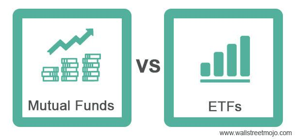

Understanding different investment strategies is crucial for any investor aiming to maximize returns. This article compares three popular investment methods: Mutual Funds, ETFs (Exchange-Traded Funds), and Algo Trading. The purpose is to provide clarity on the fundamentals, benefits, and considerations of each approach.

Mutual Funds are pooled investment vehicles managed by professional fund managers. They offer diversification by investing in a variety of assets, thus reducing risks associated with individual investments. Mutual Funds are structured to allow investors to buy shares in a diversified portfolio without the need to select individual stocks or bonds.

ETFs, or Exchange-Traded Funds, share some similarities with mutual funds in that they pool investor resources to purchase a diversified set of assets. However, they differ significantly in their tradeability and cost implications. ETFs are traded like stocks on exchanges, offering greater liquidity and typically lower fees than mutual funds.

Algo Trading, or algorithmic trading, represents the intersection of finance and technology. It employs algorithms to automatically execute trades based on predefined criteria. The primary advantages of algo trading include enhanced speed, accuracy, and the elimination of emotional biases in trading decisions.

Understanding these concepts is essential for making informed decisions in the financial markets. By comparing mutual funds, ETFs, and algo trading, investors can better match their strategy to their financial goals, risk tolerance, and investment horizon.

## Table of Contents

## What are Mutual Funds?

Mutual funds represent a centralized investment approach where funds from multiple investors are pooled together to purchase a diversified portfolio of securities. Managed by professional portfolio managers, these funds offer individual investors access to a broad range of asset classes without the need to directly manage individual stock investments.

**Structure and Mechanics of Mutual Funds**

At their core, mutual funds work by amassing financial contributions from numerous investors into a single pool of capital. This pooled capital is then deployed across various securities, including stocks, bonds, and other financial instruments, according to the specific investment objective outlined by the fund. Professional portfolio managers are responsible for the allocation and management of these assets, thereby aiming to generate returns through strategic investment decisions and asset diversification.

Investors in mutual funds acquire shares that represent their proportional ownership in the overall pool of assets. The value of the mutual fund shares, known as the Net Asset Value (NAV), fluctuates based on the performance of the underlying assets and is typically calculated at the end of each trading day.

**Advantages: Diversification and Professional Management**

One of the primary advantages of mutual funds is diversification. By pooling resources from multiple investors, mutual funds can invest in a wide array of assets, which helps mitigate risks associated with individual securities. Diversification reduces the impact of poor performance of a single asset on the overall portfolio. Additionally, mutual funds benefit from professional management. Fund managers with expertise in financial markets analyze economic trends and company performances to make informed investment decisions tailored to the fund’s strategic goals. This professional oversight can be particularly beneficial for investors lacking the time or expertise to actively manage their own portfolios.

**Types of Mutual Funds**

Mutual funds are varied and cater to different investment goals and risk appetites. The primary categories include:

- **Equity Funds**: Invest primarily in stocks and aim for growth over the long term. They can further be divided into subsets such as large-cap, mid-cap, and small-cap funds.
- **Debt Funds**: Focus on fixed income securities like bonds and money market instruments. They usually attract investors seeking a stable income with lower risk compared to equity funds.
- **Hybrid Funds**: Combine both equity and debt instruments to provide a balanced investment approach. These funds can be suitable for investors seeking growth along with income stability.
- **Money Market Funds**: Invest in short-term debt and are regarded as low-risk, offering stable returns, suitable for conservative investors.

**Fees and Their Impact on Returns**

Mutual funds typically incur various fees, which can affect overall investment returns. The most common fees include:

- **Expense Ratio**: An annual fee expressed as a percentage of the fund’s assets, covering management fees, administrative expenses, and other operating costs.
- **Sales Loads**: Fees charged when purchasing (front-end load) or selling (back-end load) shares of the fund. Some funds operate as no-load funds, avoiding such charges.
- **Redemption Fees and Exchange Fees**: Assessed for short-term trading and switching between funds within the same fund family.

These fees, while necessary to cover the costs of fund operations and management, reduce the total returns an investor can achieve. It's important for investors to weigh these expenses against potential returns when selecting mutual funds as part of their investment strategy.

## Understanding ETFs

Exchange-Traded Funds (ETFs) are marketable securities that typically track an index, commodity, bonds, or a basket of assets like an index fund. Unlike mutual funds, ETFs can be traded on stock exchanges just like regular stocks, which provides a unique blend of the diversification benefits of mutual funds with the tradability features of stocks. 

**Differences from Mutual Funds:**
ETFs and mutual funds both offer investors a platform for diversified exposure to financial markets, but they differ significantly in how they operate. While mutual funds are priced at the net asset value (NAV) at the end of each trading day, ETFs are priced continuously throughout the trading day. This intra-[day trading](/wiki/day-trading-spy) capability of ETFs offers greater flexibility and potential for [liquidity](/wiki/liquidity-risk-premium) to investors, which is not available with mutual funds. Additionally, ETFs usually have lower expense ratios and are more tax-efficient due to their unique structure that allows in-kind creation and redemption processes.

**Advantages of ETFs:**
One of the primary advantages of ETFs is their liquidity. The ability to buy and sell ETFs throughout the trading day provides investors with the flexibility to react swiftly to market conditions. Furthermore, ETFs tend to be more cost-effective than mutual funds, often carrying lower management fees and less overhead from marketing and distribution.

**Variety of ETFs:**
ETFs offer a broad range of investment options, enabling investors to tailor their portfolios to their specific preferences:
- **Sector-Specific ETFs:** These track the performance of particular industries, such as technology or healthcare.
- **Index-Based ETFs:** These aim to replicate the performance of a specific index, such as the S&P 500.
- **Commodity-Backed ETFs:** These provide exposure to commodities like gold, oil, or agricultural products.
This diversity allows investors to implement specific investment strategies and achieve desired exposure in their portfolios.

**Tax Efficiency:**
The tax efficiency of ETFs arises from their structure and the in-kind creation/redemption process. Unlike mutual funds, which may be forced to sell individual securities to meet shareholder redemptions resulting in realized capital gains, ETFs can execute similar transactions without triggering taxable events. This capability often results in fewer capital gains distributions for [ETF](/wiki/etf-trading-strategies) investors, which can lead to more favorable tax outcomes compared to mutual funds.

**Role in a Diversified Investment Portfolio:**
ETFs can play a significant role in a diversified investment portfolio by providing a wide array of investment opportunities through a single security. They enable investors to reduce idiosyncratic risk by spreading investments across various asset classes, sectors, and geographic regions. This attribute is particularly beneficial for passive investors looking for a low-cost, efficient way to gain market exposure or for active investors seeking to complement their existing portfolio with specific tactical allocations.

In summary, ETFs offer a versatile and efficient investment option for building diversified portfolios with the added benefits of liquidity, cost-effectiveness, and tax efficiency. As a result, they have become an increasingly popular choice among a wide spectrum of investors.

 to Algo Trading

Algorithmic trading, commonly known as algo trading, refers to the use of computer algorithms to automate the trading process. This method leverages mathematical models and computational power to execute trades at speeds and frequencies impossible for human traders. The emergence of [algorithmic trading](/wiki/algorithmic-trading) has transformed modern financial markets, driven by advances in technology and increased availability of market data.

Algorithms in trading are employed to automate and streamline decision-making processes. These algorithms analyze market conditions in real-time and execute orders according to predefined criteria. This process eliminates the need for manual intervention, allowing for precise and rapid execution of trades. The core of algorithmic trading relies on sophisticated mathematical models and statistical analysis to identify market inefficiencies and patterns that can be capitalized on, often executing orders in microseconds to remain competitive.

The advantages of algorithmic trading are numerous. The primary benefit is speed; algorithms can process vast amounts of data and execute trades much faster than any human could. This speed advantage is crucial in capturing short-lived market opportunities. Additionally, algorithmic trading offers accuracy in the execution of trades, as it minimizes the risk of human error. Furthermore, by removing emotional biases, algo trading ensures disciplined adherence to trading strategies, avoiding irrational decisions driven by fear or greed.

Several common strategies are employed in algorithmic trading. Arbitrage strategies seek to exploit price discrepancies of the same asset across different markets or forms. Market making involves providing liquidity to the market by simultaneously placing buy and sell orders. Trend-following strategies identify and exploit the [momentum](/wiki/momentum) of price movements to generate profits. Other strategies include statistical [arbitrage](/wiki/arbitrage), which uses statistical methods to identify mispricings, and mean reversion, which bets on the convergence of a stock's price to its historical average.

To engage in algorithmic trading, certain technological requirements and knowledge are essential. A robust infrastructure, including high-speed internet and powerful computing systems, is necessary to handle data processing and trade execution. Knowledge of programming languages like Python, R, or C++ is crucial for developing trading algorithms. Furthermore, a deep understanding of financial markets, mathematics, and statistical analysis is required to design effective trading strategies. Access to real-time market data and sophisticated analytical tools is also essential for successful algo trading. 

Overall, algorithmic trading is a sophisticated approach that provides significant benefits through automation and precision. However, it requires substantial technological investment and expertise in both programming and market analysis to be effectively implemented.

## Comparative Analysis: Mutual Funds vs. ETFs vs. Algo Trading

When analyzing Mutual Funds, ETFs, and Algo Trading, understanding their cost structures is important, as it directly affects the net returns an investor stands to gain. 

**Cost Structure**

Mutual Funds typically charge management fees, known as the expense ratio, which can range from 0.5% to 2% of the total assets under management annually. Additionally, some funds impose sales loads, which are fees paid when buying or selling the fund. These fees can erode returns over time.

ETFs, on the other hand, usually have lower expense ratios than mutual funds due to their passive management approach. Since they are traded like stocks, investors incur brokerage fees with each transaction. However, unlike mutual funds, ETFs typically do not have sales loads.

Algo Trading involves costs related to technology, software, and data subscriptions. While direct trading fees might be lower due to automated processes, the initial setup and ongoing maintenance can be substantial. Algorithms can minimize transaction costs through efficient implementation of trading strategies.

**Liquidity and Ease of Access**

Mutual Funds have a lower liquidity than ETFs in that they can only be traded at the end of the trading day at the net asset value (NAV). ETFs offer greater liquidity as they are traded on exchanges like stocks throughout the trading day, allowing for real-time pricing and flexibility.

Algo Trading provides rapid access to markets due to automation, executing trades within milliseconds. This high-speed access is beneficial for strategies that rely on quick market movements, like arbitrage.

**Potential Returns and Risks**

Mutual Funds offer the potential for consistent returns if managed by reputable fund managers, but they are subject to market risks. The diversification in mutual funds can mitigate risks.

ETFs track indices or commodities, and their returns are tied to the performance of these underlying assets. The risk level varies depending on the ETFs' focus – sector-specific ETFs may [carry](/wiki/carry-trading) higher risks than broad-market ETFs.

Algo Trading can offer high returns due to its ability to exploit market inefficiencies. However, it carries significant risks, including model errors and unforeseen market conditions, that can lead to substantial losses.

**Time Commitment and Management Effort**

Mutual Funds require relatively low time commitment from investors since they are actively managed by professionals. Investors need only make periodic assessments of fund performance relative to their goals.

ETFs demand a moderate level of management effort, particularly for active traders who may need to make decisions based on market conditions.

Algo Trading necessitates a significant time investment initially, in developing and testing algorithms, as well as ongoing monitoring and adjustments to strategies. This approach requires a robust understanding of financial markets and coding skills.

**Suitability for Different Investors**

For passive investors and those with limited market knowledge, mutual funds offer a convenient entry point with professional management. 

Active investors who wish to engage with more control and potentially lower costs might find ETFs suitable. Retail and institutional investors alike may tailor ETFs to specific investment strategies without needing to manage individual security selections.

Algo Trading is generally more appropriate for institutional investors and those with a strong technical background. The high-tech nature and the need for continual oversight make it less suitable for typical retail investors, though it attracts those seeking systematic approaches to exploit market efficiencies.

In summary, these investment vehicles offer different balances of cost, accessibility, potential returns, and effort. Understanding these factors aids investors in selecting an appropriate strategy aligned with their individual objectives and capabilities.

## Factors to Consider When Choosing an Investment Strategy

Selecting an appropriate investment strategy involves a comprehensive understanding of several critical factors. Key among these is a clear grasp of one's financial goals and risk tolerance, as these elements fundamentally influence investment decisions. Financial goals can range from short-term objectives, such as saving for a vacation, to long-term aspirations, like retirement planning or wealth accumulation. Understanding whether your goals are short-term or long-term can help in selecting tools and strategies that best suit your needs.

Risk tolerance, on the other hand, refers to the degree of variability in investment returns that an individual is willing to withstand. This can be influenced by factors such as age, income, financial stability, and personal comfort with uncertainty. Generally, younger investors with a longer investment horizon can afford to take more risks, whereas older individuals nearing retirement might opt for safer, more conservative avenues.

The investment horizon, or the length of time you plan to hold an investment before taking the money out, is another crucial consideration. An investor with a long-term horizon might lean towards strategies that capitalize on compounding returns, despite short-term market [volatility](/wiki/volatility-trading-strategies). Conversely, those with a shorter horizon might prefer investments with less exposure to market fluctuations to preserve capital.

Diversification is a principle that emphasizes spreading investments across various asset classes to mitigate risk. A diversified portfolio is less likely to be affected by the performance of a single asset, thereby balancing potential returns with risk. This can be implemented through a mix of stocks, bonds, real estate, and other asset classes, ensuring that one area of poor performance does not drastically impact the overall portfolio.

Tax implications are also a significant [factor](/wiki/factor-investing). Mutual funds, ETFs, and algo trading have distinct tax considerations. Mutual funds may incur capital gains taxes when the fund manager sells assets within the fund. ETFs, known for their tax efficiency, typically incur taxes only upon selling the ETF shares, thanks to their unique structure involving in-kind transactions. Conversely, algo trading, which often involves frequent transactions, may be subject to higher short-term capital gains taxes. Understanding these differences helps investors manage tax liabilities effectively.

Staying informed and continually evaluating your investment choices is integral to successful investing. Financial markets are dynamic, with changes influenced by economic conditions, technological advancements, regulatory adjustments, and global events. Thus, regular reassessment of your portfolio ensures alignment with changing personal circumstances and market conditions. Utilizing tools like portfolio analysis software or consulting financial advisors can facilitate this process, aiding in the proactive adjustment of strategies to optimize financial outcomes.

## Conclusion

Mutual funds, ETFs (Exchange-Traded Funds), and algorithmic trading represent distinct yet effective strategies for investors seeking to optimize their portfolios. Each of these investment types offers unique advantages and challenges that can satisfy various investor needs and preferences.

Mutual funds provide a pooled investment vehicle managed by financial professionals, offering diversification and ease of access. They are particularly attractive to investors who prefer a hands-off approach and value professional management. However, they often come with higher fees due to management costs, which can impact overall returns.

ETFs, on the other hand, share similarities with mutual funds in terms of diversification but differ in their trading mechanisms. Traded on stock exchanges like individual stocks, ETFs offer higher liquidity and typically lower fees than mutual funds. This makes them a suitable choice for investors seeking cost-effective diversification with the flexibility of trading throughout the day.

Algorithmic trading utilizes computer algorithms to execute trades, optimizing for speed and precision while eliminating emotional biases inherent in human trading decisions. This strategy is ideal for those with a deep understanding of technology and financial markets, as it requires significant knowledge and infrastructure. While algorithmic trading can lead to higher returns, it carries significant risks and demands constant monitoring and system updates to adapt to market changes.

Determining the most appropriate investment strategy requires a thorough understanding of individual financial goals, risk tolerance, and investment horizon. Aligning your investment approach with these goals is vital to achieving desired outcomes. Given the complexities and rapid evolution of financial markets, seeking guidance from financial advisors can provide valuable insights and help mitigate risks associated with uninformed decision-making.

Investors should remain vigilant of emerging trends and technologies influencing investment landscapes. This proactive approach will enable adaptation and potential capital advantage in an ever-evolving market environment. Assessing and adjusting current investment portfolios and strategies periodically ensures alignment with personal financial objectives and responds to market advancements. 

By taking these considered steps, investors can position themselves to achieve investment success, ensuring their strategies are as dynamic and robust as the markets they engage with.

## References & Further Reading

[1]: ["Mutual Funds and Exchange-Traded Funds: Building Blocks to Wealth" by H. Kent Baker and John R. Nofsinger](https://academic.oup.com/book/7840)

[2]: ["Exchange-Traded Funds for Dummies" by Russell Wild](https://www.amazon.com/Exchange-Traded-Dummies-Business-Personal-Finance/dp/111982883X)

[3]: Agarwal, V., & Naik, N. Y. (2004). ["Risks and portfolio decisions involving hedge funds."](https://www.jstor.org/stable/1262669) The Review of Financial Studies, 17(1), 63-98.

[4]: Narang, R. K. (2013). ["Inside the Black Box: A Simple Guide to Quantitative and High-Frequency Trading."](https://onlinelibrary.wiley.com/doi/book/10.1002/9781118662717) 

[5]: Maio, P., & Santa-Clara, P. (2015). ["Exchange-Traded Funds: Performance and Policy Implications."](https://scholar.google.com/citations?user=InsCNRAAAAAJ) The Review of Financial Studies, 29(3), 580-622.

[6]: ["Algorithmic Trading & DMA: An introduction to direct access trading strategies" by Barry Johnson.](https://www.amazon.com/Algorithmic-Trading-DMA-introduction-strategies/dp/0956399207)