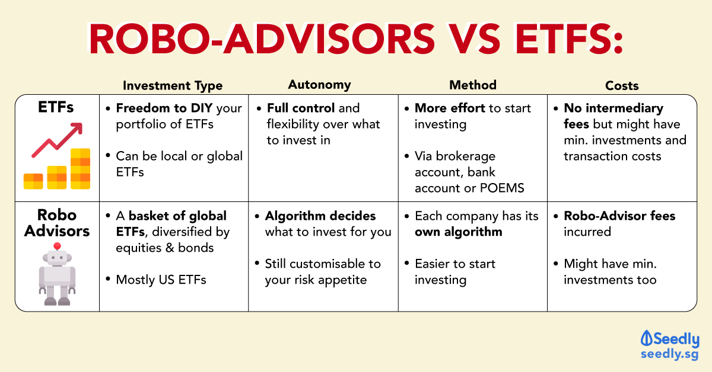

## Table of Contents

## What are ETFs and how do they work?

ETFs, or Exchange-Traded Funds, are a type of investment that combines the benefits of stocks and mutual funds. They are baskets of securities, like stocks or bonds, that you can buy and sell on a stock exchange, just like you would with individual stocks. This makes it easy for investors to diversify their portfolios without having to buy each security one by one.

When you invest in an ETF, you're essentially buying a small piece of many different assets at once. For example, an ETF might track an index like the S&P 500, which means it holds all the stocks in that index. The price of the ETF goes up and down based on the performance of the assets it holds. This allows investors to gain exposure to a broad market or a specific sector without having to manage a large number of individual investments.

## What are Robo-Advisors and how do they function?

Robo-advisors are online platforms that use computer algorithms to manage your investments for you. They ask you some questions about your financial goals, how much risk you're comfortable with, and when you need the money. Based on your answers, they create a personalized investment plan and choose a mix of investments like ETFs that fit your needs. You don't have to be an expert in investing because the robo-advisor does all the work for you.

These services are usually cheaper than hiring a human financial advisor because they don't have the same overhead costs. Robo-advisors automatically adjust your investments over time to keep them in line with your goals. They might also offer features like automatic rebalancing, where they buy and sell parts of your portfolio to keep it at the right mix of investments, and tax-loss harvesting, which can help you save on taxes. This makes investing easier and more accessible for people who might not have a lot of money to start with or who want a hands-off approach to managing their money.

## How do the costs of ETFs compare to those of Robo-Advisors?

ETFs usually have low costs compared to other types of investments. They have what's called an expense ratio, which is a small percentage of your investment that goes toward the costs of running the [ETF](/wiki/etf-trading-strategies). This fee can be as low as 0.03% for some ETFs, but it can go up to 1% or more for others. You might also pay a small fee when you buy or sell an ETF, called a trading commission, but many brokers offer ETFs with no trading fees.

Robo-advisors also have costs, but they work a bit differently. They charge a management fee, which is a percentage of the money you have invested with them. This fee is usually between 0.25% and 0.50% per year, though some might charge more or less. This fee covers the cost of the robo-advisor's services, like choosing and managing your investments. So, while ETFs might have lower direct costs, robo-advisors provide a full service for a bit more money.

## What are the typical investment minimums for ETFs versus Robo-Advisors?

ETFs usually don't have a minimum amount you need to invest. You can buy just one share of an ETF, and the price of one share can be anywhere from a few dollars to a few hundred dollars. This makes ETFs a good choice if you want to start investing with a small amount of money. However, some brokers might have their own rules about how much money you need to start trading.

Robo-advisors often have a minimum amount you need to invest to start using their service. This amount can be anywhere from $0 to $5,000, depending on the robo-advisor. Some robo-advisors let you start with no money at all, but they might ask you to set up automatic monthly contributions. Others might require you to have a certain amount of money to begin, which can make them less accessible if you're just starting out with investing.

## How does the diversification offered by ETFs compare to that of Robo-Advisors?

ETFs offer a good way to diversify your investments. When you buy an ETF, you're buying a small piece of many different stocks or bonds at once. This means you can spread your money across different companies or even different countries without having to buy each one separately. For example, if you buy an ETF that tracks the S&P 500, you're investing in 500 different companies all at once. This can help lower your risk because if one company does badly, it won't hurt your whole investment as much.

Robo-advisors also help you diversify your investments, but they do it in a different way. They use computer algorithms to create a personalized investment plan for you, which usually includes a mix of different ETFs. This mix is designed to match your goals and how much risk you're okay with. So, while ETFs give you instant diversification by themselves, robo-advisors take it a step further by choosing and managing a variety of ETFs for you. This can be easier for people who don't want to pick their own investments, but it still helps spread your money across different assets.

## What are the tax implications of investing in ETFs versus using Robo-Advisors?

When you invest in ETFs, you might have to pay taxes on any money you make from them. If you sell an ETF for more than you paid for it, you'll owe capital gains tax. The tax rate depends on how long you held the ETF. If you held it for more than a year, you'll pay a lower long-term capital gains tax. If you held it for a year or less, you'll pay a higher short-term capital gains tax, which is the same as your regular income tax rate. ETFs can also give you dividends, which are payments from the companies in the ETF. You'll have to pay taxes on these dividends too, but the rate can be lower if they are qualified dividends.

Robo-advisors can help you with taxes in a few ways. They often use a strategy called tax-loss harvesting, which means they sell investments that have gone down in value to offset any gains you've made. This can lower the amount of taxes you owe. Like ETFs, any money you make from selling investments through a robo-advisor will be subject to capital gains tax. The robo-advisor will also handle any dividends from the ETFs they invest in for you, and you'll owe taxes on those dividends. Overall, robo-advisors can be a bit more tax-efficient because of strategies like tax-loss harvesting, but you'll still need to pay taxes on your gains and dividends.

## How do the performance histories of ETFs and Robo-Advisors compare?

ETFs have a long history of performance because they've been around for a while. The performance of an ETF depends on what it's invested in. If it tracks a broad market index like the S&P 500, its performance will be similar to that index. Over the long term, many ETFs that track broad market indexes have done well, but they can go up and down a lot in the short term. Some ETFs focus on specific sectors or strategies, and their performance can be very different. It's important to look at the past performance of an ETF, but remember that past results don't guarantee future success.

Robo-advisors are newer, so they don't have as long a performance history as ETFs. The performance of a robo-advisor depends on the mix of investments they choose for you. Most robo-advisors invest in a variety of ETFs, so their performance is tied to how those ETFs do. Studies have shown that robo-advisors can offer good returns over time, but like with ETFs, there are no guarantees. Robo-advisors aim to match or beat the market, but their success depends on their investment strategy and how well they manage your portfolio. It's a good idea to look at the track record of a robo-advisor, but keep in mind that past performance isn't a sure sign of future results.

## What level of control and customization do investors have with ETFs compared to Robo-Advisors?

With ETFs, investors have a lot of control over their investments. You can choose which ETFs to buy based on what you want to invest in, like a certain country, industry, or type of investment. You decide how much money to put into each ETF and when to buy or sell them. This means you can customize your portfolio to fit your goals and how much risk you want to take. But, having this control also means you need to do your own research and make your own decisions, which can be a lot of work.

Robo-advisors give you less control but more help. You answer some questions about your goals and risk level, and the robo-advisor picks the ETFs for you. It manages your portfolio and makes changes over time to keep it on track. You can usually adjust your risk level or goals, but you don't pick the individual investments. This can be easier because you don't have to do as much work, but it also means you have less say in exactly what you're invested in.

## How do the risk management strategies differ between ETFs and Robo-Advisors?

When you invest in ETFs, you manage the risk yourself. You pick which ETFs to buy, and you decide when to buy or sell them. If you want to lower your risk, you can choose ETFs that spread your money across many different companies or countries. You can also sell some of your ETFs if they're doing too well and buy more if they're not doing so well, to keep your investments balanced. But, you need to keep an eye on your investments and make changes when needed, which can be hard work.

Robo-advisors help you manage risk automatically. They ask you about your goals and how much risk you're okay with, then they choose a mix of ETFs for you. They keep an eye on your investments and make changes to keep your risk level where you want it. For example, if one part of your portfolio is doing really well, they might sell some of it and buy more of something that's not doing as well, to keep things balanced. This makes it easier for you because you don't have to do as much work, but you have less control over exactly what's in your portfolio.

## What are the technological and user interface differences between investing in ETFs and using Robo-Advisors?

When you invest in ETFs, you usually use a website or an app from a broker, like Charles Schwab or Robinhood. These platforms let you buy and sell ETFs, check how your investments are doing, and see news about the market. The user interface can be simple or more complicated, depending on the broker. You might need to do some clicking around to find the ETFs you want and to place your orders. Some brokers offer tools to help you research ETFs, but you'll need to figure out how to use them on your own.

Robo-advisors have their own websites or apps that are made to be easy to use. When you sign up, you answer some questions about your goals and how much risk you're okay with. The robo-advisor then shows you a plan for your investments. The interface is usually simple and easy to understand, with clear steps to follow. You can see how your money is doing and make changes to your plan if you want. Robo-advisors often have extra features like automatic rebalancing and tax-loss harvesting, which you can see and control right in the app.

## How do ETFs and Robo-Advisors handle rebalancing and portfolio adjustments?

When you invest in ETFs, you handle rebalancing and portfolio adjustments yourself. Rebalancing means making sure your money is still spread out the way you want it to be. If one ETF does really well, it might take up a bigger part of your portfolio than you planned. You'd need to sell some of that ETF and buy more of the others to get back to your original plan. This can be a lot of work because you have to keep an eye on your investments and make changes when needed. But, it gives you control over exactly how your money is invested.

Robo-advisors do the rebalancing and portfolio adjustments for you. They use computer programs to check your investments regularly and make changes to keep your portfolio in line with your goals. If one part of your portfolio is doing better than the others, the robo-advisor might sell some of it and buy more of the parts that aren't doing as well. This happens automatically, so you don't have to do anything. It makes investing easier, but you have less control over the exact changes that are made.

## What are the future trends and potential developments for ETFs and Robo-Advisors?

In the future, ETFs might become even more popular and diverse. More people might start using them because they are easy to buy and sell, and they let you invest in a lot of different things at once. We might see new types of ETFs that focus on new areas, like technology or green energy. Also, the fees for ETFs might get even lower as more companies start offering them and compete for customers. This could make ETFs an even better choice for people who want to invest without spending a lot on fees.

Robo-advisors are likely to keep growing and getting better too. They might use even smarter computer programs to pick investments and manage your money. This could make them even better at helping you reach your goals. Robo-advisors might also add more features, like helping you plan for things like buying a house or saving for retirement. As more people use robo-advisors, the fees might go down too, making them a good choice for people who want help with their investments without paying a lot.

## References & Further Reading

[1]: ICI - Investment Company Institute. ["2023 Investment Company Fact Book."](https://www.ici.org/system/files/2023-05/2023-factbook.pdf)

[2]: SEC - Securities and Exchange Commission. ["Exchange-Traded Funds: Investor Bulletin."](https://www.sec.gov/investor/alerts/etfs.pdf)

[3]: FINRA - Financial Industry Regulatory Authority. ["ETFs – Exchange Traded Funds."](https://www.finra.org/investors/investing/investment-products/exchange-traded-funds-and-products)

[4]: Bergstra, J., Bardenet, R., Bengio, Y., & Kégl, B. (2011). ["Algorithms for Hyper-Parameter Optimization."](https://dl.acm.org/doi/10.5555/2986459.2986743) Advances in Neural Information Processing Systems 24.

[5]: ["Advances in Financial Machine Learning"](https://www.amazon.com/Advances-Financial-Machine-Learning-Marcos/dp/1119482089) by Marcos Lopez de Prado

[6]: ["Evidence-Based Technical Analysis: Applying the Scientific Method and Statistical Inference to Trading Signals"](https://www.amazon.com/Evidence-Based-Technical-Analysis-Scientific-Statistical/dp/0470008741) by David Aronson

[7]: ["Machine Learning for Algorithmic Trading"](https://github.com/stefan-jansen/machine-learning-for-trading) by Stefan Jansen

[8]: ["Quantitative Trading: How to Build Your Own Algorithmic Trading Business"](https://www.amazon.com/Quantitative-Trading-Build-Algorithmic-Business/dp/0470284889) by Ernest P. Chan