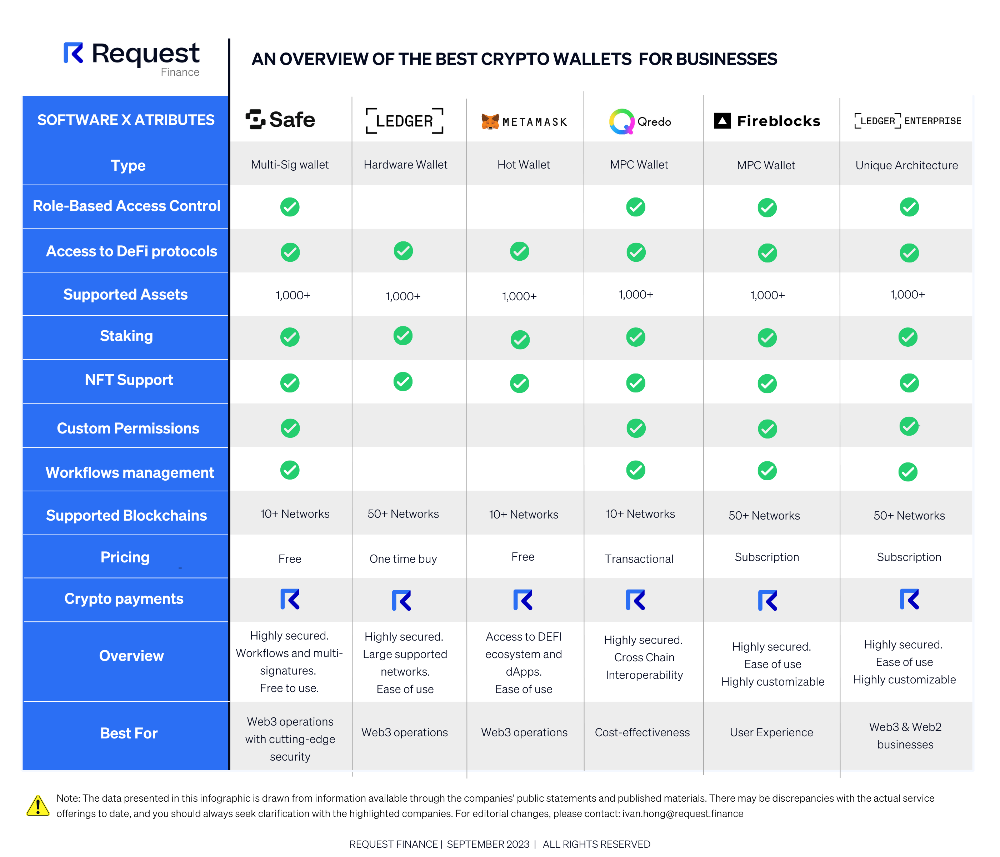

## Table of Contents

## What are Ethereum wallets and why are they important?

Ethereum wallets are like special digital containers where you can keep your Ethereum, which is a type of cryptocurrency. Just like how you use a regular wallet to store your cash and cards, an Ethereum wallet stores your Ethereum and helps you send and receive it. There are different types of Ethereum wallets, like software wallets that you can download on your computer or phone, and hardware wallets that are like small devices you can carry around.

Ethereum wallets are important because they keep your Ethereum safe and give you control over it. They use special codes called private keys, which are like secret passwords that only you know. This means that nobody can take your Ethereum without your permission. Also, with an Ethereum wallet, you can easily interact with the Ethereum network, like using apps and making transactions. So, having a wallet is essential if you want to use Ethereum for buying things, investing, or anything else.

## What are the different types of Ethereum wallets available in 2024?

In 2024, there are several types of Ethereum wallets that people can use. The first type is software wallets, which are apps you can download on your computer or phone. These are easy to use and you can quickly send and receive Ethereum. There are two kinds of software wallets: hot wallets, which are connected to the internet and good for everyday use, and cold wallets, which are not connected to the internet and are safer for storing large amounts of Ethereum. Popular software wallets include MetaMask, Trust Wallet, and Coinbase Wallet.

Another type of Ethereum wallet is hardware wallets. These are small devices that look like USB sticks, and they keep your Ethereum offline, making them very secure. You can plug them into your computer when you need to use your Ethereum. Hardware wallets are great if you want to keep your Ethereum safe from hackers. Some well-known hardware wallets are Ledger and Trezor.

Lastly, there are paper wallets, which are less common but still used by some people. A paper wallet is just a piece of paper with your Ethereum's private and public keys printed on it. You can create one online and then keep it in a safe place, like a safe deposit box. Paper wallets are very secure because they're not connected to the internet, but they can be tricky to use if you're not careful with the paper.

## How do hardware wallets compare to software wallets in terms of security and usability?

Hardware wallets are generally more secure than software wallets because they keep your Ethereum offline. This means they are not connected to the internet, which makes it very hard for hackers to steal your Ethereum. When you need to use your Ethereum, you just plug the hardware wallet into your computer. This way, even if your computer is hacked, your Ethereum is still safe on the device. The downside is that hardware wallets can be a bit more complicated to use because you need to physically handle the device and remember to keep it safe.

Software wallets, on the other hand, are easier to use because they are apps you can download on your phone or computer. You can quickly send and receive Ethereum with just a few clicks. However, because they are connected to the internet, they are more vulnerable to hacking. If your phone or computer gets hacked, someone could steal your Ethereum. So, while software wallets are convenient, they are less secure than hardware wallets.

In summary, if you want the highest level of security, a hardware wallet is the best choice, but it might be a bit more work to use. If you prefer something that's easy and quick to use, a software wallet is better, but you need to be more careful about security.

## Which Ethereum wallets offer the best user experience for beginners?

For beginners, MetaMask is one of the best Ethereum wallets because it's easy to use and works right in your web browser. You can download it as an extension for browsers like Chrome or Firefox, or use the mobile app. MetaMask lets you quickly send and receive Ethereum, and it also helps you connect to different apps on the Ethereum network. It's user-friendly, with a simple interface that makes it easy to understand what you're doing.

Another good choice for beginners is Coinbase Wallet. It's made by the same people who run the Coinbase exchange, so it's trusted and easy to use. You can download it on your phone, and it lets you store not just Ethereum but other cryptocurrencies too. Coinbase Wallet has a clean design and guides you through the process of setting up and using your wallet, making it great for people who are new to crypto.

Trust Wallet is also a good option for beginners. It's another mobile app that's easy to set up and use. Trust Wallet supports a lot of different cryptocurrencies, and it has a simple interface that helps you manage your Ethereum without feeling overwhelmed. It's great for people who want to start using Ethereum but don't want to deal with complicated features right away.

## What are the fees associated with different Ethereum wallets?

Ethereum wallets themselves don't charge fees for simply storing your Ethereum. However, when you use your wallet to send Ethereum to someone else, you'll need to pay a transaction fee. This fee goes to the people who help process your transaction on the Ethereum network, called miners. The amount of the fee can change depending on how busy the network is. If you want your transaction to go through quickly, you might need to pay a higher fee. Wallets like MetaMask, Coinbase Wallet, and Trust Wallet let you choose how much you want to pay for the transaction fee.

Different wallets might also have different ways of showing these fees. For example, MetaMask shows you an estimated fee before you send your Ethereum, and you can adjust it if you want. Coinbase Wallet and Trust Wallet also show you the fee, but they might have a default setting that you can change. It's a good idea to check the fee before you send your Ethereum, so you know how much it will cost. Remember, the wallet itself isn't charging you; it's the Ethereum network that requires the fee.

## How do Ethereum wallets handle private keys and what are the security implications?

Ethereum wallets handle private keys by storing them in a secure way. Your private key is like a secret password that lets you control your Ethereum. When you set up a wallet, it usually generates a private key for you and keeps it safe. Some wallets, like software wallets, store the private key on your phone or computer. Others, like hardware wallets, keep the private key on a special device that's not connected to the internet. This makes it harder for hackers to steal your key.

The way wallets handle private keys has big security implications. If someone gets your private key, they can take your Ethereum. That's why it's important to keep your private key secret and safe. Software wallets are easier to use, but because they're connected to the internet, they're more at risk of being hacked. Hardware wallets are safer because they keep your private key offline, but you need to be careful not to lose the device. Paper wallets are also secure if you keep the paper safe, but they can be tricky to use because you have to enter the key manually when you want to spend your Ethereum.

## What advanced features do some Ethereum wallets offer, such as staking or decentralized finance (DeFi) integration?

Some Ethereum wallets offer advanced features like staking, which lets you earn rewards by helping to secure the Ethereum network. With staking, you lock up your Ethereum in the wallet, and in return, you get more Ethereum over time. Wallets like Coinbase Wallet and Trust Wallet support staking, making it easy for you to start earning rewards without needing to know a lot about how it works. This feature is great for people who want to grow their Ethereum holdings while also supporting the network.

Another advanced feature is integration with decentralized finance (DeFi), which lets you do things like lending, borrowing, and trading directly from your wallet. Wallets like MetaMask and Coinbase Wallet let you connect to different DeFi apps, so you can use them without leaving your wallet. This makes it easy to take part in DeFi without needing to move your Ethereum around a lot. DeFi can be a bit complicated, but these wallets help make it simpler by guiding you through the process and showing you what you can do.

## How do mobile Ethereum wallets compare to desktop versions in terms of functionality and security?

Mobile Ethereum wallets and desktop versions both let you store, send, and receive Ethereum, but they have some differences in how they work and how safe they are. Mobile wallets are apps you download on your phone, so you can use them anywhere you go. They're really handy if you need to quickly check your Ethereum or make a transaction while you're out. But because they're always connected to the internet, they might be a bit less safe than desktop wallets. If your phone gets lost or stolen, someone could try to get into your wallet. So, it's important to use strong passwords and keep your phone safe.

Desktop wallets are apps you download on your computer, and they usually have more features than mobile wallets. They can be easier to use if you want to do more complicated things with your Ethereum, like using DeFi apps or staking. Desktop wallets might be a bit safer because you can keep your computer offline when you're not using it, which makes it harder for hackers to get to your Ethereum. But, if your computer gets a virus, your Ethereum could be at risk. So, it's good to have up-to-date antivirus software and be careful about what you download.

## What are the most reputable Ethereum wallets according to user reviews and security audits in 2024?

In 2024, some of the most reputable Ethereum wallets based on user reviews and security audits are MetaMask, Ledger, and Trezor. MetaMask is very popular because it's easy to use and works right in your web browser. It has been around for a long time and has gone through many security checks, so people trust it. Ledger and Trezor are hardware wallets that are known for being very safe. They keep your Ethereum offline, which makes it hard for hackers to steal it. Both of these wallets have been tested a lot to make sure they are secure, and they are often recommended by people who know a lot about cryptocurrency.

Another wallet that gets good reviews is Coinbase Wallet. It's made by the same people who run the Coinbase exchange, so it's trusted by a lot of people. Coinbase Wallet is easy to use and lets you do things like staking and using DeFi apps. It's been checked for security many times, and users say it's reliable. Trust Wallet is also well-liked because it supports a lot of different cryptocurrencies and has a simple interface. It's been audited for security, and people appreciate how easy it is to use, even if you're new to Ethereum.

## How do different Ethereum wallets support token standards like ERC-20 and ERC-721?

Different Ethereum wallets support token standards like ERC-20 and ERC-721 in various ways. ERC-20 tokens are like regular cryptocurrencies that you can send and receive, and most Ethereum wallets, like MetaMask, Coinbase Wallet, and Trust Wallet, support them. When you add an ERC-20 token to your wallet, you can see your balance and send the tokens to other people. These wallets make it easy to manage ERC-20 tokens by letting you add new tokens by their address or by searching for them in the wallet's interface.

ERC-721 tokens are different because they are unique, like digital collectibles or NFTs. Wallets like MetaMask and Coinbase Wallet also support ERC-721 tokens, letting you store, send, and receive them. When you have an ERC-721 token in your wallet, you can see details about it, like what it looks like and any special information it has. Some wallets, like MetaMask, even let you interact with marketplaces where you can buy and sell these unique tokens, making it easy to manage your digital collectibles.

## What are the scalability and performance differences among leading Ethereum wallets?

Different Ethereum wallets have different ways of handling how fast and well they work, especially when the Ethereum network gets busy. Wallets like MetaMask and Coinbase Wallet are software wallets that you can use on your phone or computer. They can sometimes feel slow when a lot of people are using the Ethereum network at the same time because they need to connect to the internet to send and receive Ethereum. But they usually work well enough for everyday use, and they keep getting better as the developers find ways to make them faster.

Hardware wallets like Ledger and Trezor are different because they keep your Ethereum offline, which can make them a bit slower when you need to use them. You have to plug them into your computer and then connect to the internet to send your Ethereum. This can take a bit more time, but it's safer. The good thing about hardware wallets is that they don't slow down because of the internet; they just need a little more time to set up and use. Overall, the speed and performance of a wallet can depend on how busy the Ethereum network is and whether you're using a software or hardware wallet.

## How do Ethereum wallets integrate with other blockchain networks and what are the benefits of such integrations?

Ethereum wallets like MetaMask and Coinbase Wallet can connect to other blockchain networks, which means you can use them to store, send, and receive different types of cryptocurrencies, not just Ethereum. For example, MetaMask supports networks like Binance Smart Chain and Polygon, while Coinbase Wallet works with networks like Bitcoin and Dogecoin. This is done by letting you switch between different networks right in the wallet app. When you want to use a different network, you just pick it from a list, and the wallet will help you manage your cryptocurrencies on that network.

The benefits of these integrations are big. First, it makes things easier for you because you don't need to use a different wallet for each type of cryptocurrency. You can keep all your digital money in one place, which is simpler and less confusing. Second, it gives you more options for what you can do with your cryptocurrencies. You can use different networks to try out new apps, earn rewards through staking, or even trade on different platforms. This can help you make the most out of your cryptocurrencies and explore more of what the blockchain world has to offer.

## References & Further Reading

[1]: Antonopoulos, A. M., & Wood, G. (2018). ["Mastering Ethereum: Building Smart Contracts and DApps"](https://www.amazon.com/Mastering-Ethereum-Building-Smart-Contracts/dp/1491971940). O'Reilly Media.

[2]: Ledger. ["Ledger Hardware Wallets"](https://shop.ledger.com/pages/hardware-wallet) (Accessed 2023).

[3]: Trezor. ["Trezor Hardware Wallets"](https://trezor.io/) (Accessed 2023).

[4]: Trust Wallet. ["Trust Wallet: Secure Multi-Crypto Wallet"](https://trustwallet.com/blog/the-official-beginners-guide-to-trust-wallet) (Accessed 2023).

[5]: Exodus. ["Exodus: Crypto Bitcoin Wallet"](https://www.exodus.com/) (Accessed 2023).

[6]: MetaMask. ["MetaMask: A Crypto Wallet & Gateway to Blockchain Apps"](https://metamask.io/) (Accessed 2023).

[7]: "Security of Cryptocurrency Wallets: A Comparative Analysis" by Grüner, T., based on IEEE Access, 2020.

[8]: Narang, A. (2020). ["Ethereum Blockchain Developer: Simplified & Illustrated"](https://www.blocknative.com/blog/ethereum-roadmap-guide) Apress.

[9]: Binance Academy. ["Getting Started With Algorithmic Trading"](https://academy.binance.com/en/articles/what-is-algo-trading-and-how-does-it-work) (Accessed 2023).