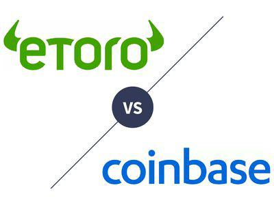

Cryptocurrency trading has experienced exponential growth over recent years, fostering the development of numerous trading platforms. Amongst these, eToro and Coinbase have distinguished themselves by offering unique features and intuitive user interfaces. These platforms are pivotal for traders aiming to maximize their market strategy's efficacy.

This article aims to provide a detailed examination of eToro and Coinbase. By highlighting their algorithmic trading capabilities, alongside their respective advantages and disadvantages, potential investors and traders are empowered to make informed decisions aligned with their trading goals. Algorithmic trading, which utilizes computer programs to execute trades based on predetermined criteria, has become indispensable for traders navigating today's fast-paced markets.



Navigating the subtleties of eToro and Coinbase can significantly influence a trader’s experience and outcome. The integration of algorithmic trading on these platforms presents opportunities to enhance precision and speed in executing trades, reducing the emotional burden associated with traditional trading approaches. For both novice and seasoned traders, acquiring comprehensive insights into these platforms facilitates the optimization of trading strategies.

For further in-depth exploration, subsequent sections will dissect individual platform features and conduct a comparative analysis. This includes an assessment of transaction costs, security measures, and the efficacy of their algorithmic trading functionalities, offering a complete picture of what each platform can offer to different types of traders.

## Table of Contents

## Overview of eToro

Founded in 2006, eToro is a multi-asset brokerage platform that facilitates trading across various asset classes including cryptocurrencies, stocks, and commodities. This platform distinguishes itself from its competitors through its social trading feature, which allows users to track and replicate the investment strategies of other successful traders. Such a capability enables both novice and experienced traders to benefit from the market expertise of others without the need to conduct independent market analyses.

eToro's appeal to cryptocurrency enthusiasts lies in its comprehensive support for a range of digital currencies. By offering a broad selection of cryptocurrencies, the platform caters to individuals keen on diversifying their portfolios beyond traditional asset classes. This aspect positions eToro as a versatile choice for users seeking diverse investment opportunities.

Among its standout features is the Crypto Smart Portfolios, designed for users interested in [algorithmic trading](/wiki/algorithmic-trading). This feature allows traders to automatically copy the trades of successful investors, enabling them to leverage advanced trading strategies with minimal manual intervention. By automating the investment process, Crypto Smart Portfolios offer both convenience and the potential for optimized returns in highly volatile markets.

Furthermore, eToro provides support for API integration, which appeals to tech-savvy individuals who wish to implement custom trading algorithms. This functionality empowers users to design and execute personalized trading strategies. By allowing API access, eToro facilitates programmatic trading, where trades are executed based on algorithms coded by the users themselves, thereby enhancing trading flexibility and precision.

Overall, eToro presents itself as a robust platform equipped with features that accommodate both manual and automated trading styles, making it a compelling option for traders with varying levels of experience and technical proficiency.

## Overview of Coinbase

Launched in 2012, Coinbase has established itself as one of the largest [cryptocurrency](/wiki/cryptocurrency) exchanges globally, renowned for its user-friendly interface and robust security measures. Catering to both novice and professional traders, Coinbase offers an extensive selection of over 250 cryptocurrencies, allowing users to engage with a diverse range of digital assets. This wide array of options ensures that all levels of traders can find suitable investment opportunities matching their preferences and risk profiles.

The platform is also notable for providing a straightforward yet powerful Application Programming Interface (API), facilitating the development of custom algorithmic trading strategies. This feature is particularly beneficial for traders who wish to automate their trading activities, allowing them to execute trades based on pre-set conditions without manual intervention. The API's accessibility and ease of use make it an attractive option for technical users aiming to optimize their trading efficiency through automation.

For users seeking more advanced trading functionalities, Coinbase offers Coinbase Pro, a platform designed to provide sophisticated trading tools and features. Coinbase Pro includes advanced analytics, enabling traders to analyze market trends and make informed decisions. Additionally, it supports programmable trades, allowing users to execute complex trading orders, which can be beneficial for those employing comprehensive trading strategies.

Security is a paramount concern for Coinbase, and the platform implements several robust measures to protect users' assets. These include two-[factor](/wiki/factor-investing) authentication, which adds an extra layer of security to user accounts, and cold storage solutions for digital assets. Cold storage refers to keeping cryptocurrencies in offline storage systems, which significantly reduces the risk of unauthorized access and cyber threats.

Through its combination of an extensive cryptocurrency selection, a powerful API for algorithmic trading, advanced trading options via Coinbase Pro, and strong security protocols, Coinbase has positioned itself as a leading choice for traders across the spectrum, from beginners to seasoned professionals.

## Algorithmic Trading on eToro and Coinbase

Algorithmic trading, a method of executing orders using automated pre-programmed trading instructions, leverages complex algorithms to analyze variables such as time, price, and [volume](/wiki/volume-trading-strategy). This approach offers significant benefits, including increased trading speed, accuracy, and the ability to handle multiple markets simultaneously. Such trading minimizes human error and emotional decision-making, leading to more consistent trading outcomes.

### eToro's Algorithmic Trading Capabilities

eToro supports algorithmic trading primarily through its CopyTrading feature, which allows users to replicate the trading strategies of successful investors. This form of social trading leverages the crowd's wisdom, providing a passive method for users to engage in algorithmic trading without needing extensive technical knowledge or developing their algorithms.

Moreover, eToro offers API integration, empowering tech-savvy users to create and implement custom trading algorithms. This feature provides flexibility for developers to automate trading strategies based on their pre-set parameters. The platform’s support for API connections ensures that users can access real-time market data, execute trades, and manage portfolios programmatically.

### Coinbase's Algorithmic Trading Facilities

Coinbase offers a robust API, enabling users to develop and execute their algorithmic trading strategies. Though lacking integrated social trading features like eToro, Coinbase's API is extensive, allowing for detailed market data access, account management, and trade execution.

Here's a simple example of how a Python script might interface with Coinbase's API for algorithmic trading:

```python
import cbpro

# Authentication
auth_client = cbpro.AuthenticatedClient(api_key, api_secret, api_passphrase)

# Fetching current market price
ticker = auth_client.get_product_ticker(product_id='BTC-USD')
price = float(ticker['price'])

# Example trade decision based on price
if price < certain_threshold:
    # Place a buy order
    order = auth_client.buy(price=price, size=0.01, order_type='limit', product_id='BTC-USD')
    print(f"Buy order placed: {order}")
```

This script demonstrates the capability to programmatically execute trading strategies, showcasing how users can interact programmatically with Coinbase.

### Choosing Between eToro and Coinbase for Algorithmic Trading

Both eToro and Coinbase provide infrastructure that facilitates algorithmic trading, but they cater to different user needs. eToro's CopyTrading simplifies algorithmic trading by enabling users to mirror successful traders' actions. This feature is particularly attractive to those who prefer a more passive approach.

Conversely, Coinbase's API allows for greater customization and complexity, appealing to users who prefer more control and are capable of developing bespoke trading strategies. Traders must consider their technical skills, trading preferences, and desired level of control when choosing between these platforms.

Understanding the nuances and capabilities of each platform enables traders to align their choice with their specific trading goals and expertise, ultimately enhancing their strategic outcomes in the competitive world of cryptocurrency trading.

## Comparative Analysis: Features, Security, and Fees

Both eToro and Coinbase offer distinct features that cater to different types of traders. These features, along with the platforms' security measures and fee structures, play significant roles in determining their suitability for varied trading preferences.

eToro is renowned for its social trading capabilities, allowing users to interact with and learn from experienced investors. This feature enables users to follow and replicate the trading actions of successful traders, which can be especially advantageous for beginners who wish to gain insights from seasoned experts. In addition to cryptocurrencies, eToro supports multiple asset classes, including stocks and commodities, providing users with opportunities to diversify their portfolios across different sectors.

On the other hand, Coinbase stands out for its intuitive interface, designed with beginner traders in mind. The platform offers a vast array of supported cryptocurrencies, making it an attractive option for traders focusing solely on crypto assets. This simplicity and focus on cryptocurrency trading make Coinbase a go-to choice for those who wish to engage in straightforward crypto transactions without the complexities of other asset classes.

Security is a critical consideration for both eToro and Coinbase. Both platforms have implemented robust security measures to protect user information and assets. eToro and Coinbase utilize two-factor authentication, which requires users to provide a second form of verification before accessing their accounts, thereby adding an additional layer of security. Furthermore, for U.S. customers, Coinbase provides FDIC-insured USD balances, giving users an extra assurance of their funds' safety.

When it comes to fees, eToro and Coinbase have different approaches. eToro charges a flat rate for cryptocurrency trades, which can be beneficial for traders who prefer predictable and transparent cost structures. In contrast, Coinbase's fee structure is more complex, with fees that vary based on trading volume and the selected payment methods. This variability can lead to higher costs for some transactions, especially those involving credit or debit card payments.

In summary, the choice between eToro and Coinbase should be influenced by the specific needs and preferences of the trader. While eToro offers a more versatile trading environment with its social features and diverse asset options, Coinbase provides a streamlined platform that emphasizes simplicity and a broad selection of cryptocurrencies. Understanding these distinctions can help traders select a platform that aligns with their trading style and financial objectives.

## Pros and Cons of Using eToro and Coinbase

eToro and Coinbase, two prominent platforms in the world of cryptocurrency trading, offer distinct advantages and disadvantages that cater to different types of traders. Understanding these can help users make informed decisions based on their trading needs and preferences.

eToro’s strengths are notably tied to its social trading capabilities and the variety of assets it supports, which extend beyond just cryptocurrencies. The platform allows users to engage in social trading through features like CopyTrading, enabling them to replicate the investment strategies of successful traders automatically. This feature is particularly beneficial for novice traders or those who prefer a more passive approach, learning from seasoned investors' decisions while potentially improving their own trading outcomes. However, eToro imposes a monthly inactivity fee, which may be a downside for those who do not trade frequently or wish to maintain dormant accounts.

On the other hand, Coinbase is lauded for its user-friendly interface, making it an appealing option for individuals new to cryptocurrency trading. It offers a broad selection of over 250 cryptocurrencies, providing ample opportunities for diversification within the crypto space. This extensive selection can be particularly advantageous for users aiming to explore various cryptocurrency investments. A significant drawback of Coinbase, however, is its higher fee structure, particularly when transactions are executed using credit or debit cards. This can be a notable consideration for cost-conscious traders or those who execute numerous trades.

Both platforms enhance accessibility through their mobile applications, providing on-the-go flexibility that appeals to active traders. This convenience ensures that users can manage and monitor their investments efficiently, regardless of their location.

Ultimately, the decision between eToro and Coinbase should be guided by individual trading goals and preferences. Traders who prioritize social networking features and a broad range of asset classes may find eToro more suitable. In contrast, those seeking a straightforward cryptocurrency trading experience might lean towards Coinbase, despite the higher fees. Evaluating the importance of social features, asset diversity, and-cost considerations will aid traders in selecting the platform that best aligns with their needs.

## Conclusion

Both eToro and Coinbase offer distinct features tailored to accommodate varying trading needs and preferences. eToro is particularly suitable for individuals who are interested in social trading and the ability to diversify their investment portfolios across different asset classes. Its innovative CopyTrading feature allows users to follow and emulate successful investors, providing a unique social trading experience that is not commonly found on other platforms. Additionally, eToro's support for multiple asset classes makes it an appealing choice for investors looking to explore more than just cryptocurrencies.

On the other hand, Coinbase stands out as an intuitive and user-friendly cryptocurrency exchange. It is ideal for traders who prioritize an extensive selection of cryptocurrencies and a straightforward trading environment. The platform's robust security features and beginner-friendly interface make it a great starting point for new cryptocurrency investors. Furthermore, Coinbase Pro provides advanced trading tools for those seeking more sophisticated trading options.

Algorithmic trading plays a crucial role in both eToro and Coinbase, equipping traders with the capability to automate their strategies. This automation can enhance efficiency by executing trades based on predefined criteria, thus reducing the potential for emotional decision-making. Both platforms support API integrations, allowing technically savvy traders to customize their trading strategies further.

A comprehensive understanding of eToro and Coinbase's strengths and limitations will enable traders to choose the platform that best aligns with their trading strategies and objectives. While eToro offers the advantage of social trading and a diverse pool of assets, Coinbase provides an extensive range of cryptocurrencies with a focus on security and simplicity.

Ultimately, selecting the optimal platform hinges on personal needs, such as the desire for engaging in social trading, accessing a broad array of cryptocurrencies, or navigating specific fee structures. Traders should evaluate their individual goals and preferences to determine which platform aligns best with their trading strategies.

## References & Further Reading

[1]: Herrington, C. (2021). ["Automated Trading with the eToro Trading API."](https://www.etoro.com/news-and-analysis/etoro-updates/choosing-etoro-over-automated-trading-systems/) eToro Academy.

[2]: Guadamuz, A. (2023). ["The Development and Increasing Use of Algorithms in Financial Trading."](https://papers.ssrn.com/sol3/cf_dev/AbsByAuth.cfm?per_id=387238) Journal of International Economic Law, 21(3), 527-564.

[3]: Narang, R. (2013). ["Inside the Black Box: A Simple Guide to Quantitative and High-Frequency Trading"](https://onlinelibrary.wiley.com/doi/book/10.1002/9781118662717). Wiley Finance.

[4]: Duggal, K. (2022). ["Comparing eToro vs. Coinbase: Which is The Better Platform?"](https://coinledger.io/tools/coinbase-vs-etoro) Investopedia.

[5]: Avellaneda, M., & Stoikov, S. (2008). ["High-frequency Trading in a Limit Order Book."](https://people.orie.cornell.edu/sfs33/LimitOrderBook.pdf) Quantitative Finance, 8(3), 217-224.

[6]: Filippi, L., & Filippi, T. (2021). ["Algorithmic and High-Frequency Trading on Cryptocurrency Exchanges."](https://www.tandfonline.com/doi/full/10.1080/08874417.2018.1552090) Energies, 14(11), 3262.

[7]: Cumming, D., Johan, S., & Li, D. (2020). ["Cryptocurrency Trading and Bitcoin: Risk and Opportunity."](https://papers.ssrn.com/sol3/papers.cfm?abstract_id=3038171) Springer.