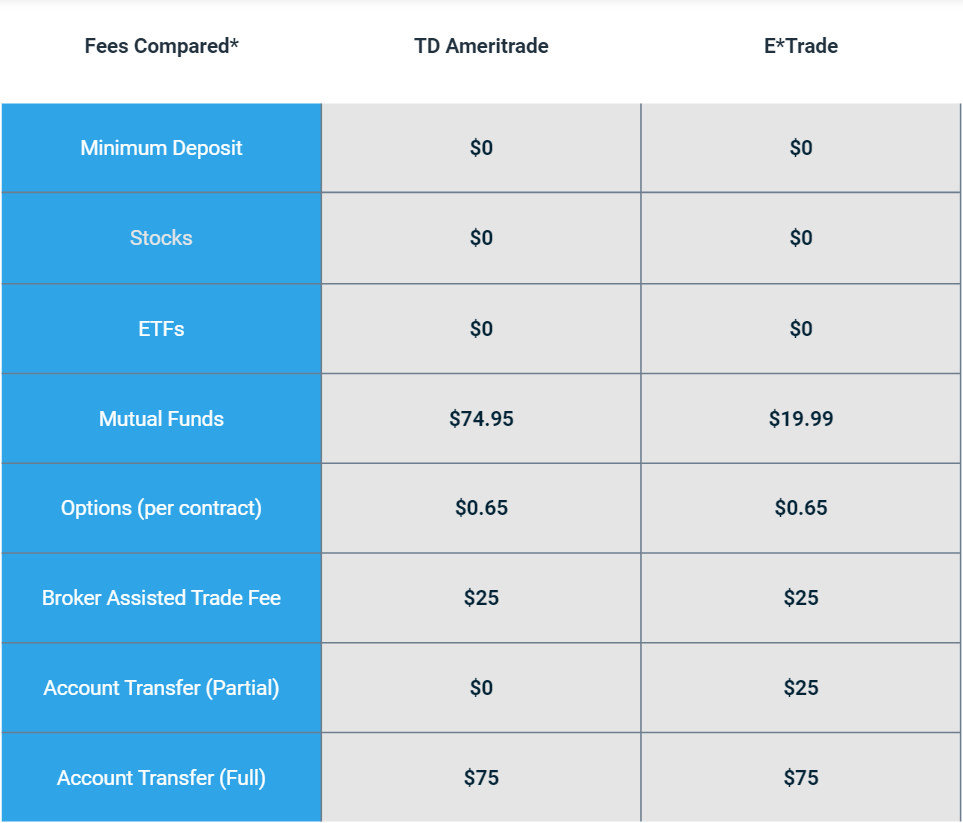

## Table of Contents

## What are E*TRADE and TD Ameritrade?

E*TRADE is a company that helps people buy and sell stocks and other investments online. It started in 1982 and has grown to be one of the biggest names in online trading. People like using E*TRADE because it has easy-to-use tools and a lot of information to help them make good choices about their money. They can trade stocks, options, mutual funds, and more, all from their computer or phone.

TD Ameritrade is another company that lets people trade stocks and other investments online. It began in 1975 and has become very popular because it offers a lot of educational resources and tools to help people learn about investing. Like E*TRADE, TD Ameritrade lets people trade a variety of investments, including stocks, options, and mutual funds. It's known for its customer service and the many ways it helps people manage their money.

Both E*TRADE and TD Ameritrade are now part of the same company, Charles Schwab, which bought them in 2020. This means that people who use either service can benefit from even more resources and tools to help them with their investments.

## How do the account opening processes differ between E*TRADE and TD Ameritrade?

Opening an account with E*TRADE is pretty straightforward. You start by visiting their website or using their mobile app. You'll need to fill out an online application form with your personal information, like your name, address, and Social Security number. E*TRADE will also ask about your investment experience and goals. After you submit your application, E*TRADE will do a quick check to make sure everything is okay. If it is, you can fund your account and start trading. The whole process can often be done in a day, but sometimes it might take a bit longer if they need more information.

Opening an account with TD Ameritrade is similar but has a few differences. You also start by going to their website or using their app. You'll fill out an application form with your personal details, including your name, address, and Social Security number. TD Ameritrade will ask about your investment knowledge and what you want to achieve with your investments. Once you submit your application, they'll review it. If everything looks good, you can add money to your account and begin trading. Like E*TRADE, the process is usually quick, but it might take a little longer if they need to verify more details.

## What types of accounts can be opened with E*TRADE and TD Ameritrade?

E*TRADE offers a variety of account types to meet different needs. You can open a regular brokerage account if you want to trade stocks, options, and other investments. They also have retirement accounts like an Individual Retirement Account (IRA) for saving for the future. If you're saving for a child's education, you can open a 529 college savings plan. E*TRADE also has managed portfolios if you want help with your investments, and they offer accounts for businesses and institutions too.

TD Ameritrade also provides a range of account types. You can start with a basic brokerage account to buy and sell investments. They offer retirement accounts like Traditional and Roth IRAs for your future. For education savings, you can choose a 529 plan. If you want professional management, TD Ameritrade has robo-advisor services and managed portfolios. They also cater to businesses with accounts like corporate and trust accounts.

## How do the fee structures compare between E*TRADE and TD Ameritrade?

E*TRADE and TD Ameritrade both have similar fee structures, especially since they are now part of the same company, Charles Schwab. For trading stocks and ETFs, both platforms offer commission-free trades, which means you don't have to pay anything to buy or sell these investments. However, there might be fees for other services. For example, E*TRADE charges a fee for trading options, which is $0.65 per contract. They also have fees for things like account transfers and inactivity, though these can vary. If you need help managing your investments, E*TRADE's managed portfolios come with a fee based on the amount of money you have invested.

TD Ameritrade also offers commission-free trading for stocks and ETFs. Like E*TRADE, they charge a fee for trading options, which is $0.65 per contract as well. They have fees for services like account transfers and inactivity, but these can change, so it's good to check their website for the latest information. If you use TD Ameritrade's robo-advisor or managed portfolios, you'll pay a fee based on your investment amount. Overall, while the basic trading fees are the same, the additional fees for other services might differ slightly between the two, so it's important to look at the details before you choose.

## What investment options are available on E*TRADE versus TD Ameritrade?

E*TRADE offers a wide range of investment options for people to choose from. You can trade stocks, which are shares in companies, and exchange-traded funds (ETFs), which are baskets of stocks or other assets. If you're interested in options, E*TRADE lets you trade those too, which are contracts that give you the right to buy or sell stocks at a certain price. They also have mutual funds, which are collections of stocks or bonds managed by professionals, and bonds, which are loans you give to companies or governments. If you're looking to save for the future, E*TRADE has retirement accounts like IRAs, and for education, they offer 529 plans.

TD Ameritrade provides a similar variety of investment choices. You can buy and sell stocks and ETFs just like with E*TRADE. They also offer options trading for those who want to try more advanced strategies. Mutual funds and bonds are available as well, giving you many ways to spread your money around. For saving for retirement, TD Ameritrade has IRAs, and for education, they offer 529 plans. Both platforms give you access to a broad range of investments, so you can pick what fits your goals best.

## How do the trading platforms of E*TRADE and TD Ameritrade compare in terms of user experience?

E*TRADE's trading platform is designed to be easy to use, even if you're new to investing. The website and mobile app have a clean look that makes it simple to find what you need. You can quickly see your investments, check on the market, and make trades. E*TRADE also has tools like charts and research to help you make decisions. If you need help, they have a lot of guides and customer support to answer your questions. Overall, people like E*TRADE because it's straightforward and has everything you need in one place.

TD Ameritrade's platform is also user-friendly and good for beginners and experienced traders. Their website and app are easy to navigate, with a layout that helps you find information quickly. You can easily track your investments and the market, and their tools for research and analysis are very helpful. TD Ameritrade is known for having a lot of educational resources, like videos and articles, to teach you about investing. Their customer service is also top-notch, so if you get stuck, you can get help fast. In general, people appreciate TD Ameritrade for its ease of use and the support it offers.

## What educational resources and tools does each platform offer to help users learn and invest?

E*TRADE has a lot of educational resources to help you learn about investing. They have articles, videos, and webinars that explain how to invest in stocks, options, and other things. If you're new to investing, E*TRADE's "Knowledge" section is a great place to start because it covers the basics in a way that's easy to understand. They also have tools like stock screeners and calculators to help you make smart choices about your money. Plus, E*TRADE's customer service team is always there to answer your questions and help you along the way.

TD Ameritrade also offers a wide range of educational resources to help you learn about investing. They have a section called "Education" that includes articles, videos, and courses on topics like stocks, options, and retirement planning. Their "Thinkorswim" platform is known for its advanced tools, but they also have simpler tools for beginners. You can use their stock screeners, calculators, and research tools to find the right investments for you. TD Ameritrade's customer service is also very helpful, so if you have any questions, you can get quick answers and guidance.

## How do the mobile apps of E*TRADE and TD Ameritrade differ in functionality and user interface?

E*TRADE's mobile app is designed to be easy to use, even if you're new to investing. The app has a simple layout that makes it easy to see your investments, check the market, and make trades. You can quickly buy and sell stocks, options, and ETFs right from your phone. E*TRADE also has tools like charts and research to help you make decisions. If you need help, the app has guides and you can reach customer support easily. Overall, people like E*TRADE's app because it's straightforward and has everything you need in one place.

TD Ameritrade's mobile app is also user-friendly and good for both beginners and experienced traders. The app's design helps you find what you need quickly, with clear menus and easy navigation. You can track your investments and the market, and their tools for research and analysis are very helpful. TD Ameritrade's app includes educational resources like videos and articles to teach you about investing. Their customer service is also easy to reach if you get stuck. In general, people appreciate TD Ameritrade's app for its ease of use and the support it offers.

## What are the customer service options and their effectiveness for E*TRADE and TD Ameritrade?

E*TRADE offers several ways to get help from their customer service team. You can call them on the phone, send them an email, or use the live chat feature on their website or app. They also have a lot of guides and FAQs that can help answer your questions without needing to talk to someone. People usually find E*TRADE's customer service to be pretty good because they are quick to respond and helpful. If you need to talk to someone, you won't have to wait too long, and they can explain things in a way that's easy to understand.

TD Ameritrade also has good customer service options. You can reach them by phone, email, or live chat, and they have a lot of educational resources that can help you figure things out on your own. TD Ameritrade is known for having really helpful customer service because they are fast to answer and know a lot about investing. People like that they can get help whenever they need it, and the support team is good at explaining things clearly.

## How do the research and analysis tools provided by E*TRADE and TD Ameritrade stack up against each other?

E*TRADE has a lot of research and analysis tools that can help you make good choices about your investments. They have stock screeners that let you find stocks based on what you're looking for, like price or how much the stock is expected to grow. They also have charts and graphs that show you how stocks have been doing over time, which can help you decide when to buy or sell. E*TRADE's research reports give you information about different companies and the market, making it easier to understand what's going on. Overall, people like E*TRADE's tools because they are easy to use and give you a lot of helpful information.

TD Ameritrade also offers strong research and analysis tools, with their "Thinkorswim" platform being really popular for its detailed features. You can use their stock screeners to find investments that match what you're looking for, and their charts and graphs help you see how stocks are doing. TD Ameritrade's research reports are very detailed and can give you a deep understanding of companies and the market. They also have a lot of educational resources that can help you learn how to use these tools better. In general, people appreciate TD Ameritrade's tools because they are powerful and can help both new and experienced investors make smart choices.

## What advanced trading features are available on E*TRADE and TD Ameritrade for experienced investors?

E*TRADE has some advanced trading features that experienced investors like. They have a platform called Power E*TRADE that lets you trade quickly and has a lot of tools to help you make decisions. You can use things like customizable charts, advanced options trading, and risk analysis tools. This helps you see how your investments might do and make trades based on that. E*TRADE also lets you set up alerts so you know when to buy or sell, and you can use different order types to control when and how your trades happen.

TD Ameritrade's advanced trading features are found in their Thinkorswim platform, which is very popular among experienced traders. Thinkorswim has a lot of tools that let you do detailed analysis and make trades fast. You can use advanced charting, options trading strategies, and backtesting to see how your ideas might have worked in the past. They also have features like paper trading, where you can practice trading without using real money. This helps you try out new strategies before you use them for real.

## How do the retirement planning services and options differ between E*TRADE and TD Ameritrade?

E*TRADE offers a range of retirement planning services to help you save for the future. You can open different types of Individual Retirement Accounts (IRAs), like Traditional and Roth IRAs, which let you save money with certain tax benefits. E*TRADE also has tools to help you figure out how much you need to save for retirement and when you can retire. If you want some help managing your retirement investments, they have managed portfolios that can do that for you. Overall, E*TRADE's retirement services are easy to use and give you a lot of options to plan for your future.

TD Ameritrade also provides several retirement planning options to help you prepare for retirement. They offer Traditional and Roth IRAs, just like E*TRADE, so you can choose the one that fits your needs best. TD Ameritrade has a lot of tools and calculators to help you plan how much to save and when you might retire. They also have robo-advisors and managed portfolios if you want professional help with your retirement investments. People like TD Ameritrade's retirement services because they have a lot of educational resources and support to guide you through the process.

## References & Further Reading

[1]: ["Advances in Financial Machine Learning"](https://www.amazon.com/Advances-Financial-Machine-Learning-Marcos/dp/1119482089) by Marcos Lopez de Prado

[2]: ["Machine Learning for Algorithmic Trading"](https://github.com/stefan-jansen/machine-learning-for-trading) by Stefan Jansen

[3]: ["Quantitative Trading: How to Build Your Own Algorithmic Trading Business"](https://www.amazon.com/Quantitative-Trading-Build-Algorithmic-Business/dp/1119800064) by Ernest P. Chan

[4]: ["Evidence-Based Technical Analysis: Applying the Scientific Method and Statistical Inference to Trading Signals"](https://www.amazon.com/Evidence-Based-Technical-Analysis-Scientific-Statistical/dp/0470008741) by David Aronson

[5]: Bergstra, J., Bardenet, R., Bengio, Y., & Kégl, B. (2011). ["Algorithms for Hyper-Parameter Optimization."](https://dl.acm.org/doi/10.5555/2986459.2986743) Advances in Neural Information Processing Systems 24.