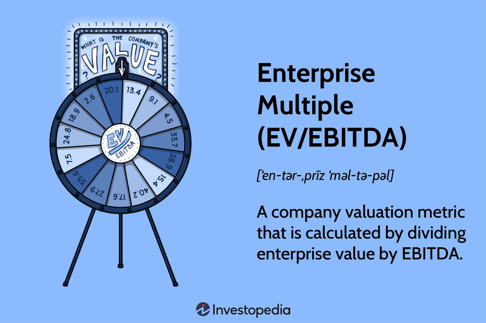

Valuation metrics are essential tools for investors seeking insights into the value and growth potential of companies. Among the myriad metrics available, two stand out due to their prevalent use and effectiveness: the Price-to-Earnings (P/E) ratio and the Enterprise Value to EBITDA (EV/EBITDA) multiple. These metrics serve as yardsticks that help investors gauge whether a company is undervalued or overvalued, particularly in relation to its market peers.

The P/E ratio is a straightforward metric that compares a company's current share price to its earnings per share (EPS), providing an indication of market expectations for future growth. A high P/E ratio may suggest that investors anticipate significant growth, whereas a low P/E might indicate undervaluation or limited growth prospects. The formula for the P/E ratio is:



$$
\text{P/E Ratio} = \frac{\text{Market Price per Share}}{\text{Earnings per Share (EPS)}}
$$

On the other hand, the EV/EBITDA multiple offers a more comprehensive view by including debt in the valuation, which is especially useful in capital-intensive industries. It considers enterprise value, which encompasses market capitalization, debt, and cash, and compares it to EBITDA (Earnings Before Interest, Taxes, Depreciation, and Amortization), a measure of a company's operational performance. The formula for the EV/EBITDA ratio is:

$$
\text{EV/EBITDA} = \frac{\text{Enterprise Value (EV)}}{\text{EBITDA}}
$$

Understanding and effectively utilizing these metrics can significantly aid investors in making informed investment decisions. By examining and comparing the P/E ratio and EV/EBITDA multiple, investors can determine their suitability in various financial analyses. These metrics can be particularly insightful when used in combination, offering a multifaceted view of a company's financial health and market positioning.

Furthermore, these valuation metrics can be seamlessly integrated into algorithmic trading strategies. Algorithms can leverage real-time data to analyze these metrics, swiftly identifying undervalued stocks or potential growth opportunities, thereby optimizing investment decisions in line with strategic goals. This article aims to explore these valuation metrics and their application, and how they can be used in algorithmic trading to enhance investment strategies.

## Table of Contents

## Understanding Price-to-Earnings (P/E) Ratio

The Price-to-Earnings (P/E) ratio is a fundamental tool in financial analysis, serving as a benchmark for evaluating the valuation and growth prospects of a company. Defined as the ratio of a company's current share price to its earnings per share (EPS), the P/E ratio reflects market expectations regarding future earnings potential. Mathematically, it is expressed as:

$$
\text{P/E Ratio} = \frac{\text{Market Price per Share}}{\text{Earnings per Share (EPS)}}
$$

This metric provides insights into how much investors are willing to pay per dollar of earnings, thus acting as a gauge for perceived growth or risk. A high P/E ratio may imply that a company is overvalued or expected to exhibit significant earnings growth in the future. Conversely, a lower P/E ratio could indicate undervaluation or potential financial distress.

However, one must be wary of the P/E ratio's limitations. It can be manipulated through accounting practices that adjust earnings, such as altering depreciation schedules or using extraordinary items, to present a more favorable financial position. Additionally, the P/E ratio's applicability varies across different industries. Sectors characterized by rapid growth or extensive capital expenditure may inherently possess higher P/E ratios than more mature or capital-light industries, complicating cross-sector comparisons.

Despite these challenges, the P/E ratio remains a prevalent measure of market sentiment. It provides a snapshot of whether the market is optimistic or pessimistic about a company's future, guiding investors in stock selection and portfolio management. Its continued use in financial analysis underscores its significance, albeit often supplemented with other metrics to paint a more comprehensive picture of an entity's financial health.

## Exploring Enterprise Value to EBITDA (EV/EBITDA) Multiple

The Enterprise Value to EBITDA (EV/EBITDA) multiple is a prominent financial metric that offers investors a comprehensive understanding of a company's overall valuation, factoring in debt and excluding non-cash expenses such as depreciation and amortization. This metric is particularly beneficial for analyzing companies within capital-intensive industries, where debt levels and capital structures can differ significantly. By incorporating both equity and debt into its calculations, the EV/EBITDA ratio provides a more balanced view of a company's financial standing than metrics that focus solely on equity.

Mathematically, the EV/EBITDA ratio is expressed as:

$$
\text{EV/EBITDA} = \frac{\text{Enterprise Value}}{\text{EBITDA}}
$$

Where:
- **Enterprise Value (EV)** is the total value of a company, calculated as the market capitalization plus debt, minority interest, and preferred shares, minus total cash and cash equivalents.
- **EBITDA (Earnings Before Interest, Taxes, Depreciation, and Amortization)** represents a company’s earnings before the impact of financing and accounting decisions, providing insights into its operational profitability.

The EV/EBITDA metric is advantageous when comparing companies in sectors such as telecommunications, utilities, and energy, where capital expenditures and financing structures play a significant role in business operations. By removing the effects of depreciation, which can vary significantly depending on accounting practices and the age and mix of fixed assets, it allows for more direct comparison between firms.

However, this metric has limitations. It may not fully capture a company's cash flow profile, as major capital expenditures can significantly impact a company’s long-term financial health, regardless of being excluded from EBITDA. It also does not account for tax differences or changes in working capital. Therefore, while valuable, the EV/EBITDA ratio should be used alongside additional metrics and contextual financial analysis to offer a complete picture of a company's viability.

In practice, the EV/EBITDA is a favored metric when comparing operational performance within industries. Its capacity to normalize earnings for firms having diverse financial and capital structures provides a robust framework for evaluating and contrasting business performance irrespective of individual financial arrangements.

## Comparing P/E and EV/EBITDA Metrics

The Price-to-Earnings (P/E) ratio and the Enterprise Value to EBITDA (EV/EBITDA) multiple are two pivotal tools for investors analyzing company valuations. Each metric offers investors distinct perspectives and should be employed with understanding of its strengths and potential shortcomings.

The P/E ratio is widely favored for its simplicity. Calculated by dividing a company's current share price by its earnings per share (EPS), it provides a snapshot of market expectations concerning a company's future profit growth. P/E = $\frac{\text{Share Price}}{\text{Earnings per Share}}$. This straightforwardness makes the P/E ratio particularly effective when comparing companies within the same industry, as it offers clarity on how investors are valuing one company relative to its peers based on earnings. However, the P/E ratio can be skewed by accounting practices that affect earnings, such as write-downs or adjustments, which may not reflect actual market conditions.

Conversely, the EV/EBITDA multiple furnishes a broader perspective by considering a company's entire capital structure. This ratio is calculated as Enterprise Value (EV) divided by Earnings Before Interest, Taxes, Depreciation, and Amortization (EBITDA): EV/EBITDA = $\frac{\text{Enterprise Value}}{\text{EBITDA}}$. It accounts for debt, providing better insight into businesses with differing capital structures or significant debt levels, such as those in capital-intensive industries. While EV/EBITDA is a formidable tool for assessing operational performance, it can overlook factors such as substantial capital expenditures that might heavily influence an organization’s cash flow and longer-term financial health.

Employing both metrics conjointly delivers a more multifaceted view of a company's financial condition. While the P/E ratio allows for straightforward industry comparison based on earnings, EV/EBITDA captures the impact of debt and potential cash flow variations. Using these measures together can reveal variances in operating performance and market valuation not discernible when using a single metric.

Ultimately, understanding the functionalities and limitations of P/E and EV/EBITDA ratios is essential for investors who strive to construct a nuanced and holistic valuation of companies. It's imperative to integrate multiple metrics for a comprehensive financial analysis and to discern between growth potential and risk accurately.

## Incorporating Valuation Metrics into Algorithmic Trading

Algorithmic trading strategies integrate advanced computational algorithms with financial analysis to optimize investment decisions and trade execution. Incorporating valuation metrics like the Price-to-Earnings (P/E) ratio and Enterprise Value to EBITDA (EV/EBITDA) into these algorithms enhances the identification of undervalued stocks that have the potential for significant growth. These metrics provide critical insights into a company’s financial health, influencing real-time trading decisions.

The P/E ratio, calculated as the current market price per share divided by earnings per share (EPS), allows algorithms to assess whether a stock is undervalued relative to its earnings potential. A lower P/E ratio might indicate that the stock is undervalued, assuming the company’s fundamentals are strong. By integrating this metric, algorithms can identify stocks that are likely to appreciate, providing an opportunity for optimal trade execution.

Similarly, the EV/EBITDA multiple is beneficial for evaluating companies with varying debt structures, as it accounts for enterprise value, combining market capitalization, debt, and cash, and normalizes earnings by excluding non-cash items like depreciation. This metric is useful in industries with significant capital expenditures and helps algorithms discern the operational performance among different companies. A lower EV/EBITDA value suggests that a stock might be undervalued given the company’s cash flow-generating potential.

In code, these indicators could be computed and utilized as follows in Python:

```python
def calculate_pe_ratio(price_per_share, earnings_per_share):
    return price_per_share / earnings_per_share

def calculate_ev_ebitda(market_cap, debt, cash, ebitda):
    enterprise_value = market_cap + debt - cash
    return enterprise_value / ebitda

# Example usage
price_per_share = 100
earnings_per_share = 5

market_cap = 1000
debt = 200
cash = 50
ebitda = 150

pe_ratio = calculate_pe_ratio(price_per_share, earnings_per_share)
ev_ebitda = calculate_ev_ebitda(market_cap, debt, cash, ebitda)

print("P/E Ratio:", pe_ratio)
print("EV/EBITDA:", ev_ebitda)
```

By analyzing vast datasets rapidly, algorithms using these metrics can monitor market trends and react instantaneously to changes, aligning trades with strategic investment goals. The ability to process and interpret large volumes of financial data in real time enables the detection of undervalued opportunities that manual analyses might overlook. This high-frequency evaluation ensures that trades are executed at the most opportune moments, thus optimizing returns and reinforcing an investment strategy's alignment with market dynamics. 

Incorporating valuation metrics into [algorithmic trading](/wiki/algorithmic-trading) not only enhances the precision of stock selection but also contributes to the efficiency and effectiveness of trading strategies. As finance continues to evolve with technology, the symbiosis of algorithmic capabilities and fundamental valuation tools like P/E and EV/EBITDA remains a cornerstone of sophisticated, data-driven trading strategies.

## Case Studies and Practical Applications

Real-world case studies provide insightful demonstrations of how the Price-to-Earnings (P/E) ratio and Enterprise Value to EBITDA (EV/EBITDA) metrics affect investment decision-making and highlight the necessity of context in their application. A commonly cited example is the technology sector, where companies often exhibit high P/E ratios due to their growth potential and investors' expectations.

For tech companies, elevated P/E ratios often indicate anticipated robust earnings growth. For instance, companies like Amazon and Tesla have historically shown high P/E ratios, reflecting investor confidence in continued expansion. However, these high ratios may also signify overvaluation without actualized earnings growth, leading to potential price corrections if expectations aren't met.

In such cases, algorithmic strategies might rely on auxiliary data or different metrics to gain additional context. For example:

```python
import numpy as np

def calculate_pe_ratio(price, earnings_per_share):
    return price / earnings_per_share

# Example for Amazon
price_amzn = 3300  # Hypothetical price
eps_amzn = 41.83   # Hypothetical earnings per share
pe_ratio_amzn = calculate_pe_ratio(price_amzn, eps_amzn)

print(f"P/E Ratio for Amazon: {pe_ratio_amzn:.2f}")
```

Conversely, disagreements between EV/EBITDA ratios and actual financial performance can occur when these metrics overlook critical aspects like capital expenditures. This was evident in traditional manufacturing firms or telecom companies where high debt levels can distort pure P/E analysis. An EV/EBITDA multiple might suggest undervaluation, while intensive capital needs or debt servicing might impinge on cash flow and present a misleading financial health picture.

For example, a telecom company might report an attractive EV/EBITDA ratio, suggesting operational efficiency. However, a deeper look reveals significant upcoming capital expenditures for infrastructure updates, which wasn't captured by this metric. This overlooks crucial data needed for sound financial evaluation.

Ultimately, these examples illustrate the importance of applying a detailed and context-rich approach when utilizing P/E and EV/EBITDA metrics. Relying solely on these metrics, without considering industry-specific factors or broader financial indicators, could lead to misinterpretation of a company’s value. Algorithmic trading applications benefit from integrating these valuation metrics with data analytics and comprehensive financial modeling to effectively navigate diverse and dynamic market conditions.

## Conclusion

Understanding the nuances of valuation metrics like the Price-to-Earnings (P/E) ratio and the Enterprise Value to EBITDA (EV/EBITDA) multiple is vital for investors and traders. These metrics serve as essential tools for evaluating the financial health and growth prospects of companies, each offering distinct perspectives. The P/E ratio, by comparing a company's share price relative to its earnings per share, provides insights into market expectations and potential overvaluation or growth opportunities. However, it is susceptible to earnings manipulation and limited applicability across diverse industries. On the other hand, the EV/EBITDA multiple is advantageous for providing a more comprehensive evaluation by accounting for debt and excluding non-cash expenses, making it particularly useful in industries with varying capital structures.

While each metric possesses unique strengths and limitations, their combined application can yield a more comprehensive understanding of a company's market valuation. By analyzing the P/E ratio alongside the EV/EBITDA multiple, investors can mitigate individual metric shortfalls, thereby enhancing the accuracy of their assessments and decision-making processes.

Algorithmic trading platforms significantly benefit from incorporating these valuation metrics into their algorithms. By leveraging the rapid computational capabilities of algorithms, traders can efficiently analyze vast datasets, quickly identifying undervalued stocks with growth potential. This capability not only optimizes trade execution but also aligns investment strategies more closely with dynamic market trends, potentially enhancing returns.

Continued education and analysis are crucial for effectively utilizing these tools in the ever-evolving financial markets. Investors and traders must remain vigilant and adaptable, consistently updating their understanding of how these metrics can be applied and adjusted to reflect market conditions accurately. Through a commitment to ongoing learning, financial professionals can better navigate the complexities of market valuation, ultimately supporting more informed investment decisions.

## References & Further Reading

[1]: Damodaran, A. (2012). ["Investment Valuation: Tools and Techniques for Determining the Value of Any Asset."](https://books.google.com/books/about/Investment_Valuation.html?id=5SRHAAAAQBAJ) Wiley Finance.

[2]: Penman, S. H. (2012). ["Financial Statement Analysis and Security Valuation."](https://archive.org/details/financialstateme0000penm_r9u4) McGraw-Hill Education.

[3]: ["The Little Book of Valuation: How to Value a Company, Pick a Stock and Profit"](https://www.amazon.com/Little-Book-Valuation-Company-Profits/dp/1394244401) by Aswath Damodaran

[4]: "Enterprise Value/EBITDA Multiple," [Corporate Finance Institute](https://corporatefinanceinstitute.com/resources/capital_markets/ebitda-multiple/). 

[5]: López de Prado, M. (2018). ["Advances in Financial Machine Learning."](https://www.amazon.com/Advances-Financial-Machine-Learning-Marcos/dp/1119482089) Wiley.

[6]: ["Algorithmic and High-Frequency Trading"](https://www.amazon.com/Algorithmic-High-Frequency-Trading-Mathematics-Finance/dp/1107091144) by Álvaro Cartea, Sebastian Jaimungal, and José Penalva

[7]: Berkman, H., & Bradbury, M. E. (2006). ["Empirical Evidence on the Corporate Use of Credit Derivatives."](https://www.jstor.org/stable/3665985) The European Journal of Finance, 12(3), 197-211.

[8]: ["Equity Valuation using Multiples: An Empirical Investigation"](https://link.springer.com/book/10.1007/978-3-8350-9531-1) by Peter Joos and Baruch Lev

[9]: ["Equity Financing and Firms’ Valuation: Evidence from Italy"](https://link.springer.com/book/10.1007/978-3-031-60530-7) by Plamen T. Patev, and Zhelyu Pavlov

[10]: Gordon, L. A., & Smith, K. J. (1992). ["Postauditing Capital Projects Using EVA and Other Residual Measures."](https://www.sciencedirect.com/science/article/pii/036136829290002A) Financial Analysts Journal, 48(4), 41-52.