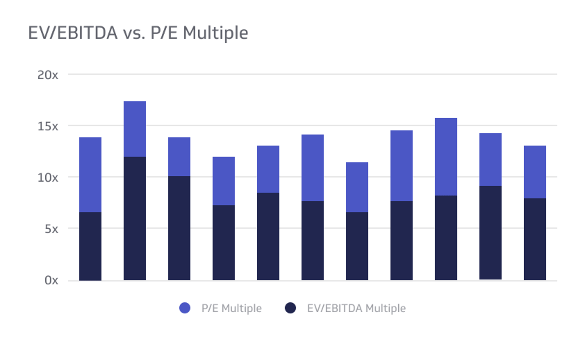

## Table of Contents

## What is EV/EBITDA and how is it calculated?

EV/EBITDA is a financial ratio that helps investors understand how much they are paying for a company's earnings before certain expenses. EV stands for Enterprise Value, which is the total value of a company including its debt and minus its cash. EBITDA stands for Earnings Before Interest, Taxes, Depreciation, and Amortization, which is a measure of a company's operating performance.

To calculate EV/EBITDA, you first need to find the enterprise value of the company. You do this by adding the market value of the company's equity (which is the stock price multiplied by the number of shares outstanding) to its total debt, and then subtracting any cash and cash equivalents the company has. Once you have the enterprise value, you divide it by the company's EBITDA, which can be found on its income statement. The result is the EV/EBITDA ratio, which shows how many times the company's EBITDA the enterprise value represents.

## What is P/E ratio and how is it calculated?

The P/E ratio, or Price-to-Earnings ratio, is a way to see how much investors are willing to pay for a company's earnings. It's like a price tag on the company's profits. The P/E ratio tells you how many dollars you need to spend to get one dollar of the company's earnings. It's a common tool used by investors to decide if a stock is a good buy or if it's too expensive.

To calculate the P/E ratio, you take the current stock price of a company and divide it by its earnings per share (EPS). The EPS is found by dividing the company's total earnings by the number of its outstanding shares. For example, if a company's stock is trading at $50 and its EPS is $5, the P/E ratio would be 10. This means investors are paying $10 for every $1 of the company's earnings.

## Why are EV/EBITDA and P/E multiples important in valuing companies?

EV/EBITDA and P/E multiples are important because they help investors understand how much they are paying for a company's earnings or cash flow. These multiples give a quick way to compare the value of different companies. For example, if one company has a lower P/E ratio than another, it might seem like a better deal. But it's not just about the numbers; investors need to think about why the ratios are different. Maybe one company is growing faster or has less debt.

Using EV/EBITDA can be especially helpful when looking at companies with a lot of debt or different ways of handling their finances. This ratio looks at the whole value of the company, including its debt, and compares it to its earnings before interest, taxes, and other expenses. This can give a clearer picture of a company's value, especially if you're thinking about buying the whole company, not just its stock. Both ratios help investors make smarter choices by giving them a way to see if a company's stock price matches its actual earnings and value.

## How do EV/EBITDA and P/E multiples differ in what they measure?

EV/EBITDA and P/E multiples measure different things about a company's value. The P/E ratio looks at the price of a company's stock compared to its earnings per share. It tells you how much you're paying for each dollar of the company's profit. If a company's P/E ratio is high, it means investors are willing to pay more for its earnings, which might mean they expect the company to grow a lot in the future.

On the other hand, EV/EBITDA looks at the whole value of the company, including its debt and cash, compared to its earnings before interest, taxes, depreciation, and amortization. This ratio is useful when you want to see how the company is doing without worrying about how it's financed. It's especially helpful for comparing companies that have different amounts of debt or different ways of handling their money. So, while P/E focuses on the stock price and earnings, EV/EBITDA gives a broader view of the company's overall value and operating performance.

## In what industries is EV/EBITDA more commonly used than P/E?

EV/EBITDA is often used more than P/E in industries where companies have a lot of debt or big investments in things like buildings and machines. For example, in the telecom and energy sectors, companies might have spent a lot of money on stuff like cell towers or oil rigs. These big investments can make their earnings look lower because of depreciation and amortization, which are costs spread out over time. EV/EBITDA helps to see past these costs and focus on the money the company is actually making from its operations.

Another place where EV/EBITDA is popular is in industries that are going through big changes or mergers. When companies buy or sell big parts of their business, their debt and cash can change a lot. EV/EBITDA is better at showing how these changes affect the company's value. It gives a clearer picture of what the company is worth, no matter how it's financed. That's why it's often used in industries like manufacturing or transportation, where big deals and investments are common.

## How can EV/EBITDA be more useful than P/E for companies with significant debt?

EV/EBITDA is more useful than P/E for companies with a lot of debt because it looks at the whole value of the company, not just its stock price. When a company has a lot of debt, the P/E ratio might not give a good picture of its value. That's because P/E only looks at the stock price and earnings per share, but it doesn't take into account the debt the company has. EV/EBITDA, on the other hand, adds the company's debt to its market value and then subtracts any cash it has. This gives a fuller view of what the company is really worth, including its debt.

Using EV/EBITDA can help investors see how the company is doing without being distracted by its debt. It looks at the company's earnings before interest, taxes, depreciation, and amortization, which means it shows the money the company makes from its main business activities. This is really helpful for companies with big loans because it shows how well they're doing at making money, even if they have to pay a lot in interest. So, EV/EBITDA gives a clearer and more complete picture of a company's value and performance when debt is a big factor.

## What are the limitations of using EV/EBITDA as a valuation metric?

One big problem with using EV/EBITDA is that it doesn't take into account how a company spends its money on things like buildings and machines. These costs are called capital expenditures, and they can be really important for some businesses. If a company has to spend a lot of money on these things, its EV/EBITDA might look good, but it might not be as healthy as it seems. This can make it hard to compare companies in different industries or even within the same industry if they have different ways of spending on their business.

Another issue is that EV/EBITDA can be easy to mess with. Companies can change how they report their earnings to make their EV/EBITDA look better. For example, they might say some costs are one-time expenses and leave them out of EBITDA. This can make the company look more valuable than it really is. So, while EV/EBITDA can be a helpful way to value a company, it's important to look at other things too, like how the company is spending its money and if its earnings are really as good as they seem.

## What are the limitations of using P/E as a valuation metric?

One limitation of using P/E as a valuation metric is that it can be misleading for companies that don't have steady earnings. If a company's earnings go up and down a lot, its P/E ratio might not give a good picture of its value. For example, if a company had a really good year and its earnings were high, its P/E ratio might look low, making it seem like a good buy. But if those high earnings don't last, the stock might not be such a good deal after all.

Another problem with P/E is that it doesn't take into account a company's debt. The P/E ratio only looks at the stock price and earnings per share, but it doesn't tell you anything about how much money the company owes. If a company has a lot of debt, it might have to pay a lot of interest, which can eat into its profits. So, even if a company's P/E ratio looks good, it might not be as healthy as it seems if it has a lot of debt.

## How do EV/EBITDA and P/E multiples help in comparing companies within the same industry?

EV/EBITDA and P/E multiples help investors compare companies within the same industry by giving them a quick way to see if one company is a better deal than another. When you look at the EV/EBITDA of different companies in the same industry, you can see which ones are valued more or less based on their operating earnings. This can help you find companies that might be undervalued or overvalued compared to their peers. For example, if one company has a lower EV/EBITDA than others in its industry, it might be a good buy because you're paying less for its earnings.

P/E multiples work in a similar way but focus on the stock price compared to earnings per share. By looking at the P/E ratios of companies within the same industry, you can see how much investors are willing to pay for each dollar of earnings. A lower P/E ratio might mean a company is undervalued, while a higher one might mean it's overvalued. This can help you decide which stocks to invest in by comparing how much you're paying for earnings across different companies. Both multiples give you a way to see if a company's stock price matches its actual earnings and value, helping you make smarter investment choices.

## Can EV/EBITDA and P/E multiples be used to compare companies across different industries, and if so, how?

Yes, you can use EV/EBITDA and P/E multiples to compare companies across different industries, but you have to be careful. These multiples can show you how much you're paying for a company's earnings or cash flow, no matter what industry it's in. For example, if one company in the tech industry has a lower P/E ratio than a company in the retail industry, it might seem like a better deal. But different industries have different ways of making money and spending it, so you need to think about why the multiples are different. Maybe one industry has more debt or needs to spend more on things like buildings and machines.

When you're using EV/EBITDA to compare companies across industries, it's a bit easier because it looks at the whole value of the company, including its debt and cash. This can give you a clearer picture of a company's value, even if it's in a different industry. But you still need to remember that industries can have different levels of debt and different ways of handling their finances. So, while EV/EBITDA and P/E multiples can help you compare companies across industries, it's important to look at other things too, like how the companies are spending their money and if their earnings are steady or not.

## How do changes in a company's capital structure affect EV/EBITDA and P/E multiples?

Changes in a company's capital structure can really change its EV/EBITDA multiple. The capital structure is about how a company uses debt and equity to finance its business. If a company takes on more debt, its enterprise value (EV) goes up because EV includes debt. But the EBITDA, which is the earnings before interest, taxes, depreciation, and amortization, stays the same. So, when you divide a bigger EV by the same EBITDA, the EV/EBITDA multiple gets bigger. This can make the company look more expensive. On the other hand, if a company pays off some of its debt, its EV goes down, and the EV/EBITDA multiple might go down too, making the company look cheaper.

The P/E multiple is affected differently by changes in capital structure. The P/E ratio looks at the stock price divided by earnings per share (EPS). Changes in debt don't directly change the stock price or the EPS, so the P/E ratio might not change much right away. But if a company takes on more debt, it might have to pay more interest, which can lower its earnings. If earnings go down, the P/E multiple might go up because you're dividing the same stock price by a smaller EPS. So, even though the P/E ratio doesn't directly include debt, changes in the capital structure can still affect it indirectly through the company's earnings.

## What advanced techniques can be used to adjust EV/EBITDA and P/E multiples for more accurate company valuations?

To get a more accurate valuation using EV/EBITDA, you can adjust for things like capital expenditures and working capital. Some companies spend a lot on things like buildings and machines, which can make their EV/EBITDA look better than it really is. To fix this, you can subtract the money they spend on these things from their EBITDA. This gives you a number called "free cash flow to the firm," which can be a better way to see how much money the company is really making. You can also look at how much cash the company needs to run its day-to-day business, which is called working capital. By adjusting EV/EBITDA for these things, you can get a clearer picture of the company's value.

For P/E multiples, one advanced technique is to use forward P/E ratios instead of trailing P/E ratios. A trailing P/E ratio looks at the company's past earnings, but a forward P/E ratio looks at what analysts think the company will earn in the future. This can be more accurate because it takes into account any changes or growth that the company might see. Another way to adjust P/E multiples is to look at the company's earnings quality. If a company's earnings are steady and not affected by one-time events, the P/E ratio might be a good measure of its value. But if the earnings are up and down a lot, you might need to adjust the P/E ratio to account for this. By using these advanced techniques, you can get a better idea of whether a company's stock is a good buy or not.

## What is the Price-to-Earnings (P/E) Ratio and how can it be understood?

The Price-to-Earnings (P/E) ratio is a fundamental tool in financial analysis, serving as a benchmark for evaluating the valuation and growth prospects of a company. Defined as the ratio of a company's current share price to its earnings per share (EPS), the P/E ratio reflects market expectations regarding future earnings potential. Mathematically, it is expressed as:

$$
\text{P/E Ratio} = \frac{\text{Market Price per Share}}{\text{Earnings per Share (EPS)}}
$$

This metric provides insights into how much investors are willing to pay per dollar of earnings, thus acting as a gauge for perceived growth or risk. A high P/E ratio may imply that a company is overvalued or expected to exhibit significant earnings growth in the future. Conversely, a lower P/E ratio could indicate undervaluation or potential financial distress.

However, one must be wary of the P/E ratio's limitations. It can be manipulated through accounting practices that adjust earnings, such as altering depreciation schedules or using extraordinary items, to present a more favorable financial position. Additionally, the P/E ratio's applicability varies across different industries. Sectors characterized by rapid growth or extensive capital expenditure may inherently possess higher P/E ratios than more mature or capital-light industries, complicating cross-sector comparisons.

Despite these challenges, the P/E ratio remains a prevalent measure of market sentiment. It provides a snapshot of whether the market is optimistic or pessimistic about a company's future, guiding investors in stock selection and portfolio management. Its continued use in financial analysis underscores its significance, albeit often supplemented with other metrics to paint a more comprehensive picture of an entity's financial health.

## What is the significance of Exploring Enterprise Value to EBITDA (EV/EBITDA) Multiple?

The Enterprise Value to EBITDA (EV/EBITDA) multiple is a prominent financial metric that offers investors a comprehensive understanding of a company's overall valuation, factoring in debt and excluding non-cash expenses such as depreciation and amortization. This metric is particularly beneficial for analyzing companies within capital-intensive industries, where debt levels and capital structures can differ significantly. By incorporating both equity and debt into its calculations, the EV/EBITDA ratio provides a more balanced view of a company's financial standing than metrics that focus solely on equity.

Mathematically, the EV/EBITDA ratio is expressed as:

$$
\text{EV/EBITDA} = \frac{\text{Enterprise Value}}{\text{EBITDA}}
$$

Where:
- **Enterprise Value (EV)** is the total value of a company, calculated as the market capitalization plus debt, minority interest, and preferred shares, minus total cash and cash equivalents.
- **EBITDA (Earnings Before Interest, Taxes, Depreciation, and Amortization)** represents a company’s earnings before the impact of financing and accounting decisions, providing insights into its operational profitability.

The EV/EBITDA metric is advantageous when comparing companies in sectors such as telecommunications, utilities, and energy, where capital expenditures and financing structures play a significant role in business operations. By removing the effects of depreciation, which can vary significantly depending on accounting practices and the age and mix of fixed assets, it allows for more direct comparison between firms.

However, this metric has limitations. It may not fully capture a company's cash flow profile, as major capital expenditures can significantly impact a company’s long-term financial health, regardless of being excluded from EBITDA. It also does not account for tax differences or changes in working capital. Therefore, while valuable, the EV/EBITDA ratio should be used alongside additional metrics and contextual financial analysis to offer a complete picture of a company's viability.

In practice, the EV/EBITDA is a favored metric when comparing operational performance within industries. Its capacity to normalize earnings for firms having diverse financial and capital structures provides a robust framework for evaluating and contrasting business performance irrespective of individual financial arrangements.

## References & Further Reading

[1]: Damodaran, A. (2012). ["Investment Valuation: Tools and Techniques for Determining the Value of Any Asset."](https://books.google.com/books/about/Investment_Valuation.html?id=5SRHAAAAQBAJ) Wiley Finance.

[2]: Penman, S. H. (2012). ["Financial Statement Analysis and Security Valuation."](https://archive.org/details/financialstateme0000penm_r9u4) McGraw-Hill Education.

[3]: ["The Little Book of Valuation: How to Value a Company, Pick a Stock and Profit"](https://www.amazon.com/Little-Book-Valuation-Company-Profits/dp/1394244401) by Aswath Damodaran

[4]: "Enterprise Value/EBITDA Multiple," [Corporate Finance Institute](https://corporatefinanceinstitute.com/resources/capital_markets/ebitda-multiple/). 

[5]: López de Prado, M. (2018). ["Advances in Financial Machine Learning."](https://www.amazon.com/Advances-Financial-Machine-Learning-Marcos/dp/1119482089) Wiley.

[6]: ["Algorithmic and High-Frequency Trading"](https://www.amazon.com/Algorithmic-High-Frequency-Trading-Mathematics-Finance/dp/1107091144) by Álvaro Cartea, Sebastian Jaimungal, and José Penalva

[7]: Berkman, H., & Bradbury, M. E. (2006). ["Empirical Evidence on the Corporate Use of Credit Derivatives."](https://www.jstor.org/stable/3665985) The European Journal of Finance, 12(3), 197-211.

[8]: ["Equity Valuation using Multiples: An Empirical Investigation"](https://link.springer.com/book/10.1007/978-3-8350-9531-1) by Peter Joos and Baruch Lev

[9]: ["Equity Financing and Firms’ Valuation: Evidence from Italy"](https://link.springer.com/book/10.1007/978-3-031-60530-7) by Plamen T. Patev, and Zhelyu Pavlov

[10]: Gordon, L. A., & Smith, K. J. (1992). ["Postauditing Capital Projects Using EVA and Other Residual Measures."](https://www.sciencedirect.com/science/article/pii/036136829290002A) Financial Analysts Journal, 48(4), 41-52.