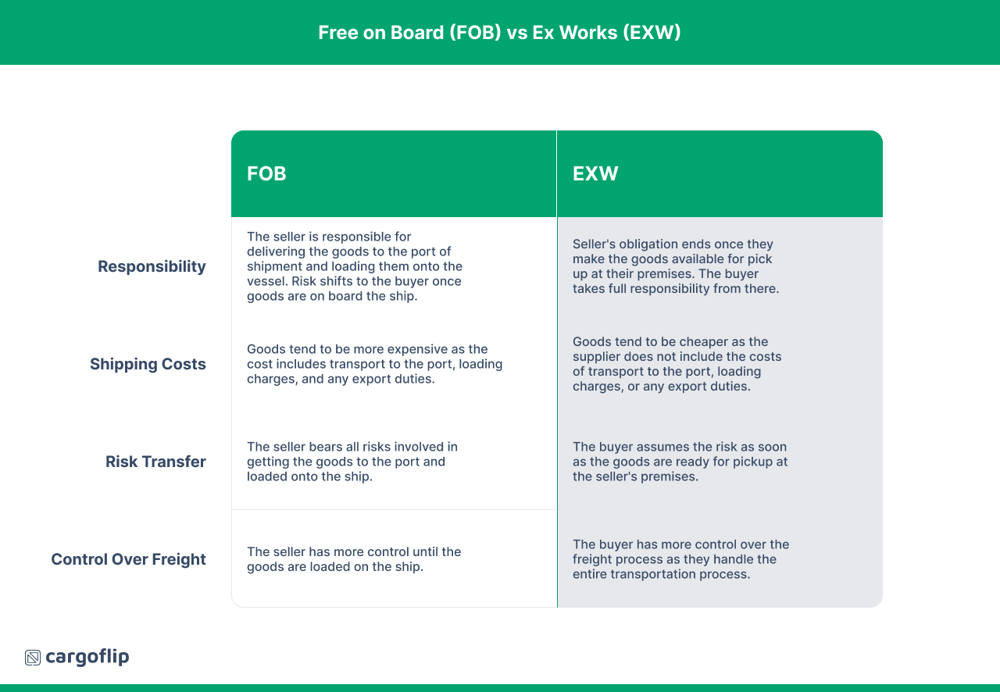

## Table of Contents

## What is Ex Works (EXW)?

Ex Works, often abbreviated as EXW, is a common international trade term where the seller makes the goods available at their premises, and the buyer is responsible for all other costs and risks involved in transporting the goods to their final destination. This means that once the goods are ready for pickup at the seller's location, the buyer must handle everything from loading the goods onto a vehicle, to arranging for transportation, customs clearance, and insurance.

This term is often used when the buyer wants full control over the shipping process or when the seller does not have the means to handle export procedures. It can be beneficial for the buyer if they can secure better shipping rates or have specific requirements for the transportation of the goods. However, it also places a heavier burden on the buyer, as they must manage all logistics and bear all risks once the goods leave the seller's premises.

## What is Free on Board (FOB)?

Free on Board, or FOB, is a term used in shipping that means the seller is responsible for getting the goods to the port of shipment and loading them onto the ship. Once the goods are on the ship, the buyer takes over. This means the buyer pays for the shipping from that point and also handles any risks if something goes wrong during the rest of the journey.

FOB is popular because it clearly splits responsibilities between the seller and buyer. For example, if the goods are damaged after they are loaded onto the ship, it's the buyer's problem, not the seller's. This term is often used when goods are shipped overseas, and it helps both parties know exactly what they are responsible for during the shipping process.

## How do Ex Works and Free on Board differ in terms of responsibility for goods?

Ex Works and Free on Board differ in who is responsible for the goods and when. With Ex Works, the seller's job is done once the goods are ready at their place. The buyer then has to pick up the goods, arrange transport, and handle everything else, including any risks if something goes wrong. This means the buyer is in charge from the moment the goods are available at the seller's location.

On the other hand, with Free on Board, the seller has more responsibility. They need to get the goods to the port and load them onto the ship. Once the goods are on the ship, the responsibility shifts to the buyer. The buyer then takes care of the rest of the shipping and any risks after that point. This makes FOB a bit easier for the buyer because the seller handles the initial part of the journey.

## What are the costs associated with Ex Works?

When using Ex Works, the buyer has to pay for a lot of things. They need to cover the cost of [picking](/wiki/asset-class-picking) up the goods from the seller's place. This includes any transport costs to get the goods from the seller to the port or wherever they need to go next. The buyer also has to pay for loading the goods onto the vehicle, and any export fees or customs duties that come up when the goods leave the seller's country.

The buyer is also responsible for the cost of shipping the goods to their final destination. This means paying for the ship or plane that carries the goods, and any insurance to protect the goods during the journey. If anything goes wrong, like the goods getting damaged or lost, the buyer has to deal with those costs too. So, with Ex Works, the buyer ends up paying for almost everything after the goods are ready at the seller's location.

## What are the costs associated with Free on Board?

With Free on Board, the seller has to pay for getting the goods to the port and loading them onto the ship. This means they cover the cost of transport from their place to the port and the fees for loading the goods onto the ship. The seller is also responsible for any export duties or fees that need to be paid before the goods leave their country.

Once the goods are on the ship, the buyer takes over and has to pay for the rest of the shipping costs. This includes the cost of the ship or plane that carries the goods to their final destination, and any insurance to protect the goods during the rest of the journey. If something goes wrong after the goods are on the ship, like if they get damaged or lost, the buyer has to deal with those costs.

## How does the risk transfer point vary between Ex Works and Free on Board?

With Ex Works, the risk transfers to the buyer as soon as the goods are ready at the seller's place. This means if anything goes wrong after the goods are ready, like if they get damaged while being picked up or during transport, it's the buyer's problem, not the seller's. The buyer has to deal with all the risks from the moment they can pick up the goods.

With Free on Board, the risk transfers to the buyer a bit later. The seller is in charge until the goods are loaded onto the ship at the port. Once the goods are on the ship, the risk shifts to the buyer. So, if something goes wrong after the goods are on the ship, like if they get damaged during the rest of the journey, it's the buyer's responsibility.

## In what situations would a buyer prefer Ex Works over Free on Board?

A buyer might choose Ex Works when they want to have full control over the shipping process. With Ex Works, the buyer can pick their own shipping company and handle all the logistics themselves. This can be good if the buyer knows how to get better shipping deals or if they have special needs for how the goods should be moved. For example, if a buyer can get cheaper shipping rates or has a preferred carrier, Ex Works lets them use those options.

Another reason a buyer might prefer Ex Works is if the seller does not have the ability to handle export procedures. In some cases, the seller might not know how to deal with the paperwork or fees needed to ship goods out of their country. By choosing Ex Works, the buyer takes on these tasks themselves, which can be easier if they are more familiar with the process or have better resources to manage it.

## Under what circumstances would a seller prefer Free on Board over Ex Works?

A seller might prefer Free on Board because it lets them handle the goods until they are on the ship. This can be good if the seller has a good deal with a shipping company or if they want to make sure the goods are packed and loaded properly. With FOB, the seller can make sure everything is done right up to the point where the goods are on the ship, which can help avoid problems and keep their customers happy.

Another reason a seller might choose FOB is that it makes things simpler for them. With Ex Works, the seller has to be ready for the buyer to pick up the goods at any time, which can be tricky to manage. FOB gives the seller a clear point where their job is done, which is when the goods are on the ship. This can make the whole process easier to plan and manage, and the seller doesn't have to worry about what happens to the goods after they are on the ship.

## How do Ex Works and Free on Board impact the logistics and transportation of goods?

Ex Works puts a lot of responsibility on the buyer for logistics and transportation. The buyer has to pick up the goods from the seller's place, which means they need to arrange and pay for transport to get the goods to the port or wherever they need to go next. The buyer also has to handle loading the goods onto the transport vehicle and take care of all the export paperwork and fees. Once the goods leave the seller's place, the buyer is in charge of everything, including the shipping to the final destination and any insurance needed to protect the goods during the journey. This can be good if the buyer knows how to get better shipping deals or has special needs for how the goods should be moved, but it also means they have to manage all the risks if something goes wrong.

Free on Board, on the other hand, splits the logistics and transportation responsibilities between the seller and the buyer. The seller has to get the goods to the port and load them onto the ship, which means they handle the transport from their place to the port and the fees for loading the goods onto the ship. The seller also takes care of any export duties or fees before the goods leave their country. Once the goods are on the ship, the buyer takes over. The buyer then has to pay for the rest of the shipping to the final destination and any insurance needed to protect the goods during the rest of the journey. This can be easier for the buyer because the seller handles the initial part of the journey, but the buyer still has to manage the risks after the goods are on the ship.

## What are the documentation requirements for Ex Works compared to Free on Board?

With Ex Works, the buyer has to handle all the paperwork for shipping the goods. This means the buyer needs to get all the documents needed to move the goods out of the seller's country and into their own country. The buyer has to take care of export licenses, customs declarations, and any other paperwork needed for the journey. The seller just has to give the buyer the documents that show the goods are ready to be picked up, like an invoice or a packing list.

For Free on Board, the seller has to do more with the paperwork. The seller needs to get the documents ready for the goods to leave their country, like export licenses and customs declarations. Once the goods are on the ship, the buyer takes over and has to handle the rest of the paperwork for the journey to the final destination. This means the buyer needs to get the import documents and any other papers needed to get the goods into their country. So, with FOB, the seller and buyer share the work on the paperwork, but the seller does more at the start and the buyer does more at the end.

## How do international trade regulations affect the choice between Ex Works and Free on Board?

International trade regulations can make a big difference in choosing between Ex Works and Free on Board. With Ex Works, the buyer has to deal with all the rules and paperwork for exporting the goods from the seller's country and importing them into their own country. This can be tricky if the buyer does not know the rules well or if the seller's country has a lot of complicated export rules. The buyer needs to make sure they follow all the regulations, which can add more work and risk to the process.

On the other hand, with Free on Board, the seller takes care of the export regulations and paperwork until the goods are on the ship. This can be easier for the buyer because the seller knows the export rules of their own country better. Once the goods are on the ship, the buyer then has to deal with the import regulations of their own country. So, the choice between Ex Works and Free on Board can depend on how well the buyer and seller know the trade rules and how much work they want to handle.

## What are the advanced considerations for choosing between Ex Works and Free on Board in complex supply chains?

In complex supply chains, choosing between Ex Works and Free on Board can be tricky because there are many steps and people involved. With Ex Works, the buyer has to handle everything from picking up the goods at the seller's place to getting them through all the different stages of the supply chain. This can be good if the buyer wants to control how the goods move and can use their own shipping deals to save money. But it can also be hard if the buyer has to deal with a lot of different rules and paperwork in different countries, especially if the supply chain goes through many places.

On the other hand, Free on Board can make things easier for the buyer in a complex supply chain because the seller takes care of getting the goods to the port and onto the ship. This can help if the seller knows the export rules well and can handle the first part of the journey smoothly. After the goods are on the ship, the buyer then takes over and has to deal with the rest of the supply chain. This can be a good choice if the buyer wants to focus on the later stages of the journey and let the seller handle the start.

In some cases, the choice might also depend on how well the buyer and seller can work together. If they can share information and work well together, they might be able to use Ex Works or Free on Board in a way that fits their supply chain best. For example, if the buyer knows a lot about shipping and can handle the risks, Ex Works might be better. But if the seller can help with the first part of the journey and make things easier, Free on Board might be the way to go.

## References & Further Reading

[1]: ["Incoterms® 2020: ICC Rules for the Use of Domestic and International Trade Terms"](https://iccwbo.org/business-solutions/incoterms-rules/incoterms-2020/) by the International Chamber of Commerce

[2]: Kemp, S. (2017). ["International Trade and Finance: Overview and Resources."](https://crsreports.congress.gov/product/pdf/R/R46669) Collier Library Collections.

[3]: Lopez de Prado, M. (2018). ["Advances in Financial Machine Learning."](https://www.amazon.com/Advances-Financial-Machine-Learning-Marcos/dp/1119482089) Wiley.

[4]: Jansen, S. (2020). ["Machine Learning for Algorithmic Trading - Second Edition: Predictive models to extract signals from market and alternative data for systematic trading strategies with Python."](https://thuvienso.hoasen.edu.vn/bitstream/handle/123456789/12260/Contents.pdf?sequence=1) Packt Publishing.

[5]: Chan, E. P. (2009). ["Quantitative Trading: How to Build Your Own Algorithmic Trading Business."](https://github.com/ftvision/quant_trading_echan_book) Wiley.