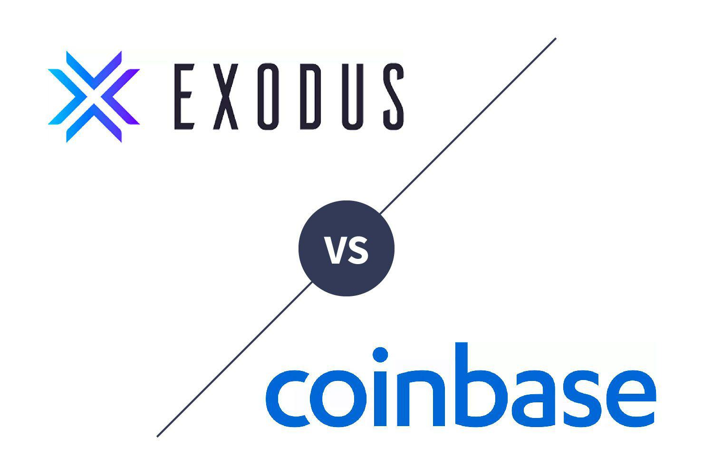

The world of cryptocurrency offers investors a diverse range of options, particularly when selecting the right exchange and wallet. With the rapid evolution of digital currencies, choosing the appropriate platform can significantly influence an investor's experience and outcomes. This article provides a comprehensive comparison between two prominent cryptocurrency platforms: Exodus and Coinbase. By examining their features, fees, security measures, ease of use, and other relevant criteria, we aim to guide readers in selecting the platform that best suits their needs. Whether you prioritize control over your assets or require an easy entry point into the crypto market, understanding these differences is crucial.

Exodus is recognized for its decentralized approach and strong user autonomy. It offers a software wallet integrated with Trezor hardware, giving users substantial control over their digital assets. Coinbase, in contrast, is a centralized exchange known for its user-friendly interface. It serves as an accessible entry point for newcomers to the world of cryptocurrency. Both platforms provide a suite of features, including staking and P2P trading, yet they differ significantly in their security measures and user independence.



In addition to these core aspects, this article will also briefly cover the algo trading opportunities available on Exodus and Coinbase. Algorithmic trading, or algo trading, refers to the use of pre-programmed strategies to execute trades based on specified criteria. This feature can enhance trading efficiency and potentially increase profitability for users. By thoroughly comparing these facets, investors can make informed decisions aligned with their cryptocurrency goals and preferences.

## Table of Contents

## Overview of Exodus and Coinbase

Exodus is recognized as a decentralized digital currency exchange with a focus on personalized control and security. At the heart of Exodus is its software wallet, which is designed to be seamlessly integrated with Trezor hardware wallets. This integration provides users with an additional layer of security for their digital assets. By using Exodus, users retain significant control over their cryptocurrencies as it does not serve as a custodian; instead, it holds the private keys locally on the user's device. This approach empowers users through a higher degree of autonomy and privacy in managing their assets.

Coinbase takes a different approach as a centralized cryptocurrency exchange. It is one of the most widely used platforms, favored for its intuitive interface that makes it an accessible starting point for those new to cryptocurrency investing. Unlike Exodus, Coinbase acts as a custodian for its users, offering a more traditional and managed path for asset security. This structure simplifies the buying, selling, and storage processes but often involves trade-offs regarding user control over private keys.

Both platforms offer a wide range of features, enhancing the value proposition for their users. For instance, staking is supported on both Exodus and Coinbase, allowing users to earn rewards on compatible cryptocurrencies by participating in network security and consensus. Additionally, peer-to-peer (P2P) trading is available, allowing for direct transactions between users without a central intermediary. However, despite these shared features, Exodus and Coinbase diverge notably in their approaches to security and user autonomy.

Exodus prioritizes a decentralized model where the security responsibility predominantly rests on the user. This means users must ensure their devices are secure against malware and unauthorized access. Conversely, Coinbase provides a centralized and structured environment with comprehensive security protocols, offering insurance on USD balances and ensuring regulatory compliance. This makes Coinbase a reliable choice for those who prioritize simplicity and assurance typical of traditional banking systems paired with [cryptocurrency](/wiki/cryptocurrency) investment opportunities.

## Features and Functionalities

Exodus and Coinbase are prominent cryptocurrency platforms, each offering distinctive features and functionalities tailored towards different user experiences and preferences. Exodus provides support for over 260 cryptocurrencies, with the key requirement for users to download its desktop or mobile application. This app-centric approach allows for enhanced user control and management of digital assets directly on their devices. Exodus's integration with Trezor hardware wallets further reinforces its commitment to providing users substantial autonomy over their private keys and security. By supporting offline storage capabilities through Trezor, users can achieve enhanced security while retaining the flexibility of managing their cryptocurrency portfolios.

On the other hand, Coinbase offers an accessible platform through both web and mobile interfaces, supporting over 250 cryptocurrencies. This mere parity with Exodus in terms of supported cryptocurrencies underscores Coinbase's emphasis on simplicity and ease of use, particularly appealing to those new to the cryptocurrency landscape. A standout feature of Coinbase is its Learning Rewards program, which incentivizes users to educate themselves about various cryptocurrencies by offering small amounts of these currencies as a reward for completing lessons. This not only promotes user engagement but also aids newcomers in familiarizing themselves with diverse digital assets.

Exodus and Coinbase each provide unique offerings geared toward their target demographics. Exodus's user-centric model with Trezor integration is suitable for those seeking greater control over their wallets and security, while Coinbase's emphasis on accessibility and educational rewards attracts beginners looking to gradually build their understanding of cryptocurrencies.

## Wallet Comparison

Exodus and Coinbase offer contrasting approaches to cryptocurrency wallet management, each catering to different user needs in terms of security, fees, and user control.

Exodus operates as a hot wallet, offering users a high degree of autonomy over their digital assets. In a hot wallet setup, like Exodus, users retain control over their private keys, stored locally on their devices rather than on centralized servers. This decentralization grants users complete control over their funds, as they are solely responsible for managing and securing their private keys. Exodus supports over 260 cryptocurrencies, with standalone apps for desktops and mobile devices. Integration with Trezor hardware wallets provides an extra security layer, allowing users the option to store their private keys offline.

Conversely, Coinbase functions as a brokerage with a custodial wallet service. Users opting for Coinbase trust the platform to manage their private keys, which are stored securely on Coinbase's servers. This custodial model offers more convenience, particularly for those less familiar with handling private keys, as Coinbase ensures asset security through stringent protocols and insurance for USD balances. Coinbase offers a standalone wallet application, which allows users to control their private keys, bridging the gap between traditional custody and user autonomy.

In terms of fees, Exodus does not charge users for sending or receiving cryptocurrency, though it applies network fees dictated by blockchain congestion. These network fees are variable and must be borne by the user. Additionally, Exodus may include a spread in the conversion rates during exchanges within the wallet, subtly affecting transaction costs.

Coinbase's fee structure is more intricate, involving maker-taker fees and fixed charges for various transactions. According to the transaction [volume](/wiki/volume-trading-strategy) and user's region, these fees range, potentially impacting users differently based on trading habits and investment scales. Unlike Exodus, Coinbase's fee structure might pose hurdles for frequent traders due to relatively higher costs unless considered in light of the convenience of use and added security layers provided.

Ultimately, selecting between Exodus and Coinbase depends on the user's preference for autonomy versus convenience and security. Users who prioritize total control and potentially lower costs might lean towards Exodus, while those valuing convenience and insurance backing may find Coinbase more appealing.

## Security and Trustworthiness

Exodus and Coinbase differ significantly in their approaches to security and trustworthiness, each offering distinct models that cater to different user preferences. Understanding these approaches is crucial for users to make informed decisions about which platform aligns with their security needs.

Exodus operates on a decentralized model, granting users significant control over their assets. This means that users' private keys are stored locally on their devices, and they possess full ownership of their cryptocurrencies. While this offers high user autonomy, it also imposes a significant responsibility on users to ensure the security of their devices and manage their wallets effectively. In this decentralized system, if a user's device is compromised, or if they lose access to their private keys, they may permanently lose their assets. Therefore, Exodus users must implement robust security measures such as two-[factor](/wiki/factor-investing) authentication, strong passwords, and regular backups of their wallet data.

On the other hand, Coinbase functions as a centralized exchange with a focus on comprehensive security protocols. It provides secure custody of users’ assets, holding private keys on behalf of users. This model reduces the individual responsibility for security measures, as Coinbase employs advanced security technologies. Features include multi-signature wallets, 98% of funds stored offline in cold storage, and insurance protection against breaches for USD balances. These measures aim to protect users from potential threats such as hacking or theft at the exchange level.

The choice between Exodus and Coinbase ultimately depends on user preferences for control versus convenience. While Exodus offers greater autonomy and the absence of intermediary risk, it requires users to be proactive in securing their assets. Coinbase, conversely, is suitable for users preferring professional security management but willing to trade off some degree of control over their private keys. Each platform's security strategy reflects a different philosophy, underscoring the importance of users aligning their choice with their security competencies and comfort levels with risk management.

## Fees and Costs

When evaluating the fee structures of Exodus and Coinbase, it's important to consider how each platform's pricing model aligns with various types of users and their specific needs. 

Exodus adopts a simple approach to fees, not charging users for sending or receiving cryptocurrencies. Instead, it applies network fees, which are standard charges imposed by the blockchain network for processing transactions. These fees vary based on network congestion and the complexity of transactions. Additionally, Exodus incorporates a spread, a slight difference between the buy and sell price, within its in-app exchange. This spread compensates for the absence of direct transaction fees and can vary depending on market conditions. Users engaged in frequent exchanges or large transactions might perceive the impact of spreads more acutely, especially in volatile markets.

In contrast, Coinbase employs a more complex fee structure, often viewed as less favorable for users making numerous or small transactions. Its model incorporates maker-taker fees on its advanced trading platform, which are charges applied based on whether a user adds [liquidity](/wiki/liquidity-risk-premium) to the market (maker) or removes liquidity (taker). These fees can be relatively high, influenced by the transaction volume. Furthermore, Coinbase imposes additional fees for standard transactions, deposits, and withdrawals. For example, a typical transaction might incur both a flat fee and a percentage of the transaction amount, leading to higher costs for transactions of smaller volumes.

To illustrate the impact of Coinbase’s fees, consider a user executing a $100 transaction. They might encounter a base fee of $1.99 plus a 1.49% variable fee, leading to a total cost of approximately $3.48. For active traders, particularly those with high trade volumes, these fees cumulatively reduce profitability, prompting them to seek lower-cost alternatives or restructure their trading strategies to minimize fees.

In summary, while Exodus offers straightforward fee transparency through network fees and spreads, Coinbase presents a multifaceted fee paradigm that may disproportionately affect users with specific trading habits or lower investment volumes. Therefore, understanding these fee structures is crucial for selecting the platform that aligns with one's trading habits and financial goals.

## Ease of Use and Accessibility

Coinbase and Exodus offer distinct approaches to ease of use and accessibility, each catering to different user preferences and skill levels. Coinbase is renowned for its browser-based trading platform, which emphasizes simplicity and accessibility. The design of the Coinbase interface is streamlined, making it an appealing option for beginners or those new to cryptocurrency trading. Users can easily access their accounts and execute trades directly from any web browser without needing to download additional software or applications. Additionally, Coinbase provides extensive educational resources, including tutorials and guides, which further support users in understanding and navigating the cryptocurrency market.

In contrast, Exodus adopts a more app-centric approach which requires users to install its applications on desktop or mobile devices. This design grants users greater control over their assets, aligning with Exodus's philosophy of decentralization and user autonomy. The Exodus interface is feature-rich, offering detailed insights and tools for managing a wide range of cryptocurrencies. While this may involve a steeper learning curve, especially for those unfamiliar with app-based platforms, it empowers users with comprehensive controls and customization options, potentially appealing to more experienced traders.

Accessibility-wise, Exodus's approach enables deep integration with users' devices, leading to a seamless experience in managing, sending, or receiving cryptocurrencies. However, this also means users are responsible for securing and maintaining the devices where the app is installed. In contrast, Coinbase's web-based model allows users to access their account from any device with internet connectivity, providing convenience without the necessity of a dedicated application or hardware.

In summary, the choice between Coinbase and Exodus regarding ease of use and accessibility largely depends on the balance between simplicity and control that a user desires. Beginners may find Coinbase more approachable due to its straightforward web interface and educational materials, while users looking for greater asset management capabilities might prefer Exodus, despite requiring a more significant initial commitment to understanding its app-based system.

## Algo Trading Opportunities

Algorithmic trading, a sophisticated investment strategy involving automated trading decisions based on pre-set rules and algorithms, has gained traction in the cryptocurrency market. Both Exodus and Coinbase, notable cryptocurrency platforms, offer varying levels of support for this trading style.

**Exodus:**

Exodus primarily functions as a user-centric cryptocurrency wallet and exchange. It does not natively support [algorithmic trading](/wiki/algorithmic-trading) features. However, users looking to implement algorithmic trading can do so indirectly through Exodus's integration with established exchanges and third-party APIs. By leveraging external services, traders can connect their Exodus wallets to platforms that support algorithmic strategies. This method requires technical expertise to configure APIs and execute automated trading functions using external tools, such as Python-based algorithmic trading libraries (e.g., ccxt).

Here's a simple example of how one might use Python and ccxt to set up a script that interfaces with a cryptocurrency exchange:

```python
import ccxt

# Instantiate the exchange object
exchange = ccxt.binance()  # Replace with an exchange that Exodus integrates with

# Load your API keys (Note: Exodus itself does not require/expose API keys)
exchange.apiKey = 'YOUR_API_KEY'
exchange.secret = 'YOUR_SECRET_KEY'

# Fetch ticker information for a cryptocurrency
ticker = exchange.fetch_ticker('BTC/USDT')
print(f"Current BTC/USDT price: {ticker['last']}")

# Example of a simple trading algorithm: Buy if BTC price is below a certain threshold
if ticker['last'] < 50000:  # This threshold is arbitrary for example purposes
    order = exchange.create_market_buy_order('BTC/USDT', 0.001)  # Place a market buy order for 0.001 BTC
    print('Order executed:', order)
```

**Coinbase:**

Unlike Exodus, Coinbase offers robust features through its Coinbase Pro platform that can be used in conjunction with external tools for algorithmic trading. Coinbase Pro provides APIs that facilitate access to real-time market data and allow users to execute trades programmatically. Its structured environment can support algorithmic strategies, including market-making, [arbitrage](/wiki/arbitrage), and trend-following.

Coinbase's API documentation provides comprehensive guidance for developers looking to implement algorithmic strategies. Users can build and deploy trading bots tailored to their strategies, enhancing trading efficiency and potential profitability.

Considerations for profitability hinge on market conditions, strategy optimization, and technical infrastructure. Utilizing historical price data and [backtesting](/wiki/backtesting) trading algorithms before deployment are critical steps in optimizing strategies for real-world application.

Overall, while Exodus does not directly support algorithmic trading, its ecosystem can be tailored through external resources to facilitate such activities. Coinbase, with its Coinbase Pro platform, provides a more direct and structured approach for traders seeking to leverage algorithmic trading. Users considering algorithmic trading must weigh the technical requirements and market conditions to maximize their strategies effectively.

## Conclusion

Exodus and Coinbase each offer distinct advantages and potential drawbacks, catering to different segments of cryptocurrency users. Exodus stands out with its focus on decentralized features, offering users substantial autonomy and control over their assets through its hot wallet solution. This platform appeals to security-conscious investors who are comfortable managing their own private keys and want to minimize third-party risks. Its integration with Trezor provides additional security measures, making it suitable for those who prioritize asset control and trust minimization.

Conversely, Coinbase is ideal for beginners and those who value ease of use and convenience in their cryptocurrency experience. Its user-friendly interface, combined with a range of educational resources like the Learning Rewards program, makes it an accessible entry point for newcomers. However, Coinbase follows a centralized model, which means users need to trust the platform with custody, although it provides insurance protections for its USD balances.

For investors who prioritize low costs, Exodus's lack of service fees and charges only network fees and spreads make it an economical choice for frequent transactions. Meanwhile, Coinbase's fee structure, including maker-taker fees, could impact cost-effectiveness, particularly for high-volume traders.

In terms of algo trading, both platforms offer distinct tools and opportunities, potentially impacting users who engage in automated trading strategies with efficiency and adaptability.

Choosing between Exodus and Coinbase ultimately depends on individual goals and preferences. Users focused on security and asset control might find Exodus more aligned with their objectives, while beginners or those prioritizing streamlined trading processes might prefer Coinbase. Understanding one's cryptocurrency goals and tolerance for managing security can significantly influence the decision-making process when selecting the right platform.

## References & Further Reading

[1]: Bergstra, J., Bardenet, R., Bengio, Y., & Kégl, B. (2011). ["Algorithms for Hyper-Parameter Optimization."](https://papers.nips.cc/paper/4443-algorithms-for-hyper-parameter-optimization) Advances in Neural Information Processing Systems 24.

[2]: ["Advances in Financial Machine Learning"](https://www.amazon.com/Advances-Financial-Machine-Learning-Marcos/dp/1119482089) by Marcos Lopez de Prado

[3]: ["Evidence-Based Technical Analysis: Applying the Scientific Method and Statistical Inference to Trading Signals"](https://www.amazon.com/Evidence-Based-Technical-Analysis-Scientific-Statistical/dp/0470008741) by David Aronson

[4]: ["Machine Learning for Algorithmic Trading"](https://github.com/stefan-jansen/machine-learning-for-trading) by Stefan Jansen

[5]: ["Quantitative Trading: How to Build Your Own Algorithmic Trading Business"](https://books.google.com/books/about/Quantitative_Trading.html?id=j70yEAAAQBAJ) by Ernest P. Chan