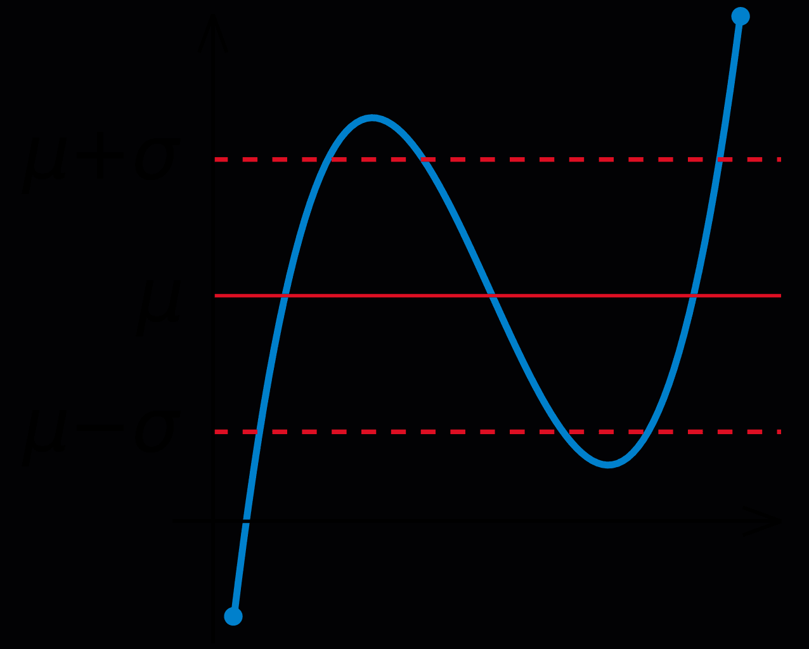

The landscape of algorithmic trading has evolved significantly over recent years, propelled by swift advancements in technology and data analysis capabilities. Algorithmic trading, which employs complex algorithms to make trading decisions at speeds and frequencies beyond human capacity, has become a cornerstone of modern financial markets. These advancements allow traders to analyze vast volumes of data and execute orders with precision unobtainable a few decades ago, thus reshaping trading paradigms to align more closely with quantitative analysis and data-driven insights.

At the core of algorithmic trading are key financial concepts: expected return, investment risk, and standard deviation. These metrics are critical for assessing the profitability and risks associated with various trading strategies. The expected return provides a forecast of potential profitability by predicting the average of all possible returns of an investment. This measure forms the basis of investment decisions, guiding traders in estimating the potential success of a trade. On the other hand, investment risk is often quantified through the lens of standard deviation, which measures the volatility or variability of returns around the expected return. A higher standard deviation indicates greater variability, suggesting higher risk, and vice versa.



Understanding these concepts is crucial for investors aiming to make informed decisions and optimize their trading strategies. The interplay between expected return and risk forms the backbone of effective portfolio management, guiding the construction of diversified investment portfolios that seek to balance risk with potential rewards. As the landscape continues to evolve, leveraging these metrics alongside cutting-edge technologies such as machine learning and artificial intelligence becomes imperative. These technologies provide the means to process extensive datasets, identify underlying trends, and refine trading strategies, thereby enhancing the precision and adaptability of algorithmic trading.

In navigating the complexities of today's financial markets, traders and investors must adeptly integrate expected return calculations, risk assessments, and modern trading tools to achieve optimal outcomes. This integration not only maximizes potential returns but also strategically manages risks, ensuring sustainable investment growth.

## Table of Contents

## Understanding Expected Return in Algorithmic Trading

Expected return is a fundamental measure in finance, especially within the context of algorithmic trading, where precision and data-driven strategies are paramount. It represents the mean value of all potential outcomes of an investment based on a set of probabilities. Understanding and calculating expected return enables traders to anticipate the potential profitability of their trades, allowing for better strategy design and execution.

### Calculation of Expected Return

Mathematically, expected return ($E(R)$) is calculated as the weighted average of all possible returns, where each possible return ($R_i$) is multiplied by its probability ($P_i$):

$$

E(R) = \sum_{i=1}^{n} P_i \times R_i 
$$

In this formula:
- $P_i$ is the probability of each outcome.
- $R_i$ is the return associated with each outcome.
- $n$ is the total number of possible outcomes.

### Application in Algorithmic Trading

In [algorithmic trading](/wiki/algorithmic-trading), expected return calculations are used to refine trading strategies by examining the potential success of trades through comprehensive algorithms. These algorithms assimilate vast datasets, considering various market scenarios and possible outcomes to calculate a statistically informed projection of returns. This approach is pivotal in optimizing portfolio performance and minimizing risk.

For instance, traders might use historical price data and current market indicators in a Python algorithm to project expected returns. Consider a simplified scenario:

```python
# Example Python code for Expected Return calculation
probability_distribution = [0.2, 0.5, 0.3]  # Example probabilities
possible_returns = [0.05, 0.10, -0.02]       # Example returns

expected_return = sum(p * r for p, r in zip(probability_distribution, possible_returns))
print(f"Expected Return: {expected_return:.2%}")
```

This code snippet calculates the expected return based on defined probabilities and possible returns. Algorithmic trading platforms enhance this basic concept by applying complex models and large data analyses to achieve more precise estimations.

Algorithmic trading systems are continually refined using the data processing capabilities of modern computers to adjust to new information rapidly. Thus, expected return is not only a static calculation but a dynamic figure constantly updated to reflect the ongoing changes in financial markets. This dynamic optimization allows traders to quickly adapt to emerging trends and improve their trading performance over time.

By incorporating expected return into their strategic framework, traders are better equipped to maximize potential profits while balancing associated risks.

## Calculating Risk Using Standard Deviation

Standard deviation is a statistical measure that quantifies the amount of variation or [dispersion](/wiki/dispersion-trading) of a set of values. In the context of investments, it is used to assess the [volatility](/wiki/volatility-trading-strategies) of investment returns, providing investors with insights into the risk associated with their portfolios. The formula for calculating standard deviation ($\sigma$) of a series of returns is as follows:

$$
\sigma = \sqrt{\frac{\sum_{i=1}^{N} (R_i - \bar{R})^2}{N-1}}
$$

where:
- $R_i$ is the return for each period,
- $\bar{R}$ is the average return over all periods,
- $N$ is the number of periods.

The standard deviation serves as a critical measure of risk. A higher standard deviation indicates greater volatility and uncertainty about future returns, whereas a lower standard deviation denotes stability. By analyzing the variability of returns, traders can gauge the level of risk they are exposed to and make informed decisions about how much risk is acceptable when targeting higher returns.

**Example for Practical Application**

Consider an investment portfolio with annual returns over four years: 5%, 10%, 15%, and 20%. We can calculate the standard deviation of the returns to understand the volatility. Here's an illustrative Python code to compute the standard deviation:

```python
import numpy as np

# Returns over four years
returns = np.array([5, 10, 15, 20])

# Calculate the average return
average_return = np.mean(returns)

# Calculate the standard deviation
standard_deviation = np.std(returns, ddof=1)

print(f"Average Return: {average_return}%")
print(f"Standard Deviation: {standard_deviation:.2f}%")
```

In this example, the calculated standard deviation will provide insight into the fluctuations in the returns of the portfolio. A substantial deviation from the mean return signals higher volatility and risk.

**Importance in Portfolio Management**

In portfolio management, standard deviation is used alongside expected returns to manage and optimize portfolios effectively. It helps in identifying the risk of individual investments and assessing their contribution to the portfolio's overall volatility. A common strategy involves blending assets with varying levels of volatility in dimensions that align with an investor's risk tolerance. Additionally, standard deviation is employed to compare the risk levels of different portfolios or investment strategies, facilitating more comprehensive risk assessment and management. By integrating standard deviation into risk management practices, investment managers can better forecast potential downsides and devise strategies to mitigate them.

## Balancing Risk and Return in Portfolio Management

In algorithmic trading, achieving a harmonious balance between risk and return is a central objective of portfolio management. Investors rely on the complementary use of expected return and standard deviation to craft investment strategies that are both profitable and stable.

Expected return offers a forecast of the potential gains from an investment, providing a target for profitability. On the other side, standard deviation serves as a measure of risk by quantifying the volatility of returns around the expected value. The combination of these metrics helps in identifying the risk-return profiles of different trades, allowing investors to make more informed decisions.

One key strategy is diversification, where a portfolio is constructed with a variety of assets to reduce risk. By spreading investments across uncorrelated or negatively correlated assets, investors lower the total risk through the diversification effect. Mathematically, this is expressed by the formula for the portfolio standard deviation:

$$
\sigma_p = \sqrt{\sum_{i=1}^{N}\sum_{j=1}^{N} w_i w_j \sigma_i \sigma_j \rho_{i,j}}
$$

Where:
- $\sigma_p$ is the portfolio standard deviation,
- $w_i$ and $w_j$ are the weights of assets $i$ and $j$ in the portfolio,
- $\sigma_i$ and $\sigma_j$ are the standard deviations of assets $i$ and $j$,
- $\rho_{i,j}$ is the correlation coefficient between the returns of assets $i$ and $j$.

Effective risk assessment is another vital component. Algorithms are designed to estimate potential risks by analyzing historical data and simulating potential future conditions using Monte Carlo simulations or other predictive models. This risk assessment allows for dynamic adjustment of portfolios to maintain the targeted risk-return balance.

Performance benchmarking is also integral to portfolio management. By comparing the returns and volatility of a portfolio against market indices or peer benchmarks, investors can evaluate the effectiveness of their strategies. This helps in identifying areas for improvement or rebalancing. Python can be used to automate these processes efficiently. For example:

```python
import pandas as pd
import numpy as np

# Example data: Adjust with actual returns data
returns = pd.DataFrame({
    'Asset1': np.random.normal(0.05, 0.1, 100),
    'Asset2': np.random.normal(0.02, 0.08, 100),
})

# Calculating expected return and standard deviation
expected_returns = returns.mean()
std_devs = returns.std()

# Covariance matrix
cov_matrix = returns.cov()

# Portfolio variance
weights = np.array([0.5, 0.5])  # Adjust weights
port_variance = np.dot(weights.T, np.dot(cov_matrix, weights))
port_std_dev = np.sqrt(port_variance)

print("Expected Returns:", expected_returns)
print("Portfolio Standard Deviation:", port_std_dev)
```

By applying these principles and leveraging modern computational tools, algorithmic trading enables the construction of portfolios that aim to achieve maximum expected returns while keeping risks in check. This holistic approach to portfolio management is crucial for adapting to the ever-evolving dynamics of financial markets.

## Enhancing Trading Strategies with Machine Learning

Machine learning (ML) and [artificial intelligence](/wiki/ai-artificial-intelligence) (AI) have become central to advancing algorithmic trading by enhancing the reliability of expected return calculations. These technologies enable the processing of vast and complex data sets, allowing traders to identify subtle trends and correlations that might otherwise go unnoticed.

### Identifying Trends and Correlations

In algorithmic trading, ML algorithms can process historical market data to uncover patterns that are indicative of future price movements. Popular techniques include supervised learning, where historical data with known outcomes are used to train models, and unsupervised learning, which helps discover hidden structures within data sets.

For instance, a typical supervised learning task might involve training a regression model to predict future asset prices based on historical prices, trading volumes, and other relevant features. This model is then tested on unseen data to evaluate its predictive accuracy. More sophisticated approaches, like neural networks, have the potential to capture complex nonlinear relationships in data, offering even more precise forecasts.

### Dynamic Strategy Adjustment

One of the key advantages of ML in trading is its ability to dynamically adjust strategies based on real-time data. Reinforcement learning is particularly useful here. In this framework, an algorithm learns optimal trading actions by interacting with the environment, receiving feedback in the form of rewards or penalties based on its actions.

For example, a [reinforcement learning](/wiki/reinforcement-learning) agent can be programmed to maximize expected return by choosing actions that lead to the most favorable market conditions. This involves continuously updating its strategy based on new data, ensuring that trading decisions reflect the latest market dynamics.

### Enhancing Precision with Big Data

Big Data technologies complement ML by providing the infrastructure needed to process and analyze enormous data sets efficiently. Traders can leverage distributed computing platforms to collect and assess large volumes of financial data, such as tick-by-tick price movements or high-frequency trading signals.

Machine learning models can be further improved through feature engineering, which involves creating new input variables that help the model better understand the underlying data landscape. Combining refined feature sets with advanced learning algorithms enhances the precision of trading strategies significantly.

### Implementing Machine Learning in Algorithmic Trading

Python, with its rich ecosystem of libraries such as TensorFlow, Scikit-learn, and PyTorch, is well-suited for implementing ML-based trading strategies. The following Python code snippet illustrates how a simple linear regression model might be used to predict future asset prices:

```python
import numpy as np
import pandas as pd
from sklearn.model_selection import train_test_split
from sklearn.linear_model import LinearRegression

# Load historical market data
data = pd.read_csv('market_data.csv')

# Assume 'price' is the feature and 'future_price' is the target
X = data[['price']] 
y = data['future_price']

# Split data into training and testing sets
X_train, X_test, y_train, y_test = train_test_split(X, y, test_size=0.2, random_state=42)

# Initialize and train the model
model = LinearRegression()
model.fit(X_train, y_train)

# Predict future prices
predictions = model.predict(X_test)
```

By integrating [machine learning](/wiki/machine-learning) techniques into algorithmic trading strategies, traders can significantly improve the reliability and precision of their predictions. This allows for more informed decision-making and the ability to adapt to fast-changing market conditions. Through continuous learning and adaptation, ML models can enhance expected return calculations, providing traders with a competitive edge in financial markets.

## Practical Tools and Platforms for Algorithmic Trading

Platforms such as QuantConnect and Alpaca have revolutionized algorithmic trading by offering comprehensive resources for traders to better implement expected return calculations in their strategies. These platforms support a variety of functionalities integral to executing informed and data-driven trades.

### QuantConnect

QuantConnect is an algorithmic trading platform that provides a cloud-based environment for developing trading strategies. It supports multiple programming languages, notably C# and Python, making it accessible for a wide range of developers. One of its standout features is the ability to backtest strategies across historical data, enabling traders to evaluate potential outcomes before executing live trades. This facilitates the incorporation of expected return calculations in the strategy development phase, allowing traders to optimize for profitability.

QuantConnect's robust [backtesting](/wiki/backtesting) capabilities are complemented by real-time data feeds, which ensure that trading algorithms are consistently updated with the latest market information. This synchronization with current market cycles enhances the accuracy of trading strategies, as models can be adjusted dynamically based on real-time analysis.

Furthermore, QuantConnect offers portfolio optimization tools. By utilizing algorithms that consider expected returns and standard deviations, traders can construct diversified portfolios. This involves balancing risk and maximizing potential gains, crucial components in achieving optimal trading performance.

Here is a basic example of a backtest setup in QuantConnect using Python:

```python
class MovingAverageCrossAlgorithm(QCAlgorithm):
    def Initialize(self):
        self.SetStartDate(2020, 1, 1)
        self.SetEndDate(2021, 1, 1)
        self.SetCash(10000)

        self.symbol = self.AddEquity("SPY", Resolution.Daily).Symbol
        self.fast_ma = self.EMA(self.symbol, 10)
        self.slow_ma = self.EMA(self.symbol, 50)

    def OnData(self, data):
        if not self.fast_ma.IsReady or not self.slow_ma.IsReady:
            return

        if self.Portfolio.Invested and self.fast_ma.Current.Value < self.slow_ma.Current.Value:
            self.Liquidate()

        if not self.Portfolio.Invested and self.fast_ma.Current.Value > self.slow_ma.Current.Value:
            self.SetHoldings(self.symbol, 1)
```

### Alpaca

Alpaca is another platform facilitating algorithmic trading, particularly through its commission-free trading API. It provides developers with tools to execute trades programmatically using Python, which enables the integration of complex trading strategies within a simple, intuitive interface. Alpaca supports both backtesting and live trading environments, creating a seamless transition from strategy development to execution.

One of Alpaca's strengths lies in its open framework, allowing for easy data integration and real-time data analysis. Traders can leverage various data sources to formulate strategies that consider expected returns and associated risks efficiently. Additionally, Alpaca’s API can be used concurrently with machine learning tools, providing scalability and precision in forecasting and strategy adjustment.

Here's a sample script to submit a market order through Alpaca using Python:

```python
import alpaca_trade_api as tradeapi

ALPACA_API_KEY = "your_api_key"
ALPACA_API_SECRET = "your_api_secret"
APCA_API_BASE_URL = "https://paper-api.alpaca.markets"

api = tradeapi.REST(ALPACA_API_KEY, ALPACA_API_SECRET, APCA_API_BASE_URL, api_version='v2')

# Submit a market order to buy 1 share of Apple (AAPL)
api.submit_order(
    symbol='AAPL',
    qty=1,
    side='buy',
    type='market',
    time_in_force='gtc'
)
```

Both QuantConnect and Alpaca exemplify the power of technological tools in refining algorithmic trading strategies. By leveraging these platforms' capabilities in backtesting, real-time data processing, and portfolio optimization, traders can significantly enhance their decision-making processes.

## Conclusion

Expected return, standard deviation, and risk management are closely related concepts that are critical components of algorithmic trading. They form the foundation upon which traders build strategies to understand and predict market movements. The expected return provides a forecast of potential profitability, guiding traders in setting achievable financial targets. It serves as a guide for assessing whether an investment is likely to yield positive results based on historical data and statistical analysis.

Standard deviation, on the other hand, is a key measure of risk. It quantifies the volatility of investment returns, highlighting the extent to which returns can diverge from the expected value. A higher standard deviation indicates greater risk, which can lead to larger swings in investment value — both positive and negative. This measure is crucial for gauging market stability and deciding the risk level an investor is willing to accept.

To succeed in algorithmic trading, it is not enough to merely grasp these concepts. Traders must also combine them with modern computational tools and techniques. The rapidly evolving financial markets demand the integration of traditional financial metrics with advanced technologies like machine learning and artificial intelligence. These technologies enable the processing of vast datasets, allowing traders to identify subtle patterns and correlations that might otherwise go unnoticed.

Investors can further enhance their strategies by utilizing algorithmic trading platforms such as QuantConnect or Alpaca. These platforms provide vital functionalities like backtesting, real-time data analysis, and portfolio optimization, making it easier for traders to implement and test their strategies comprehensively.

In conclusion, the integration of expected return, standard deviation, and risk management with cutting-edge technology is imperative for navigating today's complex financial markets. Together, these elements equip traders and investors with the tools they need to make informed decisions, optimize their portfolios, and potentially enhance their trading outcomes. By understanding and applying these fundamental metrics in conjunction with modern tools, trading strategies can be refined and optimized for better performance.

## References & Further Reading

[1]: Bergstra, J., Bardenet, R., Bengio, Y., & Kégl, B. (2011). ["Algorithms for Hyper-Parameter Optimization."](https://dl.acm.org/doi/10.5555/2986459.2986743) Advances in Neural Information Processing Systems 24.

[2]: ["Advances in Financial Machine Learning"](https://www.amazon.com/Advances-Financial-Machine-Learning-Marcos/dp/1119482089) by Marcos Lopez de Prado

[3]: ["Evidence-Based Technical Analysis: Applying the Scientific Method and Statistical Inference to Trading Signals"](https://www.amazon.com/Evidence-Based-Technical-Analysis-Scientific-Statistical/dp/0470008741) by David Aronson

[4]: ["Machine Learning for Algorithmic Trading"](https://github.com/stefan-jansen/machine-learning-for-trading) by Stefan Jansen

[5]: ["Quantitative Trading: How to Build Your Own Algorithmic Trading Business"](https://www.amazon.com/Quantitative-Trading-Build-Algorithmic-Business/dp/1119800064) by Ernest P. Chan