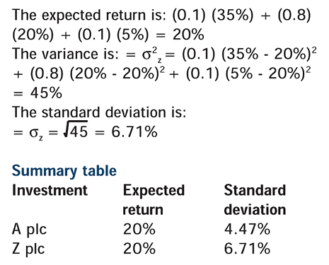

## Table of Contents

## What is expected return and how is it calculated?

Expected return is a way to guess how much money you might make from an investment. It's like trying to predict the future, but with numbers. You look at all the possible outcomes of your investment and figure out how likely each one is. Then, you mix these possibilities together to come up with one number that shows what you might earn on average.

To calculate the expected return, you need to know the possible returns and the chance of each return happening. For example, if you have a stock that could go up by 10% with a 50% chance, or go down by 5% with a 50% chance, you would do some math. You multiply each possible return by its chance of happening, then add those numbers together. So, (10% x 0.5) + (-5% x 0.5) equals 2.5%. That means your expected return is 2.5%.

## What is standard deviation in the context of finance?

Standard deviation in finance is a way to measure how much the returns of an investment can vary from what you expect them to be. Imagine you have an investment that usually gives you a 5% return. But sometimes it might give you 10%, and other times it might give you 0%. Standard deviation tells you how spread out these returns are around that average 5% return. If the standard deviation is small, it means the returns are pretty consistent and don't change much. If it's large, the returns can be all over the place.

To calculate standard deviation, you first find the difference between each actual return and the average return. Then, you square those differences, add them up, and divide by the number of returns to get the variance. Finally, you take the square root of the variance to get the standard deviation. In finance, a higher standard deviation means the investment is riskier because its returns are less predictable. This helps investors understand the risk they're taking on when they choose an investment.

## Why are expected return and standard deviation important in investment analysis?

Expected return and standard deviation are key tools in investment analysis because they help investors understand what they might gain and how risky an investment is. Expected return gives you a guess about how much money you might make from an investment. It's like a prediction based on all the possible outcomes and their chances of happening. This helps investors compare different investments and decide which one might give them the best return for their money.

Standard deviation, on the other hand, tells you how much the returns of an investment can vary from what you expect. It's a measure of risk. If an investment has a high standard deviation, it means the returns can be all over the place, which makes it riskier. If the standard deviation is low, the returns are more predictable and the investment is less risky. By looking at both expected return and standard deviation, investors can make smarter choices about where to put their money, balancing the potential rewards against the risks.

## How do you interpret the relationship between expected return and standard deviation?

The relationship between expected return and standard deviation is all about balancing reward and risk. Expected return tells you how much money you might make from an investment, while standard deviation shows you how much those returns could vary. Think of it like this: if you want to earn more money, you might have to take on more risk. Investments with higher expected returns usually have a higher standard deviation, meaning their returns can swing more wildly.

This relationship helps investors make choices. If you're okay with taking bigger risks, you might go for an investment with a high expected return and a high standard deviation. But if you want to play it safe, you might pick an investment with a lower expected return and a lower standard deviation. It's all about finding the right balance between what you want to earn and how much risk you're willing to take.

## What is the risk-return tradeoff and how does it relate to expected return and standard deviation?

The risk-return tradeoff is a basic idea in investing that says if you want to make more money, you have to be okay with taking more risk. It's like a seesaw: when one side goes up (more return), the other side goes up too (more risk). This tradeoff is important because it helps investors decide which investments are right for them. If you're someone who doesn't like surprises and wants to keep your money safe, you'll pick investments with lower risk and lower expected returns. But if you're okay with the chance of losing some money because you want to earn a lot, you'll go for investments with higher risk and higher expected returns.

Expected return and standard deviation are the tools that help you see this tradeoff clearly. Expected return is your best guess about how much money you'll make from an investment. It's like looking into a crystal ball and seeing all the possible outcomes. Standard deviation, on the other hand, tells you how much those returns can change. If an investment has a high standard deviation, it means the returns can be all over the place, which makes it riskier. By looking at both the expected return and the standard deviation, you can understand the risk-return tradeoff for any investment. This helps you make smarter choices about where to put your money, based on how much risk you're willing to take and how much return you want.

## Can you explain the concept of the efficient frontier using expected return and standard deviation?

The efficient frontier is a way to help investors pick the best investments by looking at expected return and standard deviation. Imagine you have a bunch of different investments, and each one has its own expected return and standard deviation. The efficient frontier is like a line that shows the best possible combinations of these investments. It's the line where, for any level of risk (standard deviation), you get the highest possible return (expected return). Any investment that falls on this line is considered efficient because it gives you the best return for the risk you're taking.

Think of the efficient frontier as a guide to help you make smart choices. If an investment is below the efficient frontier line, it means you could get a better return for the same level of risk by [picking](/wiki/asset-class-picking) an investment on the line. If an investment is above the line, it's not possible because it would mean getting a higher return with less risk, which is too good to be true. By using the efficient frontier, investors can see which investments are worth considering and which ones to avoid, helping them balance the risk-return tradeoff in the best way possible.

## How does diversification impact expected return and standard deviation?

Diversification means spreading your money across different investments instead of putting it all in one place. When you diversify, you mix investments that don't all go up and down at the same time. This can help lower the overall risk of your portfolio, which is shown by a lower standard deviation. Imagine you have two stocks: one goes up when the other goes down. By owning both, the ups and downs can balance each other out, making your total returns less bumpy. So, diversification can reduce the standard deviation of your portfolio without necessarily lowering the expected return.

However, diversification doesn't always mean you'll get a higher expected return. The expected return of your portfolio is usually a mix of the expected returns of all the investments you own. If you add more investments with lower expected returns, your overall expected return might go down a bit. But the big benefit is that you can still keep a good expected return while making your portfolio less risky. So, diversification is like a safety net that helps you manage risk better, making your investment journey smoother and more predictable.

## What are the limitations of using expected return and standard deviation for investment decisions?

Using expected return and standard deviation to make investment decisions has some limits. One big problem is that these numbers are based on guesses about the future. They use past data to predict what might happen, but the future can be different. For example, if a stock did well last year, it doesn't mean it will do well next year. Also, expected return and standard deviation don't tell you everything about an investment. They don't show you other risks like changes in the economy, new laws, or company problems that can affect your money.

Another limit is that standard deviation only measures how much returns can change, but it doesn't tell you if those changes are good or bad. It treats big gains and big losses the same way. This can make some investments look riskier than they really are if they have a chance for big wins. Also, these numbers don't consider how different investments might affect each other. If you own a bunch of stocks that all go up and down together, your portfolio might still be risky even if each stock looks safe on its own. So, while expected return and standard deviation are helpful, they don't give you the whole picture.

## How do different asset classes typically compare in terms of expected return and standard deviation?

Different asset classes like stocks, bonds, and cash have different levels of expected return and standard deviation. Stocks usually have the highest expected returns but also come with the highest standard deviation, meaning they can be pretty risky. If you invest in stocks, you might see big gains, but you could also lose a lot of money. On the other hand, bonds have lower expected returns than stocks but also have a lower standard deviation, making them less risky. They're like a middle ground where you don't make as much money, but your returns are more predictable. Cash, like money in a savings account, has the lowest expected return and the lowest standard deviation. It's very safe, but you won't see much growth in your money.

When you look at these asset classes, you can see the risk-return tradeoff in action. Stocks might be the best choice if you're okay with taking risks and want to grow your money a lot. They can be a roller coaster, but the potential rewards are high. Bonds are good if you want to play it safer and still get some growth, but not as much as stocks. They're more like a steady ride. And if you want to keep your money safe and don't care about big returns, cash is the way to go. It's like parking your money in a safe spot, but it won't take you very far.

## What advanced statistical measures can complement expected return and standard deviation in portfolio analysis?

In addition to expected return and standard deviation, there are other advanced statistical measures that can help you understand your investments better. One of these is the Sharpe Ratio. It tells you how much extra return you're getting for the risk you're taking. If you have two investments with the same expected return, the one with the higher Sharpe Ratio is better because it gives you more return for the same amount of risk. Another useful measure is the Sortino Ratio, which is similar to the Sharpe Ratio but only looks at the bad risk, or the risk of losing money. This can be helpful if you're more worried about losing money than about the ups and downs of your investment.

Another important measure is beta, which shows how much an investment moves with the overall market. If a stock has a beta of 1, it moves the same way as the market. If it's more than 1, it moves more than the market, which means it's riskier. If it's less than 1, it moves less than the market, which means it's safer. Value at Risk (VaR) is another measure that can be useful. It tells you the most money you could lose in a bad situation, like a market crash. It's like a warning sign that helps you understand the worst-case scenario. These measures can give you a fuller picture of your investments and help you make smarter choices.

## How can one use historical data to estimate expected return and standard deviation, and what are the pitfalls of this approach?

You can use historical data to estimate expected return and standard deviation by looking at how an investment did in the past. For expected return, you add up all the returns you've seen over time and divide by the number of years to get an average. For standard deviation, you figure out how much each year's return was different from the average, square those differences, add them up, divide by the number of years, and then take the square root. This gives you a number that shows how much the returns can change from year to year. By doing this, you get a guess about how an investment might do in the future based on what happened before.

But there are some problems with using historical data this way. The biggest one is that the past doesn't always tell you what will happen in the future. Things like the economy, new laws, and world events can change how investments do, and these things can be hard to predict. Also, if you don't have enough historical data, your estimates might not be very accurate. Another issue is that historical data can be affected by rare events, like a big market crash, which might not happen again soon but can make your numbers look scarier than they need to be. So, while looking at historical data can help, it's important to remember that it's just a guess and things can turn out differently.

## What role do modern portfolio theory and the Capital Asset Pricing Model play in the analysis of expected return and standard deviation?

Modern Portfolio Theory (MPT) helps investors make their money grow while keeping it safe. It does this by looking at expected return and standard deviation together. MPT says that by mixing different investments in a smart way, you can lower the risk (standard deviation) of your whole portfolio without losing out on the expected return. It's like putting different ingredients into a recipe to make it taste better and be healthier at the same time. MPT uses a special line called the efficient frontier to show which mixes of investments are the best. If your portfolio is on this line, it means you're getting the highest possible return for the amount of risk you're taking. This helps investors pick the right mix of investments to meet their goals.

The Capital Asset Pricing Model (CAPM) is another tool that helps with expected return and standard deviation. CAPM looks at how much risk an investment has compared to the whole market. It uses something called beta to measure this risk. If an investment has a high beta, it means it's riskier than the market, and if it has a low beta, it's safer. CAPM helps you figure out what kind of return you should expect from an investment based on its risk. It says that you should get a higher return if you're taking on more risk. By using CAPM, investors can see if an investment is worth the risk or if they should look for something else. Together, MPT and CAPM give investors powerful ways to understand and manage the balance between expected return and standard deviation.

## What is the understanding of expected return in algorithmic trading?

Expected return is a fundamental measure in finance, especially within the context of algorithmic trading, where precision and data-driven strategies are paramount. It represents the mean value of all potential outcomes of an investment based on a set of probabilities. Understanding and calculating expected return enables traders to anticipate the potential profitability of their trades, allowing for better strategy design and execution.

### Calculation of Expected Return

Mathematically, expected return ($E(R)$) is calculated as the weighted average of all possible returns, where each possible return ($R_i$) is multiplied by its probability ($P_i$):

$$

E(R) = \sum_{i=1}^{n} P_i \times R_i 
$$

In this formula:
- $P_i$ is the probability of each outcome.
- $R_i$ is the return associated with each outcome.
- $n$ is the total number of possible outcomes.

### Application in Algorithmic Trading

In [algorithmic trading](/wiki/algorithmic-trading), expected return calculations are used to refine trading strategies by examining the potential success of trades through comprehensive algorithms. These algorithms assimilate vast datasets, considering various market scenarios and possible outcomes to calculate a statistically informed projection of returns. This approach is pivotal in optimizing portfolio performance and minimizing risk.

For instance, traders might use historical price data and current market indicators in a Python algorithm to project expected returns. Consider a simplified scenario:

```python
# Example Python code for Expected Return calculation
probability_distribution = [0.2, 0.5, 0.3]  # Example probabilities
possible_returns = [0.05, 0.10, -0.02]       # Example returns

expected_return = sum(p * r for p, r in zip(probability_distribution, possible_returns))
print(f"Expected Return: {expected_return:.2%}")
```

This code snippet calculates the expected return based on defined probabilities and possible returns. Algorithmic trading platforms enhance this basic concept by applying complex models and large data analyses to achieve more precise estimations.

Algorithmic trading systems are continually refined using the data processing capabilities of modern computers to adjust to new information rapidly. Thus, expected return is not only a static calculation but a dynamic figure constantly updated to reflect the ongoing changes in financial markets. This dynamic optimization allows traders to quickly adapt to emerging trends and improve their trading performance over time.

By incorporating expected return into their strategic framework, traders are better equipped to maximize potential profits while balancing associated risks.

## How can risk be calculated using standard deviation?

Standard deviation is a statistical measure that quantifies the amount of variation or [dispersion](/wiki/dispersion-trading) of a set of values. In the context of investments, it is used to assess the [volatility](/wiki/volatility-trading-strategies) of investment returns, providing investors with insights into the risk associated with their portfolios. The formula for calculating standard deviation ($\sigma$) of a series of returns is as follows:

$$
\sigma = \sqrt{\frac{\sum_{i=1}^{N} (R_i - \bar{R})^2}{N-1}}
$$

where:
- $R_i$ is the return for each period,
- $\bar{R}$ is the average return over all periods,
- $N$ is the number of periods.

The standard deviation serves as a critical measure of risk. A higher standard deviation indicates greater volatility and uncertainty about future returns, whereas a lower standard deviation denotes stability. By analyzing the variability of returns, traders can gauge the level of risk they are exposed to and make informed decisions about how much risk is acceptable when targeting higher returns.

**Example for Practical Application**

Consider an investment portfolio with annual returns over four years: 5%, 10%, 15%, and 20%. We can calculate the standard deviation of the returns to understand the volatility. Here's an illustrative Python code to compute the standard deviation:

```python
import numpy as np

# Returns over four years
returns = np.array([5, 10, 15, 20])

# Calculate the average return
average_return = np.mean(returns)

# Calculate the standard deviation
standard_deviation = np.std(returns, ddof=1)

print(f"Average Return: {average_return}%")
print(f"Standard Deviation: {standard_deviation:.2f}%")
```

In this example, the calculated standard deviation will provide insight into the fluctuations in the returns of the portfolio. A substantial deviation from the mean return signals higher volatility and risk.

**Importance in Portfolio Management**

In portfolio management, standard deviation is used alongside expected returns to manage and optimize portfolios effectively. It helps in identifying the risk of individual investments and assessing their contribution to the portfolio's overall volatility. A common strategy involves blending assets with varying levels of volatility in dimensions that align with an investor's risk tolerance. Additionally, standard deviation is employed to compare the risk levels of different portfolios or investment strategies, facilitating more comprehensive risk assessment and management. By integrating standard deviation into risk management practices, investment managers can better forecast potential downsides and devise strategies to mitigate them.

## How can one balance risk and return in portfolio management?

In algorithmic trading, achieving a harmonious balance between risk and return is a central objective of portfolio management. Investors rely on the complementary use of expected return and standard deviation to craft investment strategies that are both profitable and stable.

Expected return offers a forecast of the potential gains from an investment, providing a target for profitability. On the other side, standard deviation serves as a measure of risk by quantifying the volatility of returns around the expected value. The combination of these metrics helps in identifying the risk-return profiles of different trades, allowing investors to make more informed decisions.

One key strategy is diversification, where a portfolio is constructed with a variety of assets to reduce risk. By spreading investments across uncorrelated or negatively correlated assets, investors lower the total risk through the diversification effect. Mathematically, this is expressed by the formula for the portfolio standard deviation:

$$
\sigma_p = \sqrt{\sum_{i=1}^{N}\sum_{j=1}^{N} w_i w_j \sigma_i \sigma_j \rho_{i,j}}
$$

Where:
- $\sigma_p$ is the portfolio standard deviation,
- $w_i$ and $w_j$ are the weights of assets $i$ and $j$ in the portfolio,
- $\sigma_i$ and $\sigma_j$ are the standard deviations of assets $i$ and $j$,
- $\rho_{i,j}$ is the correlation coefficient between the returns of assets $i$ and $j$.

Effective risk assessment is another vital component. Algorithms are designed to estimate potential risks by analyzing historical data and simulating potential future conditions using Monte Carlo simulations or other predictive models. This risk assessment allows for dynamic adjustment of portfolios to maintain the targeted risk-return balance.

Performance benchmarking is also integral to portfolio management. By comparing the returns and volatility of a portfolio against market indices or peer benchmarks, investors can evaluate the effectiveness of their strategies. This helps in identifying areas for improvement or rebalancing. Python can be used to automate these processes efficiently. For example:

```python
import pandas as pd
import numpy as np

# Example data: Adjust with actual returns data
returns = pd.DataFrame({
    'Asset1': np.random.normal(0.05, 0.1, 100),
    'Asset2': np.random.normal(0.02, 0.08, 100),
})

# Calculating expected return and standard deviation
expected_returns = returns.mean()
std_devs = returns.std()

# Covariance matrix
cov_matrix = returns.cov()

# Portfolio variance
weights = np.array([0.5, 0.5])  # Adjust weights
port_variance = np.dot(weights.T, np.dot(cov_matrix, weights))
port_std_dev = np.sqrt(port_variance)

print("Expected Returns:", expected_returns)
print("Portfolio Standard Deviation:", port_std_dev)
```

By applying these principles and leveraging modern computational tools, algorithmic trading enables the construction of portfolios that aim to achieve maximum expected returns while keeping risks in check. This holistic approach to portfolio management is crucial for adapting to the ever-evolving dynamics of financial markets.

## References & Further Reading

[1]: Bergstra, J., Bardenet, R., Bengio, Y., & Kégl, B. (2011). ["Algorithms for Hyper-Parameter Optimization."](https://dl.acm.org/doi/10.5555/2986459.2986743) Advances in Neural Information Processing Systems 24.

[2]: ["Advances in Financial Machine Learning"](https://www.amazon.com/Advances-Financial-Machine-Learning-Marcos/dp/1119482089) by Marcos Lopez de Prado

[3]: ["Evidence-Based Technical Analysis: Applying the Scientific Method and Statistical Inference to Trading Signals"](https://www.amazon.com/Evidence-Based-Technical-Analysis-Scientific-Statistical/dp/0470008741) by David Aronson

[4]: ["Machine Learning for Algorithmic Trading"](https://github.com/stefan-jansen/machine-learning-for-trading) by Stefan Jansen

[5]: ["Quantitative Trading: How to Build Your Own Algorithmic Trading Business"](https://www.amazon.com/Quantitative-Trading-Build-Algorithmic-Business/dp/1119800064) by Ernest P. Chan