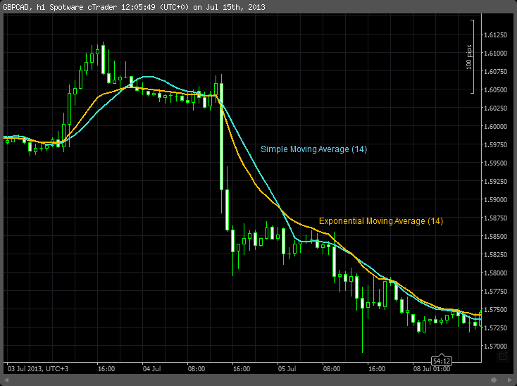

In trading, moving averages are essential tools used by traders to analyze price trends and forecast future price movements. They are used to smooth out price data over a specific period, helping to filter out the noise and provide a clearer view of market trends. Among the various types of moving averages, the Simple Moving Average (SMA) and the Exponential Moving Average (EMA) are the most commonly used.

The Simple Moving Average is calculated by taking the arithmetic mean of a given set of prices over a specified number of periods. Its primary advantage is its simplicity, making it easy to compute and interpret. However, SMA can sometimes be slow to respond to rapid market changes as it gives equal weight to all data points in the period.



The Exponential Moving Average, on the other hand, gives more weight to recent prices, making it more sensitive to new information. This responsiveness can prove beneficial in dynamic markets where traders need to react quickly to price changes. The EMA is calculated using a formula that applies a weight factor to the most recent price data, thus making it more effective in capturing short-term movements.

In algorithmic trading, moving averages play a pivotal role as they form the backbone of numerous algorithms. By using these indicators, traders can create algorithms that automate entry and exit strategies based on market conditions. Understanding the nuances between SMA and EMA is crucial for traders as it allows them to tailor their strategies according to market volatility and potential price reversals.

This article will explore the basic principles of moving averages, delve into the details of SMA and EMA, and discuss how traders can leverage these tools within algorithmic trading strategies. Additionally, it will address the challenges faced when working with moving averages and provide practical advice for traders aiming to optimize their strategies. Overall, mastering these concepts is a crucial step for traders seeking to enhance their decision-making and improve their trading performance.

## Table of Contents

## Understanding Moving Averages

Moving averages are fundamental tools in trading analysis, primarily used to smooth out price data and reduce market noise. By averaging out past prices over a specific period, moving averages create a single line that represents the trend direction, helping traders identify potential buy and sell signals. 

**Definition and Function**

A moving average is a statistical calculation used to analyze data points by creating a series of averages of different subsets of the entire data set. In trading, moving averages help traders assess the overall market direction by smoothing short-term fluctuations in price data. This smoothing process makes it easier to observe underlying trends without being distracted by short-term market [volatility](/wiki/volatility-trading-strategies).

**Smoothing Price Data and Reducing Noise**

By smoothing price data, moving averages make it simpler for traders to gauge potential trend reversals or continuations. The calculation mitigates the impact of random price spikes and short-lived volatility, providing a clearer picture of the market's longer-term direction. For instance, a trader looking at a stock with erratic price movements might struggle to identify a trend. A moving average aids this process by condensing the data into a smoother line, thus making trend analysis more manageable.

**Types of Moving Averages**

There are several types of moving averages, each with its unique characteristics and applications:

1. **Simple Moving Average (SMA):** The SMA is the most basic form of moving average, calculated by summing up recent closing prices and dividing by the number of periods. For example, a 10-day SMA adds the closing prices of the last 10 days and divides by 10.

    Formula: 
$$
    \text{SMA} = \frac{\sum_{i=1}^{N} \text{Price}_i}{N}

$$
    where $N$ is the number of periods.

2. **Exponential Moving Average (EMA):** Unlike the SMA, the EMA applies more weight to recent prices, making it more responsive to new information. The EMA is calculated using a multiplier that smooths the data, providing a quicker reaction to market movements.

    Python code for EMA:
    ```python
    def calculate_ema(prices, period):
        ema = [sum(prices[:period]) / period]
        multiplier = 2 / (period + 1)
        for price in prices[period:]:
            ema.append((price - ema[-1]) * multiplier + ema[-1])
        return ema
    ```

3. **Weighted Moving Average (WMA):** The WMA assigns different weights to data points, giving more importance to recent prices. This type emphasizes recent price movements more than the SMA but less than the EMA.

**Mathematical Foundation**

The mathematical foundation of moving averages involves statistical and algebraic concepts designed to smooth out the volatility of data. By focusing on averages, these tools filter out the 'noise' of short-term fluctuations. The formulas for calculating each type of moving average differ primarily in their weighting of past prices. The SMA treats each price equally, while the EMA and WMA apply different weightings, leading to more sensitivity to recent changes.

**Historical Context and Evolution**

Moving averages have evolved significantly since their introduction into trading, with origins tracing as far back as the early 20th century. Initially used for basic trend analysis, their application has grown considerably, especially with the advent of computational technology. Over time, moving averages have become integral components of many trading strategies, from basic trend-following systems to complex [algorithmic trading](/wiki/algorithmic-trading) models. Their enduring popularity underscores their utility in simplifying price data analysis and aiding traders in making informed decisions based on historical price movements.

## Simple Moving Average (SMA)

The Simple Moving Average (SMA) is one of the most fundamental tools used in trading analysis. It represents an average of a security's closing price over a specified number of periods, calculated by summing the closing prices and dividing by the number of periods. Mathematically, the formula for SMA is:

$$

SMA = \frac{P_1 + P_2 + ... + P_n}{n} 
$$

where $P_1, P_2, ..., P_n$ are the closing prices and $n$ is the number of periods.

### Advantages and Limitations of SMA in Trading

The SMA is an essential tool for traders because it helps to smooth out price data, providing a clearer view of price trends by reducing short-term fluctuations. Its simplicity makes it easy to calculate and understand, providing a straightforward approach to assessing market trends.

However, the SMA has certain limitations. It is slower to respond to price changes compared to the Exponential Moving Average (EMA), which can be a drawback in fast-moving markets. The lag in SMA makes it less responsive to recent price movements, potentially delaying the identification of a trend change.

### Effective Scenarios for SMA

The SMA is most effective in stable, trending markets, where it can confirm the direction of the trend. In such scenarios, traders use SMA to identify support and resistance levels. It serves as a useful tool for reinforcing signals generated by other technical indicators.

### Impact of Different Time Periods on SMA

The time period used to calculate an SMA significantly impacts its sensitivity to price changes. A short-term SMA, like a 10-day SMA, reacts more quickly to price movements and provides more immediate signals but can also generate false signals due to market noise. Conversely, a long-term SMA, such as a 100-day SMA, is more stable and reliable for identifying long-term trends but reacts more slowly.

### Real-world Examples and Charts

In practice, SMA can be used to identify buy and sell signals. For instance, when the price crosses above a moving average, it might signal a buying opportunity, indicating an upward trend. Conversely, when the price drops below an SMA, it could suggest a selling opportunity.

One common application is the use of dual or multiple SMAs to identify crossover strategies. For example, a typical method involves using a short-term SMA (e.g., 50-day) and a long-term SMA (e.g., 200-day). A "Golden Cross," where a short-term SMA crosses above a long-term SMA, signals potential upward [momentum](/wiki/momentum), while a "Death Cross" indicates the opposite.

Below is a simple Python code to plot SMA using historical stock data:

```python
import pandas as pd
import matplotlib.pyplot as plt

# Sample data: Generate using random stock data for illustration purposes
data = {'Date': pd.date_range(start='1/1/2020', periods=200, freq='D'),
        'Close': pd.Series(range(200)) + pd.Series(np.random.randn(200) * 10)}

# Convert to DataFrame
df = pd.DataFrame(data).set_index('Date')

# Calculate SMAs
df['SMA_50'] = df['Close'].rolling(window=50).mean()
df['SMA_200'] = df['Close'].rolling(window=200).mean()

# Plot data
plt.figure(figsize=(14, 7))
plt.plot(df['Close'], label='Close Price')
plt.plot(df['SMA_50'], label='50-day SMA', alpha=0.7)
plt.plot(df['SMA_200'], label='200-day SMA', alpha=0.7)
plt.title('Simple Moving Average')
plt.xlabel('Date')
plt.ylabel('Price')
plt.legend()
plt.show()
```

This code visualizes how different SMAs overlay on price data, assisting traders in making informed decisions based on historical price trends. By adjusting the SMA periods according to their trading strategy and market conditions, traders can optimize the effectiveness of SMA in their analysis.

## Exponential Moving Average (EMA)

The Exponential Moving Average (EMA) is a type of moving average that places a greater weight and significance on the most recent data points. This makes the EMA more responsive to new information compared to a Simple Moving Average (SMA), which treats all data points equally. The formula for calculating an EMA involves using a multiplier that provides more emphasis on recent prices:

$$
\text{EMA}_t = \left( \frac{2}{n + 1} \right) \times (\text{Price}_t - \text{EMA}_{t-1}) + \text{EMA}_{t-1}
$$

Where:
- $\text{EMA}_t$ is the EMA at the current time period.
- $\text{Price}_t$ is the current closing price.
- $\text{EMA}_{t-1}$ is the EMA calculated for the previous period.
- $n$ is the number of periods over which the EMA is calculated.

### Comparison with SMA

The main distinction between EMA and SMA lies in how they weight data points. While the SMA assigns equal importance to all prices in the selected time frame, the EMA gives more prominence to recent prices, which makes it more sensitive to new data. This responsiveness of the EMA can be beneficial in volatile markets where quick adjustments to a moving average are desirable.

### Responding to Recent Price Changes

The EMA's sensitivity to recent price changes makes it particularly useful for traders looking to identify trends more swiftly. In rapidly changing markets, the EMA is preferred because it reacts more quickly to price movements than the SMA. This can help traders make decisions sooner during sudden market shifts, thus potentially increasing profitability.

### Benefits and Drawbacks

**Benefits of EMA:**
- **Responsive to Market Changes:** The EMA's ability to adapt quickly to market changes allows traders to make timely decisions.
- **Trend Identification:** It can more effectively identify short-term trends than the SMA, which is useful for day traders or those engaged in swing trading.

**Drawbacks of EMA:**
- **Potential for Noise:** The same sensitivity that makes the EMA responsive to price changes can also lead to overreaction to short-term price fluctuations, resulting in false signals.
- **Less Reliable in Stable Markets:** In more stable, less volatile markets, the responsiveness of the EMA might lead to unnecessary trades due to false trend signals.

### Graphical Representation

Graphically, an EMA would appear similar to an SMA, although more fluid and responsive to recent changes. For instance, in a chart depicting both an SMA and an EMA for the same dataset, the EMA line will more closely follow the ups and downs of the market prices, whereas the SMA will appear smoother and less reactive to recent data shifts.

Here is a simple Python example to calculate and plot an EMA:

```python
import pandas as pd
import matplotlib.pyplot as plt

# Sample data: closing prices
data = {'Price': [22, 24, 23, 24, 26, 28, 27, 29, 28, 30]}
df = pd.DataFrame(data)

# Calculate EMA
df['EMA'] = df['Price'].ewm(span=5, adjust=False).mean()

# Plot
plt.plot(df['Price'], label='Price')
plt.plot(df['EMA'], label='EMA', linestyle='--')
plt.legend()
plt.title('Exponential Moving Average (EMA)')
plt.xlabel('Days')
plt.ylabel('Price')
plt.show()
```

This example visualizes how the EMA follows the trend more closely than an SMA would, demonstrating its sensitivity to price changes. Understanding EMAs is crucial for traders looking to improve their analysis and trading strategies, adapting to various market conditions with precision.

## Algorithmic Trading and Moving Averages

Algorithmic trading refers to the use of computer algorithms to execute trading orders based on predefined criteria, such as timing, price, or quantity. This approach relies heavily on technical indicators to make informed trading decisions. Among these indicators, moving averages, such as the Simple Moving Average (SMA) and Exponential Moving Average (EMA), play a critical role due to their ability to smooth price data and identify trends.

Moving averages are integrated into trading algorithms to generate signals for buying or selling securities. For instance, a common strategy involves the "moving average crossover," where a shorter-period moving average crossing above a longer-period moving average generates a buy signal, and vice versa for a sell signal. The SMA and EMA are employed in these strategies to ensure the algorithm adapts to both slow and rapid market changes. 

In algorithmic trading, various strategies utilize moving averages. For example, the "Golden Cross" strategy involves a short-term SMA crossing above a long-term SMA, signaling a potential bull market. Conversely, the "Death Cross" indicates a bear market when a short-term SMA crosses below a long-term SMA. Similarly, the EMA's sensitivity to recent price changes makes it suitable for strategies aiming to capitalize on emerging trends more swiftly than those relying solely on SMA.

Backtesting and optimization are crucial components of developing MA-based strategies in algorithmic trading. Backtesting involves running the trading strategy on historical data to evaluate its effectiveness, while optimization adjusts the strategy parameters to improve performance. Despite the simplicity of moving averages, [backtesting](/wiki/backtesting) ensures that the chosen periods for SMA and EMA align with historical market conditions, thereby enhancing strategy robustness.

Several popular algorithms employ moving averages as part of their trading logic. The Moving Average Convergence Divergence (MACD) is a widely used technical indicator that calculates the difference between two EMAs and signals potential buy or sell conditions. Another example is the Triple Moving Average Crossover, integrating three different periods to provide clearer trading signals by confirming trends over varying time frames.

In conclusion, understanding the integration of moving averages in algorithmic trading is essential for traders seeking to leverage technical indicators effectively. By adopting well-tested strategies and conducting rigorous backtesting, traders can optimize the use of SMA and EMA within algorithmic frameworks to navigate the complexities of financial markets.

## Combining SMA and EMA for Effective Trading

The Simple Moving Average (SMA) and Exponential Moving Average (EMA) are powerful tools in the arsenal of traders, each with its strengths and weaknesses. When combined, they can offer a balanced view of market trends, facilitating more informed decision-making. The SMA provides a straightforward calculation by averaging a set number of past price points, offering a smoothed line that is less reactive to sudden price changes. On the other hand, the EMA gives more weight to recent prices, allowing it to respond more swiftly to market dynamics.

By leveraging both SMA and EMA, traders can create strategies that are robust and adaptable. A common strategy is to use a dual moving average crossover system, where one could deploy, for example, a 50-day SMA and a 20-day EMA. The SMA identifies the general trend, acting as a slower signal, while the EMA delivers quicker reactions to recent changes. A trading signal might be generated when the faster EMA crosses above the slower SMA, indicating a potential buy, or conversely, a sell when the EMA crosses below the SMA.

Adapting these strategies to current market conditions is crucial. During volatile periods, reliance on the EMA might be more advantageous due to its sensitivity to recent price movements, capturing swift trend changes. In contrast, in a stable market, the SMA's smoothing effect can help maintain focus on the overarching trend without being distracted by short-term fluctuations.

Consider a hypothetical scenario where a trader implements a dual moving average strategy on a particular stock. During a period of market consolidation, the EMA may oscillate around the SMA without providing much reliable signal. However, when a distinct trend emerges, the trader notices the EMA sharply diverging from the SMA, triggering a successful trade execution. This approach underscores the necessity of flexibility and the importance of tailoring strategies to reflect current market dynamics.

To optimize such combined strategies, several practical tips can be employed:
1. Regularly backtest strategies using historical data to understand how different SMA and EMA periods respond to various market conditions.
2. Use risk management tools such as stop-loss orders to mitigate potential losses from false signals.
3. Continuously monitor market news and events that could impact price movements, adjusting the strategy parameters accordingly.
4. Employ technology for algorithmic execution, ensuring precise and timely trade actions based on defined crossover criteria.

By understanding and applying a composite approach using both SMA and EMA, traders can enhance their ability to navigate different market environments efficiently. This combination allows for a nuanced perspective on price trends, reducing susceptibility to noise and improving the overall trading strategy.

## Challenges and Considerations

When employing moving averages in trading, various challenges may arise that necessitate careful consideration. One primary concern is the impact of market volatility on moving average strategies. Moving averages, by design, smooth out price data to identify trends. However, during periods of high volatility, these averages can generate misleading signals. For instance, a sudden price spike can cause a moving average to adjust in a manner that suggests a trend reversal that may not actually occur. This can lead traders into making premature trading decisions based on false signals. To mitigate this, traders often use additional indicators or shorter timeframes to increase the responsiveness of their moving averages during volatile periods.

Psychological biases present another challenge. Traders often have cognitive biases, such as confirmation bias and overconfidence, which can affect their interpretation of moving average signals. For example, a trader might selectively focus on signals that confirm their existing beliefs about market direction while ignoring contrary evidence, thus skewing their decision-making process. Awareness and management of these biases are crucial for effective trading. Practicing disciplined trading strategies and maintaining a neutral mindset can help reduce the influence of such biases.

Effective risk management strategies play a vital role in addressing the potential pitfalls associated with moving averages. Utilizing stop-loss orders and adhering to risk-reward ratios can buffer against erroneous signals and potential market losses. For example, employing a trailing stop-loss can protect profits and limit losses when market conditions change rapidly. Diversification of strategies and the use of non-correlated trading approaches can also offer protection against the limitations of relying solely on moving averages.

Continuous learning and adaptation are essential for success in trading with moving averages. As market dynamics evolve, it is imperative for traders to update their strategies and toolsets. This might involve recalibrating moving average parameters, incorporating additional technical indicators, or developing hybrid strategies to better capture market conditions. Engaging with trading communities, attending seminars, and keeping abreast of financial literature can equip traders with new insights and techniques.

In summary, while moving averages are powerful tools, understanding their limitations and integrating them into a broader, well-informed trading strategy is crucial. By acknowledging the challenges of volatility and psychological biases, implementing sound risk management practices, and continuously adapting, traders can enhance their effectiveness in utilizing moving averages.

## Conclusion

Throughout this article, we have explored the pivotal role that moving averages play in the world of trading. We have delved into the mechanics and applications of Simple Moving Averages (SMA) and Exponential Moving Averages (EMA), highlighting their fundamental differences as well as their respective advantages and limitations. These tools, essential for smoothing price data and identifying trends, serve as critical indicators within the field of algorithmic trading.

Mastering moving averages is not merely advantageous but essential for traders seeking to enhance their decision-making framework. Understanding both the theoretical and practical nuances of SMA and EMA allows traders to tailor their strategies to varying market conditions, maximizing their effectiveness.

The integration of moving averages into algorithmic trading underscores their utility, as algorithms rely heavily on such technical indicators for data-driven decision-making. Strategies that adapt and optimize the use of these averages are capable of yielding significant returns, particularly when subjected to rigorous backtesting and optimization processes.

We encourage ongoing research and analysis to fully harness the potential of moving averages in trading. The complexity and dynamism of financial markets necessitate continuous learning and adaptation. Exploration of advanced topics, such as the integration of [machine learning](/wiki/machine-learning) with moving average strategies or the development of hybrid models blending multiple indicators, could offer further refinement and improved predictive capabilities.

For continued growth, traders are invited to engage with advanced materials, seek out additional resources, and participate in communities that foster knowledge sharing and innovation. As trading evolves, staying ahead of trends and technological advancements is paramount, and keeping a pulse on emerging techniques will ensure preparedness for future challenges.

This journey into moving averages marks just the beginning. We invite readers to further their exploration into the complexities and opportunities present in trading, embracing both foundational knowledge and cutting-edge research.

## References & Further Reading

[1]: Murphy, J. J. (1999). ["Technical Analysis of the Financial Markets: A Comprehensive Guide to Trading Methods and Applications."](https://archive.org/details/technicalanalysi0000murp) New York Institute of Finance.

[2]: Pring, M. J. (2002). ["Technical Analysis Explained: The Successful Investor's Guide to Spotting Investment Trends and Turning Points."](https://www.amazon.com/Technical-Analysis-Explained-Fifth-Successful/dp/0071825177) McGraw-Hill.

[3]: Wilder, J. W. (1978). ["New Concepts in Technical Trading Systems."](https://archive.org/details/newconceptsintec00wild) Trend Research.

[4]: Brock, W., Lakonishok, J., & LeBaron, B. (1992). ["Simple technical trading rules and the stochastic properties of stock returns."](https://www.jstor.org/stable/2328994) The Review of Financial Studies.

[5]: Achelis, S. B. (2000). ["Technical Analysis from A to Z."](https://www.mhebooklibrary.com/doi/book/10.1036/9780071380119) McGraw-Hill.