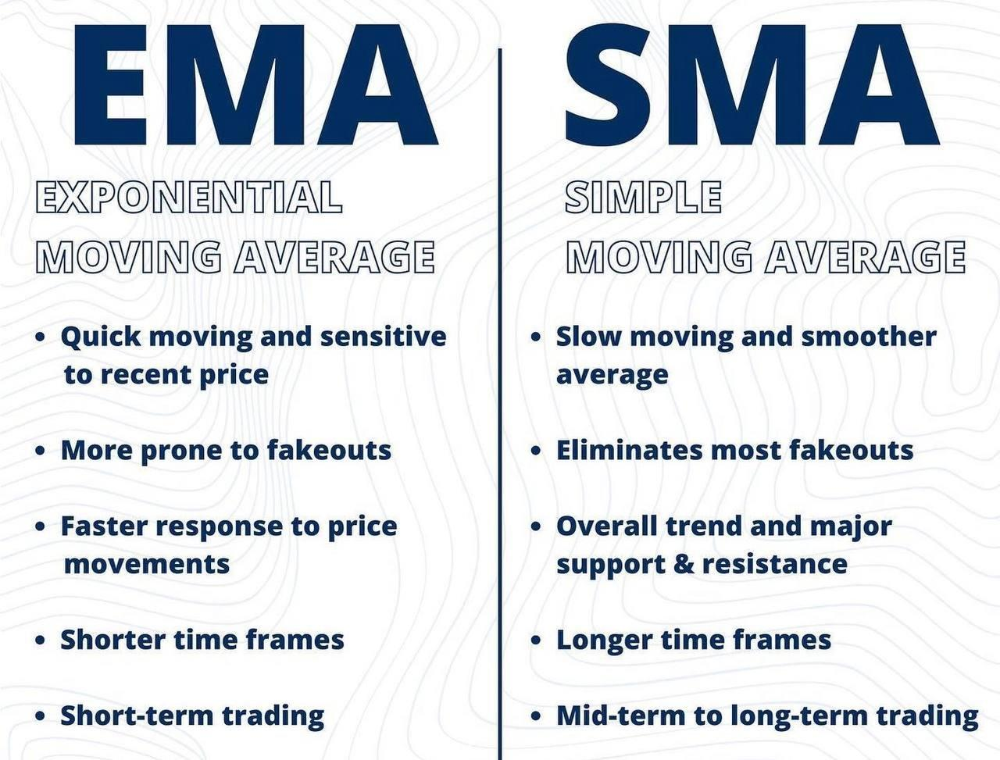

## Table of Contents

## What is a moving average?

A moving average is a way to smooth out data over time. It helps to see trends by taking the average of a set of numbers over a specific period. For example, if you want to find the 3-day moving average of a stock price, you would add up the prices for the last three days and then divide by three. This gives you a single number that represents the average price over those three days.

Moving averages are useful in many fields, like finance and weather forecasting. In finance, traders use moving averages to help them decide when to buy or sell stocks. They might look at a 50-day moving average to see the overall trend of a stock's price over the last 50 days. In weather forecasting, meteorologists might use moving averages to smooth out daily temperature readings to better predict future weather patterns. By using moving averages, people can make better decisions based on clearer trends in the data.

## What is an exponential moving average (EMA)?

An exponential moving average (EMA) is a type of moving average that gives more weight to recent data points. Unlike a simple moving average where each data point in the period is equally important, the EMA focuses more on what happened recently. This makes the EMA more responsive to new information, which can be helpful in fields like stock trading where recent trends are important.

To calculate an EMA, you start with a simple moving average for the first data point. After that, you use a formula that includes a multiplier to give more weight to the most recent data. The multiplier is based on the number of periods you are using for the EMA. For example, if you're using a 10-day EMA, the multiplier would be calculated as (2 / (10 + 1)). This way, the EMA can quickly adjust to changes in the data, making it useful for tracking trends that might be changing fast.

## What is a simple moving average (SMA)?

A simple moving average (SMA) is a way to smooth out data over time by taking an average of a set of numbers. It's called "simple" because it gives equal importance to all the numbers in the set. For example, if you want to find the 5-day SMA of a stock price, you add up the prices for the last five days and then divide by five. This gives you a single number that shows the average price over those five days.

SMAs are used in many areas, like finance and weather forecasting. In finance, traders use SMAs to see the overall trend of a stock's price over time. For instance, a 20-day SMA can help show if a stock's price is going up or down over the last 20 days. In weather forecasting, meteorologists might use a 7-day SMA to smooth out daily temperature readings and better predict future weather patterns. By using SMAs, people can make better decisions based on clearer trends in the data.

## How is an EMA calculated?

To calculate an exponential moving average (EMA), you start with a simple moving average (SMA) for the first data point. Let's say you want to find the 10-day EMA of a stock's price. First, you calculate the 10-day SMA by adding up the prices of the last 10 days and dividing by 10. This gives you the starting point for your EMA.

After that, you use a special formula to figure out the EMA for each new day. The formula is: EMA = (Closing price - Previous EMA) * Multiplier + Previous EMA. The multiplier is based on the number of days you're using for the EMA. For a 10-day EMA, the multiplier is 2 divided by (10 + 1), which is about 0.1818. So, if today's closing price is $50 and yesterday's EMA was $48, the new EMA would be ($50 - $48) * 0.1818 + $48, which comes out to about $48.36. This way, the EMA gives more weight to recent prices, making it quick to show changes in the data.

## How is an SMA calculated?

A simple moving average (SMA) is a way to smooth out data by taking an average over a certain period. To calculate it, you add up all the numbers in that period and then divide by how many numbers there are. For example, if you want the 5-day SMA of a stock's price, you add up the prices for the last five days and then divide by five. This gives you one number that shows the average price over those five days.

SMAs are used in many areas, like finance and weather forecasting. In finance, traders use SMAs to see if a stock's price is going up or down over time. For instance, a 20-day SMA can help show the trend of a stock's price over the last 20 days. In weather forecasting, meteorologists might use a 7-day SMA to smooth out daily temperature readings and better predict future weather patterns. By using SMAs, people can make better decisions based on clearer trends in the data.

## What are the key differences between EMA and SMA?

The main difference between an exponential moving average (EMA) and a simple moving average (SMA) is how they treat the data. An EMA gives more importance to recent data points. This means it can change quickly when the data changes. On the other hand, an SMA treats all data points the same. It takes the average of all numbers in the period, so it doesn't react as fast to new information.

Because of this, EMAs are often used when you want to see trends that are changing fast. For example, in stock trading, traders might use an EMA to decide when to buy or sell because it can show them recent changes in the stock's price. SMAs are more useful when you want a smoother view of the data over time. They're good for seeing long-term trends because they don't jump around as much as EMAs do.

## In what scenarios might an EMA be more useful than an SMA?

An EMA is more useful than an SMA when you need to see recent changes in data quickly. For example, in stock trading, traders often use EMAs because they want to know if a stock's price is going up or down right now. Since an EMA gives more weight to the newest prices, it can show these changes faster than an SMA. This helps traders make quick decisions about buying or selling stocks based on the latest trends.

Another scenario where an EMA might be more useful is in tracking fast-changing data in other fields, like monitoring real-time traffic flow or website analytics. If you're looking at how many people are visiting a website each day, an EMA can help you see if there's a sudden increase or decrease in traffic. This can be important for making quick adjustments to marketing strategies or website content. Because an EMA reacts faster to new data, it's better for these kinds of situations where you need to stay on top of current trends.

## In what scenarios might an SMA be more useful than an EMA?

An SMA is more useful than an EMA when you want to see a smooth, long-term trend in your data. For example, if you're looking at the average temperature over a month, an SMA will give you a clear picture of the overall trend without being affected too much by daily changes. This can be helpful for weather forecasts or climate studies where you want to see the bigger picture over time.

In finance, an SMA can be useful for investors who are not interested in short-term fluctuations but want to see how a stock's price is doing over a longer period. For instance, if you're looking at a 200-day SMA, it will show you the general direction of the stock's price without being swayed by recent ups and downs. This helps long-term investors make decisions based on steady trends rather than quick changes.

## How does the choice of period length affect the performance of EMA and SMA?

The length of the period you choose for an EMA or SMA can really change how they work. A shorter period, like a 10-day EMA or SMA, will follow the ups and downs of the data more closely. This means you'll see changes in the data faster. It's good if you want to know what's happening right now, like in stock trading where you might want to buy or sell quickly. But, shorter periods can also make the moving average jump around a lot, which can be confusing if you're looking for a clear trend.

On the other hand, a longer period, like a 200-day EMA or SMA, will smooth out the data a lot more. It won't show you the quick changes, but it will give you a better idea of the big picture over time. This is useful if you're not interested in the day-to-day changes but want to see the overall direction of the data. For example, if you're a long-term investor in stocks, a 200-day moving average can help you see if the stock's price is generally going up or down over many months.

## Can you provide a real-world example where EMA outperformed SMA?

Imagine you're a day trader looking at the stock price of a tech company. You want to buy the stock when it's going up and sell it when it starts to go down. You decide to use a 10-day moving average to help you make these decisions. If you use a simple moving average (SMA), it takes the average of the last 10 days' prices equally. But if you use an exponential moving average (EMA), it gives more importance to the most recent prices. One day, the stock price suddenly jumps up because of good news about the company. The EMA quickly shows this change, going up faster than the SMA. This helps you see the upward trend sooner, so you buy the stock right away and make a good profit when the price keeps going up.

In another example, let's say you're monitoring website traffic for an online store. You want to know if there's a sudden increase in visitors so you can adjust your marketing strategy. You start tracking the number of visitors each day and use a 7-day moving average to smooth out the data. If you use an SMA, it takes the average of the last 7 days' visitor numbers equally. But if you use an EMA, it gives more weight to the most recent days' numbers. One week, there's a big sale that brings a lot more visitors to your site. The EMA shows this spike in traffic much faster than the SMA. This lets you see the increase in visitors sooner, so you can quickly ramp up your marketing efforts to take advantage of the trend.

## Can you provide a real-world example where SMA outperformed EMA?

Imagine you're a long-term investor looking at the stock price of a big company. You want to see the overall trend of the stock over many months to decide whether to keep your investment or sell it. You decide to use a 200-day moving average to help you make this decision. If you use a simple moving average (SMA), it takes the average of the last 200 days' prices equally. But if you use an exponential moving average (EMA), it gives more importance to the most recent prices. Over time, the stock price has been slowly going up, but there have been some quick ups and downs along the way. The SMA shows this steady upward trend clearly because it smooths out the short-term changes. The EMA, on the other hand, jumps around a bit more because it reacts to the recent price changes. In this case, the SMA helps you see the big picture better, so you decide to keep your investment and benefit from the long-term growth.

In another example, think about a farmer who needs to plan for the next planting season based on average rainfall over the past year. The farmer uses a 365-day moving average to see the overall rainfall pattern. If the farmer uses an SMA, it takes the average of the last 365 days' rainfall equally. But if the farmer uses an EMA, it gives more weight to the most recent days' rainfall. Over the year, there were some heavy rainfalls in the last month, but the overall trend was still towards less rain than usual. The SMA shows this overall trend more clearly because it doesn't get swayed too much by the recent heavy rains. The EMA, however, shows a higher average because it reacts more to the recent heavy rainfalls. In this case, the SMA gives the farmer a better idea of the long-term trend, helping them plan for a drier season and choose crops that need less water.

## What advanced techniques can be used to optimize the use of EMA and SMA in trading strategies?

One way to make EMA and SMA better for trading is by using different time periods together. For example, you might use a short-term EMA, like a 10-day one, with a longer-term SMA, like a 50-day one. When the short-term EMA crosses above the long-term SMA, it could be a good time to buy because it shows that the price is going up fast. If the short-term EMA goes below the long-term SMA, it might be time to sell because the price could be going down. This is called a "crossover strategy," and it can help traders see when trends are starting or ending.

Another way to improve using EMA and SMA is by adding other tools to your trading plan. You could use something called the Relative Strength Index (RSI) to see if a stock is overbought or oversold. If the RSI shows a stock is overbought and the EMA crosses below the SMA, it might be a stronger sign to sell. Also, you can use something called stop-loss orders to limit your losses. If you buy a stock based on an EMA and SMA crossover, you can set a stop-loss order at a lower price to sell the stock automatically if it drops too much. This can help you manage risk better and make your trading strategy more solid.

## What is Understanding Moving Averages?

Moving averages are fundamental tools in trading analysis, primarily used to smooth out price data and reduce market noise. By averaging out past prices over a specific period, moving averages create a single line that represents the trend direction, helping traders identify potential buy and sell signals. 

**Definition and Function**

A moving average is a statistical calculation used to analyze data points by creating a series of averages of different subsets of the entire data set. In trading, moving averages help traders assess the overall market direction by smoothing short-term fluctuations in price data. This smoothing process makes it easier to observe underlying trends without being distracted by short-term market [volatility](/wiki/volatility-trading-strategies).

**Smoothing Price Data and Reducing Noise**

By smoothing price data, moving averages make it simpler for traders to gauge potential trend reversals or continuations. The calculation mitigates the impact of random price spikes and short-lived volatility, providing a clearer picture of the market's longer-term direction. For instance, a trader looking at a stock with erratic price movements might struggle to identify a trend. A moving average aids this process by condensing the data into a smoother line, thus making trend analysis more manageable.

**Types of Moving Averages**

There are several types of moving averages, each with its unique characteristics and applications:

1. **Simple Moving Average (SMA):** The SMA is the most basic form of moving average, calculated by summing up recent closing prices and dividing by the number of periods. For example, a 10-day SMA adds the closing prices of the last 10 days and divides by 10.

    Formula: 
$$
    \text{SMA} = \frac{\sum_{i=1}^{N} \text{Price}_i}{N}

$$
    where $N$ is the number of periods.

2. **Exponential Moving Average (EMA):** Unlike the SMA, the EMA applies more weight to recent prices, making it more responsive to new information. The EMA is calculated using a multiplier that smooths the data, providing a quicker reaction to market movements.

    Python code for EMA:
    ```python
    def calculate_ema(prices, period):
        ema = [sum(prices[:period]) / period]
        multiplier = 2 / (period + 1)
        for price in prices[period:]:
            ema.append((price - ema[-1]) * multiplier + ema[-1])
        return ema
    ```

3. **Weighted Moving Average (WMA):** The WMA assigns different weights to data points, giving more importance to recent prices. This type emphasizes recent price movements more than the SMA but less than the EMA.

**Mathematical Foundation**

The mathematical foundation of moving averages involves statistical and algebraic concepts designed to smooth out the volatility of data. By focusing on averages, these tools filter out the 'noise' of short-term fluctuations. The formulas for calculating each type of moving average differ primarily in their weighting of past prices. The SMA treats each price equally, while the EMA and WMA apply different weightings, leading to more sensitivity to recent changes.

**Historical Context and Evolution**

Moving averages have evolved significantly since their introduction into trading, with origins tracing as far back as the early 20th century. Initially used for basic trend analysis, their application has grown considerably, especially with the advent of computational technology. Over time, moving averages have become integral components of many trading strategies, from basic trend-following systems to complex [algorithmic trading](/wiki/algorithmic-trading) models. Their enduring popularity underscores their utility in simplifying price data analysis and aiding traders in making informed decisions based on historical price movements.

## What is a Simple Moving Average (SMA)?

The Simple Moving Average (SMA) is one of the most fundamental tools used in trading analysis. It represents an average of a security's closing price over a specified number of periods, calculated by summing the closing prices and dividing by the number of periods. Mathematically, the formula for SMA is:

$$

SMA = \frac{P_1 + P_2 + ... + P_n}{n} 
$$

where $P_1, P_2, ..., P_n$ are the closing prices and $n$ is the number of periods.

### Advantages and Limitations of SMA in Trading

The SMA is an essential tool for traders because it helps to smooth out price data, providing a clearer view of price trends by reducing short-term fluctuations. Its simplicity makes it easy to calculate and understand, providing a straightforward approach to assessing market trends.

However, the SMA has certain limitations. It is slower to respond to price changes compared to the Exponential Moving Average (EMA), which can be a drawback in fast-moving markets. The lag in SMA makes it less responsive to recent price movements, potentially delaying the identification of a trend change.

### Effective Scenarios for SMA

The SMA is most effective in stable, trending markets, where it can confirm the direction of the trend. In such scenarios, traders use SMA to identify support and resistance levels. It serves as a useful tool for reinforcing signals generated by other technical indicators.

### Impact of Different Time Periods on SMA

The time period used to calculate an SMA significantly impacts its sensitivity to price changes. A short-term SMA, like a 10-day SMA, reacts more quickly to price movements and provides more immediate signals but can also generate false signals due to market noise. Conversely, a long-term SMA, such as a 100-day SMA, is more stable and reliable for identifying long-term trends but reacts more slowly.

### Real-world Examples and Charts

In practice, SMA can be used to identify buy and sell signals. For instance, when the price crosses above a moving average, it might signal a buying opportunity, indicating an upward trend. Conversely, when the price drops below an SMA, it could suggest a selling opportunity.

One common application is the use of dual or multiple SMAs to identify crossover strategies. For example, a typical method involves using a short-term SMA (e.g., 50-day) and a long-term SMA (e.g., 200-day). A "Golden Cross," where a short-term SMA crosses above a long-term SMA, signals potential upward [momentum](/wiki/momentum), while a "Death Cross" indicates the opposite.

Below is a simple Python code to plot SMA using historical stock data:

```python
import pandas as pd
import matplotlib.pyplot as plt

# Sample data: Generate using random stock data for illustration purposes
data = {'Date': pd.date_range(start='1/1/2020', periods=200, freq='D'),
        'Close': pd.Series(range(200)) + pd.Series(np.random.randn(200) * 10)}

# Convert to DataFrame
df = pd.DataFrame(data).set_index('Date')

# Calculate SMAs
df['SMA_50'] = df['Close'].rolling(window=50).mean()
df['SMA_200'] = df['Close'].rolling(window=200).mean()

# Plot data
plt.figure(figsize=(14, 7))
plt.plot(df['Close'], label='Close Price')
plt.plot(df['SMA_50'], label='50-day SMA', alpha=0.7)
plt.plot(df['SMA_200'], label='200-day SMA', alpha=0.7)
plt.title('Simple Moving Average')
plt.xlabel('Date')
plt.ylabel('Price')
plt.legend()
plt.show()
```

This code visualizes how different SMAs overlay on price data, assisting traders in making informed decisions based on historical price trends. By adjusting the SMA periods according to their trading strategy and market conditions, traders can optimize the effectiveness of SMA in their analysis.

## What is an Exponential Moving Average (EMA)?

The Exponential Moving Average (EMA) is a type of moving average that places a greater weight and significance on the most recent data points. This makes the EMA more responsive to new information compared to a Simple Moving Average (SMA), which treats all data points equally. The formula for calculating an EMA involves using a multiplier that provides more emphasis on recent prices:

$$
\text{EMA}_t = \left( \frac{2}{n + 1} \right) \times (\text{Price}_t - \text{EMA}_{t-1}) + \text{EMA}_{t-1}
$$

Where:
- $\text{EMA}_t$ is the EMA at the current time period.
- $\text{Price}_t$ is the current closing price.
- $\text{EMA}_{t-1}$ is the EMA calculated for the previous period.
- $n$ is the number of periods over which the EMA is calculated.

### Comparison with SMA

The main distinction between EMA and SMA lies in how they weight data points. While the SMA assigns equal importance to all prices in the selected time frame, the EMA gives more prominence to recent prices, which makes it more sensitive to new data. This responsiveness of the EMA can be beneficial in volatile markets where quick adjustments to a moving average are desirable.

### Responding to Recent Price Changes

The EMA's sensitivity to recent price changes makes it particularly useful for traders looking to identify trends more swiftly. In rapidly changing markets, the EMA is preferred because it reacts more quickly to price movements than the SMA. This can help traders make decisions sooner during sudden market shifts, thus potentially increasing profitability.

### Benefits and Drawbacks

**Benefits of EMA:**
- **Responsive to Market Changes:** The EMA's ability to adapt quickly to market changes allows traders to make timely decisions.
- **Trend Identification:** It can more effectively identify short-term trends than the SMA, which is useful for day traders or those engaged in swing trading.

**Drawbacks of EMA:**
- **Potential for Noise:** The same sensitivity that makes the EMA responsive to price changes can also lead to overreaction to short-term price fluctuations, resulting in false signals.
- **Less Reliable in Stable Markets:** In more stable, less volatile markets, the responsiveness of the EMA might lead to unnecessary trades due to false trend signals.

### Graphical Representation

Graphically, an EMA would appear similar to an SMA, although more fluid and responsive to recent changes. For instance, in a chart depicting both an SMA and an EMA for the same dataset, the EMA line will more closely follow the ups and downs of the market prices, whereas the SMA will appear smoother and less reactive to recent data shifts.

Here is a simple Python example to calculate and plot an EMA:

```python
import pandas as pd
import matplotlib.pyplot as plt

# Sample data: closing prices
data = {'Price': [22, 24, 23, 24, 26, 28, 27, 29, 28, 30]}
df = pd.DataFrame(data)

# Calculate EMA
df['EMA'] = df['Price'].ewm(span=5, adjust=False).mean()

# Plot
plt.plot(df['Price'], label='Price')
plt.plot(df['EMA'], label='EMA', linestyle='--')
plt.legend()
plt.title('Exponential Moving Average (EMA)')
plt.xlabel('Days')
plt.ylabel('Price')
plt.show()
```

This example visualizes how the EMA follows the trend more closely than an SMA would, demonstrating its sensitivity to price changes. Understanding EMAs is crucial for traders looking to improve their analysis and trading strategies, adapting to various market conditions with precision.

## References & Further Reading

[1]: Murphy, J. J. (1999). ["Technical Analysis of the Financial Markets: A Comprehensive Guide to Trading Methods and Applications."](https://archive.org/details/technicalanalysi0000murp) New York Institute of Finance.

[2]: Pring, M. J. (2002). ["Technical Analysis Explained: The Successful Investor's Guide to Spotting Investment Trends and Turning Points."](https://www.amazon.com/Technical-Analysis-Explained-Fifth-Successful/dp/0071825177) McGraw-Hill.

[3]: Wilder, J. W. (1978). ["New Concepts in Technical Trading Systems."](https://archive.org/details/newconceptsintec00wild) Trend Research.

[4]: Brock, W., Lakonishok, J., & LeBaron, B. (1992). ["Simple technical trading rules and the stochastic properties of stock returns."](https://www.jstor.org/stable/2328994) The Review of Financial Studies.

[5]: Achelis, S. B. (2000). ["Technical Analysis from A to Z."](https://www.mhebooklibrary.com/doi/book/10.1036/9780071380119) McGraw-Hill.