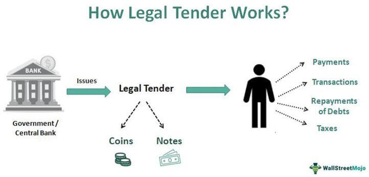

In today's rapidly evolving financial landscape, distinguishing between different forms of currency is essential for anyone involved in economics or finance. Legal tender and fiat money are two key components of global economies, each possessing distinct characteristics and playing unique roles. Legal tender is a specific category of currency that must be accepted by law for settling debts. Essentially, it serves as the official medium for economic transactions within a particular jurisdiction. Examples include the US dollar and Euro, which are backed by the authoritative guarantees of their respective governments.

Fiat money, on the other hand, is currency issued by governments not backed by physical commodities like gold or silver. Its value is not intrinsic but rather derived from the trust and confidence the public and financial institutions have in the issuing government. Most contemporary paper currencies fall under this category and are regulated by central banks, allowing for flexible monetary policy management.



Understanding the differences between legal tender and fiat money is not only academic; it has practical implications in today's markets. Algorithmic trading—an essential component of modern finance—relies heavily on the characteristics of these currencies. By using electronic platforms to execute orders based on predetermined criteria, algorithmic trading capitalizes on the liquidity, volatility, and legal acceptability of these currencies. Consequently, the nuances between legal tender and fiat money can significantly impact trading strategies and decisions.

The impact of these currency forms is also felt on a global scale, affecting international trade and investment flows. Central banks use fiat money to implement monetary policies that can expand or contract money supply, influencing economic growth and stability. Conversely, changes in legal tender laws can reshape consumer behavior and alter market dynamics.

A comprehensive understanding of these currency types is invaluable for investors and economists alike, informing everything from daily transactions to complex trading algorithms. As financial systems continue to evolve with technology advancements and changes in global economic conditions, appreciating the roles of legal tender and fiat money will remain crucial for navigating the future successfully.

## Table of Contents

## What is Legal Tender?

Legal tender is a form of currency that a country’s legal system designates as acceptable for fulfilling financial obligations. Within a given jurisdiction, legal tender is the mandatory medium for the settlement of debts, meaning it must be accepted when offered in payment. Typically issued by a government, legal tender status grants a currency official recognition, allowing it to be utilized for both public and private debt discharges. Notable examples of legal tender include prominent national currencies such as the United States dollar (USD), the Euro (EUR), and other currencies legislated to be accepted in economic transactions within their respective regions.

The concept of legal tender plays a critical role in maintaining economic stability and fostering trust in financial systems. By legally mandating that a currency be accepted for payment, governments can support a stable economic environment where transactions can occur smoothly and predictably. This assurance is vital for economic participants, as it mitigates the risk of payment refusal, thus facilitating trade and commerce.

Moreover, the establishment of a specific currency as legal tender can significantly affect monetary policy and economic management. Governments and central banks leverage the legal tender status to influence economic activities, control inflation, and manage fiscal deficits. For instance, by regulating the supply of legal tender, central banks can implement policies to target inflation rates, stabilize currency value, and promote economic growth.

Legal tender is also crucial in strengthening public confidence. The obligation to accept legal tender for debt payment instills confidence among citizens and businesses, ensuring that the currency they hold is reliably accepted within the economy. This trust is foundational to the broader financial ecosystem, as it underpins the effective functioning of markets and institutions.

In summary, legal tender is not only a mandatory medium of exchange sanctioned by law but also a fundamental pillar of economic infrastructure that promotes stability and instills confidence in financial systems across the globe.

## Understanding Fiat Money

Fiat money is a form of currency that is issued by a government but not backed by a physical commodity such as gold or silver. Instead, its value is derived from the trust and confidence that the populace places in the government that issues it. This trust is crucial, as it underpins the currency's ability to function effectively as a medium of exchange, a unit of account, and a store of value in the economy.

Modern fiat currencies, such as the United States dollar (USD), the euro (EUR), and the Japanese yen (JPY), are regulated by central banks. These institutions are tasked with managing national monetary policies, which involves controlling the money supply and interest rates to achieve economic objectives like full employment, price stability, and economic growth. The flexibility of fiat money allows central banks to implement various monetary policy tools, such as open market operations and quantitative easing, to influence economic conditions.

One notable advantage of fiat money is this very flexibility in monetary policy. Unlike commodity-backed currencies, which are limited by the physical quantities of the commodities they back, fiat money can be expanded or contracted according to the needs of the economy. This allows governments to respond more dynamically to economic crises, stimulate spending during recessions, and curb inflationary pressures during periods of rapid growth.

However, the reliance on trust and confidence means that fiat money is susceptible to inflation, where excessive money supply can devalue the currency. If mismanaged, this can lead to hyperinflation, a scenario where prices increase rapidly as the currency loses its purchasing power. Historical examples include the hyperinflation in Zimbabwe in the late 2000s and the Weimar Republic in the early 1920s, where the overproduction of currency led to severe economic disarray.

The dynamics of fiat money significantly influence both national and global economies. Through exchange rates, fiat currencies interact with each other in global markets, where their relative values can affect international trade competitiveness, capital flows, and economic policy decisions. For example, a strong national currency might make exports more expensive and less competitive abroad, while a weaker currency can boost exports but make imports more costly for domestic consumers.

In conclusion, fiat money's role in modern economies is both foundational and intricate. Its benefits of flexibility in supporting economic objectives must be carefully balanced against the risks of mismanagement and loss of public trust. Understanding these dynamics is essential for policymakers, investors, and economists seeking to navigate and optimize economic outcomes in a complex, interconnected global landscape.

## Differences Between Legal Tender and Fiat Money

While all legal tender qualifies as fiat money, the reverse is not always true. Understanding this distinction is essential for grasping how these forms of currency function within various economic systems and policies.

Legal tender is a currency that must be accepted if offered in payment of a debt. This legal recognition is mandated by governmental laws, requiring that the currency be used for settling public and private debts within the issuing jurisdiction. Examples include the US dollar, the Euro, and other national currencies that have been designated as such by law. This status ensures that these currencies can be used to discharge financial obligations, thereby maintaining economic stability and trust in the financial system.

Fiat money, on the other hand, refers to any currency that a government has declared to be legal tender but is not backed by a physical commodity like gold or silver. Its value is not intrinsic but rather derives from the trust and confidence of the people who use it. Fiat currencies are mainly regulated by central banks and include most of the world's paper currencies today.

The critical distinction lies in their application and the requirements attached to their acceptance. While all legal tender is fiat money, not all fiat money is mandated by law to be accepted for settling debts. A practical example of this is illustrated by considering digital currencies like Bitcoin. While Bitcoin can be used as a medium of exchange in various transactions, it is not legal tender in most countries because it is not legally recognized or mandatory for debt payment.

This difference affects how these money forms are used economically and in policy-making. For instance, governments can influence economic activity by mandating which currencies are legal tender, impacting how goods and services are priced and paid for within an economy. In contrast, fiat money allows for flexibility in monetary policy, enabling central banks to control monetary supply and interest rates, thus influencing inflation and economic growth.

Real-world scenarios highlight these distinctions: during a monetary crisis, such as hyperinflation, a government may face challenges if its legal tender loses public trust, leading to situations where fiat money is not effectively functioning as a medium of exchange. Alternatively, some currencies, though fiat, might not have legal tender status in jurisdictions that use them as a legal currency, such as foreign currencies used in international trade agreements.

In conclusion, although legal tender and fiat money intersect in various aspects, their primary differences and applications have significant implications for economic operations and policy considerations. Understanding these distinctions is essential for navigating everyday financial transactions and broader economic strategies.

## Algorithmic Trading and Currency Types

Algorithmic trading, often referred to as algo-trading, is a method of executing orders using automated and pre-programmed trading instructions. It considers variables such as timing, price, and [volume](/wiki/volume-trading-strategy) to make trades at speeds and frequencies unmanageable for human traders. The role of different currencies, including fiat money and legal tender, plays a critical part in shaping [algorithmic trading](/wiki/algorithmic-trading) strategies, especially in the foreign exchange ([forex](/wiki/forex-system)) and [cryptocurrency](/wiki/cryptocurrency) markets.

Fiat money and legal tender serve unique purposes in algorithmic trading. Fiat money, being the predominant form of currency in forex markets, is affected by various economic indicators and geopolitical events. Traders leverage the inherent [liquidity](/wiki/liquidity-risk-premium) and regulatory framework of fiat currencies like the US dollar or Euro, optimizing their strategies to capitalize on fluctuations in interest rates, inflation, and monetary policies dictated by central banks. In contrast, the role of legal tender is legally binding, which ensures its acceptability in settling debts. However, its influence in algo-trading is often more prominent in straightforward instances where legality and compliance are crucial.

The liquidity and [volatility](/wiki/volatility-trading-strategies) of a currency are critical metrics in algorithmic trading. Liquidity refers to how easily an asset can be bought or sold in the market without affecting its price. Fiat currencies of economically stable countries generally offer high liquidity, making them attractive for traders using algorithmic approaches. Conversely, volatility denotes the degree of price variation, offering opportunities for profit due to significant price swings. Cryptocurrencies, although not legal tender in most jurisdictions and classified outside the traditional fiat framework, present significant volatility, posing both opportunities and risks in algo-trading strategies.

An effective algorithmic trading strategy often incorporates these currency characteristics through [backtesting](/wiki/backtesting)—a process of testing a trading strategy using historical data. Here is an example of backtesting a simple algo-trading strategy in Python using fiat currency data:

```python
import pandas as pd
import numpy as np
import matplotlib.pyplot as plt

# Load historical forex data
data = pd.read_csv('forex_data.csv')

# Simple moving average strategy
data['SMA50'] = data['Close'].rolling(window=50).mean()
data['SMA200'] = data['Close'].rolling(window=200).mean()

# Generate trading signals
data['Signal'] = 0
data.loc[data['SMA50'] > data['SMA200'], 'Signal'] = 1
data.loc[data['SMA50'] < data['SMA200'], 'Signal'] = -1

# Calculate returns
data['Returns'] = data['Close'].pct_change()
data['StrategyReturns'] = data['Returns'] * data['Signal'].shift(1)

# Plot the results
data[['Close', 'SMA50', 'SMA200']].plot(figsize=(12, 6))
plt.title('Forex Price and SMA Strategy')
plt.show()

data['StrategyReturns'].cumsum().apply(np.exp).plot(title='Cumulative Strategy Returns')
plt.show()
```

This code snippet demonstrates a simplistic moving average crossover strategy, a common approach that can be adapted to various fiat and other tradeable assets.

Incorporating multiple currency types in algo-trading involves understanding their influences on liquidity and volatility and navigating their legal acceptability in different jurisdictions. This complexity provides a landscape of both benefits and challenges. Benefits include the ability to swiftly adapt to market conditions and harness large datasets for predictive insights. Challenges, however, involve compliance with financial regulations, managing exchange rate risks, and ensuring technological infrastructure can accommodate high-frequency trading demands.

As the financial markets continue evolving, the importance of understanding how various currency types impact algorithmic trading cannot be understated. Mastery in leveraging these currencies within algo-trading systems can potentially lead to enhanced profitability and reduced risks, provided traders remain vigilant to the ever-changing global economic backdrop and regulatory environment.

## Implications on Global Financial Markets

The circulation of fiat money and legal tender significantly impacts global financial markets, influencing trade, capital flows, and investor behavior. Central banks are pivotal in shaping these dynamics through their monetary policies, which directly affect the supply of fiat money. By adjusting interest rates, engaging in open market operations, and setting reserve requirements, central banks influence liquidity and economic activity. For example, during economic recessions, central banks often adopt expansionary monetary policies, increasing the money supply to stimulate growth.

Legal tender laws can also alter market dynamics. These laws determine which forms of money are mandatory for settling debts, affecting the acceptability and demand for particular currencies. Any amendments in legal tender regulations can lead to shifts in investor confidence and behavior. For instance, if a country decides to replace or devalue its currency, it may lead to capital flight as investors seek more stable or profitable assets elsewhere.

Historical case studies illustrate the profound economic outcomes of policies related to fiat money and legal tender. In Zimbabwe, the excessive printing of fiat money without adequate backing led to hyperinflation in the late 2000s. This resulted in the abandonment of the Zimbabwean dollar in favor of foreign currencies as legal tender, showcasing the potential destabilizing effects of mismanaging fiat money.

Policymakers and investors navigate these complex environments by analyzing market signals and economic indicators. Investors often look for cues in central bank communications and government announcements regarding currency policies to make informed decisions. Diversification strategies in investment portfolios can mitigate the risks associated with currency fluctuations.

In maintaining economic stability, it is crucial for policymakers to strike a balance between controlling inflation and fostering growth. This often involves fine-tuning monetary policies and ensuring clear, consistent legal tender laws. Future challenges include managing the integration of digital currencies into existing frameworks, which could redefine legal tender and fiat money dynamics.

Understanding these implications is essential for stakeholders in global financial markets as they adapt to ever-changing economic conditions and regulatory landscapes.

## Conclusion

The distinction between legal tender and fiat money is a cornerstone of modern economic understanding. Both forms of currency hold essential roles within monetary systems, influencing activities from everyday transactions to the mechanics of algorithmic trading. Legal tender, with its mandatory acceptance for debt settlement, underpins the stability and trust in financial systems. Conversely, fiat money's prevalence, derived from governmental authority and public confidence rather than intrinsic value, allows for flexible monetary policies that central banks utilize to manage economic conditions. 

In an age of rapid financial and technological shifts, understanding these concepts is crucial for informed decision-making by investors and effective regulation crafting by policymakers. Legal tender's binding nature in transactions and the vast scope of fiat money interact in complex ways, affecting liquidity, inflation, and market dynamics. As digital currencies and innovations in financial technology evolve, these traditional currency concepts will invariably intersect with new paradigms, reshaping them. 

Continued exploration and understanding will be pivotal for future financial success. The dynamics of legal tender and fiat money will remain at the forefront as they adapt to changing global economic conditions and technological advancements. Staying informed and adaptive to these changes will be essential for navigating and thriving in evolving financial landscapes.

## References & Further Reading

[1]: ["Fiat Money: Definition, How It Works, Pros & Cons, Examples"](https://boycewire.com/fiat-money-definition/) by James Chen, Investopedia.

[2]: ["The Future of Money: Gearing up for Central Bank Digital Currency"](https://www.imf.org/en/News/Articles/2022/02/09/sp020922-the-future-of-money-gearing-up-for-central-bank-digital-currency) by Kristalina Georgieva, International Monetary Fund.

[3]: ["Money Creation in Fiat and Digital Currency Systems"](https://www.imf.org/en/Publications/WP/Issues/2019/12/20/Money-Creation-in-Fiat-and-Digital-Currency-Systems-48843) by Raphael Auer and Rainer Hasenpusch, Bank for International Settlements.

[4]: ["Trading Algorithms"](https://www.investopedia.com/articles/active-trading/101014/basics-algorithmic-trading-concepts-and-examples.asp) by Ernie Chan

[5]: ["Legal Tender: A Legal Fiction"](https://www.amazon.com/Legal-Tender-Rosato-Associates-Novel/dp/0062400134) by Money, Law, and Economic Activity, The Modern Law Review. 

[6]: ["The Role of Trust in the Long-term Orientation of Modern Economies"](https://www.researchgate.net/publication/273718542_The_Moderating_Effect_of_Long-Term_Orientation_Culture_on_the_Relationship_between_Trust_Personalization_and_Customer_Satisfaction_and_Loyalty_A_Proposed_Framework) by Nordica MacCarty and Elzbieta Wrobel, Canadian Journal of Development Studies / Revue canadienne d'études du développement.