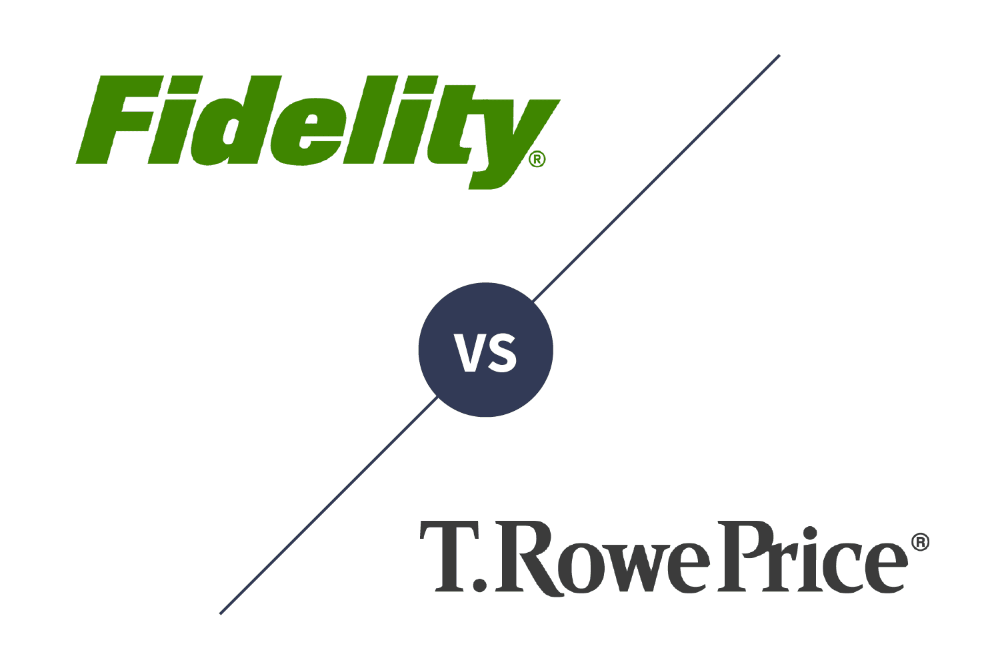

In today's dynamic financial environment, selecting the right investment firm is crucial for maximizing returns and achieving long-term financial goals. The investment landscape is increasingly complex, with a myriad of options and strategies available to investors. Two prominent firms that stand out in this arena are Fidelity Investments and T. Rowe Price. These institutions have a long-standing reputation for providing exceptional investment services and have continually adapted to the evolving market dynamics.

Fidelity Investments, established in 1946, is a well-known global financial services corporation headquartered in Boston, Massachusetts. It offers a diverse range of services including wealth management, investment products, mutual funds, and brokerage services. On the other hand, T. Rowe Price, founded in 1937, is based in Baltimore, Maryland and is recognized for its disciplined investment philosophy focusing on long-term growth and active management of funds. Both firms have demonstrated expertise in asset management and have earned trust among individual and institutional investors alike.



In recent years, algorithmic trading has emerged as a significant force reshaping modern investment strategies. Algorithmic trading involves the use of advanced mathematical models and computer programs to execute trades at high speeds based on defined criteria. This method has transformed traditional trading by enhancing speed, accuracy, and efficiency in trade execution. The rise of algorithmic trading is largely due to advancements in technology and the increasing availability of large datasets, which allow for more sophisticated analysis and decision-making processes.

The purpose of this article is to compare Fidelity Investments and T. Rowe Price in the context of their algorithmic trading solutions. By examining their respective approaches, tools, and strategies, potential investors can gain insights into how these firms leverage technology to optimize trading outcomes. The comparative analysis will help investors make informed decisions by evaluating the strengths and limitations of each firm's algorithmic trading offerings.

With the proliferation of data and advancements in technology, making informed investment decisions is more important than ever. Algorithmic trading represents a powerful tool for those who wish to harness data and technology to achieve better investment results. By understanding the nuances of algorithmic trading solutions offered by Fidelity and T. Rowe Price, investors will be better equipped to align their choices with their financial objectives and risk tolerance.

## Table of Contents

## Understanding Algorithmic Trading

Algorithmic trading, often referred to as automated or black-box trading, is a method of executing orders using pre-programmed and automated trading instructions accounting for variables such as time, price, and volume. These algorithms leverage complex mathematical models and formulas to make high-speed decisions and trades in the financial markets. In modern finance, algorithmic trading has become an integral part due to its potential to handle vast amounts of data and execute trades at a fraction of a second.

### How Algorithmic Trading Works

Algorithmic trading works by using computer programs to monitor markets for predefined conditions and execute orders based on these parameters. These programs are designed around specific strategies that might include statistical [arbitrage](/wiki/arbitrage), [market making](/wiki/market-making), or [trend following](/wiki/trend-following), among others. At its core, [algorithmic trading](/wiki/algorithmic-trading) relies on two main components: the trading strategy and the algorithm that implements it.

A basic example of a trading algorithm might involve coding a strategy in Python as follows:

```python
# Example of a simple moving average crossover strategy
import pandas as pd

# Assume 'data' is a pandas DataFrame containing historical price data
data['SMA_50'] = data['Close'].rolling(window=50).mean()
data['SMA_200'] = data['Close'].rolling(window=200).mean()

# Generate signals: Buy when SMA_50 crosses above SMA_200, Sell when it crosses below
data['Signal'] = 0
data['Signal'][50:] = np.where(data['SMA_50'][50:] > data['SMA_200'][50:], 1, 0)
data['Position'] = data['Signal'].diff()
```

This example represents a simple moving average crossover strategy, where the program generates a "buy" signal when a short-term moving average crosses above a long-term moving average and a "sell" signal when it crosses back below.

### Advantages of Algorithmic Trading

The primary advantages of algorithmic trading include:

1. **Speed**: Algorithms can process complex calculations and execute trades much faster than a human trader, often in milliseconds or microseconds.
2. **Accuracy**: By removing human emotion and error, algorithms can achieve high-level precision in buying, selling, and managing multiple orders at once.
3. **Efficiency**: Algorithms can manage multiple trades simultaneously, optimizing profit opportunities and ensuring trades are executed at the best possible prices.

### Challenges and Risks

Despite its benefits, algorithmic trading comes with several challenges and risks:

- **Market Impact**: Large orders executed by algorithms can cause substantial shifts in market prices, impacting the algorithm's performance.
- **System Failures**: Technical glitches, network issues, or power outages can disrupt trading operations, leading to significant losses.
- **Algorithm Errors**: Errors in the logic or design of algorithms can result in unintended trades or unforeseen market pressures.
- **Market Volatility**: While algorithms can be designed to respond to volatility, unexpected market events can still lead to substantial risks.

### Current Trends

Algorithmic trading is witnessing increasing adoption across various trading arenas. Recent trends include the use of [machine learning](/wiki/machine-learning) and [artificial intelligence](/wiki/ai-artificial-intelligence) to enhance predictive analytics and decision-making processes. Algorithms are becoming more sophisticated, incorporating factors such as sentiment analysis from social media and financial news, which can help in understanding market sentiments and predicting future price movements.

Additionally, there has been a surge in the use of high-frequency trading ([HFT](/wiki/high-frequency-trading-strategies)) among institutional investors, highlighting the growing reliance on technology to gain competitive advantages in speed and pricing precision. The continual development of quantum computing also holds promise for revolutionizing algorithmic trading capabilities, expanding the limits of processing power and efficiency in trading strategies.

In summary, algorithmic trading plays a pivotal role in modern finance, offering speed, accuracy, and efficiency while posing certain risks and challenges that require careful management and oversight. Its evolving nature and increasing popularity underscore its crucial function in contemporary investment strategies.

## Fidelity Investments: Overview and Approach to Algorithmic Trading

Fidelity Investments, established in 1946 by Edward C. Johnson II, is a multinational financial services corporation headquartered in Boston, Massachusetts. Initially founded to manage mutual funds, Fidelity has since diversified its offerings to include a wide array of investment products and services, catering to individual investors, financial advisors, and institutions globally. Over the decades, Fidelity has grown to be one of the largest asset managers worldwide, with assets under management exceeding $4 trillion as of 2023.

Fidelity's investment philosophy emphasizes disciplined, long-term planning coupled with a commitment to innovation and client service. The company prioritizes active management of its funds, drawing on in-depth research and analysis to identify investment opportunities. This philosophy is underpinned by a strong belief in the benefits of diversification and risk management, aiming to optimize returns while minimizing unnecessary risk for its clients.

In recent years, Fidelity has embraced algorithmic trading as part of its comprehensive suite of investment solutions. Algorithmic trading involves the use of computer algorithms to execute trades at optimal times, based on predefined criteria such as timing, price, and [volume](/wiki/volume-trading-strategy). Fidelity employs advanced trading technologies to enhance the efficiency and accuracy of its trade execution processes, thereby improving outcomes for its clients. 

Fidelity offers a range of tools and platforms designed to support algorithmic trading. These include sophisticated trading platforms that enable access to real-time market data, advanced order types, and analytics to assist traders and investment professionals in making informed decisions. The firm's integration of machine learning models and artificial intelligence technologies further refines its trading strategies, enhancing prediction accuracy and trade execution.

Clients can leverage Fidelity’s suite of algorithmic trading resources through platforms like Fidelity Active Trader Pro, which provides advanced charting, extensive market research, and customizable trading alerts. Additionally, Fidelity's APIs allow for the development of personalized trading strategies, offering investors further customization and control over their trading activities.

Case studies and testimonials from Fidelity's clientele illustrate the firm's success in implementing algorithmic trading solutions. Many clients report improved trading performance and execution speed, attributing these gains to Fidelity's technologically advanced platforms and algorithmic trading capabilities. For instance, institutional clients have highlighted reduced transaction costs and enhanced [liquidity](/wiki/liquidity-risk-premium) management as notable benefits of Fidelity's algorithmic trading services.

In summary, Fidelity Investments combines a rich history and a robust investment philosophy with cutting-edge algorithmic trading technologies. This integration allows Fidelity to offer comprehensive and competitive investment solutions, catering to the evolving needs of modern investors. Fidelity's commitment to innovation and client success continues to underpin its strategy in the dynamic landscape of asset management.

## T. Rowe Price: Overview and Approach to Algorithmic Trading

T. Rowe Price, founded in 1937 by Thomas Rowe Price Jr., has established itself as a prominent player in the investment management industry. The firm is known for its fundamental investing approach, emphasizing careful stock selection based on rigorous research and analysis. The company's philosophy centers on long-term growth, capital preservation, and risk management, aiming to deliver consistent, sustainable returns to its clients.

In recent years, T. Rowe Price has acknowledged the transformative potential of algorithmic trading in modern finance. While traditionally focused on active management, the firm has integrated algorithmic solutions to complement its investment strategies. These solutions leverage quantitative models and advanced analytics to optimize trading execution, minimize costs, and improve the efficiency of portfolio management processes.

T. Rowe Price's algorithmic trading capabilities are supported by a robust technological infrastructure and a dedicated team of quantitative analysts. The firm employs sophisticated algorithms to facilitate trade execution, adjusting for market conditions in real-time. This allows T. Rowe Price to achieve better price discovery and liquidity management, ultimately enhancing portfolio performance.

The tools and platforms offered by T. Rowe Price for algorithmic trading include proprietary systems developed in-house, as well as collaborations with leading technology providers. These platforms utilize cutting-edge technologies such as machine learning and big data analytics, providing traders with actionable insights and automating complex trading tasks for faster decision-making.

Client success stories and performance examples attest to T. Rowe Price's achievements in algorithmic trading. For instance, the firm has successfully implemented algorithms designed to reduce transaction costs and improve execution speed, which has contributed to superior client outcomes. Such innovations demonstrate T. Rowe Price's commitment to integrating technology and data-driven methodologies into its investment management practices to offer enhanced services to its clients.

Overall, T. Rowe Price remains committed to balancing traditional investment principles with modern technological advancements, offering its clients a comprehensive and adaptive approach to asset management. Through the integration of algorithmic trading, T. Rowe Price continues to evolve its strategies to meet the changing demands of the investment landscape.

## Comparative Analysis: Fidelity vs. T. Rowe Price

Fidelity Investments and T. Rowe Price are two significant players in the investment management industry, each with distinctive approaches to algorithmic trading. This section provides a detailed comparison of their algorithmic trading solutions, fees, platform accessibility, investment options, and the performance and reliability of their strategies.

### Algorithmic Trading Solutions

**Fidelity:** Fidelity has established a robust infrastructure for algorithmic trading, emphasizing speed, accuracy, and flexibility. Their offerings include a range of algorithmic trading strategies supported by advanced technologies like machine learning and big data analytics. Fidelity provides a suite of tools designed to help both institutional and retail investors optimize their trading strategies, such as customizable algorithms and real-time market data analytics.

**T. Rowe Price:** T. Rowe Price, on the other hand, focuses on a more personalized approach to algorithmic trading. While it may not match Fidelity's technological breadth, T. Rowe Price leverages its deep research capabilities and market insights to craft algorithmic strategies tailored to long-term growth and risk management. Their proprietary algorithms often incorporate factors identified through rigorous fundamental analysis.

### Fees, Costs, and Investment Minimums

**Fidelity:** Fidelity is known for its competitive fee structure, often providing clients with low trading costs and no account minimums for many investment options. Their pricing model can be appealing to cost-conscious investors, especially those looking to minimize transaction costs.

**T. Rowe Price:** T. Rowe Price typically employs a more traditional fee structure with specific investment minimums. The firm's fee schedule reflects its emphasis on active management and personalized service, which might result in higher costs compared to Fidelity, but these are justified by the potential for higher value-added strategies.

### User Experience, Platform Accessibility, and Customer Support

**Fidelity:** Fidelity's digital platforms are highly regarded for their user-friendly interfaces, extensive educational resources, and comprehensive customer support services. The accessibility of their trading platforms, complemented by a robust mobile application, enhances the overall user experience, making it suitable for both novice and experienced investors.

**T. Rowe Price:** T. Rowe Price maintains a user-centric platform with a focus on long-term investors. Although their interface might not be as advanced as Fidelity's, the firm provides strong customer support and educational content aimed at helping investors make informed decisions aligned with long-term financial goals.

### Range of Investment Options and Customization

**Fidelity:** Fidelity offers a broad spectrum of investment options, including extensive customization opportunities for algorithmic trading strategies. Their platform supports a wide array of assets, from stocks and bonds to ETFs and mutual funds, enabling investors to tailor their portfolios to specific risk tolerances and investment outcomes.

**T. Rowe Price:** While T. Rowe Price offers fewer investment options relative to Fidelity, the focus is on quality and long-term value. Their investment solutions include a curated selection of mutual funds and retirement accounts. The firm's approach is less about expansive choice and more about strategic selection.

### Performance and Reliability of Algorithmic Trading Strategies

**Fidelity:** Fidelity's algorithmic strategies are designed to deliver high performance with a focus on optimizing execution speed and lowering transaction costs. By leveraging cutting-edge technology and a vast data repository, Fidelity's algorithms exhibit a high degree of reliability in various market conditions.

**T. Rowe Price:** T. Rowe Price's algorithmic trading strategies are deeply rooted in the firm's research-driven investment philosophy. Their performance is often characterized by stability and consistency, aligning with the firm's emphasis on long-term growth and risk-adjusted returns. While not as rapid or data-heavy as Fidelity, T. Rowe Price’s strategies leverage sophisticated market insights for reliability.

In conclusion, choosing between Fidelity and T. Rowe Price for algorithmic trading largely depends on the investor's priorities: Fidelity offers comprehensive technology and lower costs, while T. Rowe Price provides a more tailored, research-focused approach. Investors must weigh these elements against their own financial goals and risk tolerance to make an informed decision.

## Factors to Consider When Choosing Between Fidelity and T. Rowe Price

When deciding between Fidelity and T. Rowe Price, it is crucial to evaluate several factors that can significantly impact your investment success and satisfaction. Understanding your investment goals and risk tolerance is a foundational step in this process. Each investor has unique objectives, whether it be aggressive growth, steady income, or preserving capital. Fidelity offers a range of investment options that may cater to more aggressive traders seeking short-term gains, while T. Rowe Price typically emphasizes a philosophy focused on long-term growth. Assessing your risk tolerance will guide you in aligning with the firm that complements your appetite for risk.

Second, evaluating the importance of technology and innovation in your investment strategy is vital, especially with the rise of algorithmic trading. Fidelity has prioritized innovative technological solutions, providing advanced platforms and tools for traders keen on utilizing algorithmic strategies. T. Rowe Price, while also embracing technology, tends to focus on integrating it with long-term strategic planning, which may appeal to investors who prioritize robust [fundamental analysis](/wiki/fundamental-analysis) over high-frequency trading.

Fees and costs are another critical consideration as they directly affect your investment returns. Both Fidelity and T. Rowe Price offer competitive fee structures, but their costs can vary depending on the type of investments and accounts. For instance, Fidelity is often praised for its low-cost index funds and commission-free trading options, making it financially appealing for cost-sensitive investors. Conducting a detailed comparison of the fee schedules of both firms, particularly how they align with your specific investment style and portfolio needs, can illuminate any hidden costs that might accrue over time.

Customer service, support, and educational resources are also pivotal in making an informed choice. Fidelity is renowned for its robust client support and educational offerings, which can be essential for novice investors or those who value a high degree of guidance. T. Rowe Price is equally committed to client support, providing comprehensive resources and a personalized approach, especially appealing to investors who appreciate detailed, research-based insights.

Finally, aligning your choice with your long-term investment outlook and personal preferences is essential. If your focus is on building wealth over decades, T. Rowe Price's long-term growth emphasis may be preferable. Conversely, if you are intrigued by cutting-edge trading technologies and require a wide array of customizable options, Fidelity's approach might better suit your needs. Balancing personal preferences with an objective analysis of each firm's offerings will ensure that your choice not only meets your current requirements but also adapts to your evolving financial landscape.

## Conclusion

In comparing Fidelity Investments and T. Rowe Price, it is evident that both firms offer robust algorithmic trading solutions, yet they cater to different investor needs and preferences. Fidelity's approach is characterized by its cutting-edge technology and vast array of investment tools, providing a high degree of customization and rapid execution of trades. T. Rowe Price, on the other hand, emphasizes long-term growth and stability through its algorithmic offerings, supported by a strong foundation of research and data analysis.

Algorithmic trading plays a crucial role in modern investment strategies, offering significant advantages such as increased speed, precision, and efficiency in executing trades. However, it is not without challenges and risks, including market [volatility](/wiki/volatility-trading-strategies) and technical malfunctions. Therefore, potential investors should carefully assess their strategies, considering how algorithmic solutions align with their financial goals and risk tolerance.

For those seeking to leverage these sophisticated investment tools, further research and professional advice are recommended. Understanding the nuances of algorithmic trading, as well as the distinct offerings of Fidelity and T. Rowe Price, can enable investors to make informed decisions that align with their long-term objectives.

As the investment landscape continually evolves, driven by technological advancements and market dynamics, it is imperative for investors to remain adaptable and informed. Aligning investment choices with personal financial goals is crucial for achieving success, making it essential to regularly review and adjust strategies as necessary. This strategic alignment will ensure that investors not only navigate the complexities of the market but also capitalize on the opportunities presented by innovations in algorithmic trading.

## References & Further Reading

[1]: Bergstra, J., Bardenet, R., Bengio, Y., & Kégl, B. (2011). ["Algorithms for Hyper-Parameter Optimization."](https://dl.acm.org/doi/10.5555/2986459.2986743) Advances in Neural Information Processing Systems 24.

[2]: ["Advances in Financial Machine Learning"](https://www.amazon.com/Advances-Financial-Machine-Learning-Marcos/dp/1119482089) by Marcos Lopez de Prado

[3]: ["Evidence-Based Technical Analysis: Applying the Scientific Method and Statistical Inference to Trading Signals"](https://www.semanticscholar.org/paper/Evidence-Based-Technical-Analysis%3A-Applying-the-and-Aronson/3b33df8737f1772e9e14d66a08c9696f140a2ee1) by David Aronson

[4]: ["Machine Learning for Algorithmic Trading"](https://github.com/PacktPublishing/Machine-Learning-for-Algorithmic-Trading-Second-Edition) by Stefan Jansen

[5]: ["Quantitative Trading: How to Build Your Own Algorithmic Trading Business"](https://books.google.com/books/about/Quantitative_Trading.html?id=j70yEAAAQBAJ) by Ernest P. Chan