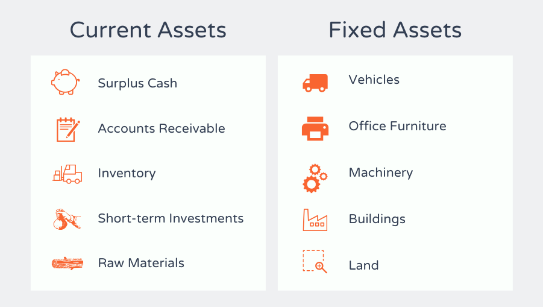

## Table of Contents

## What are fixed assets?

Fixed assets are things a company owns that it uses for a long time to help run its business. These things are not meant to be sold quickly but are used to make money over many years. Examples of fixed assets include buildings, machines, vehicles, and computers. They are different from things like inventory, which a company buys and sells all the time.

When a company buys a fixed asset, it doesn't count the whole cost as an expense right away. Instead, the cost is spread out over the years the asset will be used. This is called depreciation. For example, if a company buys a machine that will last 10 years, the cost of the machine is divided by 10, and that amount is taken as an expense each year. This helps show a more accurate picture of the company's profits and how it uses its money.

## What are current assets?

Current assets are things a company owns that can be turned into cash or used up within one year. They are important because they show how well a company can pay its short-term bills. Examples of current assets include cash, money in the bank, things the company will sell soon (called inventory), and money that customers owe the company (called accounts receivable).

These assets are listed on the company's balance sheet and are usually shown in the order of how quickly they can be turned into cash. Cash is the most liquid, meaning it can be used right away. Inventory might take a bit longer to turn into cash because it needs to be sold first. Current assets are different from fixed assets, which are things like buildings and machines that the company uses for a long time.

## How do fixed assets differ from current assets?

Fixed assets and current assets are two different types of things a company owns. Fixed assets are things like buildings, machines, and vehicles that a company uses for a long time to help run its business. They are not meant to be sold quickly but are used over many years to make money. When a company buys a fixed asset, it doesn't count the whole cost as an expense right away. Instead, it spreads the cost over the years the asset will be used, which is called depreciation.

Current assets, on the other hand, are things that can be turned into cash or used up within one year. They include cash, money in the bank, things the company will sell soon (inventory), and money that customers owe the company (accounts receivable). Current assets are important because they show how well a company can pay its short-term bills. They are listed on the company's balance sheet and are usually shown in the order of how quickly they can be turned into cash.

The main difference between fixed assets and current assets is how long they are used and how quickly they can be turned into cash. Fixed assets are long-term and not easily turned into cash, while current assets are short-term and can be quickly turned into cash. This difference affects how a company manages its money and plans for the future.

## Can you provide examples of fixed assets?

Fixed assets are things a company owns that it uses for a long time to help run its business. Some examples of fixed assets are buildings, machines, and vehicles. A company might own a factory building where it makes its products. The factory is a fixed asset because it helps the company make money over many years. Another example is a machine that a company uses to make things. If a company buys a big machine to make cars, that machine is a fixed asset because it will be used for a long time.

Vehicles are also fixed assets. For example, a delivery company might own trucks to deliver packages. These trucks are fixed assets because they help the company do its job over many years. Computers and office furniture can also be fixed assets. If a company buys computers for its employees to use at work, those computers are fixed assets because they are used over a long time to help the company run.

Fixed assets are different from things like inventory, which a company buys and sells quickly. When a company buys a fixed asset, it doesn't count the whole cost as an expense right away. Instead, it spreads the cost over the years the asset will be used, which is called depreciation. This helps show a more accurate picture of the company's profits and how it uses its money.

## Can you provide examples of current assets?

Current assets are things a company owns that can be turned into cash or used up within one year. A simple example of a current asset is cash. This is the money a company has in its bank account or in its cash registers. Another example is accounts receivable, which is money that customers owe the company for things they have already bought. If a company sells something to a customer and lets them pay later, that money is a current asset because the company expects to get it within a year.

Another type of current asset is inventory. This is the stuff a company has bought to sell to its customers. For example, a store might have clothes or toys that it plans to sell soon. These items are current assets because the company expects to turn them into cash by selling them within a year. Lastly, there are things like prepaid expenses. If a company pays for something in advance, like insurance for the next year, that payment is a current asset because it will be used up within a year.

Current assets are important because they show how well a company can pay its short-term bills. They are listed on the company's balance sheet and are usually shown in the order of how quickly they can be turned into cash. Cash is the most liquid, meaning it can be used right away. Inventory might take a bit longer to turn into cash because it needs to be sold first. Current assets are different from fixed assets, which are things like buildings and machines that the company uses for a long time.

## How are fixed assets recorded on the balance sheet?

Fixed assets are things like buildings, machines, and vehicles that a company uses for a long time. On the balance sheet, fixed assets are listed under a section called "Property, Plant, and Equipment" or sometimes just "Fixed Assets." The total cost of these assets is shown here. For example, if a company bought a building for $1 million, that amount would be listed on the balance sheet as the cost of the building.

But, because fixed assets are used over many years, their value goes down over time. This is called depreciation. On the balance sheet, the company also shows how much the fixed assets have depreciated. This is usually shown as "Accumulated Depreciation." If the building from our example has depreciated by $200,000, the balance sheet will show this amount. To find out the current value of the fixed assets, you subtract the accumulated depreciation from the total cost. So, the building's current value on the balance sheet would be $1 million minus $200,000, which is $800,000.

## How are current assets recorded on the balance sheet?

Current assets are things a company owns that can be turned into cash or used up within one year. On the balance sheet, these are listed at the top, right after the company's name and other basic info. The current assets section includes things like cash, money that customers owe the company (called accounts receivable), and stuff the company plans to sell soon (called inventory). Each type of current asset is listed separately, and then all the amounts are added up to show the total current assets.

The value of current assets shown on the balance sheet is usually the amount the company expects to get from them. For example, cash is listed at its full value because it can be used right away. Accounts receivable are listed at the amount the company expects to collect from customers. Inventory is usually listed at the lower of its cost or the market value, which means the company shows the lower amount if the stuff they plan to sell is worth less now than when they bought it. This helps give a clear picture of how much money the company can get from its current assets in the short term.

## What is the typical lifespan of fixed assets compared to current assets?

Fixed assets have a long lifespan. They are things like buildings, machines, and vehicles that a company uses for many years to help run its business. For example, a building might last for 30 years or more, while a machine might be used for 10 to 20 years. Because fixed assets last a long time, their cost is spread out over the years they are used, which is called depreciation. This helps show a more accurate picture of the company's profits and how it uses its money.

Current assets, on the other hand, have a short lifespan. They are things that can be turned into cash or used up within one year. Examples include cash, money that customers owe the company (accounts receivable), and stuff the company plans to sell soon (inventory). These assets are important because they help the company pay its short-term bills. The short lifespan of current assets means they are always changing as the company buys and sells things or collects money from customers.

## How does depreciation affect fixed assets?

Depreciation is a way to spread out the cost of fixed assets over the time they are used. Fixed assets are things like buildings, machines, and vehicles that a company uses for a long time. When a company buys a fixed asset, it doesn't count the whole cost as an expense right away. Instead, it divides the cost by the number of years the asset will be used. For example, if a company buys a machine that will last 10 years, it divides the cost of the machine by 10 and takes that amount as an expense each year. This helps show a more accurate picture of the company's profits and how it uses its money.

Depreciation affects fixed assets by reducing their value on the balance sheet over time. On the balance sheet, the total cost of the fixed assets is shown under "Property, Plant, and Equipment." But there's also a section called "Accumulated Depreciation" that shows how much the value of the fixed assets has gone down. For example, if a company bought a building for $1 million and it has depreciated by $200,000, the balance sheet will show the building's current value as $800,000. This lower value helps the company and others see how much the fixed assets are really worth now, after being used for a while.

## How does the liquidity of current assets impact a company's financial health?

The liquidity of current assets is really important for a company's financial health. Liquidity means how quickly something can be turned into cash. Current assets, like cash, money that customers owe the company, and stuff the company plans to sell soon, are all very liquid. This means the company can use these assets to pay its short-term bills quickly. If a company has a lot of liquid current assets, it can easily cover its short-term costs, like paying suppliers or employees. This makes the company financially healthy because it can handle its money needs without problems.

If a company doesn't have enough liquid current assets, it might have trouble paying its bills on time. This can lead to financial stress and even trouble with the company's operations. For example, if the company can't pay its suppliers, it might not get the materials it needs to make its products. Or if it can't pay its employees, they might leave. So, having enough liquid current assets is key to keeping the company running smoothly and staying financially healthy. It's like having enough money in your pocket to cover your daily expenses without worrying.

## What are the tax implications of fixed versus current assets?

Fixed assets and current assets have different tax implications because of how they are used and how their costs are treated. Fixed assets, like buildings and machines, are used for a long time. When a company buys a fixed asset, it doesn't count the whole cost as an expense right away. Instead, it spreads the cost over the years the asset will be used, which is called depreciation. This depreciation can be deducted from the company's income each year, reducing the amount of tax the company has to pay. For example, if a company buys a machine for $100,000 and it lasts 10 years, the company can deduct $10,000 each year from its income, lowering its tax bill.

Current assets, like cash and inventory, are used up or turned into cash within a year. The tax treatment of current assets is different because they are not depreciated. When a company sells its inventory, the cost of that inventory is subtracted from the sales income to figure out the profit. This profit is what the company pays tax on. For example, if a company buys inventory for $50,000 and sells it for $70,000, the profit is $20,000, and the company pays tax on that $20,000. The quick turnover of current assets means the company can manage its cash flow and taxes more directly, but it doesn't get the long-term tax benefits that come with depreciation of fixed assets.

## How do strategic decisions about fixed and current assets influence long-term business planning?

Strategic decisions about fixed and current assets play a big role in long-term business planning. Fixed assets, like buildings and machines, are things a company uses for a long time. When a company decides to buy a fixed asset, it's making a big choice about how it wants to grow and what it wants to do in the future. For example, if a company buys a new factory, it's planning to make more products over many years. These decisions can help the company grow and make more money, but they also mean the company has to spend a lot of money upfront and wait a while to see the benefits.

Current assets, like cash and inventory, are things a company uses up or turns into cash within a year. Decisions about current assets are important for keeping the business running smoothly day to day. For example, if a company decides to keep more cash on hand, it can pay its bills more easily and handle unexpected costs. But having too much cash sitting around might mean the company is missing out on other ways to use that money to grow. So, a company needs to balance its current assets to make sure it can cover its short-term needs while also planning for the future. Both types of assets are important, and the company's choices about them shape its long-term plans and success.

## What are Fixed Assets: Their Definition and Examples?

Fixed assets, also referred to as non-current assets, are essential components of a company's financial structure, representing resources intended for long-term use to support revenue generation. Characterized by their extended benefit period and lack of immediate liquidity, these assets are used by businesses to produce goods, deliver services, or serve other operational purposes. Common examples of fixed assets include tangible resources such as property, plant, and equipment, as well as intangible assets like intellectual property, including patents and trademarks.

The management of fixed assets is a multifaceted process that involves accounting for depreciation, maintaining the condition of these assets, and quantifying their effects on a company's financial statements. Depreciation is a key concept in handling fixed assets, as it refers to the systematic allocation of an asset's cost over its useful life. This allocation is vital for providing a realistic view of a company's financial health by matching the cost of fixed assets with the revenue they generate over time. The formula for calculating depreciation using the straight-line method is:

$$
\text{Depreciation Expense} = \frac{\text{Cost of Asset} - \text{Residual Value}}{\text{Useful Life of Asset}}
$$

Regular maintenance of fixed assets is crucial to ensure their efficiency and longevity, impacting both operational effectiveness and financial outcomes. Well-maintained assets help reduce unexpected repair costs and downtime, enhancing a company’s productivity and reliability.

Understanding the role and management of fixed assets is central to strategic capital investment decisions. Companies need to analyze the potential returns on investing in new fixed assets versus the costs associated with maintaining or replacing existing ones. These assessments are critical for determining the viability of expansion projects or upgrading current operations.

Furthermore, fixed assets significantly affect a company's balance sheet by contributing to its long-term stability and investment profile. Investors and stakeholders closely monitor fixed assets to evaluate the company's capacity to sustain growth and generate profit. The strategic management of these assets reflects an organization's commitment to sustaining long-term profitability and competitiveness. 

In summary, fixed assets play a pivotal role in underpinning business operations and facilitating strategic growth, necessitating careful consideration and management within the financial strategy of any enterprise.

## What is the Role of Asset Classification in Financial Reporting?

Accurate asset classification plays a critical role in constructing financial statements, such as balance sheets, providing a transparent depiction of a company's financial status. Asset classification categorizes assets into fixed or current assets, which is essential for evaluating key financial metrics, including liquidity, solvency, and cash flow.

### Understanding Key Financial Metrics

1. **Liquidity** refers to a company's ability to meet its short-term obligations using its current assets. By accurately classifying assets, businesses can assess their liquidity through the calculation of metrics such as the current ratio (current assets divided by current liabilities), which gives insight into the company's short-term financial health.
$$
   \text{Current Ratio} = \frac{\text{Current Assets}}{\text{Current Liabilities}}

$$

2. **Solvency**, on the other hand, indicates a company's ability to meet its long-term debts and obligations. Proper asset classification aids in assessing solvency by focusing on the ratio of total assets to total liabilities, known as the debt-to-asset ratio.
$$
   \text{Debt-to-Asset Ratio} = \frac{\text{Total Liabilities}}{\text{Total Assets}}

$$

3. **Cash Flow** concerns the inflow and outflow of cash to and from the company's operations. Effective asset classification ensures that the balance sheet accurately reflects cash and cash equivalents, aiding in the analysis of cash flow statements.

### Regulatory Compliance and Comparability

Standardized asset classification practices are imperative for regulatory compliance. Financial reporting standards, such as the International Financial Reporting Standards (IFRS) and Generally Accepted Accounting Principles (GAAP), require consistent asset classification to facilitate comparability across businesses. This standardization ensures that stakeholders, including investors, creditors, and regulatory bodies, have a clear and reliable view of a company's financial statements, promoting confidence and informed decision-making.

### Impact on Decision-Making

Accurate asset classification informs strategic decision-making by providing a clear picture of the company's asset base. This understanding enables businesses to optimize resource allocation, plan for capital investments, and manage risks effectively. Investors and analysts rely on classified financial statements to evaluate a firm's performance and potential for growth, guiding investment decisions.

In summary, the meticulous classification of assets into fixed and current categories underpins meaningful financial reporting. It enhances understanding of liquidity, solvency, and cash flow, ensures compliance with financial standards, and supports strategic decisions, ultimately fostering transparency and trust in financial markets.

## References & Further Reading

To deepen your understanding of asset classification and its impact on algorithmic trading, a range of academic and industry resources are available. These materials offer valuable insights into the dynamics of financial asset management and trading strategies, ensuring you can effectively integrate asset classification principles into your trading systems.

1. **Textbooks**:
   - "Financial Accounting: An Introduction to Concepts, Methods, and Uses" by Roman L. Weil, Katherine Schipper, and Jennifer Francis provides a comprehensive overview of financial reporting and asset classification.
   - "Principles of Corporate Finance" by Richard A. Brealey, Stewart C. Myers, and Franklin Allen explores the strategic implications of asset management within corporate finance.

2. **Research Articles**:
   - Consider exploring the article "Asset Pricing Theory and the Valuation of Owner-Occupied Housing" published in the *Review of Financial Studies*, which discusses the intricacies of asset valuation.
   - "Algorithmic Trading and Information Processing in Financial Markets" by Terrence Hendershott, Charles M. Jones, and Albert J. Menkveld in the *Journal of Economic Perspectives* reviews how asset classification impacts trading algorithms.

3. **Case Studies**:
   - Harvard Business School offers case studies on asset management and trading strategies. For instance, cases on algorithmic trading provide insights into the practical application of theory.
   - The Journal of Financial Economics provides case studies that examine how firms classify assets to improve trading outcomes and strategic investment decisions.

4. **Software Tools and Libraries**:
   - Python libraries such as Pandas for data manipulation and analysis, alongside NumPy for numerical computations, can aid in developing algorithms that incorporate asset classification data.
   - The `backtrader` library in Python is useful for backtesting trading strategies that utilize different asset classifications.

5. **Online Courses and Modules**:
   - Coursera and edX offer courses on algorithmic trading and financial accounting, such as "Algorithmic Trading and Finance Models with Python, R, and Stata Essential Training", which help understand the integration of asset classification into trading models.
   - Financial Modeling and Valuation by the Corporate Finance Institute includes modules on classifying and managing assets for corporate financial strategy.

Engaging with these resources will facilitate a robust understanding of asset classification's role in financial performance and trading strategy optimization.

