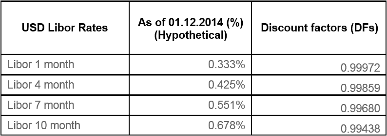

## Table of Contents

## What is a floating interest rate?

A floating interest rate, also known as a variable interest rate, is a type of interest rate that can change over time. Unlike a fixed interest rate, which stays the same throughout the loan term, a floating rate is tied to an external benchmark, such as the prime rate or the federal funds rate. This means that the interest you pay on a loan with a floating rate can go up or down based on changes in the benchmark rate.

For example, if you have a loan with a floating rate that is set at the prime rate plus 2%, and the prime rate is currently 3.25%, you would pay an interest rate of 5.25%. If the prime rate increases to 3.5%, your interest rate would then increase to 5.5%. Floating rates can be beneficial if the benchmark rate goes down, as it can lead to lower interest payments. However, they can also be risky because if the benchmark rate goes up, your payments could become more expensive.

## What is a fixed interest rate?

A fixed interest rate is a type of interest rate that stays the same for the entire time you have a loan. When you get a loan with a fixed rate, you know exactly how much interest you will pay each month. This makes it easier to plan your budget because your payments won't change, even if other interest rates in the economy go up or down.

For example, if you take out a loan with a fixed rate of 5%, you will pay 5% interest on the loan every year until you pay it off. This can be good if you want to avoid surprises and prefer to have a steady payment amount. However, if general interest rates go down after you get your loan, you might end up paying more interest than if you had a different type of loan.

## How do floating interest rates work?

Floating interest rates work by changing based on a special number called a benchmark rate. This benchmark rate can be things like the prime rate or the federal funds rate. When you get a loan with a floating rate, your interest rate is set to be a certain amount more or less than the benchmark rate. For example, if your loan has a floating rate of the prime rate plus 2%, and the prime rate is 3%, your interest rate would be 5%.

If the benchmark rate changes, your interest rate changes too. So, if the prime rate goes up to 3.5%, your interest rate would go up to 5.5%. This means your loan payments could go up or down depending on what happens to the benchmark rate. Floating rates can be good if the benchmark rate goes down because it makes your payments cheaper. But they can also be risky because if the benchmark rate goes up, your payments could get more expensive.

## How do fixed interest rates work?

Fixed interest rates are a type of interest rate that stays the same for the whole time you have a loan. When you get a loan with a fixed rate, you know exactly how much interest you will pay every month. This makes it easier to plan your budget because your payments won't change, even if other interest rates in the economy go up or down.

For example, if you take out a loan with a fixed rate of 5%, you will pay 5% interest on the loan every year until you pay it off. This can be good if you want to avoid surprises and prefer to have a steady payment amount. However, if general interest rates go down after you get your loan, you might end up paying more interest than if you had a different type of loan.

## What are the advantages of choosing a floating interest rate?

Choosing a floating interest rate can be good because it might save you money if the benchmark rate goes down. The benchmark rate is a special number that floating rates are based on, like the prime rate or federal funds rate. If this number goes down, your interest rate goes down too. This means you'll pay less interest on your loan, which can make your monthly payments smaller. For example, if you have a loan with a floating rate of the prime rate plus 2% and the prime rate drops from 3% to 2.5%, your interest rate would go from 5% to 4.5%, saving you money.

Another advantage is that floating rates can be more flexible. If interest rates in the economy go down, you can take advantage of lower rates without having to do anything. This is different from fixed rates, where you're stuck with the same rate even if other rates drop. With a floating rate, you don't have to worry about missing out on lower rates because your loan adjusts automatically. This can be really helpful if you think rates might go down in the future.

## What are the advantages of choosing a fixed interest rate?

Choosing a fixed interest rate is good because it keeps your payments the same every month. This makes it easier to plan your budget because you know exactly how much you'll pay. You don't have to worry about your interest rate going up and making your payments bigger. This can be really helpful if you like to know what to expect and don't want any surprises.

Another advantage is that fixed rates protect you if the economy's interest rates go up. If you have a fixed rate and the rates for everyone else go up, you still pay the same amount. This means you save money compared to people with floating rates whose payments might go up. So, if you think interest rates might go up in the future, a fixed rate can be a safe choice.

## What are the potential risks associated with floating interest rates?

One risk of choosing a floating interest rate is that your payments might go up if the benchmark rate goes up. The benchmark rate is a special number that your floating rate is based on, like the prime rate or federal funds rate. If this number goes up, your interest rate goes up too, making your monthly payments bigger. This can make it hard to plan your budget because you don't know if your payments will stay the same or get more expensive.

Another risk is that you might end up paying more interest over time. If the benchmark rate keeps going up, your interest rate will keep going up too. This means you could pay a lot more interest than you would with a fixed rate. It can be risky if you don't like surprises and prefer to know exactly how much you'll pay every month.

## What are the potential risks associated with fixed interest rates?

One risk of choosing a fixed interest rate is that you might miss out on lower rates if the economy's interest rates go down. If you have a fixed rate and the rates for everyone else drop, you still have to pay the same higher rate. This means you could end up paying more interest than people with floating rates whose payments might go down.

Another risk is that you might not be able to take advantage of new loan deals. If interest rates fall a lot, other people might be able to get new loans with lower rates. But if you have a fixed rate, you're stuck with your original rate unless you pay fees to change your loan. This can make it harder to save money over time if rates keep going down.

## How do economic conditions affect floating and fixed interest rates?

Economic conditions can change floating interest rates a lot. Floating rates are tied to a special number called a benchmark rate, like the prime rate or federal funds rate. When the economy is doing well, these benchmark rates might go up because there's more demand for money. This means if you have a loan with a floating rate, your interest rate and payments could go up too. But if the economy is not doing so well, the benchmark rates might go down to encourage people to borrow and spend money. This can make your payments smaller if you have a floating rate loan.

Fixed interest rates are not affected by changes in the economy after you get your loan. When you take out a loan with a fixed rate, your interest rate stays the same no matter what happens to the economy. This means if the economy gets better and interest rates go up, you still pay the same rate. But if the economy gets worse and interest rates go down, you don't get to pay less. Your payments stay the same, which can be good if you like to know exactly how much you'll pay each month, but it might not be the best if rates drop a lot.

## In what scenarios would a floating interest rate be more beneficial than a fixed rate?

A floating interest rate would be more beneficial than a fixed rate if you think the economy's interest rates will go down. When you have a floating rate, your interest rate changes with a special number called a benchmark rate. If this number goes down, your interest rate goes down too. This means you'll pay less interest on your loan, making your monthly payments smaller. For example, if you believe the prime rate will drop in the future, choosing a floating rate could save you money because your payments will get cheaper as the rate falls.

Another scenario where a floating rate might be better is if you want to take advantage of lower rates without doing anything. With a floating rate, you don't have to worry about missing out on lower rates because your loan adjusts automatically. If the economy's rates go down, your floating rate will go down too, saving you money. This can be really helpful if you think rates might go down in the future and you want to keep your payments flexible.

## In what scenarios would a fixed interest rate be more beneficial than a floating rate?

A fixed interest rate would be more beneficial if you think the economy's interest rates will go up. When you have a fixed rate, your interest rate stays the same no matter what happens to the economy. If rates go up, you still pay the same amount, which can save you money compared to someone with a floating rate whose payments might get bigger. This is really helpful if you want to keep your payments the same and don't want any surprises.

Another scenario where a fixed rate might be better is if you like to plan your budget easily. With a fixed rate, you know exactly how much you'll pay every month. This makes it easier to plan because your payments won't change, even if the economy's rates go up or down. If you prefer to have a steady payment amount and avoid the risk of your payments going up, a fixed rate can be a safe choice.

## How can borrowers hedge against the risks of floating interest rates?

Borrowers can hedge against the risks of floating interest rates by using something called an interest rate cap. An interest rate cap is like an insurance policy for your loan. It sets a maximum limit on how high your floating rate can go. If the benchmark rate goes above this limit, you don't have to pay the extra interest. This can protect you from big increases in your payments, but you might have to pay a fee to get this cap.

Another way to hedge against floating rate risks is by using an interest rate swap. This is when you agree to swap your floating rate for a fixed rate with someone else. You still have your original loan, but you pay a fixed rate to the other person, and they pay you the floating rate. This can help you avoid the risk of your payments going up if the benchmark rate goes up. But, like an interest rate cap, you might have to pay a fee to do this swap.

## References & Further Reading

[1]: ["Interest Rate Models - Theory and Practice: With Smile, Inflation and Credit"](https://link.springer.com/book/10.1007/978-3-540-34604-3) by Damiano Brigo and Fabio Mercurio

[2]: ["Fixed Income Securities: Tools for Today's Markets"](https://www.amazon.com/Fixed-Income-Securities-Markets-Finance/dp/1119835550) by Bruce Tuckman and Angel Serrat

[3]: ["Interest Rate Swaps and Other Derivatives"](https://www.investopedia.com/terms/i/interestrateswap.asp) by Howard Corb

[4]: ["Algorithmic Trading and DMA: An Introduction to Direct Access Trading Strategies"](https://www.amazon.com/Algorithmic-Trading-DMA-introduction-strategies/dp/0956399207) by Barry Johnson

[5]: Hull, J. C. (2014). ["Options, Futures, and Other Derivatives"](https://www.amazon.com/Options-Futures-Other-Derivatives-9th/dp/0133456315). Pearson Education.

[6]: ["Trading and Exchanges: Market Microstructure for Practitioners"](https://academic.oup.com/book/52292) by Larry Harris