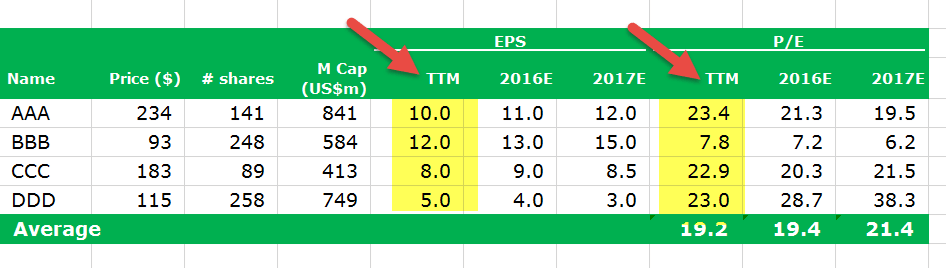

Understanding financial ratios is crucial for investors aiming to assess the value and performance of a company. These ratios provide valuable insights into various aspects of a company's financial health, allowing investors to make well-informed decisions. Among the myriad of financial ratios available, the price-to-earnings (P/E) ratio stands out as a significant metric. It offers a straightforward method to evaluate whether a stock is over or undervalued in comparison to its earnings. This article focuses on the differences between two specific types of P/E ratios: the forward P/E and trailing P/E ratios, and their relevance in algorithmic trading. 

The trailing P/E ratio, which is based on a company’s past earnings, provides investors with a snapshot of the company's historical profitability. In contrast, the forward P/E ratio estimates a company's future earnings potential, offering a predictive view of its expected performance. Each ratio has distinct advantages and disadvantages, and their appropriate use depends greatly on the investor’s objectives and market context.



In recent years, the rise of algorithmic trading has transformed how investors leverage these financial metrics. Algorithmic trading harnesses the power of computer algorithms to execute trades at speeds and frequencies far beyond human capabilities. By integrating P/E ratios into these algorithms, traders can automate their decision-making processes. This capability allows for real-time adjustments to trading strategies based on continuous analysis of historical and anticipated data.

The strategic application of these ratios—both individually and in combination—can optimize trading strategies. Understanding the nuances of forward and trailing P/E ratios provides investors with a more comprehensive view of a company's value, enabling them to refine their investment approaches and maximize returns. As algorithmic trading gains prominence, the effective utilization of these financial metrics becomes increasingly essential for achieving successful outcomes in the stock market.

## Table of Contents

## What is the Price-to-Earnings (P/E) Ratio?

The price-to-earnings (P/E) ratio is a financial metric instrumental in evaluating a company's current share price relative to its earnings per share (EPS). This ratio serves as an indicator of what the market is prepared to pay today for a stock based on its earnings history or expected future performance. The formula for calculating the P/E ratio is:

$$
\text{P/E Ratio} = \frac{\text{Market Value per Share}}{\text{Earnings per Share (EPS)}}
$$

This ratio offers insights into whether a stock is overvalued or undervalued by comparing its market price to its earnings. A high P/E ratio may suggest that investors anticipate higher growth rates in the future, whereas a low P/E can imply that the stock is undervalued or that the company is experiencing challenges.

The P/E ratio is often used alongside other financial metrics to give a more comprehensive picture of a company's valuation. While the P/E ratio alone cannot tell the whole story of a company's financial health, it plays a crucial role in investment analysis by providing a comparative measure across different companies and industries. Investors often consider the context within which a P/E ratio is analyzed, acknowledging sector benchmarks, historical trends, and growth prospects.

## Understanding Trailing P/E Ratio

Trailing Price-to-Earnings (P/E) Ratio is a financial metric that calculates a company's current share price relative to its earnings per share (EPS) over the past 12 months. This metric is often referred to as a "backward-looking" indicator because it is based on historical data rather than projections. The formula for calculating the trailing P/E ratio is:

$$
\text{Trailing P/E Ratio} = \frac{\text{Current Share Price}}{\text{Earnings Per Share (EPS) over the past 12 months}}
$$

The trailing P/E ratio offers investors an objective measure based on actual historical earnings, allowing for a reliable assessment of a company's past earnings performance. This is particularly valuable for assessing companies with stable earnings patterns, as it bases its evaluations solely on realized profits rather than speculative forecasts.

One of the key advantages of the trailing P/E ratio is its objectivity. Unlike forward-looking estimates that can be vulnerable to analyst biases and market sentiment, trailing P/E metrics utilize data that has already been reported, providing a factual basis for valuation analyses. Investors frequently leverage this ratio to evaluate whether a stock is overvalued or undervalued by comparing it with the company's historical P/E ratios or those of similar companies in the industry.

However, a significant limitation of the trailing P/E ratio is its inability to account for future earnings growth or potential changes in a company's financial dynamics. In rapidly evolving industries or companies experiencing significant growth or decline, relying solely on past earnings can lead to an incomplete picture of a company's potential. To address this limitation, investors often complement trailing P/E analysis with other metrics or forward-looking measures, ensuring a more comprehensive evaluation of a company's financial health and future prospects.

## Deciphering Forward P/E Ratio

The forward price-to-earnings (P/E) ratio is a financial metric that evaluates a stock's potential valuation using expected earnings over the upcoming 12 months. This predictive ratio is particularly advantageous for investors seeking insights into a company's prospective growth and its relative performance within its industry. Mathematically, the forward P/E ratio is expressed as:

$$
\text{Forward P/E} = \frac{\text{Current Stock Price}}{\text{Estimated Future Earnings per Share (EPS)}}
$$

Here, "Estimated Future Earnings per Share" denotes the anticipated earnings for the next fiscal period, reflecting company forecasts and market analyst projections.

Unlike the trailing P/E ratio, which is anchored in historical data, the forward P/E ratio offers a forward-looking perspective. This attribute is beneficial when growth forecasts suggest favorable trends, allowing investors to make informed decisions about a company's future performance compared to its peers. By focusing on anticipated earnings, the forward P/E ratio can provide early signals about a company's potential, assisting in the identification of growth opportunities or impending declines in value.

However, reliance on the forward P/E ratio requires caution due to potential discrepancies arising from estimation errors and analyst biases. Analyst predictions can be swayed by various factors, including macroeconomic conditions, industry developments, and company-specific news, leading to significant deviations between projected and actual earnings. Consequently, it is prudent for investors to consider the forward P/E ratio in conjunction with other financial metrics and qualitative assessments to mitigate the risks associated with inaccurate forecasts. This comprehensive approach enhances the robustness of investment strategies, ensuring a well-rounded evaluation of stock prospects.

## Forward P/E vs. Trailing P/E: Key Differences

The primary distinction between the forward price-to-earnings (P/E) and trailing P/E ratios lies in their respective temporal focuses. Trailing P/E is rooted in historical data, providing an analysis based on a company's earnings over the past 12 months. This approach offers the advantage of using confirmed figures, making the trailing P/E a reliable indicator of a company's current valuation based on actual past performance. Its backward-looking nature renders it particularly useful for assessing how a company has performed under existing market conditions.

In contrast, the forward P/E ratio employs projected earnings for the upcoming 12 months. This forward-looking measure anticipates a company’s future performance, making it beneficial for investors focused on growth and potential. The forward P/E ratio can be particularly informative in industries where rapid change or expansion is expected, providing insights that the trailing P/E might not capture.

Both trailing and forward P/E ratios serve important, albeit different, purposes in investment analysis. Trailing P/E is invaluable for its objectivity and the reliability of historical data, proving useful when scrutinizing a company's past ability to generate earnings. Forward P/E, however, is leveraged by investors seeking to predict future growth, offering a glimpse into possible future earnings and aiding in the comparison of companies poised for expansion.

Deciding between using trailing or forward P/E ratios often hinges on individual investment strategy and prevailing market conditions. In stable markets, trailing P/E might be favored for its reliance on solid past data. However, in dynamic markets or when investing in emerging industries, forward P/E may be more relevant due to its focus on expected changes and anticipated growth.

Overall, both ratios have their place in a well-rounded investment analysis. The key is to understand each metric’s limitations and benefits, tailoring their use to align with specific investment goals and the broader economic context.

## The Role of P/E Ratios in Algorithmic Trading

Algorithmic trading leverages technological advancements to automate the decision-making process in financial markets. At its core, this type of trading relies on algorithms—sequences of rules or instructions—to evaluate and execute trades. P/E ratios, representing the price of a stock relative to its earnings, are integrated into these algorithms due to their significance in assessing stock valuation. By utilizing P/E ratios, algorithms can systematically determine whether a stock is overvalued or undervalued, helping to inform buy or sell decisions.

Incorporating P/E ratios into trading algorithms involves using both trailing and forward P/E metrics for a comprehensive analysis. Trailing P/E, based on historical earnings, offers a snapshot of a company's past performance, while forward P/E, which considers projected future earnings, helps predict potential growth. This dual approach enables algorithms to balance historical reliability with future expectations.

An [algorithmic trading](/wiki/algorithmic-trading) system can be designed to adjust strategies in real time based on these P/E metrics. For instance, consider a Python-based trading algorithm that triggers a buy signal when a stock's forward P/E falls below a specific threshold, suggesting undervaluation relative to peers. Here's a simplified example to illustrate this:

```python
def evaluate_stock(price, earnings, forecasted_earnings):
    forward_pe = price / forecasted_earnings
    trailing_pe = price / earnings

    # Assuming predefined thresholds
    TRAILING_PE_THRESHOLD = 15
    FORWARD_PE_THRESHOLD = 12

    buy_signal = (forward_pe < FORWARD_PE_THRESHOLD and 
                  trailing_pe < TRAILING_PE_THRESHOLD)

    return buy_signal

stock_price = 100
earnings_per_share = 5
forecasted_earnings_per_share = 8

if evaluate_stock(stock_price, earnings_per_share, forecasted_earnings_per_share):
    print("Buy Signal Triggered")
else:
    print("No Buy Signal")
```

In this example, the algorithm assesses whether the P/E ratios fall within desirable ranges, signaling a potential buying opportunity. This real-time capability allows trading systems to react efficiently to changes in market conditions, thus embodying the predictive analytics power of algorithmic trading.

The integration of P/E ratios into algorithmic trading not only enhances the objectivity of investment analysis but also ensures that trading strategies remain aligned with fundamental financial principles. By automating adjustments based on P/E metrics and other financial indicators, these algorithms contribute to more disciplined and data-driven trading approaches.

## How to Effectively Use P/E Ratios in Trading Strategies

Investors aiming to refine their trading strategies should employ both forward and trailing Price-to-Earnings (P/E) ratios. Utilizing both allows for a more nuanced understanding of a company's valuation, accommodating both historical performance and future projections.

To further enhance decision-making, P/E ratios can be correlated with additional financial metrics like the Price/Earnings to Growth (PEG) ratio or dividend yields. The PEG ratio refines the P/E ratio by considering a company's growth rate, giving a more comprehensive view by accounting for potential earnings growth. A basic calculation of the PEG ratio is as follows:

$$
\text{PEG Ratio} = \frac{\text{P/E Ratio}}{\text{Earnings Growth Rate (\%)}}
$$

A result under 1.0 generally suggests a stock is undervalued relative to its growth potential, whereas a result over 1.0 can indicate overvaluation.

Similarly, dividend yield provides another layer of analysis indicating how much cash flow investors are getting for each dollar of invested equity. Its formula is:

$$
\text{Dividend Yield} = \frac{\text{Annual Dividends Per Share}}{\text{Price Per Share}}
$$

Algorithmic trading systems stand to gain significantly through these integrated approaches. By automating the analysis of P/E ratios alongside other metrics, algorithms can offer real-time adjustments to trading strategies. Such systems can implement pre-set criteria to trigger buy or sell decisions based on a more holistic assessment of stock value.

For instance, a simplified Python example of an algorithm that considers P/E ratio and dividend yield before making a trading decision could be structured as follows:

```python
def evaluate_stock(pe_ratio, earnings_growth, annual_dividend, stock_price):
    peg_ratio = pe_ratio / earnings_growth
    dividend_yield = annual_dividend / stock_price

    # Example conditions for trading decision
    if peg_ratio < 1 and dividend_yield > 0.03:
        return "Buy"
    elif peg_ratio > 1.5 or dividend_yield < 0.02:
        return "Sell"
    else:
        return "Hold"

# Example data
stock_pe_ratio = 15
growth_rate = 12  # 12%
dividend_per_share = 1.5
current_stock_price = 50

decision = evaluate_stock(stock_pe_ratio, growth_rate, dividend_per_share, current_stock_price)
print(f"Trading decision: {decision}")
```

Incorporating both P/E ratios with complementary metrics, and automating this synthesis, investors can achieve a more comprehensive and objective evaluation framework. Such systems are adaptable to evolving market conditions, offering optimized buy or sell triggers based on enhanced data analysis.

## Challenges and Limitations

The utilization of forward and trailing P/E ratios, while valuable, comes with inherent challenges and limitations that investors must consider to avoid potential pitfalls. 

The forward P/E ratio's reliability is heavily reliant on the precision of future earnings forecasts. These forecasts can be tempered by a variety of external factors, such as economic downturns, regulatory changes, or alterations in market demand, all of which can lead to discrepancies between projected and actual earnings. This dependency increases the risk of using forward P/E as a sole indicator, as analyst predictions can vary significantly, sometimes driven by optimistic biases or incomplete data.

On the other hand, the trailing P/E ratio, grounded in historical performance, may not accurately reflect a company's future potential, particularly in scenarios of rapid business growth or decline. Companies undergoing significant transformation or expansion might display a misleadingly high trailing P/E, prompting investors to undervalue future earnings potential. Conversely, companies experiencing temporary setbacks might appear undervalued if only trailing P/E is considered, potentially overlooking a rebound in performance.

Investors incorporating these ratios, especially within automated trading algorithms, must be cognizant of these nuances. Algorithms relying on forward P/E must incorporate mechanisms to update or adjust earnings forecasts dynamically, accounting for new data or market conditions. Similarly, algorithms using trailing P/E should integrate additional metrics that capture growth or contraction trends. A comprehensive approach utilizing both ratios, possibly in conjunction with other financial indicators, is advisable. This multifaceted strategy can help mitigate limitations intrinsic to each type of P/E ratio, ensuring a more balanced and informed trading decision-making process.

## Conclusion

Both forward and trailing P/E ratios are pivotal instruments in comprehensively evaluating stock valuation. Investors utilizing these metrics are better positioned to discern whether a stock is accurately valued, overpriced, or undervalued. Accurate valuation is a cornerstone of maximizing investment returns as it assists investors in making informed decisions about buying, holding, or selling stocks.

To leverage these tools effectively, it is essential to understand the contexts in which each P/E ratio is most useful. The trailing P/E ratio, which incorporates actual earnings from the past year, provides a snapshot of the company's historical performance, offering a reliable measure of current stock value. In contrast, the forward P/E ratio projects future earnings expectations, allowing investors to estimate growth potential and market movements.

When combined with algorithmic trading, the power of P/E ratios is significantly amplified. Algorithmic trading utilizes software based on predetermined logic to execute trades with speed and accuracy superior to manual trading. By embedding P/E ratios into these algorithms, investors can execute strategies that adapt in real-time to market changes, ensuring timely responses to emerging trends.

Here's a simple Python function that demonstrates how these ratios might be integrated into an algorithmic trading strategy:

```python
def evaluate_stock(trailing_pe, forward_pe, pe_threshold):
    # Basic evaluation strategy
    if trailing_pe < pe_threshold and forward_pe < pe_threshold:
        return "Buy"
    elif trailing_pe > pe_threshold and forward_pe > pe_threshold:
        return "Sell"
    else:
        return "Hold"

# Example usage:
stock_decision = evaluate_stock(trailing_pe=15, forward_pe=18, pe_threshold=20)
print(f"Trading Decision: {stock_decision}")
```

The hypothetical function `evaluate_stock` takes trailing P/E, forward P/E, and a P/E threshold to make a basic buy, sell, or hold decision. Such an approach demonstrates how integrating these ratios into decision-making algorithms can facilitate nuanced and objective evaluations.

Ultimately, both forward and trailing P/E ratios are indispensable in the asset management toolkit, empowering investors to perform nuanced evaluations supported by automatized capabilities in algorithmic trading strategies. By understanding and effectively applying these ratios, investors can enhance their ability to achieve optimal investment outcomes.

## References & Further Reading

[1]: ["Advances in Financial Machine Learning"](https://www.amazon.com/Advances-Financial-Machine-Learning-Marcos/dp/1119482089) by Marcos Lopez de Prado

[2]: ["Evidence-Based Technical Analysis: Applying the Scientific Method and Statistical Inference to Trading Signals"](https://www.amazon.com/Evidence-Based-Technical-Analysis-Scientific-Statistical/dp/0470008741) by David Aronson

[3]: ["Machine Learning for Algorithmic Trading"](https://github.com/stefan-jansen/machine-learning-for-trading) by Stefan Jansen

[4]: ["Quantitative Trading: How to Build Your Own Algorithmic Trading Business"](https://www.amazon.com/Quantitative-Trading-Build-Algorithmic-Business/dp/1119800064) by Ernest P. Chan

[5]: Asness, C. S. (2014). ["The Value of Early Fundamentals: The Born Loser."](https://pages.stern.nyu.edu/~lpederse/papers/ValMomEverywhere.pdf) *Journal of Portfolio Management.*

[6]: Damodaran, A. (2012). ["Investment Valuation: Tools and Techniques for Determining the Value of Any Asset, University Edition"](https://books.google.com/books/about/Investment_Valuation.html?id=5SRHAAAAQBAJ) by Aswath Damodaran