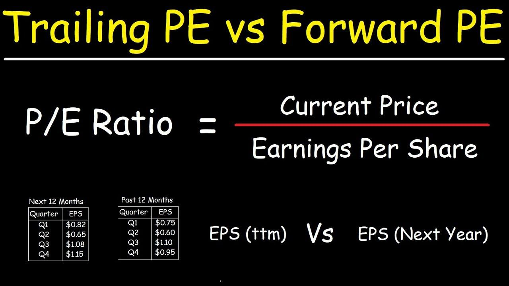

## Table of Contents

## What is a P/E ratio?

The P/E ratio, or Price-to-Earnings ratio, is a way to figure out how much investors are willing to pay for a company's earnings. It's calculated by dividing the current stock price by the company's earnings per share (EPS). This number tells you how many years it would take for the company to earn back the amount you paid for the stock, based on its current earnings.

A high P/E ratio might mean that investors think the company will grow a lot in the future, so they're willing to pay more for its stock. On the other hand, a low P/E ratio could mean that the company is not expected to grow much, or it might be seen as a bargain if the company is doing well but the stock price is low. It's a useful tool for comparing different companies or seeing if a stock is overvalued or undervalued.

## What is the difference between Forward P/E and Trailing P/E?

Forward P/E and Trailing P/E are two ways to calculate the Price-to-Earnings ratio, but they look at different time periods. Trailing P/E uses the earnings from the past 12 months. This is easy to find because it's based on numbers that have already happened. It's like looking in the rearview mirror to see how the company did last year.

Forward P/E, on the other hand, uses the earnings that analysts expect the company to make in the next 12 months. This can be trickier because it's a guess about the future. It's like trying to predict what the road ahead will look like. Because it's based on predictions, Forward P/E can change if analysts change their minds about how well the company will do.

## How is Forward P/E calculated?

Forward P/E is calculated by dividing the current stock price by the company's predicted earnings per share for the next 12 months. The predicted earnings come from what financial analysts think the company will earn in the future. They look at things like the company's past performance, what's happening in the market, and any news about the company to make their guess.

Because Forward P/E is based on guesses about the future, it can change a lot. If something good happens to the company, like a new product doing well, analysts might predict higher earnings and the Forward P/E could go down. If something bad happens, like a big lawsuit, the predicted earnings might go down, and the Forward P/E could go up. It's a helpful way to see what investors think about a company's future, but it's not always exact because no one can really predict the future perfectly.

## How is Trailing P/E calculated?

Trailing P/E is calculated by dividing the current stock price by the company's earnings per share (EPS) over the past 12 months. This means you take the price of one share of the company's stock right now and divide it by how much money the company made per share in the last year. This number gives you an idea of how much investors are willing to pay for the company's past earnings.

Because Trailing P/E uses numbers from the past, it's a straightforward calculation. You can find these numbers in the company's financial reports or on financial websites. It's a good way to see how the company has done recently, but it doesn't tell you anything about what might happen in the future.

## Why might an investor use Forward P/E instead of Trailing P/E?

An investor might use Forward P/E instead of Trailing P/E because Forward P/E gives them a peek into what might happen in the future. It's based on what financial experts think the company will earn next year. This can be really helpful if an investor is trying to decide if a stock is a good buy now, based on how the company is expected to do in the future. For example, if a company is going through a rough patch but is expected to bounce back, the Forward P/E might show that the stock is a good deal.

On the other hand, Trailing P/E only looks at what the company has already done in the past year. While this is useful for understanding the company's history, it doesn't tell you anything about what's coming up. If an investor is more interested in future growth and potential, they'll find Forward P/E more useful. It helps them see if the stock's price is fair based on what the company is expected to earn, rather than what it has earned.

## What are the advantages of using Trailing P/E?

One big advantage of using Trailing P/E is that it's based on real numbers from the past year. This makes it easy to find and trust because you're looking at what the company actually did, not what someone thinks it might do. It's like checking the score after a game is over, so you know exactly how the team performed.

Another advantage is that Trailing P/E helps you compare different companies easily. Since everyone is using the same past year's numbers, you can see how one company stacks up against another. This can be really helpful if you're trying to decide which stock to buy based on how companies have done recently.

## Can Forward P/E and Trailing P/E be used together for analysis?

Yes, using Forward P/E and Trailing P/E together can give you a fuller picture of a company's value. Trailing P/E tells you how the company has done in the last year, based on real numbers. This is like looking at the score after a game is over. It's easy to find and trust because it's based on what actually happened. On the other hand, Forward P/E looks at what experts think the company will earn next year. This is like trying to guess the score of a game that hasn't happened yet. It can help you see if the stock is a good deal now, based on what might happen in the future.

By looking at both numbers, you get a better sense of where the company stands and where it might be headed. If the Forward P/E is lower than the Trailing P/E, it might mean that people think the company will do better in the future. If the Forward P/E is higher, it could mean that people expect the company to have a harder time. Using both together helps you make smarter choices about whether to buy, sell, or hold a stock, because you're considering both the past and the future.

## How do Forward P/E and Trailing P/E ratios impact investment decisions?

Forward P/E and Trailing P/E ratios help investors make decisions by giving them different views of a company's value. Trailing P/E tells you how much investors are willing to pay for what the company has already earned in the past year. It's like looking at the score after a game is over. This number is easy to find and trust because it's based on real numbers. If an investor sees a low Trailing P/E, it might mean the stock is a good deal because people aren't paying much for the company's past earnings.

Forward P/E, on the other hand, looks at what experts think the company will earn next year. It's like trying to guess the score of a game that hasn't happened yet. A low Forward P/E might mean the stock is a good buy because people think the company will do well in the future. By looking at both ratios, investors can get a better idea of whether a stock is a good buy now. If the Forward P/E is lower than the Trailing P/E, it might mean the company is expected to grow. If it's higher, it could mean people think the company will have a harder time. Using both helps investors make smarter choices about buying, selling, or holding a stock.

## What are the limitations of using Forward P/E?

One big problem with Forward P/E is that it's based on guesses about the future. Analysts try to predict what a company will earn next year, but they can be wrong. Things like new laws, what customers want, or even the weather can change a company's earnings in ways that are hard to predict. So, if the guesses are off, the Forward P/E can be way off too. This means investors might think a stock is a good deal when it's not, or they might pass up a good investment because the Forward P/E looks too high.

Another issue is that different analysts can have different guesses about the same company. This can make Forward P/E numbers different depending on which analyst's prediction you use. It's like trying to decide what to wear based on different weather forecasts - it can be confusing and might lead to bad decisions. So, while Forward P/E can be helpful, it's important to remember that it's not always exact and should be used carefully.

## What are the limitations of using Trailing P/E?

One limitation of using Trailing P/E is that it only looks at the past. It tells you how much money a company made last year, but it doesn't say anything about what might happen next. If a company is going through changes, like getting a new boss or starting a new product, the Trailing P/E won't show that. It's like driving a car by only looking in the rearview mirror - you can see where you've been, but you might miss what's coming up ahead.

Another problem with Trailing P/E is that it can be affected by one-time events. For example, if a company had a big lawsuit or sold a part of its business last year, those things might make the earnings look different than they usually are. This can make the Trailing P/E misleading because it's based on numbers that might not happen again. So, while Trailing P/E is good for seeing the past, it's not always the best way to understand a company's true value or future potential.

## How do analysts predict future earnings for Forward P/E calculations?

Analysts predict future earnings for Forward P/E calculations by looking at a lot of different things. They start by checking the company's past earnings to see how it has done before. They also look at what's happening in the market, like if people are buying more or less of what the company sells. They think about any new products the company might be working on, or if there are any big changes happening, like a new boss or a merger. They even consider things like new laws or what the economy is doing. All these things help them make a guess about how much money the company might make next year.

Sometimes, analysts use special math formulas to help with their predictions. These formulas take into account things like how fast the company has grown in the past, what other companies in the same industry are doing, and what experts think about the future of the industry. By putting all this information together, analysts come up with a number that they think the company will earn per share next year. This number is what they use to calculate the Forward P/E. But because it's a guess about the future, it's not always exact, and different analysts might come up with different numbers.

## In what scenarios might Forward P/E be more misleading than Trailing P/E?

Forward P/E can be more misleading than Trailing P/E when big changes happen that no one saw coming. For example, if a company is about to launch a new product that turns out to be a huge hit or a total flop, the guesses about future earnings might be way off. Also, if there's a sudden change in the economy, like a big recession or a boom, the predictions might not match what actually happens. Because Forward P/E is based on these guesses, it can lead investors to think a stock is a good deal when it's not, or make them miss out on a good investment because the Forward P/E looks too high.

Another time Forward P/E can be misleading is when different analysts have very different ideas about what will happen. Since Forward P/E is based on what analysts think the company will earn next year, if one analyst thinks the company will do great and another thinks it will do poorly, the Forward P/E numbers can be all over the place. This can make it hard for investors to know which number to trust. Trailing P/E, on the other hand, is based on real numbers from the past, so it's more reliable and less likely to be misleading because it's not a guess about the future.

## What is the Price-to-Earnings (P/E) Ratio?

The price-to-earnings (P/E) ratio is a financial metric instrumental in evaluating a company's current share price relative to its earnings per share (EPS). This ratio serves as an indicator of what the market is prepared to pay today for a stock based on its earnings history or expected future performance. The formula for calculating the P/E ratio is:

$$
\text{P/E Ratio} = \frac{\text{Market Value per Share}}{\text{Earnings per Share (EPS)}}
$$

This ratio offers insights into whether a stock is overvalued or undervalued by comparing its market price to its earnings. A high P/E ratio may suggest that investors anticipate higher growth rates in the future, whereas a low P/E can imply that the stock is undervalued or that the company is experiencing challenges.

The P/E ratio is often used alongside other financial metrics to give a more comprehensive picture of a company's valuation. While the P/E ratio alone cannot tell the whole story of a company's financial health, it plays a crucial role in investment analysis by providing a comparative measure across different companies and industries. Investors often consider the context within which a P/E ratio is analyzed, acknowledging sector benchmarks, historical trends, and growth prospects.

## What is the Understanding of Trailing P/E Ratio?

Trailing Price-to-Earnings (P/E) Ratio is a financial metric that calculates a company's current share price relative to its earnings per share (EPS) over the past 12 months. This metric is often referred to as a "backward-looking" indicator because it is based on historical data rather than projections. The formula for calculating the trailing P/E ratio is:

$$
\text{Trailing P/E Ratio} = \frac{\text{Current Share Price}}{\text{Earnings Per Share (EPS) over the past 12 months}}
$$

The trailing P/E ratio offers investors an objective measure based on actual historical earnings, allowing for a reliable assessment of a company's past earnings performance. This is particularly valuable for assessing companies with stable earnings patterns, as it bases its evaluations solely on realized profits rather than speculative forecasts.

One of the key advantages of the trailing P/E ratio is its objectivity. Unlike forward-looking estimates that can be vulnerable to analyst biases and market sentiment, trailing P/E metrics utilize data that has already been reported, providing a factual basis for valuation analyses. Investors frequently leverage this ratio to evaluate whether a stock is overvalued or undervalued by comparing it with the company's historical P/E ratios or those of similar companies in the industry.

However, a significant limitation of the trailing P/E ratio is its inability to account for future earnings growth or potential changes in a company's financial dynamics. In rapidly evolving industries or companies experiencing significant growth or decline, relying solely on past earnings can lead to an incomplete picture of a company's potential. To address this limitation, investors often complement trailing P/E analysis with other metrics or forward-looking measures, ensuring a more comprehensive evaluation of a company's financial health and future prospects.

## What is the process of deciphering the Forward P/E Ratio?

The forward price-to-earnings (P/E) ratio is a financial metric that evaluates a stock's potential valuation using expected earnings over the upcoming 12 months. This predictive ratio is particularly advantageous for investors seeking insights into a company's prospective growth and its relative performance within its industry. Mathematically, the forward P/E ratio is expressed as:

$$
\text{Forward P/E} = \frac{\text{Current Stock Price}}{\text{Estimated Future Earnings per Share (EPS)}}
$$

Here, "Estimated Future Earnings per Share" denotes the anticipated earnings for the next fiscal period, reflecting company forecasts and market analyst projections.

Unlike the trailing P/E ratio, which is anchored in historical data, the forward P/E ratio offers a forward-looking perspective. This attribute is beneficial when growth forecasts suggest favorable trends, allowing investors to make informed decisions about a company's future performance compared to its peers. By focusing on anticipated earnings, the forward P/E ratio can provide early signals about a company's potential, assisting in the identification of growth opportunities or impending declines in value.

However, reliance on the forward P/E ratio requires caution due to potential discrepancies arising from estimation errors and analyst biases. Analyst predictions can be swayed by various factors, including macroeconomic conditions, industry developments, and company-specific news, leading to significant deviations between projected and actual earnings. Consequently, it is prudent for investors to consider the forward P/E ratio in conjunction with other financial metrics and qualitative assessments to mitigate the risks associated with inaccurate forecasts. This comprehensive approach enhances the robustness of investment strategies, ensuring a well-rounded evaluation of stock prospects.

## How can one effectively use P/E ratios in trading strategies?

Investors aiming to refine their trading strategies should employ both forward and trailing Price-to-Earnings (P/E) ratios. Utilizing both allows for a more nuanced understanding of a company's valuation, accommodating both historical performance and future projections.

To further enhance decision-making, P/E ratios can be correlated with additional financial metrics like the Price/Earnings to Growth (PEG) ratio or dividend yields. The PEG ratio refines the P/E ratio by considering a company's growth rate, giving a more comprehensive view by accounting for potential earnings growth. A basic calculation of the PEG ratio is as follows:

$$
\text{PEG Ratio} = \frac{\text{P/E Ratio}}{\text{Earnings Growth Rate (\%)}}
$$

A result under 1.0 generally suggests a stock is undervalued relative to its growth potential, whereas a result over 1.0 can indicate overvaluation.

Similarly, dividend yield provides another layer of analysis indicating how much cash flow investors are getting for each dollar of invested equity. Its formula is:

$$
\text{Dividend Yield} = \frac{\text{Annual Dividends Per Share}}{\text{Price Per Share}}
$$

Algorithmic trading systems stand to gain significantly through these integrated approaches. By automating the analysis of P/E ratios alongside other metrics, algorithms can offer real-time adjustments to trading strategies. Such systems can implement pre-set criteria to trigger buy or sell decisions based on a more holistic assessment of stock value.

For instance, a simplified Python example of an algorithm that considers P/E ratio and dividend yield before making a trading decision could be structured as follows:

```python
def evaluate_stock(pe_ratio, earnings_growth, annual_dividend, stock_price):
    peg_ratio = pe_ratio / earnings_growth
    dividend_yield = annual_dividend / stock_price

    # Example conditions for trading decision
    if peg_ratio < 1 and dividend_yield > 0.03:
        return "Buy"
    elif peg_ratio > 1.5 or dividend_yield < 0.02:
        return "Sell"
    else:
        return "Hold"

# Example data
stock_pe_ratio = 15
growth_rate = 12  # 12%
dividend_per_share = 1.5
current_stock_price = 50

decision = evaluate_stock(stock_pe_ratio, growth_rate, dividend_per_share, current_stock_price)
print(f"Trading decision: {decision}")
```

Incorporating both P/E ratios with complementary metrics, and automating this synthesis, investors can achieve a more comprehensive and objective evaluation framework. Such systems are adaptable to evolving market conditions, offering optimized buy or sell triggers based on enhanced data analysis.

## References & Further Reading

[1]: ["Advances in Financial Machine Learning"](https://www.amazon.com/Advances-Financial-Machine-Learning-Marcos/dp/1119482089) by Marcos Lopez de Prado

[2]: ["Evidence-Based Technical Analysis: Applying the Scientific Method and Statistical Inference to Trading Signals"](https://www.amazon.com/Evidence-Based-Technical-Analysis-Scientific-Statistical/dp/0470008741) by David Aronson

[3]: ["Machine Learning for Algorithmic Trading"](https://github.com/stefan-jansen/machine-learning-for-trading) by Stefan Jansen

[4]: ["Quantitative Trading: How to Build Your Own Algorithmic Trading Business"](https://www.amazon.com/Quantitative-Trading-Build-Algorithmic-Business/dp/1119800064) by Ernest P. Chan

[5]: Asness, C. S. (2014). ["The Value of Early Fundamentals: The Born Loser."](https://pages.stern.nyu.edu/~lpederse/papers/ValMomEverywhere.pdf) *Journal of Portfolio Management.*

[6]: Damodaran, A. (2012). ["Investment Valuation: Tools and Techniques for Determining the Value of Any Asset, University Edition"](https://books.google.com/books/about/Investment_Valuation.html?id=5SRHAAAAQBAJ) by Aswath Damodaran