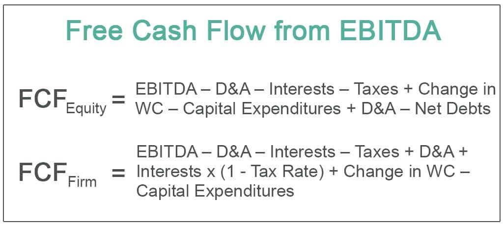

Understanding the financial health of a company is crucial for investors and stakeholders who seek to make informed decisions about allocating their resources. Whether evaluating potential risks, identifying growth opportunities, or simply seeking value, stakeholders rely on a comprehensive analysis of financial metrics. Among these metrics, Free Cash Flow (FCF) and Earnings Before Interest, Tax, Depreciation, and Amortization (EBITDA) are pivotal in assessing a company's profitability and operational efficiency.

Free Cash Flow represents the cash generated by a company that is available after deducting capital expenditures needed to maintain or expand its asset base. It reflects an organization's ability to generate surplus cash that can be reinvested, distributed as dividends, or used to reduce debt. FCF is recognized for providing a realistic picture of a company's financial position by accounting for necessary capital investments, thus aiding in long-term strategic planning and financing decisions.

Contrastingly, EBITDA offers a snapshot of operational profitability by focusing on earnings derived from core business operations, excluding expenses related to financing and accounting choices. By presenting a uniform measure, EBITDA facilitates cross-company comparisons, particularly among firms with differing capital structures and tax environments. This metric is valuable for assessing the intrinsic profitability independent of extraneous financial and accounting variables.

Algorithmic trading, which utilizes automated systems to execute trades on financial markets, heavily incorporates these financial metrics to formulate strategies. FCF and EBITDA each offer unique insights that can be leveraged to predict market behavior. While FCF highlights a firm's capability in cash management, indicating potential for stock price appreciation, EBITDA aids in identifying overall operational efficiency and market trends. This article explores the distinctions between Free Cash Flow and EBITDA and discusses their respective roles in enhancing strategic decision-making within the fast-paced environment of algorithmic trading.

## Table of Contents

## Understanding Free Cash Flow (FCF)

Free Cash Flow (FCF) is a financial metric that represents the cash a company generates after accounting for capital expenditures required to sustain or expand its asset base. Unlike accounting profits, which might include non-cash revenues and expenses, Free Cash Flow provides a clearer picture of actual cash that is both earned and retained by a company, thus making it an 'unencumbered' monetary indicator.

FCF is a crucial measure for evaluating a company's financial health and decision-making flexibility. This metric reveals the amount of cash available to a company for potential reinvestment into the business, distribution of dividends to shareholders, and reduction of debt. High levels of Free Cash Flow can indicate that a company is capable of generating sufficient revenue to fund these initiatives, implying robustness in financial standing.

To compute Free Cash Flow, start with the net income derived from the company's income statement. Adjust this figure for non-cash expenses like depreciation and amortization, which do not directly affect cash flow but do reduce net income. Additionally, modifications for changes in working capital—such as accounts receivable, accounts payable, and inventory levels—are necessary, as these reflect the cash tied up in or released from ongoing operations. Finally, subtract capital expenditures, which are funds used by the company to purchase or upgrade physical assets like property, industrial buildings, or equipment, as these represent cash outflows not reflected in net income directly.

The formula for Free Cash Flow is often expressed as:

$$
\text{FCF} = \text{Net Income} + \text{Depreciation and Amortization} - \text{Change in Working Capital} - \text{Capital Expenditures}
$$

This straightforward representation of cash flow aligns closely with operating cash flows and provides valuable insights beyond what might be indicated by earnings metrics alone. Understanding and utilizing Free Cash Flow provides stakeholders with a reliable measure of a company's natural financial strength and operational efficiency.

## Understanding EBITDA

EBITDA, an acronym for Earnings Before Interest, Tax, Depreciation, and Amortization, is a financial metric that offers a clear view of a company's operational profitability before the influence of non-operational factors. By isolating earnings from interest, tax, depreciation, and amortization, EBITDA provides a measure of a company’s core profitability from its primary business activities. This focus on operational earnings allows investors and analysts to evaluate a company’s performance regardless of its capital structure, tax regime, or investment approaches.

Mathematically, EBITDA is calculated as follows:

$$

\text{EBITDA} = \text{Net Income} + \text{Interest} + \text{Taxes} + \text{Depreciation} + \text{Amortization} 
$$

The exclusion of interest and taxes ensures that the metric reflects purely operational performance, independent of financial and tax strategies. Excluding depreciation and amortization expenses, which are non-cash charges related to past capital investments, further refines this focus, emphasizing the ongoing operational earnings power.

EBITDA is particularly valuable for comparative analysis. By standardizing earnings metrics across different companies, it becomes easier to compare businesses across various industries or those employing different accounting practices. This comparability is crucial in industries such as telecommunications, energy, and manufacturing—sectors characterized by substantial capital expenditures and associated non-cash charges.

In capital-intensive industries, EBITDA is a favored metric because it aligns closely with cash flow without being an actual cash measure. This is because these industries often have significant depreciation and amortization costs, related to their large-scale physical assets, which can distort standard earnings measures like Net Income. Consequently, EBITDA provides an uncomplicated view of profitability, useful in evaluating companies with heavy asset bases and varying capital allocations.

## Key Differences Between FCF and EBITDA

Free Cash Flow (FCF) and Earnings Before Interest, Taxes, Depreciation, and Amortization (EBITDA) serve different roles in financial analysis, providing distinct insights into a company's financial health and operational efficiency.

Free Cash Flow offers a more accurate representation of available cash by accounting for capital expenditures. FCF is calculated as:

$$

\text{FCF} = \text{Operating Cash Flow} - \text{Capital Expenditures}
$$

This calculation includes deductions for capital expenditures, ensuring that the available cash reflects actual [liquidity](/wiki/liquidity-risk-premium) that a company can use for dividends, debt repayment, or reinvestment. This comprehensive insight aids investors in evaluating a company's capacity to generate cash from its operations after necessary investments to maintain or expand its asset base.

In contrast, EBITDA does not take capital expenditures into account, which can lead to a less accurate portrayal of a company's financial health. By excluding depreciation and amortization, EBITDA isolates operational profitability from financing and accounting decisions. This exclusion can sometimes result in misleading conclusions, as significant cash outflows related to capital investments are ignored. The formula for EBITDA is:

$$

\text{EBITDA} = \text{Net Income} + \text{Interest} + \text{Taxes} + \text{Depreciation} + \text{Amortization}
$$

Due to its exclusion of capital expenditures, EBITDA is often preferred in merger and acquisition scenarios. It provides a standardized measure for comparing the profitability of companies regardless of their capital structure or investment strategies. This feature makes it a valuable tool for assessing operational efficiency and potential profitability when considering mergers and acquisitions.

On the other hand, FCF is generally considered a more transparent metric. It emphasizes a company's ability to generate cash, providing a fuller picture of financial health that includes the impacts of capital expenditures. This transparency can be crucial for investors seeking to understand how much cash a company truly has at its disposal for growth and shareholder returns.

Overall, both FCF and EBITDA serve significant roles in financial analysis, but users must be aware of their inherent differences and limitations. These insights are vital for making informed decisions about investments, particularly when evaluating companies with substantial capital investment needs or varied capital structures.

## Role of FCF and EBITDA in Algorithmic Trading

Algorithmic trading employs sophisticated algorithms and automated strategies to execute trades, often relying on financial metrics like Free Cash Flow (FCF) and Earnings Before Interest, Tax, Depreciation, and Amortization (EBITDA) to guide decision-making processes. These metrics contribute crucial insights about a company’s financial situation and operational efficiency, aiding in the prediction of stock movements and the formulation of trading strategies.

Free Cash Flow (FCF) is a valuable indicator of a company's financial health, highlighting the cash available after necessary capital expenditures. For algorithmic traders, a strong FCF suggests a company is effectively managing its cash, which can lead to price appreciation. This metric serves as a signal for the potential reinvestment capabilities and financial stability, forming a basis for algorithms to identify stocks likely to perform well over time. By integrating FCF into trading algorithms, traders can discern companies with robust cash management practices, potentially leading to favorable stock performance.

EBITDA provides another layer of analysis by focusing on the company’s operational profitability, excluding factors like interest, taxes, depreciation, and amortization. This metric is instrumental in facilitating cross-company comparisons, especially in industries with substantial capital investments. For algorithmic traders, assessing EBITDA allows for identifying market trends and highlighting firms with superior operational efficiencies. Enhanced comparability through EBITDA can help algorithms pinpoint undervalued stocks relative to their industry peers, thereby generating potential trading opportunities based on operational strength.

Incorporating both FCF and EBITDA into [algorithmic trading](/wiki/algorithmic-trading) strategies equips traders with a comprehensive view of potential stock performance. By understanding and leveraging these financial metrics, algorithms can better predict stock movement, adjusting trading strategies to optimize profitability. Consequently, integrating FCF and EBITDA allows for a more holistic analysis, resulting in informed and strategic decision-making in the financial markets.

## Conclusion

Both Free Cash Flow (FCF) and Earnings Before Interest, Tax, Depreciation, and Amortization (EBITDA) are essential metrics in financial analysis, each serving distinct functions. FCF offers a concrete assessment of a company's cash availability, reflecting the actual funds available for business growth, dividends, or debt repayment. Its calculation, involving the subtraction of capital expenditures from operating cash flow, underscores its importance in determining a firm's capacity to finance its operations and investments without relying on external financing.

Conversely, EBITDA provides insights into a company's operational efficiency by highlighting earnings derived purely from core business operations. This metric removes the effects of financial and accounting decisions, such as interest and tax obligations, as well as non-cash items like depreciation and amortization. Consequently, EBITDA is beneficial for industry comparisons and for evaluating companies with large capital investment needs, offering a more standardized view of operational profitability.

For algorithmic traders, the integration of both FCF and EBITDA can enhance market analysis by providing a well-rounded view of a company's financial health. FCF can serve as an indicator of a firm’s ability to generate cash and its potential for price appreciation, which is crucial for constructing trading strategies focused on value identification and risk management. Meanwhile, using EBITDA allows for the comparison of operational efficiency across different firms, aiding in the identification of market trends and opportunities for [arbitrage](/wiki/arbitrage).

Investors and traders should weigh these metrics according to their specific investment strategies and goals. While FCF presents a more transparent view of a company’s liquidity and cash management prowess, EBITDA facilitates peer comparison by isolating operating performance from external financing factors. A thoughtful consideration of both metrics can assist in constructing a balanced portfolio and achieving informed investment decisions.

## References & Further Reading

[1]: ["Valuation: Measuring and Managing the Value of Companies"](https://www.amazon.com/Valuation-Measuring-Managing-Companies-Finance/dp/1119610885) by McKinsey & Company Inc.

[2]: ["Financial Statement Analysis: A Practitioner's Guide"](https://onlinelibrary.wiley.com/doi/book/10.1002/9781119201489) by Martin S. Fridson and Fernando Alvarez

[3]: ["Corporate Finance"](https://www.investopedia.com/terms/c/corporatefinance.asp) by Stephen A. Ross, Randolph W. Westerfield, and Jeffrey Jaffe

[4]: Damodaran, Aswath. ["Investment Valuation: Tools and Techniques for Determining the Value of Any Asset"](https://archive.org/details/investmentvaluat0000damo_n6k9)

[5]: ["Applied Corporate Finance"](https://www.amazon.com/Applied-Corporate-Finance-Aswath-Damodaran/dp/1118808932) by Aswath Damodaran