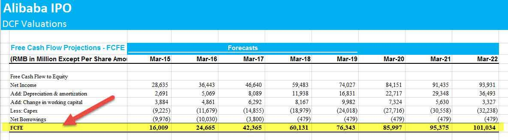

## Table of Contents

## What is Free Cash Flow to Equity (FCFE)?

Free Cash Flow to Equity (FCFE) is the amount of cash a company has left over after it has paid for all its expenses, investments, and debts. It's the money that's available to be paid out to the company's shareholders. Think of it as the money you have left in your pocket after you've paid all your bills and bought what you need. This is important for investors because it shows how much money the company can return to them.

FCFE is calculated by starting with the company's net income, then adding back any non-cash expenses like depreciation. Next, you subtract any money spent on capital expenditures, which are investments in things like new equipment or buildings. You also need to adjust for any changes in working capital, which is the money tied up in day-to-day operations. Finally, you subtract any debt payments the company makes. The result is the free cash flow to equity, which tells investors how much cash is available for dividends or stock buybacks.

## What are accounting profits?

Accounting profits are the total earnings a business makes after subtracting all the expenses from its total revenue. These expenses include costs like rent, salaries, and the cost of goods sold. The idea is to figure out how much money the business has left over after paying for everything it needs to operate. This number is important because it shows whether the business is making money or losing money according to standard accounting rules.

However, accounting profits don't always tell the whole story. They don't include some hidden costs, like the opportunity cost of using the owner's time or money instead of investing it elsewhere. For example, if you own a store and you could have earned more money working a different job, that lost potential income isn't counted in accounting profits. So, while accounting profits are useful for understanding a business's financial health from a traditional perspective, they might not give you the complete picture of its true profitability.

## How is FCFE calculated?

Free Cash Flow to Equity (FCFE) is the money left over after a company pays for everything it needs to run and grow. To figure it out, you start with the company's net income, which is what's left after all the bills are paid. Then, you add back any non-cash expenses, like depreciation, because these don't actually take money out of the company's pocket. Next, you subtract the money the company spends on big investments, like new machines or buildings, which is called capital expenditures. You also need to account for any changes in working capital, which is the money tied up in everyday business activities.

Finally, you need to subtract any payments the company makes on its debts. This is important because these payments reduce the cash available for shareholders. After making all these adjustments, what you're left with is the FCFE. This number shows how much cash the company can give back to its owners, either through dividends or by buying back its own stock. It's a key figure for investors because it tells them how much money they might get back from their investment in the company.

## How are accounting profits calculated?

Accounting profits are the money a business makes after paying for everything it needs to run. You start with the total revenue, which is all the money the business earns from selling its products or services. Then, you subtract all the costs, like rent, salaries, and the cost of goods sold. These costs are called expenses. What's left after subtracting all the expenses from the total revenue is the accounting profit. This number tells you if the business is making money or losing money according to standard accounting rules.

However, accounting profits don't tell the whole story. They don't include some hidden costs, like the opportunity cost of using the owner's time or money. For example, if you own a store and you could have earned more money working a different job, that lost potential income isn't counted in accounting profits. So, while accounting profits are useful for understanding a business's financial health from a traditional perspective, they might not give you the complete picture of its true profitability.

## What are the key differences between FCFE and accounting profits?

Free Cash Flow to Equity (FCFE) and accounting profits are two different ways to look at how well a business is doing. FCFE is the actual cash left over after a company pays for all its expenses, investments, and debts. It's the money that can be given back to the shareholders, either through dividends or by buying back the company's own stock. On the other hand, accounting profits are what's left after subtracting all the business's expenses from its total revenue. This number tells you if the business is making money according to standard accounting rules.

The main difference between FCFE and accounting profits is what they include and how they're used. FCFE is a measure of the real cash available to shareholders, so it's important for investors who want to know how much money they might get back from their investment. It includes adjustments for non-cash expenses like depreciation and takes into account capital expenditures and debt payments. Accounting profits, however, don't include these adjustments and focus more on the traditional profit and loss statement. They can be useful for understanding the business's financial health from an accounting perspective but don't show the actual cash flow as clearly as FCFE does.

## Why is FCFE important for investors?

FCFE is important for investors because it shows how much cash a company can give back to them. It's like the money left in your pocket after you've paid all your bills and bought what you need. Investors care about this because it tells them how much money they might get back from their investment, either through dividends or the company buying back its own stock. This can help investors decide if a company is a good place to put their money.

Also, FCFE is a good way to see if a company is really making money. Sometimes, a company can look profitable on paper but not have enough cash to pay its bills or grow. FCFE takes into account things like big investments and debt payments, so it gives a clearer picture of the company's financial health. This helps investors make smarter choices about where to invest their money.

## How can accounting profits mislead investors?

Accounting profits can mislead investors because they only show part of the story. They are calculated by subtracting all the expenses from the total revenue, which sounds good, but they don't include some important costs. For example, they don't account for the opportunity cost of the owner's time or money. If you own a business and could have made more money working a different job, that lost potential income isn't counted in accounting profits. This means a business might look profitable on paper, but it might not be as good an investment as it seems.

Another way accounting profits can be misleading is that they include non-cash expenses like depreciation. These expenses reduce the profit number but don't actually take cash out of the business. So, a company might have high accounting profits but still struggle to pay its bills or invest in growth. Investors who only look at accounting profits might think the company is doing well when it's actually not generating enough cash to be sustainable. This is why it's important for investors to look at other measures, like free cash flow to equity, to get a fuller picture of a company's financial health.

## What are the advantages of using FCFE over accounting profits for valuation?

FCFE is a better tool for figuring out how much a company is worth because it shows the real cash that can be given back to shareholders. Accounting profits can be tricky because they include things like depreciation, which don't actually take money out of the company's pocket. FCFE takes these non-cash expenses out of the equation, giving a clearer picture of the cash the company has left over after paying for everything it needs.

Another big advantage of using FCFE is that it considers the money spent on big investments, like new equipment or buildings, and the money used to pay off debts. These are important because they affect how much cash is really available for shareholders. Accounting profits don't account for these things, so they might make a company look more profitable than it really is. By looking at FCFE, investors can get a better idea of whether a company is a good investment and how much money they might get back.

## Can you provide an example of a company where FCFE and accounting profits significantly differ?

Let's take a look at a company like Amazon. In 2020, Amazon reported huge accounting profits. This made it look like they were making a lot of money. But when you look at their FCFE, it tells a different story. Amazon spends a lot of money on big investments, like building new warehouses and buying new technology. These investments are not counted in accounting profits, but they do reduce the FCFE. So, even though Amazon's accounting profits were high, their FCFE was much lower because they were spending a lot of cash on growing the business.

This difference is important for investors. If they only looked at Amazon's accounting profits, they might think the company was doing great and had a lot of cash to give back to shareholders. But the FCFE shows that a lot of that money was being used to grow the business instead. This means investors might not get as much money back in dividends or stock buybacks as they would expect from looking at the accounting profits alone. Understanding this difference helps investors make better decisions about whether to invest in Amazon or not.

## How do changes in working capital affect FCFE but not accounting profits?

Changes in working capital can make a big difference in a company's Free Cash Flow to Equity (FCFE) but don't show up in the same way in accounting profits. Working capital is the money a company has tied up in things like inventory, accounts receivable, and accounts payable. If a company spends more money on inventory or gives customers more time to pay, it uses up cash. This reduces the FCFE because there's less cash left over for shareholders after these expenses. On the other hand, if the company collects payments faster or reduces its inventory, it frees up cash, which increases the FCFE.

Accounting profits, however, don't reflect these changes in working capital in the same way. Accounting profits are calculated by subtracting all the expenses from the total revenue, but they don't directly account for the cash tied up in working capital. For example, if a company buys a lot of inventory, it might not change the accounting profit much because the cost of the inventory is spread out over time. But it does use up cash right away, which directly affects the FCFE. So, while accounting profits might show a company is profitable, the FCFE can tell a different story about the actual cash available to shareholders.

## What role do non-cash expenses play in the discrepancy between FCFE and accounting profits?

Non-cash expenses, like depreciation, are a big reason why FCFE and accounting profits can be different. When a company buys something big, like a machine, it doesn't pay for it all at once. Instead, it spreads out the cost over time through depreciation. This reduces the accounting profit because it's counted as an expense, but it doesn't take any actual cash out of the company's pocket. So, when you calculate FCFE, you add back these non-cash expenses because the company still has that cash to use.

This difference matters a lot for investors. If they only look at accounting profits, they might think the company has less money than it really does. But FCFE shows the real cash the company has after paying for everything, including those non-cash expenses. This helps investors see if the company can give them money back through dividends or stock buybacks. So, understanding how non-cash expenses affect FCFE and accounting profits helps investors make better choices about where to put their money.

## How can advanced financial modeling techniques be used to reconcile FCFE and accounting profits for more accurate forecasting?

Advanced financial modeling techniques can help investors and analysts get a better picture of a company's financial health by reconciling FCFE and accounting profits. One way to do this is by building detailed cash flow models that account for all the factors that affect FCFE, like capital expenditures, debt payments, and changes in working capital. These models can show how non-cash expenses, like depreciation, impact both FCFE and accounting profits. By adjusting for these non-cash items, analysts can see the real cash flow available to shareholders, which is important for accurate forecasting.

Another technique is scenario analysis, where different future situations are modeled to see how they might affect FCFE and accounting profits. For example, if a company plans to invest heavily in new projects, the model can show how this will reduce FCFE in the short term but might increase it in the long term if the projects are successful. By comparing these scenarios to the company's accounting profits, investors can better understand the timing and impact of these investments. This helps them make more informed decisions about the company's future performance and potential returns.

## What is Understanding Free Cash Flow to Equity (FCFE)?

Free Cash Flow to Equity (FCFE) is a vital financial metric that represents the cash available to equity shareholders after accounting for operational costs, reinvestments, and debt obligations. This measure is instrumental in assessing a company's financial strength from a shareholder's standpoint, as it reflects the actual cash that is accessible to distribute as dividends or to buy back shares.

The formula for calculating FCFE is expressed as follows:

$$
\text{FCFE} = \text{Net Income} + \text{Depreciation} - \text{Capital Expenditures} - \Delta \text{Working Capital} + \text{Net Borrowings}
$$

- **Net Income**: Represents the company's earnings after taxes and all expenses have been deducted. It forms the basis from which FCFE calculations start.

- **Depreciation**: Added back to net income as it is a non-cash expense that reduces reported earnings but does not affect cash flow.

- **Capital Expenditures (CapEx)**: These are the purchases of physical assets and investments made to maintain or expand a company's operations. Deducting CapEx reflects the capital outflow necessary for business operations and growth.

- **Change in Working Capital ($\Delta\text{Working Capital}$)**: This reflects the net change in a company’s current assets and liabilities. If working capital increases, it indicates a cash outflow, hence it is deducted, and vice versa.

- **Net Borrowings**: This is the total of any new debt issued minus the repayment of existing debt. It includes the cash inflow or outflow relevant to the company's financing activities.

By capturing a firm's [liquidity](/wiki/liquidity-risk-premium), FCFE provides crucial insights into its capability to maintain consistent dividend payouts and assess its potential for share buybacks. Companies with higher FCFE are often viewed favorably by investors as they indicate robust financial health and a greater likelihood of distributing significant shareholder returns.

## What are the differences between FCFE and Accounting Profits: A Comparative Analysis?

Free Cash Flow to Equity (FCFE) and accounting profits are two fundamental metrics employed by investors and financial analysts to gauge a company's financial health, but they offer different perspectives. FCFE provides a cash-based view, focusing on the actual funds available to equity shareholders after accounting for all operational costs, reinvestments, and debt obligations. This metric is particularly useful for evaluating a company's capability to undergo dividend distributions and share buybacks, which directly impact shareholder value.

In contrast, accounting profits refer to the net income recorded under generally accepted accounting principles (GAAP), emphasizing profitability after deducting explicit costs. While accounting profits are essential for conventional profitability assessments, they may not fully capture a company's true economic performance since they exclude aspects like operational reinvestments and changes in working capital that affect cash flow.

The formula for FCFE is given by:

$$
\text{FCFE} = \text{Net Income} + \text{Depreciation} - \text{Capital Expenditures} - \Delta \text{Working Capital} + \text{Net Borrowings}
$$

This formula illustrates how FCFE encompasses several additional components beyond net income, thus providing insights into a firm's liquidity and the real funds available to shareholders.

When FCFE and accounting profits are used together, they offer a more holistic view of a company's financial status. FCFE is critical when making decisions about cash distributions to shareholders, as it assesses the company's ability to sustain these outflows without jeopardizing financial stability. Meanwhile, accounting profits are vital for traditional profit assessment, tax calculations, and financial reporting.

Combining both metrics allows a comprehensive analysis of a company’s financial wellbeing. While accounting profits are crucial for understanding the profitability from an accounting perspective, the cash-centric nature of FCFE enables stakeholders to make informed decisions on liquidity and capital allocation, potentially leading to optimized investment strategies.

## References & Further Reading

[1]: Damodaran, A. (2006). ["Damodaran on Valuation: Security Analysis for Investment and Corporate Finance"](https://onlinelibrary.wiley.com/doi/book/10.1002/9781119201786). Wiley Finance.

[2]: Palepu, K. G., Healy, P. M., & Peek, E. (2019). ["Business Analysis and Valuation: IFRS Edition"](https://books.google.com/books/about/Business_Analysis_and_Valuation.html?id=PQG6zgEACAAJ). Cengage Learning.

[3]: Penman, S. H. (2010). ["Financial Statement Analysis and Security Valuation"](https://archive.org/details/financialstateme0000penm_r9u4). McGraw-Hill.

[4]: Greenblatt, J. (2010). ["The Little Book That Still Beats the Market"](https://archive.org/details/littlebookthatst0000gree). Wiley.

[5]: Pardo, R. (2008). ["The Evaluation and Optimization of Trading Strategies"](https://onlinelibrary.wiley.com/doi/book/10.1002/9781119196969). Wiley.

[6]: Bodie, Z., Kane, A., & Marcus, A. J. (2013). ["Investments"](https://books.google.com/books/about/EBOOK_Investments_Global_edition.html?id=BMsvEAAAQBAJ). McGraw-Hill Education. 

[7]: ["Financial Modeling"](https://en.wikipedia.org/wiki/Financial_modeling) by Simon Benninga.