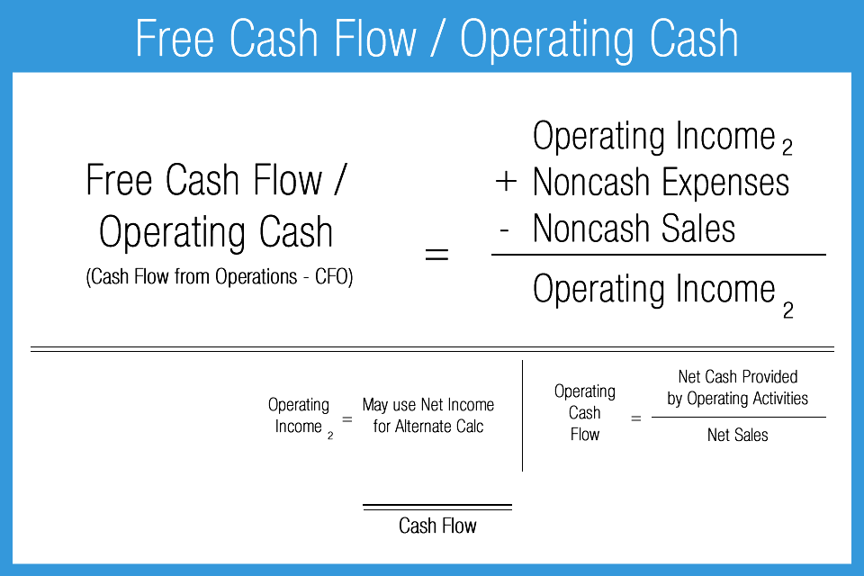

## Table of Contents

## What is Free Cash Flow (FCF)?

Free Cash Flow (FCF) is the money a company has left after paying for its operating expenses and capital expenditures. It's like the extra cash a business has after taking care of its basic needs, such as buying new equipment or maintaining its facilities. FCF is important because it shows how much money a company can use for other things, like paying down debt, buying back shares, or investing in new projects.

Investors and analysts pay close attention to FCF because it gives a clear picture of a company's financial health. If a company has a lot of FCF, it means it's generating more cash than it needs to run its business, which is a good sign. On the other hand, if a company has negative FCF, it might be struggling to cover its costs and could be in financial trouble. By looking at FCF, people can make better decisions about whether to invest in a company or not.

## What is Operating Cash Flow (OCF)?

Operating Cash Flow (OCF) is the money a company makes from its normal business activities. It shows how much cash a company is bringing in from things like selling products or services, after paying for the costs to run the business. OCF is important because it tells us if a company can make enough money from its main business to keep going and grow.

Think of OCF like the money you have left after paying your monthly bills. If you have money left over, you can save it or spend it on other things. For a company, a positive OCF means it's doing well enough to cover its day-to-day expenses and maybe even invest in new projects. If OCF is negative, it might mean the company is struggling to make ends meet.

## How is Free Cash Flow calculated?

Free Cash Flow (FCF) is calculated by starting with the Operating Cash Flow (OCF) and then subtracting the money spent on capital expenditures (CapEx). OCF is the cash a company makes from its regular business activities, like selling products or services, after paying for the costs to run the business. CapEx is the money spent on things like new equipment or buildings that help the company grow or keep running.

So, to find FCF, you take the OCF and subtract the CapEx. For example, if a company has an OCF of $100,000 and spends $30,000 on CapEx, the FCF would be $70,000. This number tells you how much cash the company has left over after taking care of its basic needs and investing in its future. It's important because it shows if a company can pay down debts, buy back shares, or invest in new projects.

## How is Operating Cash Flow calculated?

Operating Cash Flow (OCF) is the money a company makes from its everyday business activities, like selling products or services, after paying for the costs to run the business. To calculate OCF, you start with the company's net income, which is the profit after all expenses and taxes are paid. Then, you add back any non-cash expenses like depreciation and amortization. These are costs that reduce the company's profit on paper but don't actually take any cash out of the business.

Next, you adjust for changes in working capital, which includes things like inventory, accounts receivable, and accounts payable. If inventory goes up, you subtract that increase because it means the company spent cash to buy more goods. If accounts receivable go up, you subtract that too, because it means the company sold things but hasn't gotten paid yet. On the other hand, if accounts payable go up, you add that increase because it means the company delayed paying some bills, keeping more cash in the business. After making all these adjustments, you get the Operating Cash Flow, which shows how much cash the company is really bringing in from its main business activities.

## What are the main differences between FCF and OCF?

Free Cash Flow (FCF) and Operating Cash Flow (OCF) are both important measures of a company's financial health, but they tell us different things. OCF is the cash a company makes from its everyday business activities, like selling products or services, after paying for the costs to run the business. It shows if a company can make enough money from its main business to keep going and grow. Think of OCF like the money you have left after paying your monthly bills. If you have money left over, you can save it or spend it on other things. For a company, a positive OCF means it's doing well enough to cover its day-to-day expenses and maybe even invest in new projects.

FCF, on the other hand, takes OCF a step further by subtracting the money spent on capital expenditures (CapEx). CapEx is the money spent on things like new equipment or buildings that help the company grow or keep running. So, FCF is the money a company has left after paying for its operating expenses and capital expenditures. It's like the extra cash a business has after taking care of its basic needs. FCF is important because it shows how much money a company can use for other things, like paying down debt, buying back shares, or investing in new projects. In simple terms, OCF tells you how much cash a company makes from its main business, while FCF tells you how much extra cash is left after all the essential spending is done.

## Why is Free Cash Flow important for investors?

Free Cash Flow (FCF) is important for investors because it shows how much extra money a company has after paying for its everyday needs and big purchases. This extra money can be used for things like paying off debts, buying back shares, or investing in new projects. When a company has a lot of FCF, it's a good sign that it's doing well and has money to do more things that can make it even better in the future. Investors like to see high FCF because it means the company is healthy and has the cash to grow or reward shareholders.

On the other hand, if a company has negative FCF, it means it's spending more money than it's making. This can be a warning sign for investors because it might mean the company is struggling to keep up with its costs. Negative FCF can make it hard for a company to pay its bills or invest in new opportunities. By looking at FCF, investors can get a clear picture of a company's financial health and make smarter decisions about whether to buy, hold, or sell its stock.

## How does Operating Cash Flow reflect a company's operational efficiency?

Operating Cash Flow (OCF) shows how well a company is doing at making money from its main business. It's like looking at how much cash a company has left after paying for the things it needs to run every day. If a company has a high OCF, it means it's good at turning its sales into cash. This shows that the company is efficient because it can pay its bills, buy what it needs, and still have money left over. A high OCF is a good sign that the company is managing its day-to-day operations well.

On the other hand, if a company has a low or negative OCF, it might be struggling to make enough money to cover its costs. This can happen if the company is not selling enough products or services, or if it's spending too much on things like inventory or salaries. A low OCF can be a warning sign that the company needs to find ways to be more efficient. By looking at OCF, investors and managers can see how well the company is doing at its core business and make decisions to improve its operational efficiency.

## Can Free Cash Flow be negative, and what does it indicate?

Yes, Free Cash Flow (FCF) can be negative. This happens when a company spends more money than it makes after paying for its everyday needs and big purchases. Imagine you have a lemonade stand. If you spend more money on lemons, sugar, and cups than you make from selling lemonade, your FCF would be negative. For a company, negative FCF means it's using up its cash reserves or borrowing money to keep going.

Negative FCF isn't always a bad thing. Sometimes, a company might be investing a lot of money in new projects or equipment to grow bigger in the future. This can lead to negative FCF for a while, but if the investments pay off, the company could make more money later. However, if a company keeps having negative FCF without a good reason, it might be a sign that it's struggling to make enough money to cover its costs. This can worry investors because it might mean the company is in financial trouble.

## How do changes in working capital affect Operating Cash Flow?

Changes in working capital can make a big difference in a company's Operating Cash Flow (OCF). Working capital includes things like inventory, accounts receivable, and accounts payable. If a company buys more inventory, it spends cash, which makes OCF go down. If the company sells products but hasn't been paid yet, that's accounts receivable going up, and it also makes OCF go down because the cash isn't in the bank yet. On the other hand, if a company delays paying its bills, that's accounts payable going up, and it makes OCF go up because the company keeps more cash in its pocket for now.

So, when working capital changes, it can make OCF look better or worse. If a company manages its working capital well, it can keep more cash flowing in, which is good for OCF. But if it's not careful, like buying too much inventory or letting customers take too long to pay, it can hurt OCF. Understanding these changes helps investors and managers see if the company is doing a good job at managing its everyday money needs.

## What role do capital expenditures play in the difference between FCF and OCF?

Capital expenditures, or CapEx, are the big purchases a company makes, like buying new machines or building new factories. These costs are important because they help the company grow or keep running smoothly. When we talk about Free Cash Flow (FCF), we start with Operating Cash Flow (OCF) and then subtract CapEx. So, FCF is what's left after the company pays for its everyday needs and these big purchases. If a company spends a lot on CapEx, it can make FCF much smaller than OCF.

For example, if a company has an OCF of $100,000 but spends $30,000 on new equipment, its FCF would be $70,000. This difference shows how much extra cash the company has after taking care of all its needs. If a company is investing a lot in new projects, its FCF might be lower, but this could be good if those investments help the company make more money later. On the other hand, if a company keeps spending more on CapEx than it's making in OCF, it might run into financial trouble. So, understanding CapEx helps us see why FCF and OCF can be different and what it means for the company's future.

## How can Free Cash Flow be used to value a company?

Free Cash Flow (FCF) is a key number that investors use to figure out how much a company is worth. They do this by using a method called the Discounted Cash Flow (DCF) model. This model looks at the FCF a company is expected to make in the future and then brings those future cash flows back to today's value by using a discount rate. The discount rate is like an [interest rate](/wiki/interest-rate-trading-strategies) that shows how much risk there is in the company's future cash flows. If a company is expected to have high FCF in the future, its value today will be higher.

Using FCF to value a company is helpful because it shows if the company can make money after paying for everything it needs. It's like looking at how much extra cash a business has to spend on things like paying off debts, buying back shares, or starting new projects. If a company has a lot of FCF, it might be worth more because it has the money to do these things. But if FCF is low or negative, it might mean the company is struggling, and investors might think it's worth less. By looking at FCF, investors can get a good idea of a company's health and decide if it's a good investment.

## What advanced metrics can be derived from comparing FCF and OCF over time?

By comparing Free Cash Flow (FCF) and Operating Cash Flow (OCF) over time, investors can find out some advanced metrics that show how well a company is doing. One important metric is the FCF to OCF ratio. This ratio tells you how much of the money a company makes from its main business is left after it pays for big purchases like new equipment. If this ratio is high, it means the company is good at turning its everyday earnings into extra cash that can be used for other things like paying off debts or buying back shares. If the ratio is low or going down over time, it might mean the company is spending a lot on big projects and not making as much extra cash.

Another useful metric is the trend of FCF and OCF over time. By looking at these trends, investors can see if a company is getting better or worse at making money from its main business and how much extra cash it has. If both FCF and OCF are growing, it's a good sign that the company is doing well and getting more efficient. But if OCF is growing and FCF is not, it might mean the company is spending a lot on big purchases, which could be good if those investments pay off in the future. If both FCF and OCF are going down, it might be a warning sign that the company is struggling to make enough money to cover its costs.

## What is the difference between Understanding Operating Cash Flow and Free Cash Flow?

Operating cash flow (OCF) is a critical metric that provides insight into the cash generated or used by a company through its core business activities. This metric is essential for assessing a company's operational efficiency and immediate financial health. OCF is derived from the operating activities section of a company's cash flow statement and serves as a measure of the cash inflow and outflow directly related to business operations, excluding financing and investing activities. The calculation typically starts with net income, adjusting for non-cash items like depreciation and changes in working capital:

$$

\text{OCF} = \text{Net Income} + \text{Depreciation and Amortization} + \Delta \text{Working Capital}
$$

Free cash flow (FCF) offers a broader perspective, representing the cash a company can generate after accounting for the capital expenditures necessary to maintain or expand its asset base. FCF is crucial for understanding a company's financial flexibility, its ability to generate surplus cash, and its potential to increase shareholder value. The calculation can be expressed as:

$$

\text{FCF} = \text{OCF} - \text{Capital Expenditures}
$$

Both OCF and FCF are indispensable in assessing a company's cash-generating capabilities, but they differ fundamentally in scope. While OCF focuses strictly on operational cash flows, FCF allows stakeholders to gauge the company's discretionary cash after essential capital investments.

Businesses might manipulate these figures to craft favorable financial narratives. For example, delaying payments to suppliers or accelerating cash receipts can temporarily boost OCF, thereby creating an illusion of superior short-term financial health. Similarly, strategic shifts in capital expenditure timing can influence FCF, impacting perceptions of long-term financial strategy and stability.

Understanding these metrics, their calculations, and potential manipulations provides analysts and investors with a comprehensive framework for evaluating a company's financial standing and operational efficacy. These insights, when accurately assessed, guide informed decision-making and are pivotal in strategic financial planning.

## What is the role of cash flows in financial analysis?

Understanding cash flows is a pivotal component for investors and analysts looking to evaluate a company's true performance. Among the various measures, Operating Cash Flow (OCF) and Free Cash Flow (FCF) stand out for their significance in assessing [liquidity](/wiki/liquidity-risk-premium), profitability, and long-term sustainability.

**Operating Cash Flow (OCF)** is derived from the cash that a company generates through its regular operational activities. It provides a lens to measure operational efficiency by highlighting the cash inflow from core business operations. OCF can be calculated using the formula:

$$
\text{OCF} = \text{Net Income} + \text{Non-Cash Expenses} - \text{Changes in Working Capital}
$$

This metric allows stakeholders to understand how well the company is capitalizing on its business model without relying on external financing.

**Free Cash Flow (FCF)**, in contrast, measures the cash available after accounting for capital expenditures necessary to maintain or expand a company’s asset base. It serves as an indicator of a company's financial flexibility and its ability to fund growth, pay dividends, or reduce debt. The formula for FCF is:

$$
\text{FCF} = \text{OCF} - \text{Capital Expenditures}
$$

Both OCF and FCF are essential for determining a company's financial health. Analysis of these metrics offers insights into a company's liquidity, as a strong cash flow position implies that a company can meet its short-term liabilities without requiring additional external financing.

### Case Studies and Strategic Planning

Several instances demonstrate how companies leverage these metrics in financial reporting and strategic planning:

1. **Apple Inc.** uses robust OCF figures as a testament to its operational dominance in the technology sector, reflecting its ability to convert revenue into cash effectively. This allows Apple to engage in strategic reinvestment and shareholder returns through dividends and stock buybacks.

2. **General Electric (GE)** historically focused on FCF to demonstrate financial discipline and ensure sustainability. By highlighting strong FCF, GE underscores its capacity to invest in research and development while managing debt levels effectively.

Such practical applications of OCF and FCF emphasize their crucial role in not only illustrating operational success but also in formulating long-term strategic objectives.

### Common Pitfalls and Misconceptions

Despite their importance, there are common misinterpretations associated with cash flow analysis. One common misconception is equating high net income with strong cash flow. It's critical to recognize that net income includes non-cash items like depreciation and amortization, which do not affect cash flow directly.

Another pitfall is ignoring changes in working capital when analyzing OCF. Significant increases in accounts receivable, for instance, might inflate perceived profitability while constraining cash availability.

Thus, a thorough cash flow analysis, taking into account these nuances, is imperative for an accurate understanding of a company's financial standing. Analysts must integrate a comprehensive view by considering both internal operations and external economic conditions when interpreting these metrics.

In summary, operating and free cash flow are indispensable tools in financial analysis. They provide a multi-faceted view of a company's financial capabilities, guiding investment decisions and strategic planning while offering critical insights into financial health and the potential for growth.

## References & Further Reading

[1]: ["Cash Flows and Financial Performance"](https://www.researchgate.net/publication/330043527_Cash_flow_ratios_and_financial_performance_A_comparative_study) by the CFA Institute

[2]: ["Free Cash Flow, Capital Structure, and Company Value"](https://www.investopedia.com/terms/f/freecashflow.asp) by James A. Ohlson

[3]: ["Financial Statement Analysis and Security Valuation"](https://www.amazon.com/Financial-Statement-Analysis-Security-Valuation/dp/0073379662) by Stephen H. Penman

[4]: ["The Interpretation of Financial Statements"](https://online.hbs.edu/blog/post/how-to-read-financial-statements) by Benjamin Graham and Spencer B. Meredith

[5]: ["Principles of Corporate Finance"](https://www.mheducation.com/highered/product/Principles-of-Corporate-Finance-Brealey.html) by Richard A. Brealey, Stewart C. Myers, and Franklin Allen

[6]: Franco Modigliani and Merton H. Miller (1958). ["The Cost of Capital, Corporation Finance and the Theory of Investment."](https://www.aeaweb.org/aer/top20/48.3.261-297.pdf) The American Economic Review, 48(3), 261–297.

[7]: ["Investments"](https://www.investopedia.com/terms/i/investing.asp) by Zvi Bodie, Alex Kane, and Alan Marcus