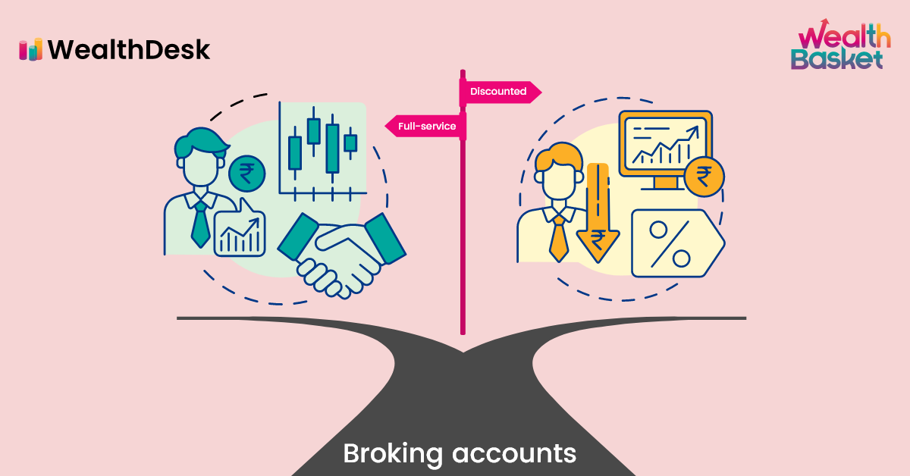

## Table of Contents

## What is a full-service brokerage?

A full-service brokerage is a type of financial firm that helps people buy and sell stocks, bonds, and other investments. They offer a lot more than just trading. They give you advice and help you plan your investments. They have experts who know a lot about the market and can help you make good choices.

These brokerages are good for people who want a lot of help with their investments. They can be more expensive than other types of brokerages because of all the extra services they offer. But for some people, the extra cost is worth it because they get personalized advice and feel more confident about their investment decisions.

## What is DIY investing?

DIY investing means you handle your own investments without help from a professional. You pick the stocks, bonds, or funds you want to buy and sell them on your own. You use online platforms or apps that let you trade without talking to a broker. This way, you have full control over your money and decisions.

It's good for people who like to learn about investing and want to save money on fees. But it can be risky if you don't know much about the market. You need to do your own research and stay updated on what's happening with your investments. If you're willing to put in the time and effort, DIY investing can be a rewarding way to grow your money.

## How does the level of service differ between full-service brokerages and DIY investing?

Full-service brokerages give you a lot of help with your investments. They have experts who can give you advice and help you make decisions. They will look at your money goals and suggest what to buy or sell. They also help you plan for the future, like saving for retirement. This kind of service costs more because you're paying for their time and knowledge. It's good for people who want a lot of guidance and don't mind paying extra for it.

DIY investing is when you do everything yourself. You use online platforms or apps to buy and sell investments. There's no one to give you advice, so you have to do your own research. This means you're in control of all your decisions, but it can be hard if you don't know much about investing. DIY investing is cheaper because you're not paying for advice, but it takes more time and effort. It's good for people who like to learn and want to keep costs low.

## What are the typical fees associated with full-service brokerages?

Full-service brokerages charge more than other types of brokerages because they give you a lot of help. They have fees for trading, which means every time you buy or sell a stock or bond, you pay a fee. This fee can be a flat amount, like $50 per trade, or it can be a percentage of the money you're investing. They also have fees for managing your account. This is a yearly fee that's a percentage of all the money in your account. It's usually around 1% to 2% of your total investments.

Another fee you might see is for financial advice. If you meet with an advisor to talk about your money goals and get a plan, you might have to pay for that time. This can be an hourly fee or a flat fee for the advice session. Some full-service brokerages also charge extra for things like research reports or special services. All these fees add up, so it's important to know what you're paying for and if it's worth it for the help you get.

## What are the costs involved in DIY investing?

DIY investing usually costs less than using a full-service brokerage. The main cost you'll see is trading fees. These are the fees you pay every time you buy or sell a stock, bond, or fund. Many online platforms now offer low or no trading fees, which makes DIY investing cheaper. You might also pay a small fee to keep your account open, but this is usually much less than what you'd pay at a full-service brokerage.

Another cost to think about is the expense ratio if you invest in mutual funds or ETFs. This is a yearly fee that's a small percentage of your investment, like 0.1% to 1%. It's taken out automatically, so you don't have to do anything, but it can add up over time. Overall, DIY investing is cheaper because you're not paying for advice or extra services, but you need to be careful and keep an eye on all the little fees that can add up.

## How does the investment advice quality compare between full-service brokerages and DIY platforms?

Full-service brokerages offer high-quality investment advice because they have experts who know a lot about the market. These experts can look at your money goals and help you make a plan that fits you. They can give you advice on what to buy or sell and help you understand why. This can be really helpful if you're new to investing or if you want someone else to guide you. The advice you get is personalized, which means it's made just for you based on your situation.

DIY platforms don't give you advice like full-service brokerages do. Instead, they give you tools and information that you can use to make your own decisions. You might find research reports or charts that can help you, but you have to figure out what it all means. The quality of the advice depends on how much you know and how much time you spend learning. If you're good at researching and understanding the market, you can make good choices on your own. But if you're not sure, you might make mistakes because there's no one to guide you.

## What types of investment products are available through full-service brokerages versus DIY investing?

Full-service brokerages offer a wide range of investment products. You can buy stocks, bonds, mutual funds, and ETFs. They also have access to more complex products like options, futures, and even some alternative investments like real estate investment trusts (REITs) or private equity. Because they have experts who know a lot about the market, they can help you choose the right products for your goals. If you want something specific or hard to find, they can usually get it for you.

DIY investing platforms also offer a good variety of investment products, but it might not be as wide as what full-service brokerages have. You can still buy stocks, bonds, mutual funds, and ETFs. Some platforms might also let you trade options or futures, but not all of them do. The main difference is that you have to pick and choose everything yourself. There's no one to guide you to the best products for your situation, so you need to do your own research to find what fits your needs.

## How does the ease of use compare between full-service brokerages and DIY investing platforms?

Full-service brokerages are usually easier to use for people who want a lot of help. They have experts who can explain things to you and help you make decisions. You can call them or meet with them to talk about your investments. They have websites and apps too, but the main thing is that you can get personal help whenever you need it. This can make investing feel less scary, especially if you're new to it. The downside is that all this help costs more money.

DIY investing platforms are designed for people who want to do everything themselves. They have websites and apps that are usually easy to use, with simple menus and tools to help you buy and sell investments. But you have to figure everything out on your own. There's no one to call if you have questions, so you need to be comfortable using technology and doing your own research. If you like being in control and don't mind spending time learning, DIY platforms can be a good choice. They're usually cheaper too, which is a big plus.

## What are the educational resources provided by full-service brokerages compared to DIY investing platforms?

Full-service brokerages often provide a lot of educational resources to help you learn about investing. They might have workshops, webinars, or one-on-one sessions where experts explain how the market works and how to make good investment choices. They also give you reports and research that can help you understand what's happening with your investments. This is good because it means you can learn while you invest, and you have someone to ask questions if you don't understand something.

DIY investing platforms also offer educational resources, but they might not be as personalized as what you get from full-service brokerages. You can usually find articles, videos, and tutorials on their websites or apps that teach you about investing. These resources are there to help you make your own decisions, but you have to use them on your own. There's no one to explain things to you directly, so you need to be good at learning on your own and figuring things out.

## How does the potential for investment returns differ between using a full-service brokerage and DIY investing?

The potential for investment returns can be similar whether you use a full-service brokerage or do DIY investing. Both ways let you buy the same kinds of investments, like stocks, bonds, and funds. What really matters is how well you pick your investments and how the market does. If you make good choices and the market goes up, you can make money no matter which method you use.

The difference comes in how much help you get and how much you pay in fees. Full-service brokerages have experts who can help you pick good investments, which might lead to better returns if you follow their advice. But you pay more in fees for this help, which can eat into your returns. With DIY investing, you save money on fees because you're doing everything yourself. If you're good at picking investments, you might keep more of your returns. But if you make bad choices without expert help, your returns could be lower.

## What are the tax implications of choosing between a full-service brokerage and DIY investing?

The tax implications of choosing between a full-service brokerage and DIY investing are pretty much the same. No matter which one you use, you'll have to pay taxes on any money you make from your investments. This includes things like capital gains tax if you sell an investment for more than you paid for it, and dividend tax if you get money from your investments. The amount of tax you pay depends on how much money you make and the tax laws where you live.

The main difference is how much you might end up paying in the end. Full-service brokerages charge more in fees, which means you might have less money left over after taxes. If you're paying a lot in fees, it could lower your overall returns, which means you might pay less in taxes but also keep less money. With DIY investing, you usually pay less in fees, so you might have more money left after taxes. But you need to be careful and make good choices to keep your taxes low and your returns high.

## How do the long-term benefits and drawbacks of full-service brokerages compare to DIY investing for different types of investors?

For beginners or people who want a lot of help, full-service brokerages can be really good. They have experts who can guide you and help you make a plan for your money. This can make you feel more confident about your investments, especially if you're new to it. They also give you a lot of educational resources, like workshops and one-on-one sessions, which can help you learn while you invest. But the big drawback is that full-service brokerages are more expensive. The fees can eat into your returns over time, so you might end up with less money in the long run. If you're okay with paying more for the help and guidance, a full-service brokerage might be worth it.

For people who like to do things themselves and want to save money, DIY investing can be a better choice. You get to make all the decisions and control your investments, which can be fun if you enjoy learning about the market. The fees are usually a lot lower, so you keep more of your money over time. But the downside is that you don't have anyone to help you if you make a mistake. You have to do your own research and be careful with your choices. If you're willing to put in the time and effort, DIY investing can lead to good returns without the high costs of a full-service brokerage.

## References & Further Reading

[1]: Bergstra, J., Bardenet, R., Bengio, Y., & Kégl, B. (2011). ["Algorithms for Hyper-Parameter Optimization."](https://papers.nips.cc/paper/4443-algorithms-for-hyper-parameter-optimization) Advances in Neural Information Processing Systems 24.

[2]: ["Advances in Financial Machine Learning"](https://www.amazon.com/Advances-Financial-Machine-Learning-Marcos/dp/1119482089) by Marcos Lopez de Prado

[3]: ["Evidence-Based Technical Analysis: Applying the Scientific Method and Statistical Inference to Trading Signals"](https://www.amazon.com/Evidence-Based-Technical-Analysis-Scientific-Statistical/dp/0470008741) by David Aronson

[4]: ["Machine Learning for Algorithmic Trading"](https://github.com/PacktPublishing/Machine-Learning-for-Algorithmic-Trading-Second-Edition) by Stefan Jansen

[5]: ["Quantitative Trading: How to Build Your Own Algorithmic Trading Business"](https://books.google.com/books/about/Quantitative_Trading.html?id=j70yEAAAQBAJ) by Ernest P. Chan