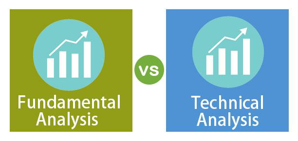

In the world of investment strategies, understanding the nuances of fundamental analysis, technical analysis, and algorithmic trading is crucial. These methodologies each offer distinct benefits, serving different investment goals and catering to varied trading styles. Fundamental analysis seeks to evaluate a company's intrinsic value through detailed examination of economic and financial factors, such as revenue, earnings, and future growth prospects. This method aims to identify undervalued or overvalued stocks to guide long-term investment decisions.

Technical analysis, by contrast, is centered on pattern and trend recognition using historical market data, forecasting future price movements. It is especially useful for short-term trading, providing traders with insights into potential entry and exit points based on statistical trends and chart patterns. Tools used in this analysis include technical indicators and support and resistance levels.



Algorithmic trading introduces algorithms to execute trades at speeds and frequencies that are impossible for human traders. This method excels in managing complex trading strategies with precision and reducing emotional biases. Common strategies in algorithmic trading involve arbitrage, trend-following, and market-making.

Understanding these analytical approaches allows investors to tailor strategies to their personal goals and risk appetites. Effective investment strategies often entail integrating multiple methods, leveraging the strengths of each to enhance decision-making and achieve balanced financial objectives. This article aims to clarify these techniques, evaluate their strengths and weaknesses, and offer insights into their practical applications in today's financial markets.

## Table of Contents

## Fundamental Analysis

Fundamental analysis involves evaluating a company's intrinsic value by assessing a variety of economic and financial factors. This process seeks to determine whether a stock is undervalued or overvalued, thus guiding long-term investment decisions. Investors use fundamental analysis to gain insights into a company's potential for future growth and financial health, which influences their investment strategies.

Key components of fundamental analysis include:

1. **Revenue and Earnings**: Revenue represents the total income generated by a company from its business activities, while earnings, or net income, are the profits remaining after all expenses have been deducted. Growth in revenue and earnings can indicate a company's expanding market presence and improved financial performance.

2. **Financial Statements**: These are crucial tools in fundamental analysis. The balance sheet provides a snapshot of a company's assets, liabilities, and shareholders' equity at a specific point in time. The income statement shows profitability over a period, detailing revenues, expenses, and net earnings. The cash flow statement highlights how a company generates and uses cash, crucial for understanding liquidity and financial flexibility.

3. **Economic Indicators**: External economic factors, such as GDP growth, unemployment rates, and inflation, can significantly impact a company's performance. A comprehensive fundamental analysis considers these indicators to assess the broader economic environment in which the company operates.

4. **Interest Rates**: They influence the cost of borrowing and the potential return on investment. Higher interest rates can increase borrowing costs and reduce corporate profits, whereas lower rates can stimulate investment and expansion.

5. **Qualitative Information**: Beyond quantitative metrics, qualitative factors like the quality of a company's management, its competitive advantages, industry position, and business model also play a vital role in determining intrinsic value. Assessing these elements requires a thorough understanding of both the industry landscape and the specific company's strategic approach.

The intrinsic value derived from [fundamental analysis](/wiki/fundamental-analysis) is then compared against the current market price to identify investment opportunities. If the intrinsic value is higher than the market price, the stock may be considered undervalued and potentially a good investment. Conversely, if the intrinsic value is lower, the stock may be overvalued, signaling caution.

## Criticisms of Fundamental Analysis

Fundamental analysis, while a cornerstone of many investment strategies, faces several criticisms. Firstly, the process can be time-consuming and subjective, primarily because it requires sifting through extensive data sets, including financial statements, industry reports, and economic indicators. This necessity for comprehensive data analysis means investors must not only gather but also accurately interpret a wealth of information, which can lead to differing conclusions based on individual biases and assumptions.

Moreover, fundamental analysis operates under the assumption of market efficiency, positing that markets reflect all available information. This premise can falter when unexpected events or market sentiments cause price fluctuations that do not align with a company's intrinsic value. For example, market reactions to geopolitical events or sudden shifts in industry trends might not be accurately captured by fundamental analysis, which can often focus more heavily on historical and quantitative data rather than real-time developments.

The long-term focus of fundamental analysis is another noteworthy limitation. Investors employing this strategy typically seek to understand a company's value over an extended period, which may not align with the goals of traders interested in short-term gains. The analysis may overlook the transient factors that short-term traders exploit, rendering it less applicable for those looking to profit from acute market movements. This focus might lead to missed opportunities for traders who rely on [momentum](/wiki/momentum) or quick price changes to generate returns.

In summary, while fundamental analysis provides a deep understanding of a company's financial health and potential, its time-intensive nature, reliance on assumed market efficiency, and predominantly long-term outlook can limit its applicability in dynamic and rapidly changing markets.

## Technical Analysis

Technical analysis is a method of evaluating securities by analyzing statistical data generated by market activity, such as past prices and [volume](/wiki/volume-trading-strategy). Unlike fundamental analysis, which seeks to understand a company's underlying value, technical analysis focuses on identifying patterns and trends that may suggest future price movements. This approach is widely used in short-term trading, as it assists in determining optimal entry and [exit](/wiki/exit-strategy) points based on identified statistical trends and chart formations.

Traders who utilize technical analysis often rely on a variety of tools to interpret market data. Key among these tools are technical indicators, which are mathematical calculations based on historical price, volume, or open interest information. Examples of popular technical indicators include moving averages, relative strength index (RSI), and the moving average convergence divergence (MACD).

Volume analysis is another critical component of technical analysis. It examines the trading volume of a security to ascertain its strength or weakness. High trading volume accompanying a price increase is generally interpreted as a strong signal, suggesting that a trend may continue. Conversely, a price change on low trading volume might indicate a lack of conviction, suggesting that the trend might not sustain.

Support and resistance levels are further foundational concepts in technical analysis. Support levels are price points where a declining stock tends to stop falling and may even reverse due to a concentration of demand. Resistance levels, on the other hand, are price points where a rising stock tends to stop climbing and may reverse because of a concentration of supply. Identifying these levels can help traders predict potential turning points in price movements.

The statistical nature of technical analysis makes it particularly suitable for [algorithmic trading](/wiki/algorithmic-trading), where predefined criteria and market signals can be programmed to automate trading decisions. This is exemplified in the use of trading algorithms that execute trades based on technical signals automatically.

In Python, libraries such as `pandas` for data manipulation and `matplotlib` for data visualization can be integral to implementing technical analysis strategies. For example, calculating a simple moving average (SMA) might be as straightforward as:

```python
import pandas as pd

# Sample price data
prices = pd.Series([100, 101, 102, 103, 104])

# Calculate the simple moving average
sma = prices.rolling(window=3).mean()
print(sma)
```

This code snippet calculates the 3-day simple moving average of a series of stock prices, which traders might use to identify a potential trend in price movements. Through such techniques, technical analysis provides traders with a systematic approach to understanding and forecasting market behavior based on historical data.

## Criticisms of Technical Analysis

Technical analysis, despite its widespread use among traders, faces significant criticisms. One primary critique is its perceived similarity to forecasting future weather conditions based solely on historical weather patterns, raising concerns about its reliability. This analogy underscores the inherent unpredictability and variability of financial markets, which can often render historical data an unreliable predictor of future price movements.

A major argument against technical analysis is rooted in the efficient market hypothesis (EMH), which posits that financial markets are informationally efficient. According to EMH, asset prices fully reflect all available information, making it challenging for any analysis, including technical analysis, to consistently achieve above-average returns. In an efficient market, any patterns or trends identified by technical analysis would already be factored into current prices, nullifying any potential advantage.

The subjective nature of technical analysis introduces further challenges. Different analysts may interpret the same charts or data sets differently, leading to inconsistent conclusions. This subjectivity can be problematic, as it depends heavily on the personal skills and experiences of the trader rather than objective, empirical evidence.

Moreover, technical analysis is criticized for its vulnerability to noise and the generation of false signals. Financial markets are influenced by a myriad of factors, including economic news, geopolitical events, and investor sentiment, which can create excessive [volatility](/wiki/volatility-trading-strategies). This volatility often results in noise that can obscure genuine trends and patterns, making it difficult for traders to distinguish between true signals and random market fluctuations.

In essence, while technical analysis offers valuable insights for short-term trading strategies, its reliance on historical data, susceptibility to subjective interpretation, and exposure to market noise present substantial limitations. These criticisms highlight the importance of using technical analysis as part of a broader, more diversified approach to trading and investment decision-making.

## Algorithmic Trading

Algorithmic trading is a method of executing trades that employs complex computer algorithms which take into account pre-defined criteria and market signals. This approach has gained prominence due to its ability to operate with speed and efficiency, addressing some of the limitations inherent in human trading.

The core advantage of algorithmic trading lies in its speed and precision. Algorithms can analyze vast arrays of market data almost instantaneously, allowing for the rapid execution of trades that would be impossible for a human trader. This high speed is crucial in modern financial markets where price discrepancies can vanish in milliseconds. By automating the trading process, algorithmic trading reduces human error and emotional biases, which are often detrimental to traditional trading approaches.

Algorithmic trading can handle complex strategies that require real-time data processing and execution. These strategies are often based on quantitative analysis and are designed to exploit market inefficiencies. Popular strategies include [arbitrage](/wiki/arbitrage), trend-following, and market-making.

1. **Arbitrage**: Arbitrage exploits the price differences of identical or similar financial instruments on different markets or in different forms. An algorithm can detect these discrepancies and execute trades simultaneously, capitalizing on the minute price differences without any market risk.

2. **Trend-following**: This strategy aims to identify and capitalize on price movements that follow a discernible trend. Using moving averages and momentum indicators, algorithms can automatically recognize when a trend begins or ends, thus optimizing entry and exit points.

3. **Market-making**: Market-making involves placing buy and sell orders simultaneously to capture the spread between the bid and ask price. Algorithms can dynamically adjust orders based on current market conditions, maintaining a balance of orders that optimize profit while managing risk.

In conclusion, algorithmic trading has transformed financial markets by offering a highly efficient and data-driven approach to trading. It continues to evolve with advancements in technology and data analysis, becoming increasingly indispensable for both institutional and individual traders seeking to enhance their trading strategies and outcomes.

## Blending Analysis Techniques

Blending fundamental and technical analyses has become an increasingly popular strategy among investors aiming to optimize their trading outcomes. By integrating these two approaches, investors can leverage the strengths of each to counteract their individual weaknesses, thus achieving a more balanced and effective investment strategy.

Fundamental analysis provides a deep dive into the intrinsic value of a company by examining various economic and financial factors. This long-term focus helps investors identify undervalued or overvalued stocks, thereby informing investment decisions that are grounded in expected future performance. On the other hand, technical analysis offers insights into market behavior through the study of past price patterns and trends. This approach is particularly valuable for timing market entries and exits, making it an essential tool for short-term traders.

By combining these methods, a hybrid strategy emerges that allows for a comprehensive risk assessment and precise investment timing. Investors can use fundamental analysis to ensure that the companies they invest in are financially sound, while technical analysis can guide the timing of these investments to maximize returns.

Algorithmic trading further enhances this blend by automating the decision-making process. Algorithms can be programmed to incorporate both fundamental and technical indicators, executing trades based on predefined criteria. This combination facilitates quick reactions to market changes, minimizes human error, and reduces emotional biases that often affect trading decisions. For instance, an algorithm might be designed to buy a stock only if its technical indicators show upward momentum and its fundamentals demonstrate undervaluation.

The integration of these techniques provides a diversified approach that caters to both short- and long-term investment goals. By exploiting the strengths of fundamental analysis for security selection and technical analysis for timing, coupled with the speed and efficiency of algorithmic trading, investors can craft a robust trading strategy adaptable to various market conditions.

## Conclusion

No single method universally guarantees success in trading and investing, given the complex and dynamic nature of financial markets. Instead, a well-rounded strategy often involves understanding and integrating multiple approaches tailored to individual investment goals, market contexts, and risk appetites. Fundamental analysis offers insights into a company's intrinsic value by examining economic factors, serving long-term investors. In contrast, technical analysis aids short-term traders in identifying patterns and trends in market data. Algorithmic trading, with its speed and efficiency, can further enhance these strategies by automating decision-making processes, allowing for the management of complex trading strategies and minimizing human error.

As the financial landscape continues to evolve, being informed and adaptive is crucial for navigating modern finance complexities. Integrating these methods allows investors to harness the unique strengths of each approach, creating a balanced portfolio that can withstand market volatility. Whether it's mitigating risks or capitalizing on emerging opportunities, a versatile strategy that evolves with market changes is indispensable for optimizing returns. This adaptability ensures that investors remain resilient against unforeseen market shifts, positioning them for success in a continuously changing environment.

## References & Further Reading

[1]: Damodaran, A. (2012). ["Investment Valuation: Tools and Techniques for Determining the Value of Any Asset"](https://books.google.com/books/about/Investment_Valuation.html?id=5SRHAAAAQBAJ) by Aswath Damodaran.

[2]: Murphy, J. J. (1999). ["Technical Analysis of the Financial Markets: A Comprehensive Guide to Trading Methods and Applications"](https://archive.org/details/technicalanalysi0000murp) by John J. Murphy.

[3]: Schwager, J. D. (1993). ["Market Wizards: Interviews with Top Traders"](https://www.amazon.com/Market-Wizards-Jack-D-Schwager/dp/0887306101) by Jack D. Schwager.

[4]: Narang, R. K. (2013). ["Inside the Black Box: A Simple Guide to Quantitative and High-Frequency Trading"](https://onlinelibrary.wiley.com/doi/book/10.1002/9781118662717) by Rishi K. Narang.

[5]: ["Algorithmic and High-Frequency Trading"](https://www.cambridge.org/us/universitypress/subjects/mathematics/mathematical-finance/algorithmic-and-high-frequency-trading) by Álvaro Cartea, Sebastian Jaimungal, and José Penalva.