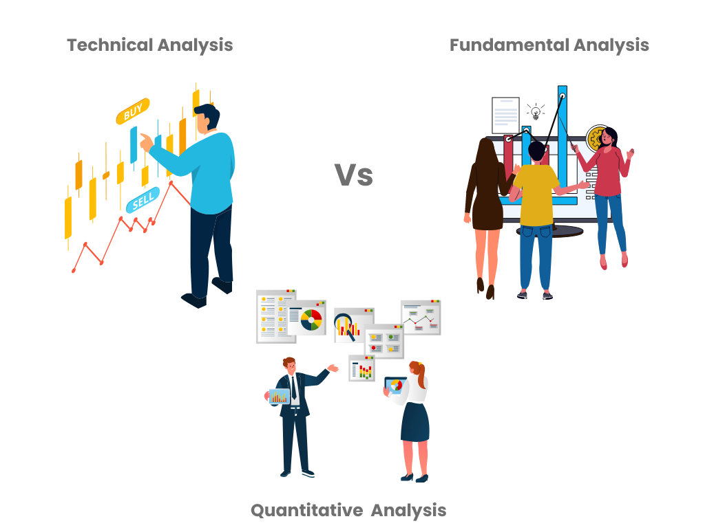

## Table of Contents

## What is fundamental analysis and how does it apply to long-term investments?

Fundamental analysis is a way to look at a company to see if it's a good investment. It involves studying things like the company's financial statements, how much money it makes, and how it's run. By looking at these details, investors can figure out if the company's stock is priced right or if it's a good buy. This method helps investors understand the real value of a company, not just what the stock market says it's worth.

When it comes to long-term investments, fundamental analysis is very important. If you plan to keep your money in a stock for many years, you want to be sure the company will do well over time. By using fundamental analysis, you can pick companies that have strong finances and good growth potential. This helps you avoid companies that might look good now but could have problems later. In the end, fundamental analysis helps long-term investors build a solid and reliable investment portfolio.

## What is technical analysis and how is it used in making long-term investment decisions?

Technical analysis is a way to study stock prices by looking at charts and patterns. Instead of focusing on a company's financial health, technical analysts look at past price movements and trading volumes to predict where the stock price might go next. They use tools like moving averages, trend lines, and various chart patterns to make their predictions. This method is based on the idea that history tends to repeat itself and that all known information about a stock is already reflected in its price.

When it comes to making long-term investment decisions, technical analysis can be helpful but is often used alongside [fundamental analysis](/wiki/fundamental-analysis). While technical analysis can help identify good entry and [exit](/wiki/exit-strategy) points for buying and selling stocks, it might not be enough on its own for long-term investing. Investors often use technical analysis to confirm what they've learned from fundamental analysis. For example, if a company looks strong based on its financials, technical analysis can help decide the best time to buy the stock. This way, long-term investors can use both methods to build a more informed and strategic investment plan.

## What is quantitative analysis and how does it differ from fundamental and technical analysis?

Quantitative analysis is a way of looking at investments by using math and numbers. It involves using data and computer models to make decisions about buying or selling stocks. People who use quantitative analysis, called quants, look at things like historical price data, financial ratios, and other statistics to find patterns and make predictions. They often build complex models that can handle a lot of data to find the best investment opportunities. This method is very different from fundamental and technical analysis because it relies more on numbers and less on looking at the company itself or its stock chart patterns.

Fundamental analysis and quantitative analysis both look at the company's financials, but in different ways. Fundamental analysis involves studying the company's financial statements, management, and market position to understand its value. It's more about understanding the story behind the numbers. On the other hand, quantitative analysis takes those numbers and uses them in math models to find patterns that might predict future performance. While fundamental analysts might spend time reading a company's annual report, quants would use the data from that report in their models.

Technical analysis is even more different from quantitative analysis. Technical analysts focus on stock price charts and trading volumes to predict future price movements. They look for patterns in the charts to decide when to buy or sell. Unlike quantitative analysis, which uses a lot of data and math, technical analysis is more about visual patterns and less about complex models. Quants might use some technical indicators in their models, but their approach is much broader and more data-driven.

## How can fundamental analysis help in assessing the long-term value of a stock?

Fundamental analysis helps in assessing the long-term value of a stock by looking at the company's financial health and future growth potential. By studying things like the company's earnings, debts, and how it's run, investors can figure out if the stock is priced right. If a company has strong earnings and a good plan for the future, its stock might be a good long-term investment. On the other hand, if a company has a lot of debt or is losing money, its stock might not be a good choice for the long term.

This method helps investors see beyond the day-to-day changes in stock prices. Instead of worrying about short-term ups and downs, investors can focus on whether the company is likely to do well over many years. By understanding the real value of a company, investors can make smarter decisions about which stocks to hold onto for a long time. This way, they can build a portfolio that is strong and likely to grow over the long term.

## Can technical analysis predict long-term market trends effectively? Why or why not?

Technical analysis can help spot some long-term trends, but it's not perfect for predicting them over many years. It looks at past price movements and chart patterns to guess where prices might go next. This can be useful for seeing if a stock is going up or down over time. But, the stock market can be affected by lots of things like new laws, big world events, or changes in the economy that technical analysis might not see coming. So, while it can give you some clues about long-term trends, it's not always right.

Also, technical analysis works best for shorter periods, like days or weeks, rather than years. It's good for finding the best times to buy or sell a stock, but it doesn't tell you much about how well a company is doing or if it will grow in the future. For long-term investing, it's usually better to use technical analysis along with fundamental analysis, which looks at the company's financial health and growth potential. This way, you get a fuller picture of whether a stock is a good long-term investment.

## How does quantitative analysis use statistical models to forecast long-term investment outcomes?

Quantitative analysis uses statistical models to forecast long-term investment outcomes by looking at a lot of data from the past. These models take in numbers like stock prices, how much money a company makes, and other financial details. They then use math to find patterns in this data. For example, a model might look at how a stock has moved in the past and use that to guess where it might go in the future. By using these patterns, quants can make predictions about whether a stock will go up or down over many years.

However, these models are not perfect. They work well when the future is a lot like the past, but they can miss big changes that no one saw coming. Things like new laws, big world events, or changes in the economy can mess up the predictions. So, while quantitative analysis can give good guesses about long-term investment outcomes, it's always a good idea to use it along with other ways of looking at investments, like fundamental analysis. This helps investors get a fuller picture of what might happen in the long run.

## What are the key financial ratios used in fundamental analysis for long-term investment?

Fundamental analysis uses several key financial ratios to help figure out if a stock is a good long-term investment. One important ratio is the Price-to-Earnings (P/E) ratio, which shows how much investors are willing to pay for each dollar of a company's earnings. A lower P/E ratio might mean the stock is a good deal, while a higher one might mean it's overpriced. Another useful ratio is the Debt-to-Equity (D/E) ratio, which tells you how much debt a company has compared to its equity. A high D/E ratio can be a warning sign that the company might have trouble paying its debts, which isn't good for long-term investing.

Other important ratios include the Return on Equity (ROE), which shows how well a company is using the money invested by shareholders to make profits. A high ROE is usually a good sign that the company is doing well. The Price-to-Book (P/B) ratio compares a stock's market value to its book value, which can help you see if the stock is undervalued or overvalued. Finally, the Dividend Yield tells you how much a company pays out in dividends each year compared to its stock price. A higher yield can be attractive for long-term investors looking for regular income from their investments.

These ratios help investors get a clear picture of a company's financial health and growth potential. By looking at them, investors can make smarter decisions about which stocks to hold onto for the long term. It's not just about [picking](/wiki/asset-class-picking) stocks that look good now, but about finding companies that will keep doing well and growing over many years.

## What technical indicators are most useful for long-term investment strategies?

For long-term investment strategies, some technical indicators can be really helpful. One of the most useful is the moving average. It smooths out the ups and downs of a stock's price over time, making it easier to see the overall trend. For long-term investors, looking at a longer-term moving average, like the 200-day moving average, can help them see if a stock is in a long-term uptrend or downtrend. If the stock price stays above the 200-day moving average, it might be a good sign to hold onto the stock for the long term.

Another helpful indicator for long-term investing is the Relative Strength Index (RSI). The RSI measures how fast a stock's price is going up or down, and it can show if a stock is overbought or oversold. If the RSI is above 70, it might mean the stock is overbought and could go down soon. If it's below 30, it might be oversold and could go up. Long-term investors can use the RSI to see if a stock is at a good price to buy or if it's time to sell. While these indicators are useful, they work best when used with other ways of looking at investments, like fundamental analysis.

## How do quantitative analysts develop algorithms for long-term investment analysis?

Quantitative analysts, or quants, develop algorithms for long-term investment analysis by using a lot of data and math. They start by collecting information about stocks, like past prices, how much money companies make, and other financial details. Then, they use this data to build models that can find patterns and make predictions. These models use things like statistics and [machine learning](/wiki/machine-learning) to guess where stock prices might go in the future. The goal is to create a system that can look at all this data and come up with good ideas about which stocks to buy and hold for a long time.

Once they have a model, quants test it to see how well it works. They might use past data to see if the model could have predicted what actually happened. If the model does well, they might start using it for real investments. But, they also keep an eye on how the model is doing over time and make changes if needed. This is because the stock market can change a lot, and what worked in the past might not work in the future. By always updating and improving their models, quants try to stay ahead and make good long-term investment choices.

## What are the limitations of using fundamental analysis for long-term investments?

Fundamental analysis has some limitations when it comes to long-term investments. One big problem is that it depends a lot on the information that's out there. If the company's financial reports are not accurate or if important information is missing, the analysis can be way off. Also, fundamental analysis looks at things like earnings and growth, but these can be hard to predict far into the future. Things like changes in the economy, new laws, or big world events can mess up even the best guesses about how a company will do over many years.

Another limitation is that fundamental analysis can be slow. It takes a lot of time to go through all the financial details and understand what they mean. By the time an investor finishes their analysis, the stock price might have already changed a lot. Plus, fundamental analysis doesn't tell you the best time to buy or sell a stock. It can help you see if a stock is a good long-term investment, but it doesn't give you the timing. So, while it's a great tool for understanding a company's value, it has its limits when it comes to making long-term investment decisions.

## How might technical analysis fail in predicting long-term market movements?

Technical analysis might fail in predicting long-term market movements because it only looks at past price patterns and charts. It doesn't take into account big things that can change the market, like new laws, world events, or changes in the economy. These things can make stock prices go up or down in ways that technical analysis can't see coming. So, while it can help spot some trends, it might miss the big picture over many years.

Also, technical analysis works better for short periods, like days or weeks, rather than years. It's good at finding the best times to buy or sell a stock, but it doesn't tell you much about how well a company is doing or if it will grow in the future. For long-term investing, it's important to know if a company is strong and has good growth potential. Technical analysis alone can't give you that information, so it might not be the best tool for making long-term investment decisions.

## What advanced quantitative techniques are available for expert long-term investors?

Expert long-term investors can use advanced quantitative techniques like machine learning and [artificial intelligence](/wiki/ai-artificial-intelligence) to make better investment choices. These techniques let them look at huge amounts of data and find patterns that are hard to see with just human eyes. For example, machine learning can learn from past stock prices and other financial data to predict what might happen in the future. This can help investors find stocks that are likely to do well over many years. But, these methods need a lot of computer power and special skills to use them right.

Another advanced technique is called [factor](/wiki/factor-investing) investing. This means looking at different factors, like how big a company is, how much it grows, or how much risk it takes, to pick stocks. By studying these factors, investors can build a portfolio that matches what they want, like more growth or less risk. Factor investing can help long-term investors make their money grow over time by choosing the right mix of stocks. Just like machine learning, factor investing needs a lot of data and math to work well.

## What is Technical Analysis?

Technical analysis is a method used by investors to evaluate securities by analyzing [statistics](/wiki/bayesian-statistics) generated by market activity, such as past prices and [volume](/wiki/volume-trading-strategy). This approach is primarily based on the idea that past trading activity and price changes of a security can be valuable indicators of the security's future price movements. Unlike fundamental analysis, which focuses on the intrinsic value of a security, technical analysis looks at patterns and trends on charts to predict future movement.

One of the core concepts in technical analysis is the identification of patterns within price charts. Patterns often reflect the psychology of market participants, with common formations including head and shoulders, double tops and bottoms, and trend lines. For example, a "head and shoulders" pattern can suggest a reversal of a trend, while "double tops and bottoms" may indicate a continuation. These patterns provide visual cues that investors use to make buy or sell decisions.

Another important aspect of technical analysis is the use of technical indicators, which are mathematical calculations based on price, volume, or open interest of a security. Common technical indicators include moving averages, relative strength index (RSI), and moving average convergence divergence (MACD). Moving averages help smooth out price data by creating a continuously updated average price. For instance, the formula for a simple moving average (SMA) over a period $n$ is:

$$
SMA = \frac{P_1 + P_2 + \ldots + P_n}{n}
$$

where $P_i$ represents the closing price of each period within the time frame considered. The RSI, on the other hand, measures the velocity and change of price movements, providing a metric to evaluate whether a security is overbought or oversold.

Moreover, while technical analysis is typically associated with short-term trading, it can indeed complement fundamental analysis for long-term investment strategies. By combining both methods, investors can gain insights into the potential future price direction, enabling them to make more informed decisions and better timing their transactions.

Charts and patterns form the backbone of technical analysis. Bar charts, line charts, and candlestick charts are commonly used to illustrate price movements over specific periods. Candlestick charts, in particular, offer detailed insights with each candlestick representing an open, high, low, and close price. This visualization helps investors quickly grasp market conditions and potential turning points.

Despite its benefits, technical analysis is not infallible and presumes that historical price movements will repeat. Thus, investors often use it in conjunction with other strategies to mitigate risks and maximize their portfolio's potential return. By integrating technical analysis with other investment approaches, investors can navigate market complexities and enhance their investment strategies over the long term.

## What is Quantitative Analysis?

Quantitative analysis utilizes numerical and statistical techniques to evaluate a company's financial data, providing insights into its performance and valuation. This form of analysis is pivotal in deciphering complex financial information and drawing meaningful conclusions about investment opportunities.

One of the primary metrics employed in quantitative analysis is Earnings Per Share (EPS). EPS measures a company's profitability and is calculated by dividing a company's net income by the number of outstanding shares. The formula is as follows:

$$
\text{EPS} = \frac{\text{Net Income} - \text{Dividends on Preferred Stock}}{\text{Average Outstanding Shares}}
$$

EPS is a critical indicator of a company's financial health, as it reflects the portion of a company's profit allocated to each outstanding share, guiding investors in assessing the company's profitability over time.

Another significant tool is the Discounted Cash Flow (DCF) analysis, which estimates a company's value based on its expected future cash flows. The DCF method involves projecting future cash flows and discounting them back to their present value using a discount rate, typically the company's weighted average cost of capital (WACC). This can be represented by the formula:

$$
\text{DCF} = \sum \left( \frac{\text{CF}_t}{(1 + r)^t} \right)
$$

where $\text{CF}_t$ is the cash flow in time period $t$, and $r$ is the discount rate.

Although quantitative analysis heavily depends on mathematical computations, it is essential to incorporate qualitative insights to form a holistic view of an investment. Factors such as management quality, brand reputation, and market conditions, although not easily quantifiable, can significantly impact a business's future performance and should be considered alongside quantitative metrics.

By reinforcing decisions made through both fundamental and technical analyses, quantitative analysis provides a more balanced perspective. It allows investors to cross-validate findings, offering reassurance in areas that purely numerical data could overlook. Consequently, incorporating quantitative analysis into investment strategies can enhance the due diligence process, ensuring informed and balanced decision-making.

## References & Further Reading

[1]: Bergstra, J., Bardenet, R., Bengio, Y., & Kégl, B. (2011). ["Algorithms for Hyper-Parameter Optimization."](https://dl.acm.org/doi/10.5555/2986459.2986743) Advances in Neural Information Processing Systems 24.

[2]: ["Advances in Financial Machine Learning"](https://www.amazon.com/Advances-Financial-Machine-Learning-Marcos/dp/1119482089) by Marcos Lopez de Prado

[3]: ["Evidence-Based Technical Analysis: Applying the Scientific Method and Statistical Inference to Trading Signals"](https://www.amazon.com/Evidence-Based-Technical-Analysis-Scientific-Statistical/dp/0470008741) by David Aronson

[4]: ["Machine Learning for Algorithmic Trading"](https://github.com/stefan-jansen/machine-learning-for-trading) by Stefan Jansen

[5]: ["Quantitative Trading: How to Build Your Own Algorithmic Trading Business"](https://www.amazon.com/Quantitative-Trading-Build-Algorithmic-Business/dp/1119800064) by Ernest P. Chan