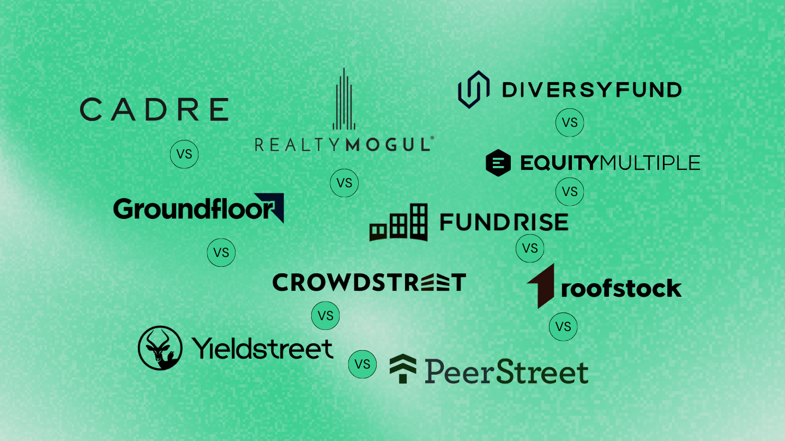

## Table of Contents

## What are Fundrise and CrowdStreet?

Fundrise is a company that helps people invest in real estate. They make it easy for anyone to invest, even if you don't have a lot of money. Fundrise picks the real estate projects and you can invest in them through their website. This way, you can own a part of big real estate projects without buying a whole building yourself.

CrowdStreet is another company that lets people invest in real estate. Like Fundrise, you can invest through their website. CrowdStreet focuses on commercial real estate, like office buildings and apartments. They let you choose which specific projects you want to invest in, so you have more control over where your money goes.

## How do Fundrise and CrowdStreet differ in terms of investment types?

Fundrise offers a variety of real estate investment options, but they mostly focus on residential properties like apartments and single-family homes. They also have some commercial real estate projects, but their main goal is to make it easy for everyday people to invest in real estate. Fundrise creates funds that you can invest in, and these funds are made up of different real estate projects. This means you don't pick the individual properties; Fundrise does that for you.

CrowdStreet, on the other hand, focuses more on commercial real estate. This includes things like office buildings, shopping centers, and large apartment complexes. With CrowdStreet, you have more control over your investments because you can choose which specific projects you want to invest in. Instead of investing in a fund, you invest directly in the properties you like. This can be more hands-on and might be better if you want to pick and choose your investments carefully.

## What are the minimum investment requirements for Fundrise and CrowdStreet?

Fundrise has a low minimum investment requirement, which makes it easier for people to start investing in real estate. You can begin with as little as $10 if you choose their starter plan. This is great for people who don't have a lot of money to invest but still want to get into real estate. Fundrise's other plans might have higher minimums, but they are still generally lower than many traditional real estate investments.

CrowdStreet, on the other hand, usually has higher minimum investment requirements. Most of their deals start at around $25,000, though some might be lower or higher depending on the specific project. This means CrowdStreet might be better for people who have more money to invest and want to choose specific commercial real estate projects.

## How do the fee structures compare between Fundrise and CrowdStreet?

Fundrise charges fees for managing your investments. They have an annual asset management fee that can be around 0.85% of your investment. They also have other fees like an advisory fee and fees for when they buy or sell properties. But Fundrise tries to keep these fees low so more of your money can grow. Their fee structure is designed to be clear and easy to understand, making it good for people new to investing.

CrowdStreet's fees can be different for each project you invest in. Usually, there's an asset management fee, which might be around 1% to 2% of your investment each year. There can also be other fees like acquisition fees when they buy a property and disposition fees when they sell it. Since you pick specific projects on CrowdStreet, the fees can change a lot depending on what you choose. This means you need to look closely at the fees for each project before you invest.

## What are the typical returns one might expect from investments on Fundrise and CrowdStreet?

With Fundrise, the returns you might expect can vary, but they often aim for around 8% to 12% annually. This means if you invest $1,000, you could earn between $80 and $120 in a year. Fundrise focuses on long-term growth, so they try to pick projects that will do well over time. Remember, these are just targets, and real returns can be higher or lower based on how the real estate market does.

CrowdStreet's returns can also vary a lot, depending on which projects you choose. They often aim for returns between 10% and 20% a year. If you invest $25,000 in a project, you might earn between $2,500 and $5,000 in a year. Because you pick specific projects on CrowdStreet, your returns can be different from one investment to another. Just like with Fundrise, these are targets, and your actual returns will depend on how well the projects do.

## How do the risk profiles of investments on Fundrise and CrowdStreet differ?

Fundrise tries to keep things safer by spreading your money across lots of different real estate projects. They pick the projects for you, so you don't have to worry about choosing the wrong one. This can make it less risky because if one project doesn't do well, the others might still be okay. But remember, all investments have some risk, and real estate can go up and down. Fundrise's focus on long-term growth means you might have to wait a while to see big returns, but it can be less scary for people new to investing.

CrowdStreet can be riskier because you pick the projects yourself. If you choose a project that doesn't do well, you could lose money. The good news is that you might also make more money if you pick a great project. CrowdStreet's focus on commercial real estate means the risks can be different from Fundrise's residential focus. Commercial projects can be affected by things like the economy and how businesses are doing, which can make them more unpredictable. So, CrowdStreet might be better for people who know more about real estate and are okay with taking on more risk.

## What kind of due diligence processes do Fundrise and CrowdStreet employ?

Fundrise does a lot of checking before they pick real estate projects for you to invest in. They look at things like how much money the project might make, how much it will cost, and if it's a good idea. They also check the people who are running the project to make sure they know what they're doing. Fundrise wants to make sure the projects are safe and will grow over time, so they do a lot of homework before letting you invest.

CrowdStreet also does a lot of checking, but they let you pick the projects you want to invest in. They look at the same things as Fundrise, like how much money a project might make and how much it will cost. They also check the people in charge of the project. But because you pick the projects on CrowdStreet, they give you a lot of information about each one so you can do your own checking too. This means you have to be more careful and make sure you understand the risks before you invest.

## How accessible are Fundrise and CrowdStreet to beginner investors?

Fundrise is very easy for beginners to use. You can start with just $10, which means you don't need a lot of money to get started. Fundrise picks the real estate projects for you, so you don't have to worry about choosing the right ones. They also explain everything clearly on their website, making it simple to understand what you're investing in. This makes Fundrise a good choice if you're new to investing and want something easy and less risky.

CrowdStreet can be a bit harder for beginners. The minimum investment is usually much higher, around $25,000, so you need more money to start. Also, you have to pick the projects yourself, which means you need to do more research and understand the risks. CrowdStreet gives you a lot of information about each project, but it can be overwhelming if you're new to investing. So, CrowdStreet might be better for people who already know a bit about real estate and are okay with taking on more risk.

## What are the tax implications of investing through Fundrise versus CrowdStreet?

When you invest through Fundrise, you might have to pay taxes on the money you make from your investments. Fundrise sends you a tax form each year that tells you how much you earned. The money you make can be taxed as regular income or as capital gains, depending on how long you held the investment. If you hold it for more than a year, it's usually taxed at a lower rate. Fundrise tries to keep things simple, but you might need to talk to a tax person to understand everything.

Investing through CrowdStreet can also mean you have to pay taxes on your earnings. Like Fundrise, CrowdStreet will send you a tax form to help you figure out what you owe. Since you pick the projects yourself on CrowdStreet, the tax situation can be different for each one. You might get money from rent, which is taxed as regular income, or you might make money when the property is sold, which could be taxed as capital gains. Because CrowdStreet investments can be more complicated, it's a good idea to talk to a tax expert to make sure you're doing everything right.

## How do the platforms handle liquidity and the ability to sell investments?

Fundrise makes it a bit hard to sell your investments quickly. They have something called a "redemption plan" where you can ask to get your money back, but they might not let you do it right away. It can take a few months or even longer. Fundrise does this because they want to keep the money in the real estate projects for a long time to help them grow. So, if you need your money fast, Fundrise might not be the best choice.

CrowdStreet is different because it can be even harder to sell your investments. Since you pick specific projects, you have to wait until those projects are done or sold before you can get your money back. This can take years. CrowdStreet doesn't have a way to sell your investment early like Fundrise does. So, if you invest with CrowdStreet, you need to be okay with waiting a long time before you can use your money again.

## What advanced features or tools does each platform offer to experienced investors?

Fundrise offers some cool tools for people who know a lot about investing. They have a thing called the "Fundrise iPO" where you can buy shares in new real estate projects before they start. This can be exciting for experienced investors who want to get in early. Fundrise also gives you a dashboard where you can see all your investments and how they're doing. This helps you keep track of everything easily. Plus, they have a feature called "Fundrise Pro" which gives you more detailed reports and lets you invest in more advanced ways.

CrowdStreet has tools that are great for people who really understand real estate. They let you pick and choose which projects you want to invest in, so you can use your knowledge to find the best ones. CrowdStreet gives you a lot of information about each project, like financial reports and market analysis, which can help you make smart choices. They also have a tool called "CrowdStreet Insights" that gives you data and trends about the real estate market, so you can see what's happening and plan your investments better.

## How do Fundrise and CrowdStreet integrate with other financial planning and management tools?

Fundrise makes it easy to keep track of your investments by letting you connect to other financial tools. You can link Fundrise to apps like Mint or Personal Capital, so you can see all your money in one place. This helps you manage your budget and see how your real estate investments fit into your overall financial plan. Fundrise also gives you reports and updates that you can share with your financial advisor, making it easier to plan your future.

CrowdStreet doesn't connect directly to other financial planning apps like Fundrise does. But you can still keep track of your CrowdStreet investments by downloading reports and adding them to your own spreadsheets or other financial tools. This way, you can see how your real estate investments are doing alongside your other money. CrowdStreet gives you a lot of detailed information about your investments, which you can use to talk to your financial advisor and make better plans for your money.

## References & Further Reading

[1]: Bergstra, J., Bardenet, R., Bengio, Y., & Kégl, B. (2011). ["Algorithms for Hyper-Parameter Optimization."](https://papers.nips.cc/paper/4443-algorithms-for-hyper-parameter-optimization) Advances in Neural Information Processing Systems 24.

[2]: ["Advances in Financial Machine Learning"](https://www.amazon.com/Advances-Financial-Machine-Learning-Marcos/dp/1119482089) by Marcos Lopez de Prado

[3]: ["Evidence-Based Technical Analysis: Applying the Scientific Method and Statistical Inference to Trading Signals"](https://www.amazon.com/Evidence-Based-Technical-Analysis-Scientific-Statistical/dp/0470008741) by David Aronson

[4]: ["Machine Learning for Algorithmic Trading"](https://github.com/stefan-jansen/machine-learning-for-trading) by Stefan Jansen

[5]: ["Quantitative Trading: How to Build Your Own Algorithmic Trading Business"](https://www.amazon.com/Quantitative-Trading-Build-Algorithmic-Business/dp/1119800064) by Ernest P. Chan