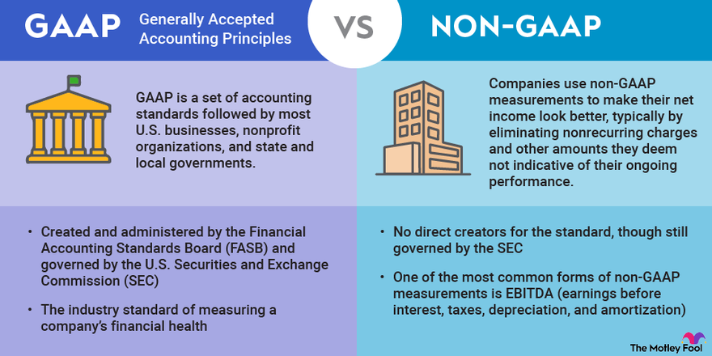

## Table of Contents

## What is GAAP?

GAAP stands for Generally Accepted Accounting Principles. It is a set of rules and guidelines that companies in the United States must follow when they prepare their financial statements. These rules help make sure that the financial information is clear, consistent, and easy to understand for everyone who looks at it, like investors and regulators.

GAAP covers a lot of different areas, like how to record income, expenses, assets, and liabilities. It also tells companies how to present this information in their financial reports. By following GAAP, companies can make sure that their financial statements are accurate and fair, which helps build trust with people who use this information to make decisions.

## What are Non-GAAP reporting standards?

Non-GAAP reporting standards are ways for companies to show their financial performance that don't follow the usual GAAP rules. Companies use these methods to give a clearer picture of how they are doing, without the strict rules of GAAP. For example, they might leave out one-time costs or other unusual expenses that they think don't show their normal business operations.

These non-GAAP measures can be helpful because they let investors see the company's performance in a way that might be more relevant to their day-to-day business. However, it's important for investors to be careful because non-GAAP numbers can sometimes be used to make a company look better than it really is. That's why companies have to explain why they use these measures and show the GAAP numbers too, so people can compare them.

## Why are GAAP and Non-GAAP standards important in financial reporting?

GAAP and Non-GAAP standards are important in financial reporting because they help make sure that the financial information companies share is clear and trustworthy. GAAP, or Generally Accepted Accounting Principles, gives companies a set of rules to follow so that everyone can understand their financial statements in the same way. This is really helpful for investors, regulators, and anyone else who needs to look at these reports to make decisions. When everyone follows the same rules, it's easier to compare different companies and see how they are doing.

Non-GAAP standards are also important because they let companies show their financial performance in a way that might be more useful for understanding their day-to-day business. Sometimes, GAAP rules can make a company's financials look different from how they are really doing, especially if there are one-time costs or other unusual expenses. By using Non-GAAP measures, companies can give a clearer picture of their normal operations. But it's important for companies to be honest and clear about why they use these measures, and they should always show the GAAP numbers too, so people can see the full story.

## What are the main differences between GAAP and Non-GAAP?

GAAP, which stands for Generally Accepted Accounting Principles, is a set of strict rules that companies in the U.S. have to follow when they make their financial reports. These rules make sure that everyone understands the financial statements the same way, which is important for investors and regulators. GAAP covers everything from how to record income and expenses to how to show assets and liabilities on the balance sheet. By following these rules, companies can make their financial statements clear and easy to compare with other companies.

Non-GAAP measures, on the other hand, let companies show their financial performance in a way that might be more useful for understanding their regular business activities. These measures can leave out one-time costs or unusual expenses that GAAP would include, giving a clearer picture of how the company is doing day-to-day. But because Non-GAAP numbers can sometimes make a company look better than it really is, it's important for companies to explain why they use these measures and to show the GAAP numbers too. This way, people can see the full picture and make better decisions.

## How does GAAP ensure consistency in financial reporting?

GAAP helps make sure that financial reports are the same across different companies by setting clear rules everyone has to follow. When companies use GAAP, they all record their income, expenses, assets, and liabilities in the same way. This means that if you look at the financial statements from two different companies, you can compare them easily because they're following the same set of rules. It's like everyone playing a game with the same rulebook, so the results are fair and easy to understand.

Having these consistent rules also helps people trust the financial information they see. Investors, regulators, and others who use these reports know that the numbers are put together in a standard way. This makes it easier for them to make decisions because they can rely on the information being accurate and fair. Without GAAP, it would be hard to know if one company's numbers were better or worse than another's because they might be using different ways to report their financials.

## What types of adjustments are commonly made in Non-GAAP reporting?

In Non-GAAP reporting, companies often make adjustments to show their financial performance in a way that better reflects their day-to-day business. One common adjustment is to remove one-time costs or unusual expenses. These might be things like restructuring charges, costs from mergers and acquisitions, or big legal settlements. By taking these out, the company can show what its regular operations look like without these big, unusual costs getting in the way.

Another adjustment often seen in Non-GAAP reporting is to change how stock-based compensation is shown. Under GAAP, this is counted as an expense, but some companies think it doesn't really cost them anything in cash, so they leave it out of their Non-GAAP numbers. This can make their profits look higher because they're not counting this expense. Companies might also adjust for things like amortization of intangible assets or other non-cash charges that they feel don't reflect their ongoing business performance.

These adjustments help investors see the company's core performance more clearly, but they can also be tricky. It's important for companies to explain why they're making these changes and to show the GAAP numbers too. This way, people can compare the Non-GAAP numbers with the GAAP ones and get a full picture of the company's financial health.

## Can you provide examples of companies that use Non-GAAP measures?

Many big companies use Non-GAAP measures to show their financial performance in a way that they think better reflects their regular business. For example, Apple often uses Non-GAAP measures to show its earnings without including stock-based compensation and other one-time expenses. This helps investors see how much money Apple is making from selling iPhones and other products, without the impact of costs that don't happen every day.

Another company that uses Non-GAAP measures is Amazon. Amazon adjusts its earnings to exclude things like stock-based compensation and costs from buying other companies. By doing this, Amazon can show investors how its core business, like selling things online and running AWS, is doing without these extra costs getting in the way. This helps people understand the real performance of Amazon's main operations.

## How do investors and analysts use GAAP and Non-GAAP figures differently?

Investors and analysts use GAAP figures to get a clear and standard picture of a company's financial health. GAAP numbers help them compare different companies easily because everyone has to follow the same rules. When looking at GAAP figures, investors can see the full picture of a company's income, expenses, assets, and liabilities. This helps them make decisions based on a complete and fair view of the company's performance. They can also use these numbers to check if the company is following the rules and to see how it's doing compared to other companies in the same industry.

On the other hand, Non-GAAP figures are used by investors and analysts to get a better understanding of a company's day-to-day business. These numbers often leave out one-time costs or unusual expenses, so investors can see how the company is doing without these extra things getting in the way. For example, if a company had a big legal settlement one year, Non-GAAP figures would show what the company's regular business looks like without that cost. Analysts might use these numbers to predict future earnings or to see how well the company is managing its core operations. But they have to be careful because Non-GAAP numbers can sometimes make a company look better than it really is, so they always look at both GAAP and Non-GAAP figures to get the full story.

## What are the regulatory requirements for using Non-GAAP measures?

Companies have to follow certain rules when they use Non-GAAP measures. The U.S. Securities and Exchange Commission (SEC) says that if a company wants to use Non-GAAP numbers in their reports, they must also show the GAAP numbers right next to them. This helps investors see both sets of numbers and compare them easily. Companies also need to explain why they are using Non-GAAP measures and what adjustments they made to the GAAP numbers. This makes sure that investors understand why the company thinks these measures are useful.

The SEC also has rules about what companies can and can't do with Non-GAAP measures. For example, companies can't make their Non-GAAP numbers look better than their GAAP numbers by leaving out things that make them look bad. They also can't use Non-GAAP measures to hide important information that investors need to know. By having these rules, the SEC helps make sure that companies are honest and clear when they use Non-GAAP measures, so investors can trust the information they are given.

## How can discrepancies between GAAP and Non-GAAP figures affect a company's valuation?

Discrepancies between GAAP and Non-GAAP figures can really change how investors see a company's value. When a company shows higher earnings using Non-GAAP measures, it might look more profitable and attractive to investors. This can make the company's stock price go up because people think it's doing better than it really is. But if investors only look at the Non-GAAP numbers and ignore the GAAP ones, they might not see the whole picture. They could be missing out on important costs or expenses that the company is leaving out, which could make the company seem more valuable than it really is.

On the other hand, if the GAAP numbers show lower earnings because of one-time costs or other unusual expenses, the company might look less profitable. This can make the stock price go down because investors might think the company is not doing as well. But if the Non-GAAP numbers show that the company's regular business is doing okay, some investors might still see the company as a good investment. It's important for investors to look at both sets of numbers to understand the true value of the company and make smart decisions about whether to buy or sell the stock.

## What are the potential pitfalls and criticisms of Non-GAAP reporting?

One big problem with Non-GAAP reporting is that companies can use it to make their financials look better than they really are. They might leave out costs or expenses that make them look bad, so their earnings seem higher. This can trick investors into thinking the company is doing better than it really is. If investors only look at the Non-GAAP numbers and ignore the GAAP ones, they might not see the whole picture and could make bad decisions about buying or selling the company's stock.

Another criticism of Non-GAAP reporting is that it can be hard to compare different companies. Since each company can choose what to include or leave out in their Non-GAAP numbers, the measures can be different from one company to another. This makes it tough for investors to see how one company is doing compared to another. Even though companies have to explain why they use Non-GAAP measures and show the GAAP numbers too, it can still be confusing and might lead to mistakes when investors try to understand the company's real performance.

## How can a company effectively communicate the reasons for using Non-GAAP measures to stakeholders?

A company can effectively communicate the reasons for using Non-GAAP measures to stakeholders by being clear and honest about what they're doing. They should explain in simple terms why they think these measures give a better picture of their regular business. For example, they might say that they're leaving out one-time costs like a big legal settlement because it doesn't show how their business usually performs. By giving clear examples and reasons, stakeholders can understand why the company thinks these measures are helpful.

It's also important for the company to show both the GAAP and Non-GAAP numbers side by side. This way, stakeholders can see the full story and compare the two sets of numbers easily. The company should also talk about any rules they have to follow when using Non-GAAP measures, like the ones from the SEC. By being open and clear about why they're using these measures and showing all the important numbers, the company can help stakeholders trust the information they're given and make better decisions.

## What is the comparative analysis between GAAP and Non-GAAP?

GAAP, or Generally Accepted Accounting Principles, offers a standardized framework that ensures consistency and reliability in financial reporting. This uniformity is invaluable for investors who rely on dependable financial statements to make informed decisions. By adhering to GAAP, companies provide a comprehensive view of their financial status, encompassed within a universal set of guidelines that facilitate comparability across different entities and time periods. This comparability cements investor trust, minimizing uncertainties related to financial disclosures.

On the other hand, Non-GAAP measures offer companies the flexibility to present financial information that may be more reflective of their core operational performance. Non-GAAP metrics typically exclude items considered extraneous to the daily operations, such as one-time expenses, acquisition costs, and restructuring charges. This approach aims to strip away the noise associated with non-recurring costs, offering a lens into the company's future potential and operational efficiency.

For example, a common adjustment in Non-GAAP reporting is the exclusion of stock-based compensation. While GAAP considers such compensation an expense impacting earnings, Non-GAAP metrics might treat it as a non-cash adjustment, underlining the operational cash flow unaffected by this accounting expense. Such adjustments can be represented by the formula:

$$
\text{Non-GAAP Net Income} = \text{GAAP Net Income} + \text{Excluded Items}
$$

Here, 'Excluded Items' may encompass stock-based compensation, restructuring charges, or other specified costs, helping stakeholders grasp the underlying operational strengths or weaknesses without distortion from atypical expenses.

The choice between GAAP and Non-GAAP reporting hinges on an organization's objectives. GAAP's inclusivity and transparency cater to stakeholders who prioritize comprehensive and stable representations of financial performance. In contrast, Non-GAAP reporting provides an opportunity for management to showcase aspects of financial health unclouded by complex accounting standards and infrequent events, appealing to investors focused on future growth trajectories. The strategy of utilizing both methods may enhance financial analysis, encouraging a balanced view that acknowledges both historical performance and future projections.

## What are the investor perspectives and implications?

Investors frequently rely on Non-GAAP measures because they provide a perspective on a company's operational health, unburdened by the constraints and intricacies of formal accounting conventions. While GAAP metrics offer consistency and comparability, they can sometimes mask underlying operational performances with non-recurring costs and accounting adjustments. Non-GAAP metrics address this by excluding these elements, which often makes them appealing for investors seeking to assess the core profitability and operational efficiency of a company.

Non-GAAP figures typically adjust financial results by removing certain expenses and incomes, which can include stock-based compensation, restructuring charges, and impairment losses. This adjusted view can better highlight ongoing operational performance. For instance, investors might be more interested in a company's operational cash flow or earnings before interest, taxes, depreciation, and amortization (EBITDA) when evaluating operational efficiency and profitability. Representing these key measures mathematically, we have:

$$
\text{EBITDA} = \text{Net Income} + \text{Interest} + \text{Taxes} + \text{Depreciation} + \text{Amortization}
$$

However, while the appeal of Non-GAAP measures is clear, there is a need for investors to approach these figures with caution. The potential for bias arises from the discretionary nature of these metrics, where companies have significant latitude in determining which costs to exclude. As a result, careful evaluation of these adjustments is essential. Investors must scrutinize the justifications for excluding certain expenses, weighing whether these exclusions are reasonable and consistent over time.

Transparency and clear communication are paramount for maintaining investor confidence when using Non-GAAP figures. Companies that utilize Non-GAAP metrics should ensure thorough disclosure of how these measures are calculated and provide detailed explanations for any adjustments made. Furthermore, it is crucial for organizations to maintain consistency in how they report these metrics from period to period, thereby enabling investors to perform reliable comparisons and trend analysis.

In conclusion, while Non-GAAP measures can offer clearer insights into a company's operational health, it is essential for investors to carefully consider the implications of these metrics. By maintaining transparency and consistency, companies can help investors make informed decisions, thereby fostering a more trustworthy investment environment.

## References & Further Reading

[1]: ["Understanding the Impact of Non-GAAP Measures: The SEC's Regulatory Approach."](https://www2.deloitte.com/us/en/pages/audit/articles/a-roadmap-to-non-gaap-financial-measures.html) U.S. Securities and Exchange Commission.

[2]: ["The Use of Non-GAAP Financial Measures in Financial Reporting."](https://accountinginsights.org/the-impact-of-non-gaap-measures-on-financial-reporting/) CFA Institute.

[3]: ["IFRS and US GAAP: Similarities and Differences."](https://viewpoint.pwc.com/dt/us/en/pwc/accounting_guides/ifrs_and_us_gaap_sim/assets/pwcifrsusgaap1124.pdf) PricewaterhouseCoopers (PwC).

[4]: ["Advances in Financial Machine Learning"](https://www.amazon.com/Advances-Financial-Machine-Learning-Marcos/dp/1119482089) by Marcos Lopez de Prado.

[5]: ["Machine Learning for Algorithmic Trading"](https://github.com/PacktPublishing/Machine-Learning-for-Algorithmic-Trading-Second-Edition) by Stefan Jansen.

[6]: ["Financial Reporting Manual"](https://www.sec.gov/files/cf-frm.pdf) U.S. Securities and Exchange Commission. 

[7]: ["Quantitative Trading: How to Build Your Own Algorithmic Trading Business"](https://books.google.com/books/about/Quantitative_Trading.html?id=j70yEAAAQBAJ) by Ernest P. Chan.