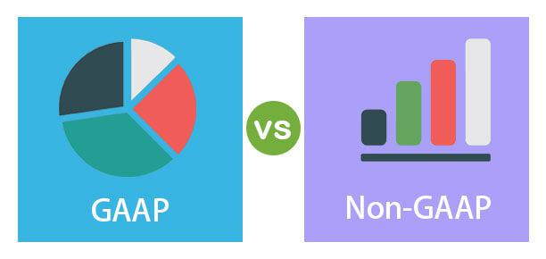

In today's financial marketplace, a clear understanding of financial reporting is essential for investors, analysts, and stakeholders alike. This article aims to explore the complexities present within financial reporting, specifically highlighting the differences between Generally Accepted Accounting Principles (GAAP) and Non-GAAP metrics, and their potential implications in algorithmic trading. As financial systems worldwide continue to advance, there's a growing emphasis on shifting towards more transparent and accurate financial measures. This shift is vital to ensure that investors and analysts can make informed decisions about the entities they choose to invest in. As algorithmic trading becomes more prevalent, the need to understand both GAAP and Non-GAAP figures becomes increasingly important, since these metrics can significantly influence trading algorithms and investment strategies. Transparency in financial reporting not only enhances the reliability of financial data but also plays a crucial role in maintaining the integrity and efficiency of global financial markets.

## Table of Contents



## Understanding GAAP and Non-GAAP

GAAP, or Generally Accepted Accounting Principles, serve as a comprehensive set of guidelines that standardize financial reporting processes, enhancing transparency and comparability across different organizations within the United States. These principles cover a wide array of accounting practices, including revenue recognition, balance sheet items, and outstanding share measurements, ensuring consistency and reliability in the presentation of financial information. This consistency is crucial for investors, regulators, and analysts who rely on this standardization to make informed decisions.

Conversely, Non-GAAP metrics offer a distinct approach, often used by companies to provide a more customized view of their financial health, focusing primarily on operational performance. While GAAP requires the inclusion of all operational and non-operational costs, Non-GAAP adjustments typically exclude irregular or exceptional expenses such as restructuring costs, asset impairments, or other one-time charges. This exclusion aims to reflect a company's underlying performance by removing items that do not recur regularly and may distort the picture of ongoing operations.

For instance, companies might use Non-GAAP measures to strip out volatility in costs or earnings associated with mergers and acquisitions, thus presenting an alternative metric that could show a steadier progression of profitability. This practice, while useful for painting a clearer picture, can also be subjective, as the choice of what to exclude lies within management's discretion. Therefore, it is essential for stakeholders to critically assess these Non-GAAP figures in conjunction with GAAP reports to obtain a balanced view of a company's financial status. 

In practice, financial analysts may employ formulas or algorithms that incorporate both GAAP and Non-GAAP figures to forecast future earnings or cash flows. This dual approach enables a more nuanced analysis, providing both the standardized consistency of GAAP and the situational clarity of Non-GAAP metrics. The combination of these measures offers a richer, more holistic understanding of a firm’s economic standing and operational trajectory.

## The Prevalence and Impact of Non-GAAP in Financial Reporting

Non-GAAP measures have become a pivotal component of financial reporting, significantly influencing how financial data is interpreted. Unlike GAAP, which focuses on standardization and comparability, Non-GAAP metrics are tailored to exclude non-operational costs, providing a more precise view of a company's core operational performance. This focus is especially critical for investors and analysts who seek to understand the sustainable [earning](/wiki/earning-announcement) capacity of a business, devoid of the noise that can sometimes accompany GAAP figures.

The increasing reliance on Non-GAAP measures can be attributed to their ability to present a clearer picture of operational efficiency and profitability. For instance, adjustments in Non-GAAP reporting generally exclude one-time expenses, restructuring costs, or non-cash charges like amortization, offering a purer view of ongoing business activities. This approach appeals to stakeholders interested in the potential future earnings of a company, which are more indicative of its health than backward-looking GAAP figures.

In recent years, the prevalence of Non-GAAP measures has grown substantially. A striking example is observed in the Dow Jones Industrial Average, where over 80% of the companies reported Non-GAAP Earnings Per Share (EPS) figures that surpassed their GAAP EPS in 2023. This trend underscores the widespread acceptance and utilization of Non-GAAP metrics among major firms, highlighting their importance for external reporting and strategic internal analysis.

Although Non-GAAP measures provide valuable insights, they are not without controversy. The lack of standardized definitions can lead to inconsistent applications among companies, potentially confusing stakeholders. Therefore, it is crucial for these measures to be accompanied by detailed reconciliations to GAAP figures to maintain transparency and reliability. The interplay between these two reporting frameworks—GAAP and Non-GAAP—continues to fuel discussions regarding their respective merits and implications for financial analysis.

## Comparative Analysis: GAAP vs. Non-GAAP

GAAP, or Generally Accepted Accounting Principles, offers a standardized framework that ensures consistency and reliability in financial reporting. This uniformity is invaluable for investors who rely on dependable financial statements to make informed decisions. By adhering to GAAP, companies provide a comprehensive view of their financial status, encompassed within a universal set of guidelines that facilitate comparability across different entities and time periods. This comparability cements investor trust, minimizing uncertainties related to financial disclosures.

On the other hand, Non-GAAP measures offer companies the flexibility to present financial information that may be more reflective of their core operational performance. Non-GAAP metrics typically exclude items considered extraneous to the daily operations, such as one-time expenses, acquisition costs, and restructuring charges. This approach aims to strip away the noise associated with non-recurring costs, offering a lens into the company's future potential and operational efficiency.

For example, a common adjustment in Non-GAAP reporting is the exclusion of stock-based compensation. While GAAP considers such compensation an expense impacting earnings, Non-GAAP metrics might treat it as a non-cash adjustment, underlining the operational cash flow unaffected by this accounting expense. Such adjustments can be represented by the formula:

$$
\text{Non-GAAP Net Income} = \text{GAAP Net Income} + \text{Excluded Items}
$$

Here, 'Excluded Items' may encompass stock-based compensation, restructuring charges, or other specified costs, helping stakeholders grasp the underlying operational strengths or weaknesses without distortion from atypical expenses.

The choice between GAAP and Non-GAAP reporting hinges on an organization's objectives. GAAP's inclusivity and transparency cater to stakeholders who prioritize comprehensive and stable representations of financial performance. In contrast, Non-GAAP reporting provides an opportunity for management to showcase aspects of financial health unclouded by complex accounting standards and infrequent events, appealing to investors focused on future growth trajectories. The strategy of utilizing both methods may enhance financial analysis, encouraging a balanced view that acknowledges both historical performance and future projections.

## Algorithmic Trading: Leveraging Financial Data

In the era of [algorithmic trading](/wiki/algorithmic-trading), understanding the nuances between different financial reporting standards plays a vital role in refining trading strategies and decision-making processes. Algorithms form the backbone of modern trading strategies, necessitating the reliance on comprehensive and accurate financial data to execute trades. Including both GAAP and Non-GAAP data inputs can significantly enhance predictive analytics, thus affording traders a competitive edge.

GAAP (Generally Accepted Accounting Principles) provides consistency and transparency, offering a uniform basis for analyzing financial statements. This consistency is crucial for traders developing algorithms based on historical data, as it ensures past performance indicators are not skewed by irregular accounting practices. The data derived from GAAP reports typically serves as a stable and reliable input for algorithmic models, which can be parameterized using historical performance data to predict future outcomes.

In contrast, Non-GAAP measures, while less standardized, offer a clearer view of a company's core operational performance by excluding non-recurring and irregular expenses. These measures can provide valuable insights into the ongoing financial health and profitability of a business. Traders can leverage Non-GAAP data to refine their algorithms by capturing more realistic and forward-looking performance metrics. This can be particularly useful in short-term trading strategies where recent operational trends are more indicative of future performance than longer-term historical data.

Incorporating both GAAP and Non-GAAP data into trading algorithms allows traders to create more robust models capable of accounting for both standardized and tailored financial insights. For instance, [machine learning](/wiki/machine-learning) models can be trained using GAAP data for stability while being fine-tuned with Non-GAAP metrics to capture the latest operational dynamics. An example of a simple algorithm combining both data types might involve using linear regression to predict stock prices. Python, with its extensive libraries like Pandas and Scikit-learn, offers sufficient tools for implementing such models:

```python
import pandas as pd
from sklearn.linear_model import LinearRegression
from sklearn.model_selection import train_test_split

# Load GAAP and Non-GAAP data
data = pd.read_csv('financial_data.csv')

# Assume we have 'GAAP_EPS' and 'Non_GAAP_EPS' columns as features
X = data[['GAAP_EPS', 'Non_GAAP_EPS']]
y = data['Stock_Price']

# Split the dataset
X_train, X_test, y_train, y_test = train_test_split(X, y, test_size=0.2, random_state=42)

# Train the model
model = LinearRegression().fit(X_train, y_train)

# Predict future stock prices
predictions = model.predict(X_test)
```

Such integrations enhance the predictive power of algorithms by combining the historical reliability of GAAP data with the insightful adjustments of Non-GAAP measures. As algorithmic trading continues to evolve, the adaptability and comprehensiveness of utilizing multiple data inputs will be pivotal in optimizing trading outcomes and maintaining a competitive advantage in the financial markets.

## Investor Perspectives and Implications

Investors frequently rely on Non-GAAP measures because they provide a perspective on a company's operational health, unburdened by the constraints and intricacies of formal accounting conventions. While GAAP metrics offer consistency and comparability, they can sometimes mask underlying operational performances with non-recurring costs and accounting adjustments. Non-GAAP metrics address this by excluding these elements, which often makes them appealing for investors seeking to assess the core profitability and operational efficiency of a company.

Non-GAAP figures typically adjust financial results by removing certain expenses and incomes, which can include stock-based compensation, restructuring charges, and impairment losses. This adjusted view can better highlight ongoing operational performance. For instance, investors might be more interested in a company's operational cash flow or earnings before interest, taxes, depreciation, and amortization (EBITDA) when evaluating operational efficiency and profitability. Representing these key measures mathematically, we have:

$$
\text{EBITDA} = \text{Net Income} + \text{Interest} + \text{Taxes} + \text{Depreciation} + \text{Amortization}
$$

However, while the appeal of Non-GAAP measures is clear, there is a need for investors to approach these figures with caution. The potential for bias arises from the discretionary nature of these metrics, where companies have significant latitude in determining which costs to exclude. As a result, careful evaluation of these adjustments is essential. Investors must scrutinize the justifications for excluding certain expenses, weighing whether these exclusions are reasonable and consistent over time.

Transparency and clear communication are paramount for maintaining investor confidence when using Non-GAAP figures. Companies that utilize Non-GAAP metrics should ensure thorough disclosure of how these measures are calculated and provide detailed explanations for any adjustments made. Furthermore, it is crucial for organizations to maintain consistency in how they report these metrics from period to period, thereby enabling investors to perform reliable comparisons and trend analysis.

In conclusion, while Non-GAAP measures can offer clearer insights into a company's operational health, it is essential for investors to carefully consider the implications of these metrics. By maintaining transparency and consistency, companies can help investors make informed decisions, thereby fostering a more trustworthy investment environment.

## Regulatory Considerations and Global Variations

Different regions exhibit varied approaches to financial reporting, primarily influenced by regulatory frameworks and cultural practices. In the United States, the Securities and Exchange Commission (SEC) plays a pivotal role in regulating the use of Non-GAAP financial metrics. The SEC aims to ensure that these figures do not mislead investors by providing clear guidelines on how Non-GAAP measures should be presented alongside GAAP metrics. Companies in the U.S. must reconcile Non-GAAP numbers with their closest GAAP counterparts, providing explanations for any deviations. This ensures transparency and consistency, protecting investor interests by highlighting the differences in calculation methods.

In contrast, European practices exhibit more flexibility towards Non-GAAP reporting. The European Securities and Markets Authority (ESMA) provides guidance through its 'Guidelines on Alternative Performance Measures,' which are less prescriptive than their U.S. counterparts. European companies are encouraged to use Non-GAAP measures responsibly, ensuring that these figures are not misleading. However, the emphasis is largely on market discipline and transparency in financial communication rather than stringent regulatory mandates.

Efforts to achieve global standardization in financial reporting are ongoing, with the International Financial Reporting Standards (IFRS) playing a significant role. The IFRS strives to harmonize accounting standards across different countries, facilitating a reliable means of comparison for international investors. By promoting consistency in financial reports, IFRS aims to enhance the clarity and comparability of financial statements globally. This international framework is essential for investors looking to make informed decisions across diverse markets, as it reduces the discrepancies arising from varying national accounting standards.

Despite these efforts, complete global standardization remains challenging due to the inherent differences in financial regulations and economic environments of various regions. Nonetheless, the collaborative initiatives spearheaded by organizations like the IFRS Foundation mark significant progress towards achieving a more uniform global financial reporting landscape.

## Conclusion

The ongoing interaction between GAAP (Generally Accepted Accounting Principles) and Non-GAAP metrics significantly shapes today's financial landscape and informs trading strategies. Both frameworks have distinct characteristics that together offer a comprehensive view of a company's financial health. GAAP provides a standardized and consistent approach, essential for maintaining investor confidence through transparency and comparability. Non-GAAP, on the other hand, highlights operational performance by excluding irregular expenses, offering insights into the core business activities that GAAP might obscure.

As algorithmic trading technologies advance, relying on both GAAP and Non-GAAP data can enhance the effectiveness of trading algorithms. These algorithms thrive on robust data inputs to predict market movements and optimize trading decisions. By incorporating multiple financial metrics, algorithms can better analyze company performance and market conditions, potentially leading to more informed and effective trading strategies.

Investors and analysts must embrace these evolving practices. Navigating financial reporting complexities requires a keen understanding of both GAAP's reliability and Non-GAAP's flexibility. Adapting to these changes means not only recognizing the inherent biases in each reporting method but also capitalizing on their combined strengths. This informed approach ensures a thorough assessment of a company's financial standing, enabling smarter investment decisions in an ever-evolving financial ecosystem. As such, the strategic use of both GAAP and Non-GAAP reporting is crucial for those seeking to maintain a competitive edge in financial analysis and trading.

## References & Further Reading

[1]: ["Understanding the Impact of Non-GAAP Measures: The SEC's Regulatory Approach."](https://www2.deloitte.com/us/en/pages/audit/articles/a-roadmap-to-non-gaap-financial-measures.html) U.S. Securities and Exchange Commission.

[2]: ["The Use of Non-GAAP Financial Measures in Financial Reporting."](https://accountinginsights.org/the-impact-of-non-gaap-measures-on-financial-reporting/) CFA Institute.

[3]: ["IFRS and US GAAP: Similarities and Differences."](https://viewpoint.pwc.com/dt/us/en/pwc/accounting_guides/ifrs_and_us_gaap_sim/assets/pwcifrsusgaap1124.pdf) PricewaterhouseCoopers (PwC).

[4]: ["Advances in Financial Machine Learning"](https://www.amazon.com/Advances-Financial-Machine-Learning-Marcos/dp/1119482089) by Marcos Lopez de Prado.

[5]: ["Machine Learning for Algorithmic Trading"](https://github.com/PacktPublishing/Machine-Learning-for-Algorithmic-Trading-Second-Edition) by Stefan Jansen.

[6]: ["Financial Reporting Manual"](https://www.sec.gov/files/cf-frm.pdf) U.S. Securities and Exchange Commission. 

[7]: ["Quantitative Trading: How to Build Your Own Algorithmic Trading Business"](https://books.google.com/books/about/Quantitative_Trading.html?id=j70yEAAAQBAJ) by Ernest P. Chan.