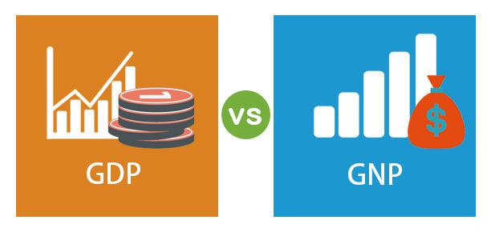

In today's fast-paced financial markets, traders and investors are increasingly required to understand economic indicators to make informed decisions. Among the most significant of these indicators are Gross Domestic Product (GDP) and Gross National Product (GNP), both of which provide crucial insights into a nation’s economic health and performance. GDP measures the total value of all goods and services produced within a country's borders, serving as a key indicator of domestic economic activity. In contrast, GNP includes the value of goods and services produced by a country’s citizens, both domestically and abroad, offering a global perspective on economic contributions.

This article examines the role that GDP and GNP play in economic analysis and their application in algorithmic trading strategies. Understanding the distinctions between GDP and GNP is vital, as each offers unique insights: GDP provides a snapshot of domestic economic strength, while GNP accounts for the international economic activities of a nation's citizens. Such knowledge can provide traders with a competitive edge in the market by enabling them to anticipate or react quickly to economic changes.



Algorithmic trading systems, which execute trades based on predefined criteria, increasingly incorporate these economic indicators. By leveraging GDP and GNP data, traders can develop models to predict market trends and identify investment opportunities, facilitating quick adjustments to trading positions in response to economic announcements. As these systems grow more sophisticated with advancements in technology and data availability, understanding economic indicators becomes even more essential for strategic trading decisions. This integration reinforces the importance of GDP and GNP in trading, emphasizing the need for traders to remain informed about these critical metrics for optimizing investment outcomes.

## Table of Contents

## Understanding GDP and GNP

Gross Domestic Product (GDP) is a fundamental economic indicator that quantifies the total monetary value of all finished goods and services produced within a country's borders in a specific time period. It is widely used to assess the economic health of a nation, as it reflects both the level of economic activity and the potential for growth. A higher GDP indicates a robust economy with increased production capacity, while a lower GDP suggests reduced economic activity and potential recessionary pressures.

Gross National Product (GNP), on the other hand, encompasses the total value of goods and services produced by a country's citizens, regardless of their location. This includes economic activities conducted both domestically and internationally. GNP offers a broader perspective by incorporating global income, capturing the economic contributions of nationals and enterprises beyond their home country's borders. 

The formulas for these indicators can be expressed as follows:
$$

\text{GDP} = \text{C} + \text{I} + \text{G} + (\text{X} - \text{M}) 
$$
where $\text{C}$ is consumption, $\text{I}$ is investment, $\text{G}$ is government spending, $\text{X}$ is exports, and $\text{M}$ is imports.

$$

\text{GNP} = \text{GDP} + \text{NFI} 
$$
where $\text{NFI}$ represents Net Factor Income from abroad, which accounts for the income paid into the country by other nations, minus the income paid out to foreign nationals.

GDP is the preferred measure for determining the domestic economic output and serves as a critical tool for local policy-making and economic planning. However, GNP provides valuable insights into the global economic contributions of a country's citizens, particularly relevant for nations with significant levels of foreign direct investment and expatriate workers. As such, the decision to utilize GDP or GNP largely depends on whether the focus is placed on measuring domestic economic production or the overall economic contributions of its citizens on a global scale. 

Understanding the distinction between GDP and GNP helps in analyzing international economic interactions and offers perspectives on how both domestic activities and international engagements influence a nation’s economic standing.

## GDP and GNP in Economic Analysis

Both Gross Domestic Product (GDP) and Gross National Product (GNP) are crucial metrics employed by economists and policymakers to assess a nation's economic health. These indicators are instrumental in identifying economic trends, shaping policy decisions, and comparing productivity on both regional and international scales.

In the context of economic analysis, GDP measures the monetary value of all finished goods and services produced within a country's borders during a specific period. It is widely used to estimate the size of an economy and its growth trajectory. GNP, on the other hand, extends this measurement to include the value of goods and services produced by a nation's citizens, regardless of their location. This broader perspective is particularly useful for countries with substantial international business activities.

Both indicators have significant implications for central bank policies. The data derived from GDP and GNP assessments inform decisions on interest rates, inflation control, and other monetary policies. For instance, a rising GDP may prompt a central bank to increase interest rates to prevent overheating the economy, while a declining GDP could lead to lower interest rates to stimulate growth. Similarly, GNP can affect policy if significant changes in citizen-led foreign production alter the national economic outlook.

Understanding the discrepancies between GDP and GNP figures can illuminate various economic dynamics. For example, a large discrepancy might indicate substantial income from foreign investments, revealing a nation's economic dependencies and strengths. This understanding is vital for strategic policymaking, as it helps in designing measures that reinforce economic stability and growth.

In summary, GDP and GNP are not just statistical figures but vital analytical tools that significantly impact economic policymaking and strategy development. Analysts and decision-makers leverage these indicators to gain insights into economic conditions, optimize policy implementations, and predict future economic movements.

## Algorithmic Trading and Economic Indicators

Algorithmic trading utilizes sophisticated computer algorithms to execute trades based on pre-established criteria. By incorporating economic indicators such as Gross Domestic Product (GDP) and Gross National Product (GNP) into these algorithms, traders can enhance the predictive accuracy of their trading models. These indicators act as critical data points in assessing market trends and identifying potential investment opportunities.

GDP and GNP indicators play a significant role in shaping the predictive models used by [algorithmic trading](/wiki/algorithmic-trading) systems. These models aim to evaluate the overall economic environment, thereby enabling traders to forecast market movements with greater precision. For instance, an unexpected change in GDP figures can indicate shifts in economic growth patterns, which may influence asset prices across various markets. By integrating this information into algorithmic systems, traders can make informed decisions about their trades.

Furthermore, algorithmic trading systems offer a distinct advantage by allowing for rapid adjustment of trading positions in response to economic announcements. Upon the release of GDP or GNP data, the algorithms can automatically recalibrate trading strategies to align with the new economic reality, ensuring that traders remain agile in volatile market conditions. This capability is crucial for capturing short-term market inefficiencies that may arise immediately following an economic data release.

The incorporation of economic indicators into trading algorithms facilitates a data-driven decision-making process, enhancing the probability of executing successful trades. With access to real-time economic data, algorithmic systems can process and analyze large volumes of information to derive actionable insights. This data-centric approach minimizes subjective biases in trading decisions, thereby increasing the likelihood of achieving favorable investment outcomes.

Overall, the synergy between algorithmic trading and economic indicators such as GDP and GNP creates a robust framework for navigating financial markets. By leveraging these indicators, traders can harness the power of computational technology to optimize their trading strategies, adapt swiftly to economic changes, and significantly improve their risk-adjusted returns.

## Utilizing GDP and GNP in Trading Strategies

Market participants closely monitor Gross Domestic Product (GDP) and Gross National Product (GNP) releases, recognizing their substantial impact on financial markets. These economic indicators are vital for devising trading strategies, primarily because they provide insights into a country's economic [momentum](/wiki/momentum), influencing investor sentiment and market dynamics.

Trading strategies often revolve around anticipating GDP reports, with traders taking positions based on expected economic growth or contraction. For instance, if an increase in GDP is anticipated, a trader might expect a bullish market trend and opt to invest in equities or sectors predicted to benefit from economic expansion, such as consumer goods or technology stocks. Conversely, a slowdown might prompt a defensive strategy, involving sectors such as utilities, healthcare, or bonds, considered safer during economic downturns.

Algorithmic traders leverage GDP and GNP data to enhance their predictive models. These models can forecast movements in currency exchanges, equity performances, and commodity trajectories. Consider an algorithm designed to trade foreign exchange markets: it might incorporate GDP growth differentials between two countries to estimate currency strength. Such a strategy could be represented mathematically by:

$$
\Delta \text{Exchange Rate} \approx f(\text{GDP}_{\text{Country A}} - \text{GDP}_{\text{Country B}})
$$

In this formula, the function $f$ models the relationship between GDP differentials and expected changes in the exchange rate.

The integration of GDP and GNP into trading systems provides traders with the capacity to predict macroeconomic shifts and adjust portfolios accordingly. For example, high GDP growth might suggest a strong domestic consumption trend, guiding investment in related industries. Additionally, GNP insights, especially relevant for economies heavily engaged in global trade, can indicate potential impacts on international earnings and currency valuations.

Moreover, algorithmic systems can react swiftly to GDP and GNP releases, parsing large datasets almost instantaneously to execute trades based on pre-determined rules and thresholds. This agility allows traders to capitalize on immediate post-announcement price movements—often driven by the gap between forecasted and actual economic data.

To implement such systems, traders might use Python, a preferred language for its extensive libraries and ease of use. A simple Python snippet for fetching GDP data and making a trading decision might look like this:

```python
import yfinance as yf  # For more datasets, visit: https://paperswithbacktest.com/datasets

def fetch_gdp_data(country_code):
    # Hypothetical function to get GDP data
    # This would be replaced with actual code to retrieve real-time data
    return fake_data_api.get_gdp(country_code)

def trade_based_on_gdp(country_code):
    gdp = fetch_gdp_data(country_code)
    if gdp > expected_gdp:
        execute_trade('buy', market='equities')
    else:
        execute_trade('sell', market='equities')

# Example usage
trade_based_on_gdp('USA')
```

In summary, effectively utilizing GDP and GNP in trading strategies enables market participants to align their portfolios with economic conditions, enhancing the prospects for achieving superior investment outcomes. By incorporating these economic indicators, traders can navigate the complexities of financial markets with greater precision and insight.

## Case Studies and Examples

Analyzing case studies where Gross Domestic Product (GDP) and Gross National Product (GNP) fluctuations impacted financial markets offers valuable insights into the relationship between economic indicators and market behavior. Historical examples demonstrate the tangible influence these indicators have on investor sentiment and market dynamics.

One illustrative example is the impact of a higher-than-expected GDP report, which often boosts investor confidence and can lead to bullish market trends. This phenomenon was observed during the economic recovery phases following financial crises. For instance, in the aftermath of the 2008 financial crisis, several economies, including the United States, reported stronger-than-expected GDP growth in subsequent years. This positive GDP growth trajectory was instrumental in restoring investor confidence, leading to a prolonged period of bull markets across various asset classes, including equities and real estate.

Conversely, GNP figures can also significantly influence market responses, particularly in economies with substantial overseas income contributions. A declining GNP can indicate reduced income from abroad, affecting national economic prospects. For example, during the Eurozone debt crisis, countries like Greece experienced sharp declines in GNP, exacerbating fears of economic instability. The subsequent depreciation in the country's currency and market sell-offs underscored the sensitivity of financial markets to GNP data, highlighting how GNP fluctuations can serve as an early warning of broader economic challenges.

Reviewing historical data further illustrates the correlation between economic indicators and market responses. Economists and traders often utilize these insights to predict market trends and inform trading strategies. For example, if a country's GDP growth rate deviates significantly from forecasts, traders may adjust their portfolios accordingly. Algorithms can be employed to automate this decision-making process, reacting swiftly to economic data releases. In Python, one could define a simplistic model to adjust investment positions based on GDP data:

```python
def adjust_portfolio(gdp_growth, expected_growth, portfolio):
    """
    Adjusts the investment portfolio based on GDP growth.

    :param gdp_growth: Actual GDP growth rate.
    :param expected_growth: Expected GDP growth rate.
    :param portfolio: Dictionary representing investment positions.
    :return: Adjusted investment portfolio.
    """
    if gdp_growth > expected_growth:
        # Increase investments in equities
        portfolio['equities'] *= 1.05
        print("Increased equity investments due to higher-than-expected GDP growth.")
    elif gdp_growth < expected_growth:
        # Increase investments in bonds
        portfolio['bonds'] *= 1.05
        print("Increased bond investments due to lower-than-expected GDP growth.")
    return portfolio

# Example usage
current_portfolio = {'equities': 50000, 'bonds': 30000}
adjusted_portfolio = adjust_portfolio(3.2, 2.8, current_portfolio)
```

By examining these case studies, market participants gain insights into the potential impact of GDP and GNP fluctuations, enabling them to refine their trading strategies. This reinforces the importance of economic indicators in shaping market behavior and allows traders to harness these patterns for better financial outcomes.

## Conclusion

Understanding GDP (Gross Domestic Product) and GNP (Gross National Product) is fundamental for traders aiming to thrive in the ever-evolving financial markets. These economic indicators are indispensable tools that offer a detailed overview of a nation's economic health and potential trajectories. They serve not only as a snapshot of current economic conditions but also as a predictive compass for future economic climates. Recognizing their impact on financial markets, incorporating GDP and GNP data into algorithmic trading systems provides traders with a substantial competitive edge. By leveraging these indicators, traders can develop sophisticated models that anticipate market movements and optimize investment strategies, contributing to enhanced trading performance. 

As technological advancements and the accessibility of data continue to progress, the integration of economic indicators in trading strategies will likely become even more prevalent. The use of [machine learning](/wiki/machine-learning) and [artificial intelligence](/wiki/ai-artificial-intelligence) is transforming how traders interpret GDP and GNP data, enabling the creation of predictive analytics that offer profound insights and foster proactive market adaptations. By staying up-to-date with these metrics, traders can make informed and strategic decisions, adeptly navigating uncertainties and maximizing returns on their investments.

## References & Further Reading

[1]: ["GDP: A Brief but Affectionate History"](https://www.jstor.org/stable/j.ctvc77mfx) by Diane Coyle

[2]: ["Understanding GDP and GNP: Implications for Public Policy"](https://www.investopedia.com/ask/answers/030415/what-functional-difference-between-gdp-and-gnp.asp) by A. Smith and J.P. Ramos

[3]: ["Algorithmic Trading: Winning Strategies and Their Rationale"](https://www.amazon.com/Algorithmic-Trading-Winning-Strategies-Rationale-ebook/dp/B00CY5HC0U) by Ernie Chan

[4]: Bureau of Economic Analysis. [BEA.gov - U.S. Department of Commerce](https://www.bea.gov/news/2024/gross-domestic-product-third-quarter-2024-advance-estimate)

[5]: International Monetary Fund. ["World Economic Outlook Reports"](https://www.imf.org/en/Publications/WEO/Issues/2024/10/22/world-economic-outlook-october-2024)

[6]: ["Automated Trading with R: Quantitative Research and Platform Development"](https://link.springer.com/book/10.1007/978-1-4842-2178-5) by Chris Conlan