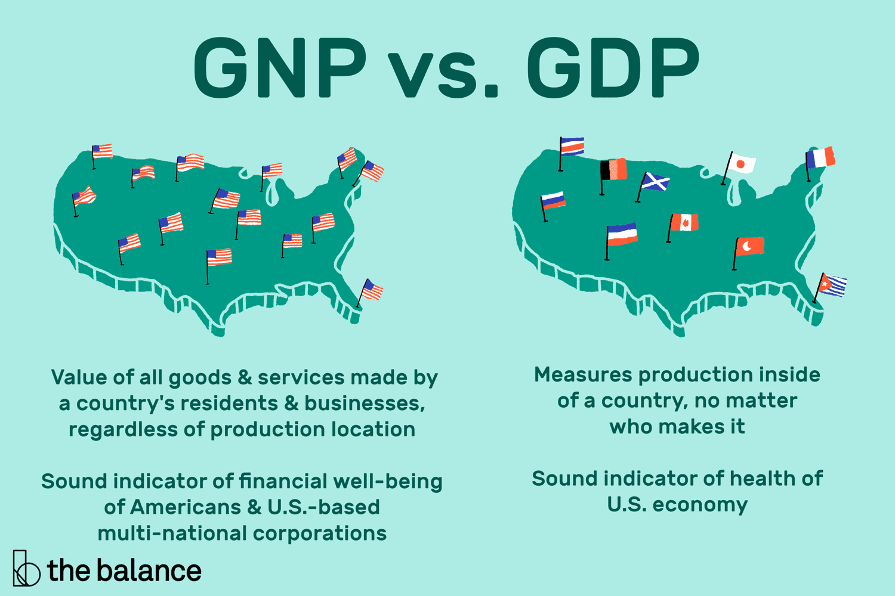

## Table of Contents

## What is GDP?

GDP stands for Gross Domestic Product. It is the total value of all goods and services produced within a country's borders in a specific time period, usually a year. GDP helps us understand how well a country's economy is doing. If the GDP is growing, it means the economy is getting bigger and people are producing more.

GDP can be calculated in different ways. One common way is to add up the value of everything that is produced, like cars, food, and services like haircuts or doctor visits. Another way is to look at how much money people spend on these goods and services. Governments and economists use GDP to make decisions about taxes, spending, and other economic policies.

## What is GNP?

GNP stands for Gross National Product. It is the total value of all goods and services produced by a country's citizens and businesses, no matter where they are in the world. So, if a company from the United States makes cars in Mexico, the value of those cars would be included in the U.S. GNP, but not in the U.S. GDP.

GNP is different from GDP because GDP only counts what is made within a country's borders. GNP gives us an idea of how much a country's citizens and companies are producing, even if they are working or living in another country. Both GDP and GNP are important for understanding an economy, but they show slightly different things.

## How is GDP calculated?

GDP can be calculated in three main ways: the production approach, the income approach, and the expenditure approach. The production approach adds up the value of all goods and services produced in a country. This means counting the value of everything from cars and computers to haircuts and doctor visits. The income approach adds up all the income earned by people and businesses in the country, like wages, profits, and taxes minus subsidies. The expenditure approach looks at all the money spent on goods and services, including what consumers, businesses, and the government spend, plus what the country spends on imports minus what it earns from exports.

Each of these methods should give the same total GDP, but they look at it from different angles. The expenditure approach is often the most commonly used because it's easy to track spending. For example, if you add up what everyone in the country spends on food, clothes, and other things, plus what businesses spend on equipment and what the government spends on services, you get a good picture of the total economic activity. Adjustments are made to avoid double-counting, like subtracting the value of imports and adding the value of exports to get the final GDP number.

## How is GNP calculated?

GNP, or Gross National Product, is calculated by adding up the value of all goods and services produced by a country's citizens and businesses, no matter where they are in the world. So, if a company from the United States makes shoes in Vietnam, the value of those shoes would be part of the U.S. GNP. To figure out GNP, you start with the country's GDP, which is the total value of everything made inside the country's borders. Then, you add the income that citizens and businesses earn from other countries, and subtract the income that foreigners earn from inside the country.

This means GNP includes things like profits from foreign investments and wages earned by citizens working abroad. For example, if an American works in Japan, their earnings would be added to the U.S. GNP. On the other hand, if a Japanese person works in the U.S., their earnings would be subtracted from the U.S. GNP. By doing this, GNP gives a picture of how much a country's people and companies are producing around the world, not just within their own country.

## What are the main differences between GDP and GNP?

GDP and GNP are both ways to measure how much a country produces, but they look at things a bit differently. GDP, which stands for Gross Domestic Product, counts all the goods and services made inside a country's borders, no matter who makes them. So, if a car is built in the United States by a Japanese company, it's counted in the U.S. GDP. This helps us see how well the economy is doing within the country.

GNP, or Gross National Product, looks at what a country's citizens and businesses produce, even if they are doing it in another country. So, if that same American company makes cars in Mexico, the value of those cars would be part of the U.S. GNP, but not the U.S. GDP. GNP gives us an idea of how much a country's people and companies are producing all around the world, not just at home. Both measures are useful, but they show different things about an economy.

## Can you provide examples of countries where GDP and GNP significantly differ?

In Ireland, there's a big difference between GDP and GNP. This is because many big companies from other countries have set up their businesses there. These companies make a lot of stuff in Ireland, so it adds a lot to Ireland's GDP. But since the money goes back to the countries where the companies come from, it doesn't count in Ireland's GNP. So, Ireland's GDP is much higher than its GNP.

Another country where you can see a big difference is Luxembourg. A lot of people who live in Luxembourg work in other countries, like Germany or France. The money they earn in those other countries is added to Luxembourg's GNP, but not to its GDP. Also, many big banks and businesses from other places operate in Luxembourg, which makes its GDP higher. But the profits these businesses make often go back to their home countries, so Luxembourg's GNP is lower than its GDP.

## How do GDP and GNP reflect a country's economic health?

GDP and GNP are both important numbers that help us understand how well a country's economy is doing. GDP shows us how much stuff is made inside a country, no matter who makes it. If GDP is going up, it usually means the economy is growing and people are making more things. This can be good because it might mean more jobs and more money for people. But if GDP goes down, it might mean the economy is not doing so well, and people might lose their jobs or have less money to spend.

GNP tells us about what a country's people and businesses are making, even if they are doing it in another country. This can be useful because it shows how much money is coming back to the country from all over the world. If GNP is higher than GDP, it might mean that the country's people are doing well in other places. But if GNP is lower, it could mean that a lot of the money made in the country is going to other places. Both GDP and GNP give us different pieces of the puzzle to help us see the whole picture of a country's economic health.

## What are the limitations of using GDP and GNP as economic indicators?

GDP and GNP are helpful numbers that show how much a country is producing, but they don't tell the whole story. One big problem is that they don't show how money is shared among people. A country can have a high GDP or GNP, but if most of the money goes to just a few rich people, many others might still be poor. Also, these numbers don't count things that are important but not bought and sold, like taking care of family members or volunteering. So, they might make it seem like the economy is doing better than it really is for everyone.

Another issue is that GDP and GNP only look at the money part of the economy. They don't show if people are happy, healthy, or if the environment is being taken care of. For example, if a country cuts down a lot of trees to make more stuff, it might increase GDP, but it could hurt the environment. Also, these numbers don't change if the prices of things go up because of inflation. So, if prices go up, GDP might look higher even if people aren't really buying more stuff. This means GDP and GNP are useful, but they don't give us the full picture of how well a country and its people are doing.

## How have GDP and GNP trends evolved over the past decade globally?

Over the past decade, global GDP has shown a steady increase overall, but with some ups and downs. After the big financial crisis around 2008, many countries worked hard to get their economies growing again. By the middle of the 2010s, a lot of places were doing better, with more jobs and more stuff being made. But then, in 2020, a big health crisis hit the world, and it made a lot of economies shrink. Many countries had to close businesses and people stayed home, so less stuff was made and sold. Since then, things have been getting better in a lot of places, but some are still trying to catch up.

GNP trends have followed a similar pattern, but with some differences because they include what a country's people and businesses make all over the world. In the 2010s, many countries saw their GNP grow as their companies did more business in other countries. For example, if a company from one country makes things in another country, that adds to the home country's GNP. But the big health crisis in 2020 affected GNP too, because it slowed down business everywhere. Since then, GNP has been recovering, but it's been a bit slower in some places because it takes time for businesses to start making things again in different countries.

Overall, both GDP and GNP have been going up over the past decade, but they've had to deal with big challenges like the financial crisis and the health crisis. These numbers help us see how the world's economy is doing, but they don't tell us everything about how people are living their lives.

## What role do multinational corporations play in the discrepancies between GDP and GNP?

Multinational corporations can make a big difference between a country's GDP and GNP. GDP counts everything made inside a country, so if a big company from another country builds a factory there, what they make adds to that country's GDP. But GNP looks at what a country's own people and companies make, no matter where they are. So, if a company from the United States makes stuff in Mexico, it adds to the U.S. GNP, not Mexico's. This can make GDP and GNP numbers look very different, especially in countries where a lot of foreign companies operate.

For example, in Ireland, many big companies from other countries have factories and offices. This makes Ireland's GDP really high because of all the stuff these companies make there. But a lot of the money these companies make goes back to their home countries, so it doesn't count in Ireland's GNP. This means Ireland's GNP is lower than its GDP. Multinational corporations can also affect GNP when their home country's citizens work or invest in other places. If an American company makes things in China, it adds to the U.S. GNP but not to China's. So, these big companies can really change how we see a country's economy when we look at GDP and GNP.

## How do changes in GDP and GNP affect national policy decisions?

Changes in GDP and GNP can really affect what a country's leaders decide to do. If GDP goes up, it might mean the economy is doing well, so leaders might decide to spend more money on things like schools or roads. But if GDP goes down, it might mean people are losing jobs, so leaders might try to help by cutting taxes or giving money to people who need it. They might also try to make it easier for businesses to start up or grow, hoping that will help the economy get better.

GNP changes can also make a difference, especially if a lot of a country's people and businesses are working in other places. If GNP is growing because companies are doing well in other countries, leaders might want to help those companies even more, maybe by making deals with other countries or helping them with money. But if GNP is going down, it might mean that money is leaving the country, so leaders might try to bring that money back by changing laws or making it easier for people to invest at home. Both GDP and GNP help leaders see what's happening with the economy and decide what to do next.

## What advanced statistical methods can be used to forecast GDP and GNP?

To forecast GDP and GNP, economists often use advanced statistical methods like time series analysis. This method looks at past numbers of GDP and GNP to find patterns and predict what might happen next. They use something called autoregressive integrated moving average (ARIMA) models, which can be pretty good at guessing future numbers based on what has happened before. Another way is to use econometric models, which look at how different things, like interest rates or how much people spend, can affect GDP and GNP. These models can help economists make better guesses about the future by understanding how different parts of the economy work together.

Another useful method is [machine learning](/wiki/machine-learning). This is when computers learn from a lot of data to make predictions. Machine learning can look at tons of information, like how much people are buying, what businesses are doing, and even things like the weather, to guess what GDP and GNP might be in the future. It's really good at finding patterns that might be hard for people to see. Both time series analysis and machine learning help economists make better plans and tell leaders what might happen with the economy, so they can make smart decisions.

## What is the difference between GDP and GNP?

Gross Domestic Product (GDP) is a fundamental economic indicator that quantifies the total monetary value of all finished goods and services produced within a country's borders in a specific time period. It is widely used to assess the economic health of a nation, as it reflects both the level of economic activity and the potential for growth. A higher GDP indicates a robust economy with increased production capacity, while a lower GDP suggests reduced economic activity and potential recessionary pressures.

Gross National Product (GNP), on the other hand, encompasses the total value of goods and services produced by a country's citizens, regardless of their location. This includes economic activities conducted both domestically and internationally. GNP offers a broader perspective by incorporating global income, capturing the economic contributions of nationals and enterprises beyond their home country's borders. 

The formulas for these indicators can be expressed as follows:
$$

\text{GDP} = \text{C} + \text{I} + \text{G} + (\text{X} - \text{M}) 
$$
where $\text{C}$ is consumption, $\text{I}$ is investment, $\text{G}$ is government spending, $\text{X}$ is exports, and $\text{M}$ is imports.

$$

\text{GNP} = \text{GDP} + \text{NFI} 
$$
where $\text{NFI}$ represents Net Factor Income from abroad, which accounts for the income paid into the country by other nations, minus the income paid out to foreign nationals.

GDP is the preferred measure for determining the domestic economic output and serves as a critical tool for local policy-making and economic planning. However, GNP provides valuable insights into the global economic contributions of a country's citizens, particularly relevant for nations with significant levels of foreign direct investment and expatriate workers. As such, the decision to utilize GDP or GNP largely depends on whether the focus is placed on measuring domestic economic production or the overall economic contributions of its citizens on a global scale. 

Understanding the distinction between GDP and GNP helps in analyzing international economic interactions and offers perspectives on how both domestic activities and international engagements influence a nation’s economic standing.

## How can GDP and GNP be utilized in trading strategies?

Market participants closely monitor Gross Domestic Product (GDP) and Gross National Product (GNP) releases, recognizing their substantial impact on financial markets. These economic indicators are vital for devising trading strategies, primarily because they provide insights into a country's economic [momentum](/wiki/momentum), influencing investor sentiment and market dynamics.

Trading strategies often revolve around anticipating GDP reports, with traders taking positions based on expected economic growth or contraction. For instance, if an increase in GDP is anticipated, a trader might expect a bullish market trend and opt to invest in equities or sectors predicted to benefit from economic expansion, such as consumer goods or technology stocks. Conversely, a slowdown might prompt a defensive strategy, involving sectors such as utilities, healthcare, or bonds, considered safer during economic downturns.

Algorithmic traders leverage GDP and GNP data to enhance their predictive models. These models can forecast movements in currency exchanges, equity performances, and commodity trajectories. Consider an algorithm designed to trade foreign exchange markets: it might incorporate GDP growth differentials between two countries to estimate currency strength. Such a strategy could be represented mathematically by:

$$
\Delta \text{Exchange Rate} \approx f(\text{GDP}_{\text{Country A}} - \text{GDP}_{\text{Country B}})
$$

In this formula, the function $f$ models the relationship between GDP differentials and expected changes in the exchange rate.

The integration of GDP and GNP into trading systems provides traders with the capacity to predict macroeconomic shifts and adjust portfolios accordingly. For example, high GDP growth might suggest a strong domestic consumption trend, guiding investment in related industries. Additionally, GNP insights, especially relevant for economies heavily engaged in global trade, can indicate potential impacts on international earnings and currency valuations.

Moreover, algorithmic systems can react swiftly to GDP and GNP releases, parsing large datasets almost instantaneously to execute trades based on pre-determined rules and thresholds. This agility allows traders to capitalize on immediate post-announcement price movements—often driven by the gap between forecasted and actual economic data.

To implement such systems, traders might use Python, a preferred language for its extensive libraries and ease of use. A simple Python snippet for fetching GDP data and making a trading decision might look like this:

```python
import yfinance as yf  # For more datasets, visit: https://paperswithbacktest.com/datasets

def fetch_gdp_data(country_code):
    # Hypothetical function to get GDP data
    # This would be replaced with actual code to retrieve real-time data
    return fake_data_api.get_gdp(country_code)

def trade_based_on_gdp(country_code):
    gdp = fetch_gdp_data(country_code)
    if gdp > expected_gdp:
        execute_trade('buy', market='equities')
    else:
        execute_trade('sell', market='equities')

# Example usage
trade_based_on_gdp('USA')
```

In summary, effectively utilizing GDP and GNP in trading strategies enables market participants to align their portfolios with economic conditions, enhancing the prospects for achieving superior investment outcomes. By incorporating these economic indicators, traders can navigate the complexities of financial markets with greater precision and insight.

## References & Further Reading

[1]: ["GDP: A Brief but Affectionate History"](https://www.jstor.org/stable/j.ctvc77mfx) by Diane Coyle

[2]: ["Understanding GDP and GNP: Implications for Public Policy"](https://www.investopedia.com/ask/answers/030415/what-functional-difference-between-gdp-and-gnp.asp) by A. Smith and J.P. Ramos

[3]: ["Algorithmic Trading: Winning Strategies and Their Rationale"](https://www.amazon.com/Algorithmic-Trading-Winning-Strategies-Rationale-ebook/dp/B00CY5HC0U) by Ernie Chan

[4]: Bureau of Economic Analysis. [BEA.gov - U.S. Department of Commerce](https://www.bea.gov/news/2024/gross-domestic-product-third-quarter-2024-advance-estimate)

[5]: International Monetary Fund. ["World Economic Outlook Reports"](https://www.imf.org/en/Publications/WEO/Issues/2024/10/22/world-economic-outlook-october-2024)

[6]: ["Automated Trading with R: Quantitative Research and Platform Development"](https://link.springer.com/book/10.1007/978-1-4842-2178-5) by Chris Conlan