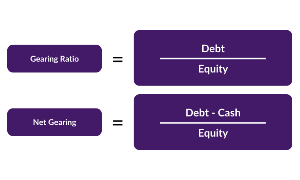

## Table of Contents

## What is a gearing ratio?

A gearing ratio is a way to measure how much a company is using borrowed money, or debt, compared to its own money, or equity. It helps people understand if a company is taking on too much risk by borrowing a lot of money. The higher the gearing ratio, the more debt the company has compared to its equity. This can be risky because if the company can't pay back the debt, it might face financial problems.

There are different ways to calculate the gearing ratio, but a common one is to divide the company's total debt by its total equity. For example, if a company has $2 million in debt and $3 million in equity, the gearing ratio would be 2/3 or about 0.67. This number tells investors and other people interested in the company how financially stable it is. A lower gearing ratio usually means the company is less risky because it relies less on borrowed money.

## What is a debt-to-equity ratio?

The debt-to-equity ratio is a way to see how much a company is using borrowed money compared to its own money. It's calculated by dividing the company's total debt by its total equity. This ratio tells us if a company is using a lot of debt to grow or run its business. A high debt-to-equity ratio means the company has a lot of debt compared to its equity, which can be risky. If the company can't pay back the debt, it might face big problems.

A low debt-to-equity ratio means the company is not using much borrowed money and is relying more on its own money. This can be seen as less risky because the company isn't as dependent on loans. Investors and others look at this ratio to decide if they want to invest in or lend money to the company. It helps them understand the financial health and risk level of the company.

## How is the gearing ratio calculated?

The gearing ratio is a way to see how much a company is using borrowed money compared to its own money. To calculate it, you take the company's total debt and divide it by its total equity. This gives you a number that shows the balance between debt and equity. For example, if a company has $2 million in debt and $3 million in equity, the gearing ratio would be 2 divided by 3, which equals about 0.67.

This ratio helps people understand if a company is taking on too much risk by borrowing a lot of money. A higher gearing ratio means the company has more debt compared to its equity, which can be risky because if the company can't pay back the debt, it might face financial problems. A lower gearing ratio usually means the company is less risky because it relies less on borrowed money. People like investors and lenders look at the gearing ratio to decide if they want to invest in or lend money to the company.

## How is the debt-to-equity ratio calculated?

The debt-to-equity ratio is a way to see how much a company is using borrowed money compared to its own money. To calculate it, you take the company's total debt and divide it by its total equity. For example, if a company has $2 million in debt and $3 million in equity, the debt-to-equity ratio would be 2 divided by 3, which equals about 0.67.

This ratio helps people understand if a company is taking on too much risk by borrowing a lot of money. A high debt-to-equity ratio means the company has a lot of debt compared to its equity, which can be risky. If the company can't pay back the debt, it might face big problems. A low debt-to-equity ratio means the company is not using much borrowed money and is relying more on its own money. This can be seen as less risky because the company isn't as dependent on loans.

## What do gearing and debt-to-equity ratios indicate about a company's financial health?

Gearing and debt-to-equity ratios tell us a lot about a company's financial health. They show how much a company is using borrowed money compared to its own money. If a company has a high gearing or debt-to-equity ratio, it means it's using a lot of debt. This can be risky because if the company can't pay back the debt, it might face big problems. People like investors and lenders look at these ratios to decide if they want to invest in or lend money to the company.

On the other hand, if a company has a low gearing or debt-to-equity ratio, it means it's not using much borrowed money and is relying more on its own money. This can be seen as less risky because the company isn't as dependent on loans. A lower ratio usually means the company is in a better financial position and is less likely to have trouble paying back what it owes. So, these ratios help people understand the financial stability and risk level of a company.

## What industries typically have higher gearing or debt-to-equity ratios?

Some industries often have higher gearing or debt-to-equity ratios because they need a lot of money to start up or keep running. For example, the utility industry, like companies that provide electricity or water, often have high ratios. These companies need to build big and expensive things like power plants or water treatment facilities. They use debt to pay for these because it takes a long time to get the money back from customers. The same goes for the telecom industry, where companies need to build networks and buy expensive equipment.

Another industry with high gearing or debt-to-equity ratios is real estate. Companies in this industry often borrow money to buy land or build properties. It can take a long time to sell the properties or rent them out to make money, so they use debt to cover the costs in the meantime. The airline industry also often has high ratios because airplanes are very expensive to buy. Airlines use debt to buy planes and then pay it back over time as they earn money from flying passengers and cargo.

## How do gearing and debt-to-equity ratios affect a company's risk profile?

Gearing and debt-to-equity ratios show how much a company is using borrowed money compared to its own money. If these ratios are high, it means the company has a lot of debt. This can make the company riskier because if it can't pay back the debt, it might get into big trouble. Imagine borrowing a lot of money from a friend. If you can't pay it back, you might lose that friend or have other problems. The same goes for a company. Investors and lenders look at these ratios to see if the company is too risky to invest in or lend money to.

On the other hand, if the gearing and debt-to-equity ratios are low, it means the company is not using much borrowed money. This can make the company less risky because it's not as dependent on loans. It's like using your own money to buy something instead of borrowing from others. A company with low ratios is usually seen as more financially stable. People are more likely to want to invest in or lend money to a company that has a lower risk of not being able to pay back what it owes.

## What are the advantages of using gearing ratio over debt-to-equity ratio?

Using the gearing ratio can be helpful because it gives a clear picture of how much a company is relying on borrowed money compared to its own money. The gearing ratio is calculated by dividing the company's total debt by its total equity, which gives a straightforward number that's easy to understand. This ratio can be especially useful for comparing companies in different industries, as it provides a standard way to look at financial risk. For example, if two companies have the same gearing ratio, it means they are using debt in a similar way, even if they are in different industries.

Another advantage of the gearing ratio is that it can help investors and lenders quickly see if a company might be taking on too much risk. A high gearing ratio means the company has a lot of debt compared to its equity, which could be a red flag. This can be important for making decisions about whether to invest in or lend money to the company. The gearing ratio also helps to spot trends over time, so you can see if a company is becoming more or less risky. This makes it a useful tool for keeping an eye on a company's financial health and making informed decisions.

## What are the limitations of using gearing ratio compared to debt-to-equity ratio?

One limitation of using the gearing ratio compared to the debt-to-equity ratio is that it might not give a complete picture of a company's financial situation. The gearing ratio looks at total debt and total equity, but it doesn't consider other things like the company's cash flow or how quickly it can pay back its debt. For example, a company might have a high gearing ratio but still be able to pay its debts easily if it has a lot of cash coming in. The debt-to-equity ratio, while similar, might be used differently in different industries, so it's important to know the context when comparing companies.

Another limitation is that the gearing ratio can be influenced by how a company chooses to finance its operations. Some companies might use more debt because it's cheaper for them, while others might use more equity. This can make it hard to compare gearing ratios across different companies or industries. The debt-to-equity ratio might also be affected by these choices, but it's often used more widely and can be easier to find in financial reports. So, while the gearing ratio is a helpful tool, it's important to look at other financial measures too to get a full understanding of a company's financial health.

## How do changes in interest rates impact gearing and debt-to-equity ratios?

Changes in interest rates can have a big effect on a company's gearing and debt-to-equity ratios. When interest rates go up, it costs more for a company to borrow money. If a company already has a lot of debt, this can make it harder for them to pay back what they owe. This might make them think twice about borrowing more money, which could lower their gearing and debt-to-equity ratios over time. On the other hand, if interest rates go down, borrowing money becomes cheaper. Companies might decide to take on more debt to grow or invest in new projects, which could increase their gearing and debt-to-equity ratios.

These changes in interest rates can also affect how investors and lenders see a company's risk. If interest rates are high and a company's gearing or debt-to-equity ratio is also high, people might see the company as more risky. They might worry that the company won't be able to pay back its debts if the cost of borrowing keeps going up. But if interest rates are low, a high gearing or debt-to-equity ratio might not seem as risky because it's cheaper for the company to keep up with its debt payments. So, interest rates play a big role in how these ratios are viewed and how they might change over time.

## How can investors use gearing and debt-to-equity ratios to make informed decisions?

Investors can use gearing and debt-to-equity ratios to understand how much risk a company is taking by using borrowed money. If a company has a high gearing or debt-to-equity ratio, it means it's using a lot of debt compared to its own money. This can be risky because if the company can't pay back the debt, it might get into big trouble. Investors might think twice before putting their money into a company with high ratios because it could mean the company is more likely to have financial problems. By looking at these ratios, investors can decide if a company is too risky or if it's a good investment.

On the other hand, if a company has low gearing and debt-to-equity ratios, it means it's not using much borrowed money and is relying more on its own money. This can be seen as less risky because the company isn't as dependent on loans. Investors might feel more comfortable investing in a company with low ratios because it shows the company is financially stable and less likely to have trouble paying back what it owes. So, by looking at these ratios, investors can make smarter choices about where to put their money and how much risk they're willing to take.

## What advanced financial models incorporate both gearing and debt-to-equity ratios for forecasting?

Advanced financial models like the Altman Z-Score and the Merton Model often use gearing and debt-to-equity ratios to predict how likely a company is to go bankrupt or have financial problems. The Altman Z-Score, for example, looks at different financial ratios, including the debt-to-equity ratio, to come up with a number that tells you if a company might be in trouble. If the number is low, it means the company could be at risk. By including the gearing and debt-to-equity ratios, these models can give a clearer picture of how much debt a company has and how it might affect the company's future.

Another model that uses these ratios is the Merton Model, which is based on the idea that a company's equity is like an option on its assets. This model looks at the company's debt and equity to figure out the chance of the company not being able to pay back its debts. By including the gearing and debt-to-equity ratios, the Merton Model can help investors and lenders understand the risk of investing in or lending money to the company. These models are helpful tools for forecasting because they take into account how much a company is relying on borrowed money and how that might impact its financial health in the future.

## What is the Debt-to-Equity Ratio and How Can We Understand It?

The debt-to-equity (D/E) ratio is a key financial metric used to assess a company's financial leverage. It is calculated by dividing a company's total liabilities by its shareholder equity. Mathematically, it is expressed as:

$$
\text{Debt-to-Equity Ratio} = \frac{\text{Total Liabilities}}{\text{Shareholder Equity}}
$$

This ratio provides insights into how a company is funding its operations, either through debt or owned capital, and reflects the balance between borrowed funds and shareholders' investments. 

The significance of the debt-to-equity ratio lies in its ability to indicate a company's capability to meet its long-term liabilities. A higher ratio suggests that a company is more heavily financed by debt than equity, potentially implying greater financial risk if earnings fail to support debt obligations. Conversely, a lower ratio indicates a more conservative capital structure, which might appeal to investors seeking stability and lower risk. Businesses with a high debt-to-equity ratio may face difficulties in securing additional funding and might incur high interest expenses during economic downturns.

Interpreting the debt-to-equity ratio involves understanding industry-specific norms. For instance, capital-intensive industries such as utilities or manufacturing typically have higher debt levels, resulting in higher debt-to-equity ratios. This is because such industries often require significant investment in infrastructure and equipment. On the other hand, technology or service-oriented companies may exhibit lower ratios due to lesser capital requirements and a propensity to rely more on equity financing.

Stakeholders, including investors and creditors, scrutinize the debt-to-equity ratio closely. A high ratio might suggest aggressive growth strategies funded through debt, posing both potential for returns and risk for financial instability. In contrast, a low ratio might indicate conservative management or under-utilization of financial leverage to drive growth. Hence, it is vital for stakeholders to consider the context of each industry and specific company circumstances when evaluating this ratio.

## What is the Gearing Ratio and how can it be explored?

The gearing ratio is a key metric used to assess a company's financial leverage and risk profile. It is primarily concerned with measuring the proportion of a company's capital that is financed by debt as opposed to equity. The formula for the gearing ratio is typically expressed as:

$$
\text{Gearing Ratio} = \frac{\text{Total Debt}}{\text{Equity}}
$$

This ratio provides insight into the company's financial risk by indicating the extent to which a firm relies on external funds for its operations and growth. Unlike the debt-to-equity ratio, which focuses strictly on the debt versus shareholder equity, the gearing ratio may include considerations of long-term liabilities and, in some variations, the cost of equity.

Understanding a company's gearing ratio is crucial because it reflects its dependence on debt to finance its activities. A high gearing ratio signifies a substantial reliance on debt, which can imply higher financial risk due to the obligation to meet interest payments and repay principal. Companies with high gearing ratios may be more susceptible to financial distress in economic downturns because their fixed obligations remain constant regardless of income [volatility](/wiki/volatility-trading-strategies).

Conversely, a low gearing ratio indicates a lesser degree of dependence on external financing, suggesting a more conservative capital structure. Such companies might be more resilient in fluctuating market conditions but may also miss out on growth opportunities that leveraged financing could afford.

High gearing is not categorically negative; there are opportunities associated with leveraging debt, especially when interest rates are low and the firm experiences strong cash flow. Successful companies often use high gearing to finance expansion, driving returns on equity higher than what they might achieve without borrowing.

For example, utility companies and telecommunications firms often exhibit high gearing ratios because they operate in capital-intensive industries where significant upfront investment is required. These sectors typically have stable cash flows to support servicing large debt levels, thus justifying higher leverage.

Conversely, industries like technology or pharmaceuticals may exhibit lower gearing ratios due to the inherently volatile nature of revenues and the associated risk of technological obsolescence.

When evaluating companies with high gearing, investors should consider the cost of debt and the ability of the company to generate sufficient cash flow to meet its obligations. The economic environment and [interest rate](/wiki/interest-rate-trading-strategies) conditions also play substantial roles in determining whether high gearing is beneficial or risky. Companies operating with elevated gearing levels may face challenges if market conditions lead to increased borrowing costs or downturns in demand for their products or services.

Overall, the gearing ratio serves as a vital metric for investors to assess financial risk and leverage strategy, guiding investment decisions based on the balance between potential returns and associated risks.

## References & Further Reading

[1]: Brealey, R. A., Myers, S. C., & Allen, F. (2020). "Principles of Corporate Finance." McGraw-Hill Education. 

[2]: Damodaran, A. (2020). ["Investment Valuation: Tools and Techniques for Determining the Value of Any Asset."](https://www.wiley.com/en-us/Investment+Valuation%3A+Tools+and+Techniques+for+Determining+the+Value+of+Any+Asset%2C+3rd+Edition-p-9781118011522) Wiley.

[3]: Hull, J. (2017). "Options, Futures, and Other Derivatives." Pearson.

[4]: Fabozzi, F. J., & Drake, P. P. (2009). "The Basics of Finance: An Introduction to Financial Markets, Business Finance, and Portfolio Management." Wiley.

[5]: Graham, B., & Dodd, D. (2008). "Security Analysis: The Classic 1940 Edition." McGraw-Hill Education.

[6]: Mandelbrot, B., & Hudson, R. L. (2004). ["The (Mis)Behavior of Markets: A Fractal View of Risk, Ruin, and Reward."](https://books.google.com/books/about/The_Mis_Behaviour_of_Markets.html?id=zg91TAIs6bgC) Basic Books.