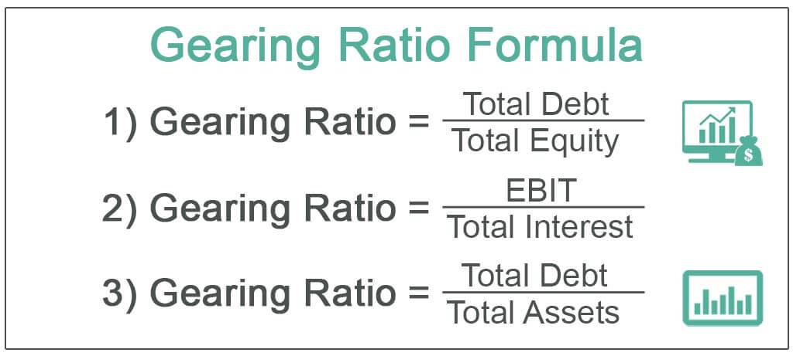

Financial ratios are essential tools in evaluating a company’s financial health and performance. By analyzing these metrics, stakeholders can assess the company’s profitability, liquidity, and solvency, which are critical for informed investment decisions. Among the various financial ratios, the debt-to-equity ratio and gearing ratio are particularly significant as they provide valuable insights into a company's leverage, indicating the extent to which a company is financing its operations through debt compared to its own equity.

The debt-to-equity ratio is a measure that helps investors understand a company's capital structure and assess its financial leverage. A high debt-to-equity ratio implies that a company is aggressively financing its growth with debt, which can enhance returns but also increases risk. Conversely, a low debt-to-equity ratio suggests reliance on equity, which might indicate a conservative capital structure but potentially lower returns on equity.

Similarly, the gearing ratio is crucial for evaluating a company’s financial risk concerning its reliance on external financing. It reflects the proportion of a company’s operations funded by creditors as opposed to shareholders. High gearing indicates greater debt relative to equity, suggesting higher financial risk, while low gearing points to a more stable financial structure.

In the modern financial landscape, these ratios are not only important for traditional analysis but also in algorithmic trading (algo trading), where they are incorporated into trading algorithms to make swift investment decisions. Algorithmic trading uses automated systems to evaluate financial metrics in real-time, allowing traders to capitalize on trading opportunities with enhanced speed and accuracy. Understanding and leveraging financial ratios such as the debt-to-equity and gearing ratios can significantly improve investment strategies by providing deeper insights into a company’s risk and return profile.

By understanding these financial metrics, investors, traders, and analysts can make more informed decisions that align with their investment goals and risk appetite. As financial markets continue to evolve, these ratios remain vital in strategic financial analysis and decision-making.

## Table of Contents

## Understanding the Debt-to-Equity Ratio

The debt-to-equity (D/E) ratio is a key financial metric used to assess a company's financial leverage. It is calculated by dividing a company's total liabilities by its shareholder equity. Mathematically, it is expressed as:

$$
\text{Debt-to-Equity Ratio} = \frac{\text{Total Liabilities}}{\text{Shareholder Equity}}
$$

This ratio provides insights into how a company is funding its operations, either through debt or owned capital, and reflects the balance between borrowed funds and shareholders' investments. 

The significance of the debt-to-equity ratio lies in its ability to indicate a company's capability to meet its long-term liabilities. A higher ratio suggests that a company is more heavily financed by debt than equity, potentially implying greater financial risk if earnings fail to support debt obligations. Conversely, a lower ratio indicates a more conservative capital structure, which might appeal to investors seeking stability and lower risk. Businesses with a high debt-to-equity ratio may face difficulties in securing additional funding and might incur high interest expenses during economic downturns.

Interpreting the debt-to-equity ratio involves understanding industry-specific norms. For instance, capital-intensive industries such as utilities or manufacturing typically have higher debt levels, resulting in higher debt-to-equity ratios. This is because such industries often require significant investment in infrastructure and equipment. On the other hand, technology or service-oriented companies may exhibit lower ratios due to lesser capital requirements and a propensity to rely more on equity financing.

Stakeholders, including investors and creditors, scrutinize the debt-to-equity ratio closely. A high ratio might suggest aggressive growth strategies funded through debt, posing both potential for returns and risk for financial instability. In contrast, a low ratio might indicate conservative management or under-utilization of financial leverage to drive growth. Hence, it is vital for stakeholders to consider the context of each industry and specific company circumstances when evaluating this ratio.

## Exploring the Gearing Ratio

The gearing ratio is a key metric used to assess a company's financial leverage and risk profile. It is primarily concerned with measuring the proportion of a company's capital that is financed by debt as opposed to equity. The formula for the gearing ratio is typically expressed as:

$$
\text{Gearing Ratio} = \frac{\text{Total Debt}}{\text{Equity}}
$$

This ratio provides insight into the company's financial risk by indicating the extent to which a firm relies on external funds for its operations and growth. Unlike the debt-to-equity ratio, which focuses strictly on the debt versus shareholder equity, the gearing ratio may include considerations of long-term liabilities and, in some variations, the cost of equity.

Understanding a company's gearing ratio is crucial because it reflects its dependence on debt to finance its activities. A high gearing ratio signifies a substantial reliance on debt, which can imply higher financial risk due to the obligation to meet interest payments and repay principal. Companies with high gearing ratios may be more susceptible to financial distress in economic downturns because their fixed obligations remain constant regardless of income [volatility](/wiki/volatility-trading-strategies).

Conversely, a low gearing ratio indicates a lesser degree of dependence on external financing, suggesting a more conservative capital structure. Such companies might be more resilient in fluctuating market conditions but may also miss out on growth opportunities that leveraged financing could afford.

High gearing is not categorically negative; there are opportunities associated with leveraging debt, especially when interest rates are low and the firm experiences strong cash flow. Successful companies often use high gearing to finance expansion, driving returns on equity higher than what they might achieve without borrowing.

For example, utility companies and telecommunications firms often exhibit high gearing ratios because they operate in capital-intensive industries where significant upfront investment is required. These sectors typically have stable cash flows to support servicing large debt levels, thus justifying higher leverage.

Conversely, industries like technology or pharmaceuticals may exhibit lower gearing ratios due to the inherently volatile nature of revenues and the associated risk of technological obsolescence.

When evaluating companies with high gearing, investors should consider the cost of debt and the ability of the company to generate sufficient cash flow to meet its obligations. The economic environment and [interest rate](/wiki/interest-rate-trading-strategies) conditions also play substantial roles in determining whether high gearing is beneficial or risky. Companies operating with elevated gearing levels may face challenges if market conditions lead to increased borrowing costs or downturns in demand for their products or services.

Overall, the gearing ratio serves as a vital metric for investors to assess financial risk and leverage strategy, guiding investment decisions based on the balance between potential returns and associated risks.

## Role of Financial Metrics in Algo Trading

Algorithmic trading, often referred to as algo trading, is a method of executing orders using automated and pre-programmed trading instructions accounting for variables such as timing, price, and [volume](/wiki/volume-trading-strategy). This type of trading has gained significant prominence in financial markets due to its ability to process large volumes of data and execute trades at velocities beyond human capability. Its rise can be attributed to advancements in technology, increased data availability, and the quest for improved trading efficiency and profitability.

Financial ratios, such as the debt-to-equity ratio and gearing ratio, are integral to [algorithmic trading](/wiki/algorithmic-trading) as they offer quantifiable insights into a company's financial health. These ratios can be seamlessly incorporated into trading algorithms to enhance decision-making processes. The debt-to-equity ratio, which is calculated as $\text{Debt-to-Equity Ratio} = \frac{\text{Total Liabilities}}{\text{Shareholders' Equity}}$, helps in assessing the proportion of debt used in the capital structure of a company. Similarly, the gearing ratio, commonly defined as $\text{Gearing Ratio} = \frac{\text{Total Debt}}{\text{Total Equity}}$, indicates the degree to which a company is financed by debt.

The integration of these financial ratios into trading algorithms allows for real-time analysis and reaction to financial metric changes. For instance, an algorithm can be programmed to initiate trades if a company's debt-to-equity ratio exceeds a certain threshold, signaling potential financial instability. This automation not only streamlines the analysis process but also enables the identification of investment opportunities that may be missed by manual scrutiny.

Moreover, algo trading improves investment strategies by facilitating the automation of financial analysis. It provides a systematic and unbiased approach to trading, minimizing human errors and emotional biases. Algorithms can be designed to continuously monitor market conditions, process updates on financial metrics, and adjust strategies accordingly. This capability allows traders to exploit market inefficiencies swiftly and optimize their portfolios based on a comprehensive analysis of financial data.

Despite these advantages, the incorporation of financial metrics into algo trading models presents several challenges. The complexity of developing algorithms that accurately interpret financial ratios requires a deep understanding of both market dynamics and the specific characteristics of each ratio. Additionally, market volatility and data inaccuracy can pose significant risks, potentially leading to erroneous trading signals. Therefore, rigorous [backtesting](/wiki/backtesting) and model validation are essential before deploying such algorithms in live trading environments.

In conclusion, the role of financial metrics in algo trading is pivotal, offering a structured approach to evaluating financial health and investment potential. The effective integration of ratios like debt-to-equity and gearing into trading algorithms empowers traders to make informed decisions, enhancing strategy and execution in a fast-paced financial landscape. However, careful consideration and robust modeling are imperative to fully harness these tools while mitigating associated risks.

## Strategic Uses of Financial Leverage Ratios

Investors use financial leverage ratios such as the debt-to-equity and gearing ratios to evaluate companies' capital structures and potential investment opportunities. These ratios serve as essential tools in assessing a company's financial stability and sustaining growth potential.

### Assessing Investment Opportunities

The debt-to-equity (D/E) ratio and gearing ratios provide insights into a firm's leverage levels, indicating how much of the company's operations are financed through debt versus equity. A high D/E ratio might suggest a heavy reliance on debt financing, which could amplify returns but also increase risk. Conversely, a low D/E ratio may indicate a conservative financial strategy with lesser risk but potentially limited growth opportunities.

Investors often prefer companies with optimal leverage levels that align with their risk tolerance. For instance, growth-oriented investors might favor companies with higher D/E ratios, betting on the potential for amplified returns in booming market conditions. In contrast, risk-averse investors might seek firms with lower leverage, prioritizing steady returns and long-term financial stability.

### Role in Credit Analysis and Risk Assessment

Financial institutions and credit analysts also use these ratios extensively to evaluate a company's creditworthiness. A high D/E ratio can signal to potential lenders that a company may struggle to meet its financial obligations, affecting its ability to secure favorable credit terms. In contrast, a balanced ratio might indicate financial prudence, suggesting that the company effectively manages its debt and equity mix.

Credit analysis often involves comparing a company's D/E and gearing ratios against industry averages, enabling analysts to understand its risk profile relative to peers. This comparative assessment supports informed lending and investment decisions by highlighting financial health disparities across firms.

### Case Studies of Successful Investment Strategies

Historical cases highlight how strategic leverage usage can lead to significant successes. For instance, companies employing high leverage during periods of low-interest rates can capitalize on cheaper debt financing to fuel expansion, outpacing competitors and driving substantial shareholder value. A notable example is the leveraged buyout (LBO) strategy, where investors acquire companies primarily through debt financing, aiming for profitability improvements and eventual high returns.

However, these strategies also exemplify potential risks. Unforeseen interest rate hikes or economic downturns can impair leveraged companies' ability to service debt, eroding investor returns. Thus, investors need a thorough risk assessment before committing to high-leverage strategies.

### Limitations and Pitfalls

Despite their usefulness, financial leverage ratios have limitations. They provide snapshots of past financial structuring but may not reflect future financial conditions. For example, sudden changes in interest rates, industry dynamics, or regulatory environments can alter a company's leverage profile, impacting the ratio's relevance.

Moreover, these ratios may not account for off-balance-sheet liabilities, potentially skewing the true financial risk picture. Analysts should complement ratio analysis with an understanding of qualitative factors, like management quality and market position, to gain a holistic view of investment risks.

### Integrating with Other Financial Metrics

Comprehensive financial analysis requires integrating leverage ratios with other key performance indicators (KPIs) such as profitability, [liquidity](/wiki/liquidity-risk-premium), and efficiency metrics. This broader perspective allows investors to assess overall financial health and strategic positioning within the competitive landscape.

For example, combining the D/E ratio with return on equity (ROE) can elucidate how effectively a company is using borrowed funds to generate returns. Such integrated analysis informs more nuanced investment decisions, ensuring leverage ratios are contextualized within the company's broader financial narrative.

In summary, financial leverage ratios serve critical roles in investment evaluation, credit analysis, and strategic decision-making. Their limitations necessitate a multidimensional approach, incorporating a spectrum of financial metrics for robust analysis.

## Conclusion

The debt-to-equity ratio and the gearing ratio are pivotal in financial analysis, offering vital insights into a company's financial health and its potential for investment. These ratios serve as essential tools for evaluating a company's leverage and its ability to meet long-term liabilities, providing a window into the risk profile associated with investing in or lending to the company. The debt-to-equity ratio, calculated as the total liabilities divided by shareholders’ equity, and the gearing ratio, which considers long-term debt in relation to shareholder equity or total capital, both reflect how a company balances its sources of funding.

In modern financial practices, particularly algorithmic trading, these ratios hold significant importance. Algorithmic trading relies on data-driven insights to execute trades, and financial ratios are integral to these models. By incorporating the debt-to-equity and gearing ratios into trading algorithms, traders can automate the analysis of a company's financial metrics, reacting swiftly to changes and optimizing investment strategies. This real-time analysis of leverage provides a competitive edge, enabling the identification of both opportunities and risks in the market.

Beyond their immediate applications, these ratios encourage a broader understanding and further exploration of financial metrics, which is crucial for making informed investment decisions. For investors, analysts, and traders, integrating these ratios with other financial indicators can enhance the accuracy of financial assessments and forecasts. 

In a constantly evolving financial landscape, staying informed and strategic is vital. Financial ratios like the debt-to-equity and gearing ratios offer a foundational understanding that, when combined with technological tools like algorithmic trading, can lead to more strategic investment decisions. This underscores the need for continuous learning and adaptation, ensuring that investors remain competent and competitive in today's dynamic markets.

## References & Further Reading

[1]: Brealey, R. A., Myers, S. C., & Allen, F. (2020). "Principles of Corporate Finance." McGraw-Hill Education. 

[2]: Damodaran, A. (2020). ["Investment Valuation: Tools and Techniques for Determining the Value of Any Asset."](https://www.wiley.com/en-us/Investment+Valuation%3A+Tools+and+Techniques+for+Determining+the+Value+of+Any+Asset%2C+3rd+Edition-p-9781118011522) Wiley.

[3]: Hull, J. (2017). "Options, Futures, and Other Derivatives." Pearson.

[4]: Fabozzi, F. J., & Drake, P. P. (2009). "The Basics of Finance: An Introduction to Financial Markets, Business Finance, and Portfolio Management." Wiley.

[5]: Graham, B., & Dodd, D. (2008). "Security Analysis: The Classic 1940 Edition." McGraw-Hill Education.

[6]: Mandelbrot, B., & Hudson, R. L. (2004). ["The (Mis)Behavior of Markets: A Fractal View of Risk, Ruin, and Reward."](https://books.google.com/books/about/The_Mis_Behaviour_of_Markets.html?id=zg91TAIs6bgC) Basic Books.