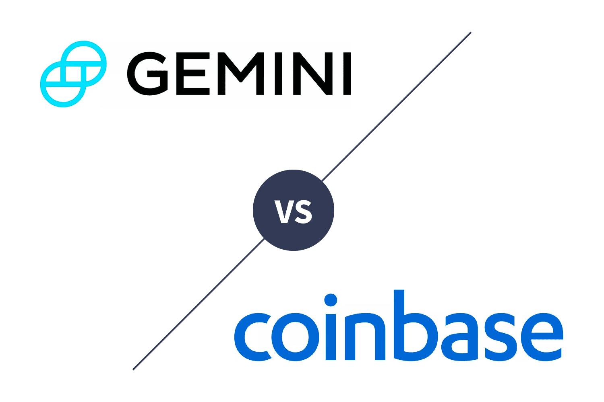

Cryptocurrency trading has witnessed substantial growth, spurred by the emergence of sophisticated platforms such as Gemini and Coinbase. These exchanges have become pivotal in providing secure and user-friendly environments for both novice and experienced traders looking to buy and sell digital assets. As the digital currency market expands, understanding the distinct features, advantages, and automated trading options offered by each platform is essential for making informed investment decisions.

Gemini and Coinbase offer a range of services designed to facilitate seamless trading experiences. Both are celebrated for their stringent security protocols and beginner-friendly interfaces, making them accessible to a wide user base. Furthermore, they have incorporated advanced algorithmic trading capabilities, allowing traders to automate their strategies and potentially streamline their trading processes. This incorporates the use of APIs that enable sophisticated trading strategies, catering to individual and institutional investors alike.



By exploring the nuances of each platform, traders can better align their needs with the most appropriate exchange. Whether the focus is on the variety of available cryptocurrencies, security measures, or educational resources, understanding the distinctions between Gemini and Coinbase is crucial. This knowledge empowers traders to choose platforms that best match their trading objectives, ultimately optimizing their asset management strategies.

## Table of Contents

## Overview of Gemini and Coinbase

Gemini and Coinbase are two prominent cryptocurrency exchanges that have carved significant niches in the digital currency market. Both platforms operate under stringent regulatory frameworks, ensuring enhanced security and compliance for their users. This establishes them as reliable choices for trading digital currencies.

Gemini, founded by the Winklevoss twins in 2014, is revered for its robust security features and a user-friendly interface that appeals to both novice and seasoned traders. The platform places a strong emphasis on regulatory compliance and was one of the first exchanges to obtain SOC 1 Type 2 and SOC 2 Type 2 certifications. This dedication to security and compliance makes it particularly attractive to institutional investors seeking a secure trading environment. [1]

In contrast, Coinbase, established in 2012 by Brian Armstrong and Fred Ehrsam, has positioned itself as a pioneer in fostering cryptocurrency adoption among the broader public. Coinbase is recognized not only for its secure trading platform but also for its educational initiatives. Through its "Coinbase Earn" program, users can learn about emerging cryptocurrencies and earn them in the process, creating an engaging pathway for individuals to enter the cryptocurrency world. This educational content is specifically designed to attract new users who are eager to understand more about digital currencies while expanding their investment portfolios. [2]

Both exchanges provide platforms accessible to a wide range of users, from beginners to institutional investors. Gemini's interface, known for its simplicity and ease of use, ensures that users can efficiently navigate the platform, execute trades, and manage their portfolios. On the other hand, Coinbase offers an intuitive user experience across its web and mobile applications, catering to a diverse audience by simplifying the complexities associated with [cryptocurrency](/wiki/cryptocurrency) trading.

The focus on robust security, user accessibility, and educational content ensures that Gemini and Coinbase maintain their status as leading cryptocurrency exchanges. This accessibility and educational focus enable both platforms to cater to diverse investment needs and preferences, strengthening their roles as key players in the cryptocurrency market.

**References:**

1. Gemini Trust Company, LLC. "Security and Compliance." Gemini, www.gemini.com/security.
2. Coinbase, Inc. "Learn and Earn." Coinbase, www.coinbase.com/earn.

## Features and Benefits of Gemini

Gemini is a prominent cryptocurrency exchange that supports a diverse selection of over 70 digital currencies, catering to a broad range of investors. One of the key features of Gemini is its Gemini Wallet, which provides insurance coverage to protect assets against potential security breaches, underscoring its commitment to safeguarding investor funds.

For traders seeking more sophisticated trading operations, Gemini offers robust APIs for [algorithmic trading](/wiki/algorithmic-trading). These APIs enable users to automate trading strategies, enhancing efficiency and execution speed. An example of a basic algorithmic trading strategy using Gemini's API in Python might look like this:

```python
import requests

def get_market_data(pair):
    url = f"https://api.gemini.com/v1/pubticker/{pair}"
    response = requests.get(url)
    return response.json()

pair = 'btcusd'
market_data = get_market_data(pair)
print(f"Last price of {pair}: {market_data['last']}")
```

In addition to its technical capabilities, Gemini provides extensive educational resources including a comprehensive FAQ knowledge base. This resource is valuable for both new and experienced traders, helping them navigate the complexities of cryptocurrency trading. Further supporting its users, Gemini offers 24/7 customer service, ensuring that assistance is always available whenever needed.

Gemini's ActiveTrader program is particularly beneficial for institutional investors. This program offers advanced charting, multiple order types, and auctions for obtaining competitive pricing. ActiveTrader is designed to meet the demanding requirements of high-[volume](/wiki/volume-trading-strategy) traders who require rapid trade execution and broad market access.

Security is a top priority for Gemini; the exchange utilizes cold storage to secure the majority of user funds offline, protecting them from online threats. This security measure is crucial for maintaining trust and confidence among users, particularly institutional investors who require stringent security protocols to protect significant asset holdings.

## Features and Benefits of Coinbase

Coinbase has established itself as a leading cryptocurrency exchange by offering a range of features and benefits tailored to both novice and seasoned investors. One of its significant advantages is the extensive support for over 200 cryptocurrencies, which allows users to diversify their portfolios with both well-known and emerging digital assets. This expansive offering sets Coinbase apart from many other exchanges and provides users with ample opportunities to explore different investment options.

A notable feature of Coinbase is its seamless user experience through both mobile and web applications. The intuitive interface ensures that buying, selling, and trading cryptocurrencies are straightforward processes, even for beginners. This ease of use is augmented by the platform's educational initiatives, such as Coinbase Earn, which enables users to learn about new cryptocurrencies while [earning](/wiki/earning-announcement) small amounts of these digital assets. This dual approach of educating users while offering financial incentives enhances user engagement and knowledge.

Security is a paramount concern in cryptocurrency trading, and Coinbase addresses this through robust security measures. Two-step verification is a standard feature that adds an extra layer of protection to user accounts. Additionally, Coinbase offers insurance coverage for digital assets held in its online storage, providing further peace of mind to users. These security protocols ensure that user funds and data are safeguarded against potential threats.

For traders interested in tracking market dynamics, Coinbase includes advanced charting tools that enable users to analyze historical price movements and identify trends. These tools provide valuable insights that aid in making informed trading decisions. Furthermore, the platform's watchlist feature allows users to customize and monitor specific cryptocurrencies, ensuring they stay updated on market developments and alerts. 

Overall, Coinbase combines a wide selection of cryptocurrencies, user-friendly interfaces, comprehensive educational resources, robust security measures, and sophisticated analytical tools, making it a versatile platform suited to various trading needs and preferences.

## Algorithmic Trading on Gemini and Coinbase

Both Gemini and Coinbase offer API integrations that enable traders to implement and automate their trading strategies. These APIs are pivotal for investors aiming to execute algorithmic trading, which involves programmable strategies that can react to market data and execute trades at high speeds and frequencies that are otherwise unmanageable by human traders.

### Gemini API for Algorithmic Trading

Gemini provides robust API solutions tailored specifically for institutional clients. These APIs support advanced trading features essential for large-scale trading operations. Institutional traders can benefit from functionalities such as direct access to order [books](/wiki/algo-trading-books), real-time trading data, and the ability to execute various order types programmatically. The API also supports sophisticated trading strategies, such as:

- **Trend Following**: This strategy involves programming algorithms to identify the direction of the market price movements and execute trades based on the established trends.

- **Arbitrage**: Here, traders can exploit price differences of the same asset in different markets. Gemini's API allows the automation of purchasing an asset in one market where the price is low and simultaneously selling it in another market where the price is higher.

- **Index Fund Rebalancing**: Traders can use APIs to automatically adjust the asset composition of portfolios based on predefined criteria, continuously aligning with specific index targets.

### Coinbase API for Algorithmic Trading

While Coinbase is known for its user-friendly environment, it also offers API integrations that are accessible to beginners in algorithmic trading. These APIs provide the fundamental tools necessary for traders to develop and test their strategies. They support automated executions within their platform, enabling users to engage in:

- **Simple Market Making**: This strategy involves placing buy and sell orders to profit from the bid-ask spread. Coinbase's API allows for automatic order placement and execution.

- **Execution Algorithms**: Traders can utilize API aspects that assist in breaking down larger orders into smaller incremental trades to minimize market impact.

Here is a simple Python example illustrating how an API can be used to fetch real-time market data and place an order based on predefined conditions:

```python
import requests

# Placeholder for actual API URLs and keys
API_URL = 'https://api.exchange.example.com'
API_KEY = 'your_api_key_here'

# Fetching real-time market data
def get_market_data(symbol):
    response = requests.get(f'{API_URL}/ticker/{symbol}', headers={'API-KEY': API_KEY})
    return response.json()

# Placing an order based on market data
def place_order(symbol, quantity, order_type='buy'):
    data = {
        'symbol': symbol,
        'quantity': quantity,
        'type': order_type
    }
    order_response = requests.post(f'{API_URL}/order', json=data, headers={'API-KEY': API_KEY})
    return order_response.json()

# Example usage
market_data = get_market_data('BTC-USD')
if market_data['price'] < 20000:  # Hypothetical condition
    order_result = place_order('BTC-USD', 0.1, 'buy')
    print(order_result)
```

In conclusion, both Gemini and Coinbase provide versatile API integrations that support algorithmic trading. Whether a trader requires the premium functionalities suited for institutional trading available through Gemini or the tailored tools for beginner algorithmic traders offered by Coinbase, these platforms furnish essential resources for executing automated trading strategies effectively.

## Security Measures

Gemini and Coinbase prioritize robust security protocols to ensure the safety of their users' assets and personal information. Both exchanges utilize cold storage for the majority of digital assets, which involves storing cryptocurrencies in offline hardware systems, away from potential online threats. This approach significantly reduces the risk of hacking and unauthorized access, as offline storage systems are not connected to the internet.

For USD balances, both exchanges offer FDIC insurance coverage, providing an extra layer of protection and instilling greater confidence among users. FDIC insurance covers up to $250,000 per depositor in the U.S., safeguarding users' cash holdings against potential banking failures.

Gemini further distinguishes itself with its SOC 1 and SOC 2 Type 2 certifications. These certifications, issued by third-party auditors, verify the efficacy of Gemini's internal controls over financial reporting and ensure that their systems are designed to secure customer data, maintain privacy, and provide robust protection against potential security threats.

Coinbase, on the other hand, employs advanced security features such as multi-signature wallets and AES-256 encryption. Multi-signature wallets require multiple keys to authorize a transaction, adding another layer of control and security over fund access. AES-256 encryption is a highly secure encryption standard that protects sensitive user data during transmission and storage, making it extremely difficult for hackers to decrypt the data without the correct keys.

These comprehensive security measures underscore Gemini's and Coinbase's commitment to delivering secure and reliable platforms for cryptocurrency trading and investing, ensuring that users' assets are well protected against the evolving landscape of digital threats.

## Comparing Fees and Usability

When comparing the fee structures and usability of Gemini and Coinbase, both exchanges stand out for their intricate pricing models, tailored to cater to different types of investors and traders. Gemini's ActiveTrader program offers a strategic advantage by providing lower fees for high-volume trading. This program is particularly beneficial for users engaging in substantial transactions, as it allows them to benefit from reduced taker and maker fees compared to the standard market.

On the other hand, Coinbase offers additional convenience for everyday users by supporting Automated Clearing House (ACH) transfers with no fees for standard transactions. This feature can save users a significant amount on transaction fees, especially for those who engage in regular deposits and withdrawals.

Gemini distinguishes itself by not charging fees for wire transfers, which can be particularly advantageous for institutional investors and users handling larger transaction volumes. This feature provides a cost-effective option for users who prefer bank transfers over other funding methods.

From a usability perspective, both platforms offer distinct advantages. Gemini is well-regarded for its interface designed to meet the needs of institutional investors, while Coinbase is praised for its intuitive layout, likely to attract beginners in cryptocurrency trading. The choice between the two often hinges on the specific requirements of the user—be it the need for lower fees through volume trading on Gemini or the easy access and no-fee transactions offered by Coinbase.

## Final Verdict

Coinbase is particularly attractive for users who prioritize a broad selection of cryptocurrencies and value educational enhancements within their trading experience. With support for over 200 cryptocurrencies and a platform designed to educate users while they earn, Coinbase provides a comprehensive suite for learning and engagement, positioning itself as an ideal choice for those exploring diverse digital assets and seeking to build knowledge alongside their investment activities.

Conversely, Gemini is a platform that caters to those who require institutional-grade services and prioritize advanced security features. Its focus on safety, underscored by SOC 1 and SOC 2 Type 2 certifications and cold storage security, makes it appealing to institutional investors and those who handle substantial monetary transactions. Additionally, the exchange's suite of advanced trading tools, such as the ActiveTrader program, provides users seeking more sophisticated trading capabilities with the resources they need.

Ultimately, the choice between Gemini and Coinbase hinges on individual trading needs and preferences. Users dedicated to exploring a wide range of cryptocurrencies with integrated educational resources might find Coinbase more suitable. At the same time, those who need rigorous security measures and advanced trading functionalities may prefer Gemini. Factors such as the variety of supported currencies, user interface design, and available trading tools should significantly influence the decision-making process, tailoring the selection to best fit an investor's specific requirements and strategic objectives.

## Conclusion

Gemini and Coinbase have established themselves as prominent platforms in the cryptocurrency exchange market, catering to both beginners and experienced traders. These exchanges provide a robust suite of features designed to accommodate varying trading strategies and risk preferences. Both platforms emphasize high security measures, including cold storage, encryption, and insurance coverage, which enhance user confidence and asset protection. The combination of diverse cryptocurrency offerings and educational resources on Coinbase makes it an attractive option for those new to digital currency trading. Conversely, Gemini's focus on institutional-grade services and comprehensive security protocols appeals to users seeking a more sophisticated trading environment.

For investors navigating the cryptocurrency landscape, choosing between Gemini and Coinbase involves a careful evaluation of individual trading needs and priorities. Factors such as the range of supported cryptocurrencies, access to advanced trading tools, and fee structures rank high in importance. By aligning these factors with personal investment goals, traders can optimize their portfolio performance and enhance their overall trading experience.

## References & Further Reading

[1]: Winklevoss, C., & Winklevoss, T. ["Security and Compliance." Gemini.](https://www.nytimes.com/2017/12/19/technology/bitcoin-winklevoss-twins.html)

[2]: Coinbase, Inc. ["Learn and Earn." Coinbase.](https://www.coinbase.com/learning-rewards)

[3]: Narayanan, A., Bonneau, J., Felten, E., Miller, A., & Goldfeder, S. (2016). ["Bitcoin and Cryptocurrency Technologies: A Comprehensive Introduction"](https://press.princeton.edu/books/hardcover/9780691171692/bitcoin-and-cryptocurrency-technologies). Princeton University Press.

[4]: Lopez de Prado, M. (2018). ["Advances in Financial Machine Learning"](https://www.amazon.com/Advances-Financial-Machine-Learning-Marcos/dp/1119482089). Wiley.

[5]: Chan, E. P. (2009). ["Quantitative Trading: How to Build Your Own Algorithmic Trading Business"](https://github.com/ftvision/quant_trading_echan_book). Wiley.

[6]: Jansen, S. (2020). ["Machine Learning for Algorithmic Trading: Predictive Models to Extract Signals From Market and Alternative Data for Systematic Trading Strategies"](https://www.amazon.com/Machine-Learning-Algorithmic-Trading-alternative/dp/1839217715). Packt Publishing.