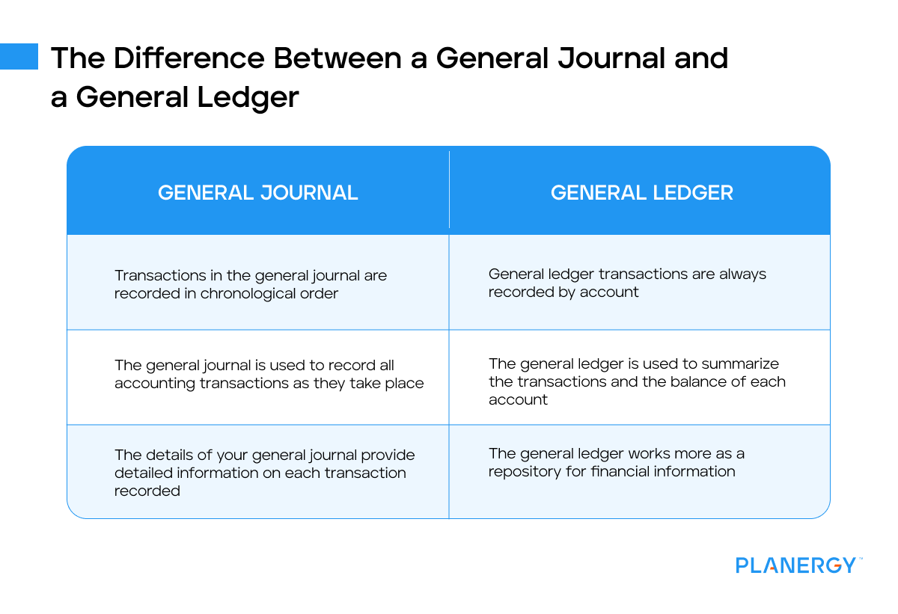

## Table of Contents

## What is a general ledger?

A general ledger is like a big notebook where a business keeps track of all its money activities. It records all the transactions, such as money coming in from sales and money going out for expenses. Each transaction is sorted into different accounts, like cash, sales, and expenses, so it's easy to see where the money is coming from and where it's going.

Think of the general ledger as the main source of financial information for a business. It helps the business make reports like the income statement and balance sheet. These reports show how well the business is doing financially. By keeping the general ledger up to date and accurate, a business can make smart decisions about its money.

## What is a general journal?

A general journal is like a diary where a business writes down all its money activities before they go into the big notebook called the general ledger. It's the first place where transactions are recorded, and each entry includes the date, the accounts that are affected, the amounts, and a short note about what happened. For example, if a business buys a new computer, the general journal would record the date of the purchase, the amount spent, and which accounts (like cash and equipment) are affected.

The general journal helps keep things organized and makes sure every transaction is recorded correctly before it goes into the general ledger. It's important because it provides a clear trail of all financial activities, making it easier to check for mistakes or to answer questions about past transactions. By using a general journal, a business can ensure that all its financial data is accurate and complete before it's used to create important financial reports.

## How do the general ledger and general journal differ in their purpose?

The general journal and the general ledger serve different but related purposes in keeping track of a business's money activities. The general journal is like a diary where all transactions are first written down. It records the date of each transaction, the accounts affected, the amounts, and a brief description of what happened. This initial recording helps to keep everything organized and ensures that every financial event is captured accurately right from the start.

On the other hand, the general ledger acts as the main notebook where all these transactions are sorted and summarized. After being recorded in the general journal, each transaction is moved to the general ledger, where it is categorized into specific accounts like cash, sales, and expenses. This sorting makes it easier to see the overall financial health of the business and to prepare important financial reports like the income statement and balance sheet. Essentially, the general ledger provides a clear and structured view of all the financial data.

In summary, the general journal is the starting point for recording transactions, ensuring accuracy and completeness, while the general ledger organizes and summarizes this data for better financial analysis and reporting. Both are crucial for maintaining accurate financial records, but they serve different stages of the accounting process.

## What types of transactions are recorded in a general journal?

The general journal records all sorts of money activities that happen in a business. This includes when the business gets money, like from selling things or getting a loan, and when it spends money, like paying for supplies or salaries. It also keeps track of other events that affect the business's money, such as when the business buys new equipment or when it gets money back from a customer who paid too much.

Every transaction in the general journal has details like the date it happened, which accounts are involved, how much money is involved, and a short note about what the transaction is about. For example, if a business buys a new computer, the general journal will show the date of the purchase, the amount spent, and note that money went out from the cash account and into the equipment account. This way, the general journal captures all the financial activities of the business in one place before they are sorted into the general ledger.

## How are transactions recorded differently in a general ledger compared to a general journal?

In a general journal, transactions are recorded as they happen, one after the other. Each entry includes the date of the transaction, the accounts that are affected, the amounts of money involved, and a short description of what the transaction is about. For example, if a business buys a new computer, the general journal will show the date of the purchase, the amount spent, and note that money went out from the cash account and into the equipment account. This way, the general journal acts like a diary, capturing every financial event in the order it occurs.

In the general ledger, these same transactions are sorted into different accounts. After being recorded in the general journal, each transaction is moved to the general ledger, where it's organized by account. So, the purchase of the new computer would be recorded in both the cash account (showing money going out) and the equipment account (showing the value of the new computer coming in). This sorting helps to see the total effect on each account over time, making it easier to create financial reports like the income statement and balance sheet. The general ledger gives a clear, structured view of all the business's financial activities, while the general journal provides the initial, chronological record.

## What is the process of transferring data from the general journal to the general ledger?

The process of transferring data from the general journal to the general ledger is called posting. When a transaction is first recorded in the general journal, it includes details like the date, the accounts involved, the amounts, and a brief description of what happened. For example, if a business buys a new computer, the general journal entry will show the date, the amount spent, and note that money went out from the cash account and into the equipment account.

After the transaction is recorded in the general journal, it's time to post it to the general ledger. This means taking the information from the journal entry and entering it into the specific accounts in the ledger. For the computer purchase, the amount would be subtracted from the cash account and added to the equipment account in the general ledger. This sorting helps to see the total impact on each account over time, making it easier to prepare financial reports. By doing this, the business keeps all its financial data organized and ready for analysis.

## How does the structure of a general ledger differ from that of a general journal?

The general journal and the general ledger have different ways of organizing money activities in a business. The general journal is like a diary where transactions are written down in the order they happen. Each entry in the journal has the date of the transaction, the accounts affected, the amount of money involved, and a short note about what happened. So, if a business buys a new computer, the journal entry will show when it happened, how much was spent, and that money came out of the cash account and went into the equipment account. This way, the journal keeps a complete record of everything in the order it occurs.

The general ledger, on the other hand, sorts these transactions into different accounts. After being recorded in the journal, each transaction is moved to the ledger where it's organized by account type. For the computer purchase, the ledger would show a decrease in the cash account and an increase in the equipment account. This sorting helps the business see the total effect on each account over time, making it easier to create financial reports like the income statement and balance sheet. The ledger provides a structured view of the business's money activities, while the journal gives the initial, chronological record.

## Can you explain the role of the general journal in the double-entry bookkeeping system?

The general journal is really important in the double-entry bookkeeping system. This system says that every time money moves, it should be recorded in two places. One place shows money coming in, and the other shows money going out. The general journal is where these moves are first written down. For example, if a business buys a new computer, the journal will show that money went out from the cash account and into the equipment account. This way, the journal makes sure every move is recorded correctly and helps keep the books balanced.

The general journal also helps to explain why the money moved. Each entry in the journal has a date, the accounts affected, the amount of money, and a short note about what happened. This note is helpful because it gives more details about the transaction. So, when the business looks back at its records, it can understand why things happened the way they did. By using the general journal, the business can make sure all its money activities are recorded accurately before they are moved to the general ledger.

## How does the use of general ledger and general journal impact financial reporting?

The general journal and general ledger play a big role in making financial reports for a business. The general journal is where all the money activities are first written down. It keeps track of when things happen, how much money is involved, and which accounts are affected. This helps make sure that every transaction is recorded correctly from the start. Once these transactions are in the journal, they are moved to the general ledger. The general ledger sorts all these transactions into different accounts, like cash, sales, and expenses. This sorting makes it easy to see how much money is coming in and going out in each area of the business.

Having accurate and organized records in the general journal and general ledger makes it easier to create important financial reports. For example, the income statement shows how much money the business made and spent over a certain time, and the balance sheet shows what the business owns and owes at a specific point in time. Both these reports use the data from the general ledger. If the general journal and general ledger are kept up to date and correct, the financial reports will be accurate too. This helps the business know how it's doing financially and make smart decisions about its money.

## What are the best practices for maintaining accuracy in both general ledger and general journal entries?

Keeping the general journal and general ledger accurate is really important for a business. One way to do this is by making sure every transaction is recorded in the general journal as soon as it happens. This means writing down the date, the accounts affected, the amount of money, and a short note about what happened. It's also good to double-check these entries for mistakes, like wrong numbers or the wrong accounts. Using a consistent way of recording things helps too, so everyone in the business knows what to do.

Once the transactions are in the general journal, they need to be moved to the general ledger correctly. This is called posting, and it's important to do it carefully. Each transaction should be put into the right accounts in the ledger, like cash, sales, and expenses. Regularly checking the ledger for errors and making sure it matches the journal is a good idea. Also, having someone else review the entries can help catch mistakes. By keeping both the journal and ledger accurate, the business can trust its financial reports and make better decisions about its money.

## How can modern accounting software enhance the management of general ledgers and journals?

Modern accounting software makes managing general ledgers and journals much easier and more accurate. It automates the process of recording transactions in the general journal, so businesses don't have to write everything down by hand. The software can quickly sort these transactions into the right accounts in the general ledger, saving a lot of time. It also helps catch mistakes by checking the numbers and making sure everything adds up correctly. This way, the business can trust that its financial records are right.

Another great thing about accounting software is that it makes it easy to see reports and analyze the business's money. With just a few clicks, the software can create important reports like the income statement and balance sheet using the data from the general ledger. It also lets multiple people work on the books at the same time, so everyone stays up to date. By using modern accounting software, businesses can keep their general ledgers and journals organized and accurate, helping them make smart decisions about their money.

## What are the advanced analytical techniques used to audit entries in general ledgers and journals?

Advanced analytical techniques help businesses check their general ledgers and journals for mistakes or unusual activities. One way to do this is by using data analytics, which looks at big sets of numbers to find patterns or things that don't fit. For example, the software can check if the numbers in the ledger match the journal entries, or if there are any strange changes in the accounts. It can also look for signs of fraud, like if someone is trying to hide money by moving it between accounts in a way that doesn't make sense.

Another technique is called trend analysis, which looks at how the numbers in the ledger change over time. This can help spot if something unusual is happening, like if expenses suddenly go up a lot without a good reason. By comparing the current numbers to past records, the business can see if everything is normal or if there's a problem. These advanced techniques make it easier to keep the general ledgers and journals accurate and trustworthy, helping the business stay on top of its money.

## References & Further Reading

[1]: ["Accounting Made Simple: Accounting Explained in 100 Pages or Less"](https://www.amazon.com/Accounting-Made-Simple-Explained-Pages/dp/0981454224) by Mike Piper

[2]: ["Algorithmic Trading: Winning Strategies and Their Rationale"](https://www.wiley.com/en-us/Algorithmic+Trading%3A+Winning+Strategies+and+Their+Rationale-p-9781118460146) by Ernie Chan

[3]: ["Financial Accounting Theory and Analysis: Text and Cases"](https://books.google.com/books/about/Financial_Accounting_Theory_and_Analysis.html?id=oVKsDwAAQBAJ) by Richard Schroeder, Myrtle Clark, and Jack Cathey

[4]: ["The Essentials of Financial Analysis"](https://www.amazon.com/Essentials-Financial-Analysis-Samuel-Weaver/dp/007176836X) by Samuel Weaver and J. Fred Weston

[5]: ["Accounting Information Systems"](https://www.investopedia.com/terms/a/accounting-information-system-ais.asp) by Marshall B. Romney and Paul J. Steinbart