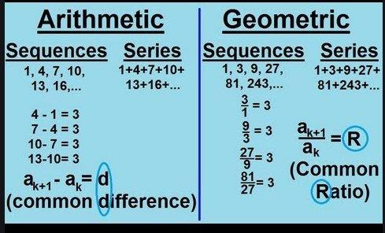

## Table of Contents

## What is the geometric mean and how is it calculated?

The geometric mean is a way to find the average of a set of numbers that are related to each other by multiplication, rather than addition. It's useful when you want to understand the overall 'growth rate' or 'scale' of numbers. For example, if you're looking at the growth of an investment over several years, the geometric mean can tell you the average yearly growth rate.

To calculate the geometric mean, you start by multiplying all the numbers together. If you have three numbers, like 2, 4, and 8, you would multiply them to get 2 × 4 × 8 = 64. Next, you take the nth root of this product, where n is the number of values you started with. In our example, since we had three numbers, you would take the cube root of 64, which is 4. So, the geometric mean of 2, 4, and 8 is 4.

## What is the arithmetic mean and how is it calculated?

The arithmetic mean is what most people think of when they hear the word "average." It's a way to find the middle value of a set of numbers by adding them all up and then dividing by how many numbers you have. For example, if you have the numbers 2, 4, and 8, you add them together to get 14. Then you divide 14 by 3 (the number of values) to get 4.67. So, the arithmetic mean of 2, 4, and 8 is 4.67.

This type of mean is useful when you want to understand the typical value in a set of numbers. It's commonly used in everyday situations, like calculating your average test score or the average temperature over a week. The arithmetic mean gives equal weight to each number in the set, which makes it simple to calculate and understand.

## How do the geometric and arithmetic means differ in their calculation?

The geometric mean and the arithmetic mean are two ways to find the average of a set of numbers, but they use different methods. The geometric mean is used when you want to understand the overall growth rate or scale of numbers. To find it, you multiply all the numbers together and then take the nth root of the product, where n is the number of values you have. For example, if you have the numbers 2, 4, and 8, you multiply them to get 64, and then take the cube root of 64 to get 4. So, the geometric mean of 2, 4, and 8 is 4.

On the other hand, the arithmetic mean is what most people think of when they talk about an average. It's used to find the middle value of a set of numbers by adding them all up and then dividing by the number of values. Using the same numbers, 2, 4, and 8, you add them to get 14, and then divide 14 by 3 to get 4.67. So, the arithmetic mean of 2, 4, and 8 is 4.67. The arithmetic mean is useful for understanding the typical value in a set of numbers and is commonly used in everyday situations.

## In what types of data sets is the geometric mean more appropriate to use?

The geometric mean is more appropriate to use when you have data that grow or change over time, like the growth of an investment or the increase in population. It's good for understanding the average rate of change because it looks at how things multiply rather than just add up. For example, if you want to know the average yearly growth rate of your savings account over several years, the geometric mean will give you a better answer than the arithmetic mean.

It's also useful when you're dealing with numbers that are very different in size or spread out a lot. The geometric mean helps to balance out extreme values so that they don't skew your average too much. This makes it a good choice for things like financial ratios or rates of return, where one big number could make the arithmetic mean misleading. So, if you're working with data where the numbers multiply together or where you need to account for big differences, the geometric mean is the way to go.

## In what types of data sets is the arithmetic mean more appropriate to use?

The arithmetic mean is best for data sets where you want to find the typical or middle value. It's great for everyday situations like figuring out your average test score or the average temperature over a week. When you add up all the numbers and divide by how many there are, you get a good sense of what's normal or expected in your data. This type of mean works well when all the numbers in your set are similar in size and you want each number to have the same importance.

For example, if you're looking at the average height of students in a class, the arithmetic mean will give you a good idea of what the typical height is. It's simple to calculate and understand, which makes it useful in many common situations. But remember, the arithmetic mean can be affected a lot by very high or very low numbers, so it might not be the best choice if your data has big differences or extreme values.

## How do the geometric and arithmetic means compare when applied to the same set of positive numbers?

When you use the geometric mean and the arithmetic mean on the same set of positive numbers, you'll usually get different results. The arithmetic mean is bigger than the geometric mean, except when all the numbers in the set are the same. If they are the same, both means will be equal. The difference between the two means depends on how spread out the numbers are. The more spread out they are, the bigger the difference will be.

The arithmetic mean adds up all the numbers and divides by how many there are, so it's like finding the middle value. It's good for understanding what's typical in a set of numbers, like average test scores or temperatures. On the other hand, the geometric mean multiplies all the numbers together and then takes the root, so it's useful for understanding how things grow or change over time, like the growth of an investment. Because of these different ways of calculating, the arithmetic mean will always be at least as big as the geometric mean, and usually bigger, when the numbers are not all the same.

## What is the relationship between the geometric and arithmetic means in terms of inequality?

The geometric mean and the arithmetic mean are related by an important inequality. This inequality says that the arithmetic mean is always at least as big as the geometric mean when you're looking at a set of positive numbers. The only time the two means are the same is when all the numbers in the set are exactly the same. If the numbers are different, the arithmetic mean will be bigger than the geometric mean.

This difference happens because the arithmetic mean adds up all the numbers and divides by how many there are, while the geometric mean multiplies them together and takes a root. When you add numbers, bigger numbers have more effect than smaller ones. But when you multiply numbers, the effect of each number is more balanced. So, the arithmetic mean gives more weight to larger numbers, making it bigger than the geometric mean when the numbers are not all the same.

## Can you provide examples where the use of geometric mean versus arithmetic mean significantly impacts the result?

Imagine you're looking at the growth of your savings account over three years. In year one, it grows by 10%, in year two by 20%, and in year three by 30%. If you want to know the average yearly growth rate, using the arithmetic mean would give you (10% + 20% + 30%) / 3 = 20%. But this isn't right because it doesn't show how your money grows over time. The geometric mean is better here. It takes the cube root of (1.10 × 1.20 × 1.30) - 1, which gives you about 19.7%. This is closer to the real average growth rate because it accounts for the compounding effect.

Now, think about a class of students where most are around the same age, but one student is much older. The ages are 10, 11, 12, 13, and 50. The arithmetic mean would be (10 + 11 + 12 + 13 + 50) / 5 = 19.2. This number is way higher than most of the students' ages because the older student's age pulls the average up a lot. If you use the geometric mean, it's the fifth root of (10 × 11 × 12 × 13 × 50), which is about 16.8. The geometric mean is lower and gives a better idea of the typical age in the class because it doesn't let the one big number affect the result as much.

## How do geometric and arithmetic means affect the interpretation of growth rates or investment returns?

When you want to understand how much your money or an investment grows over time, the geometric mean is better to use than the arithmetic mean. This is because the geometric mean looks at how your money multiplies over time. If you have different growth rates each year, the geometric mean will show you the average rate that makes your money grow to the amount you have at the end. For example, if your investment grows by 10% one year, 20% the next, and 30% the year after, the geometric mean will tell you the average yearly growth rate that leads to your final amount. The arithmetic mean would just add up those rates and divide by three, which wouldn't show how the growth compounds over time.

On the other hand, the arithmetic mean can be misleading when you're looking at growth rates or investment returns. It treats each year's growth rate the same, which doesn't match how money actually grows. If you use the arithmetic mean to find the average growth rate, it might make it seem like your money is growing faster than it really is. This is because the arithmetic mean adds up all the rates and divides them, giving too much weight to the bigger numbers. So, if you're trying to figure out how much your savings or investments are growing, the geometric mean gives you a more accurate picture of the average growth rate over time.

## What are the statistical properties of the geometric and arithmetic means, and how do they influence data analysis?

The geometric mean and the arithmetic mean have different statistical properties that affect how they are used in data analysis. The arithmetic mean is the sum of all values divided by the number of values. It's sensitive to extreme values, or outliers, because it adds them up and then divides. This means that one very high or very low number can pull the average up or down a lot. The arithmetic mean is good for looking at data where all values are similar and you want to find the middle value, like average test scores or temperatures. But if your data has big differences or extreme values, the arithmetic mean might not give you a good picture of what's typical.

The geometric mean, on the other hand, multiplies all the values together and then takes the nth root, where n is the number of values. This makes it less sensitive to extreme values because multiplying balances out the numbers more evenly than adding. The geometric mean is useful when you're looking at data that grows or changes over time, like the growth of an investment or population. It's also good for understanding the average rate of change or the scale of numbers. When you use the geometric mean, you get a better idea of how things grow or change over time, which is important for things like calculating the average yearly growth rate of your savings.

Both means can give you different results when you use them on the same set of data. The arithmetic mean is always at least as big as the geometric mean, and usually bigger, unless all the numbers are the same. This difference can change how you interpret your data. If you're looking at growth rates or investment returns, the geometric mean will give you a more accurate average rate of change. But if you're looking for a simple middle value in a set of similar numbers, the arithmetic mean is easier to use and understand. Choosing the right mean depends on what you're trying to learn from your data.

## How do the geometric and arithmetic means behave under transformations such as logarithms or exponents?

When you take the logarithm of numbers and then find their mean, the arithmetic mean of the logarithms turns into the geometric mean of the original numbers. This is because the logarithm changes multiplication into addition. So, if you have numbers like 2, 4, and 8, you can take their logarithms, find the arithmetic mean of those logarithms, and then turn that back into the original scale by using the exponent of the base of the logarithm. This way, you end up with the geometric mean of 2, 4, and 8, which is 4.

On the other hand, if you take the exponents of numbers and then find their mean, the arithmetic mean of the exponents turns into the geometric mean of the original numbers raised to those exponents. For example, if you have numbers 2, 4, and 8 and you raise them to some power, like 2, you get 4, 16, and 64. The geometric mean of 2, 4, and 8 raised to the power of 2 is the same as taking the arithmetic mean of 2, 2, and 2 (which are the exponents) and then raising 2 to that mean power. This is a bit more complicated, but it shows how the arithmetic mean of exponents relates to the geometric mean of the original numbers.

## What advanced applications in fields like finance or engineering utilize the differences between geometric and arithmetic means?

In finance, the difference between the geometric and arithmetic means is very important for understanding investment returns. When you look at how much your money grows over time, like in a savings account or stock market investment, the geometric mean gives you a better idea of the average yearly growth rate. This is because it takes into account how your money compounds over time. If you just use the arithmetic mean, it might make it seem like your money is growing faster than it really is because it adds up all the yearly returns and divides them, without considering how the returns build on each other. So, when you're figuring out how much you can expect your investment to grow, using the geometric mean helps you get a more accurate picture of what will happen over the long term.

In engineering, the difference between the two means can be useful when you're working with data that has a lot of variation, like the strength of materials or the performance of systems. The arithmetic mean is good for finding the average value of a set of similar numbers, like the average strength of a batch of steel beams. But if you're looking at data that grows or changes over time, like the efficiency of a machine over its life, the geometric mean can give you a better idea of the average rate of change. This can help engineers predict how well a system will perform over time or how much a material's strength will change under different conditions. By choosing the right mean, engineers can make better decisions about the design and maintenance of their projects.

## What is the Understanding of Arithmetic Mean?

The arithmetic mean, often referred to simply as the average, is a fundamental statistical measure that represents the central tendency of a data set. It is calculated by summing all the data values and then dividing by the number of values in the set. Mathematically, the arithmetic mean $\bar{x}$ of a data set $x_1, x_2, \ldots, x_n$ is expressed as:

$$
\bar{x} = \frac{x_1 + x_2 + \cdots + x_n}{n}
$$

In the context of finance, the arithmetic mean is frequently used to calculate the average return on investment over a specific period. For instance, if an investor has annual returns of 5%, 10%, and 15% over three consecutive years, the arithmetic mean return would be:

$$
\bar{r} = \frac{5\% + 10\% + 15\%}{3} = 10\%
$$

This calculation provides a straightforward way to assess the typical return during the period.

However, the arithmetic mean possesses limitations, particularly when it comes to accounting for the variability or [volatility](/wiki/volatility-trading-strategies) of returns. It assumes that investment returns are independent and identically distributed, which is often not the case in real-world financial markets. As a result, using the arithmetic mean to represent average investment performance can be misleading, especially in scenarios where returns fluctuate significantly.

For example, consider an investment that gains 50% in one year and loses 50% in the following year. The arithmetic mean return would be calculated as:

$$
\bar{r} = \frac{50\% - 50\%}{2} = 0\%
$$

While it seems that the average return is zero, the actual performance of this investment over the two years results in a net loss; a 50% gain on an initial amount followed by a 50% loss reduces the capital significantly due to the multiplicative nature of financial returns.

Such inconsistencies highlight the potential pitfalls of relying solely on the arithmetic mean for financial analysis, particularly for investments subject to high volatility or compounding effects. In these cases, other statistical measures like the geometric mean may provide a more accurate reflection of the investment's performance over time.

## What is Geometric Mean?

The geometric mean is a measure that plays a critical role in financial analysis, especially when it comes to understanding compounding returns. Mathematically, the geometric mean of a set of n numbers is defined as the nth root of their product. In formulaic terms, for a dataset containing values $x_1, x_2, \ldots, x_n$, the geometric mean $G$ is calculated as:

$$

G = \left( \prod_{i=1}^{n} x_i \right)^{\frac{1}{n}} = \sqrt[n]{x_1 \times x_2 \times \cdots \times x_n} 
$$

This definition emphasizes its capacity to capture average growth rates accurately when dealing with variables that have a compounding effect on each other.

In practical applications like finance, the geometric mean is especially beneficial for deriving the true average growth rate of investments over time. It accounts for the effect of compounding, which linear measures like the arithmetic mean fail to illustrate. For instance, if an investment portfolio experiences variable returns that are linked through compounding, the geometric mean provides a more realistic measure of the effective average return.

Consider an investment scenario with annual returns of 10%, -5%, and 15%. Unlike the arithmetic mean, which sums up these returns and divides by the number of years, the geometric mean takes the compounded effect into account:

```python
import numpy as np

returns = [1.10, 0.95, 1.15]
geometric_mean_return = np.prod(returns)**(1/len(returns)) - 1

geometric_mean_return_percentage = geometric_mean_return * 100
print(f"Geometric Mean Return: {geometric_mean_return_percentage:.2f}%")
```

This snippet shows how you can calculate the geometric mean in Python, leading to a more accurate representation of the compounded returns.

In volatile market conditions, where returns fluctuate significantly, the geometric mean offers a more truthful indicator of the portfolio’s performance over multiple periods. This measure reflects the effect of compound interest and provides insights that help investors make more informed decisions. This contrasts with the arithmetic mean, which can mislead by exaggerating expected returns in cases of high volatility. Thus, the geometric mean is an indispensable tool for financial analysts looking to align investment assessments with the inherent compounding nature of real-world financial scenarios.

## What are the key differences between the two means?

Arithmetic and geometric means serve distinct purposes in statistical analysis, particularly in finance where they are employed to gauge investment performance. A primary distinction lies in how each mean treats data sets. The arithmetic mean is calculated by summing all data values and dividing by the count of values, thus treating each number with equal weight without considering interdependencies. Formally, the arithmetic mean $\bar{x}$ of a set of $n$ numbers $x_1, x_2, \ldots, x_n$ is:

$$

\bar{x} = \frac{x_1 + x_2 + \cdots + x_n}{n}
$$

Conversely, the geometric mean considers the multiplicative relationships between numbers, which makes it more appropriate for datasets where values are interdependent, such as compounded investment returns. The geometric mean $G$ of the same set of numbers is given by:

$$

G = (x_1 \times x_2 \times \cdots \times x_n)^{1/n}
$$

The distinctions between these means become apparent when analyzing investment returns, especially under conditions of volatility and compounding effects. The arithmetic mean can misrepresent an investor's actual rate of return when investment outcomes demonstrate variability. For instance, consider a scenario where an investment portfolio experiences returns of +50% in one period and -50% in another. The arithmetic mean would suggest an average return of 0%, not reflecting the actual portfolio loss over time, as the net result is a 25% reduction in the overall value.

$$

\text{Arithmetic Mean Return} = \frac{50\% + (-50\%)}{2} = 0\%
$$

Given the same returns, the geometric mean offers an accurate assessment by incorporating the compounding effect:

$$

\text{Ending Value} = 1.5 \times 0.5 = 0.75 
$$
$$

\text{Geometric Mean Return} = (1.5 \times 0.5)^{1/2} - 1 = -0.1339 \text{ or } -13.39\%
$$

In volatile markets, employing the geometric mean provides a comprehensive perspective by reflecting the true growth rate or decline over multiple periods. Therefore, investors should prioritize the geometric mean to derive a more realistic overview of their portfolio's long-term performance. By considering compounding effects and assessing multiplicative rather than additive changes, the geometric mean furnishes a more valuable metric for evaluating and planning investment strategies over extended timeframes.

## What are the applications in algorithmic trading?

In [algorithmic trading](/wiki/algorithmic-trading), the decision to utilize either the arithmetic mean or the geometric mean is pivotal in shaping strategy outcomes. Each mean provides insights that can direct algorithmic strategies, but their effectiveness varies depending on the nature of the returns and the dependencies involved.

Trade algorithms that incorporate the geometric mean have a distinct advantage in quantifying compounded growth over time. This advantage lies in the geometric mean's innate ability to account for successive multiplicative relationships of returns, which are common in algorithmic trading. The geometric mean provides a measure of central tendency that inherently considers the effects of compounding. In mathematical terms, the geometric mean of a set of values $x_1, x_2, \ldots, x_n$ is calculated as:

$$
\text{Geometric Mean} = \left( \prod_{i=1}^{n} x_i \right)^{1/n}
$$

This formula highlights how each data point contributes to the overall measure in a multiplicative fashion, making it particularly suitable for growth rates and returns that are sequential and compound over time.

Optimizing algorithmic trading strategies requires an understanding of when to apply each mean. The arithmetic mean, calculated by summing the values and dividing by their count, is straightforward yet can be deceptive in contexts where returns fluctuate significantly. For example, if an asset experiences a 50% gain one period followed by a 50% loss the next, the arithmetic mean suggests a return to the original value, which misrepresents practical outcomes since the combined effect is a negative return.

Conversely, the geometric mean accurately reflects the compounding nature, providing a lower, more realistic average return in volatile environments. This understanding enables the development of more robust trading algorithms that align with realistic expectations in holding periods, risk assessments, and performance evaluations. Python code can assist in illustrating this difference:

```python
import numpy as np

# Example returns as percentages
returns = [1.5, 0.7]  # Represents +50% and -30%
# Arithmetic Mean
arith_mean = np.mean(returns)

# Geometric Mean
geo_mean = np.exp(np.mean(np.log(returns)))

print(f"Arithmetic Mean: {arith_mean}")
print(f"Geometric Mean: {geo_mean}")
```

Efficiency in algorithmic trading is thus enhanced by selecting the geometric mean in scenarios characterized by high volatility and compounding. This choice ensures that algorithms are tuned to realistic growth expectations and risk profiles, ultimately leading to improved portfolio returns. Understanding these nuances and leveraging the geometric mean appropriately allows traders to refine strategies for optimal financial outcomes.

## What are some practical examples and case studies?

To illustrate the impact of arithmetic and geometric means on investment assessment, consider a hypothetical portfolio with annual returns over five years as follows: +10%, -15%, +25%, +5%, and -10%. 

Using the **arithmetic mean**, these returns aggregate to an average annual return of:

$$
\text{Arithmetic Mean} = \frac{10 + (-15) + 25 + 5 + (-10)}{5} = \frac{15}{5} = 3\%
$$

This calculation suggests an average annual return of 3%, implying steady growth over the period. However, this does not account for the compounding nature of investment returns, which can drastically alter outcomes over multiple periods.

In contrast, the **geometric mean** provides a more accurate measure by considering compounding effects. It is calculated using the formula:

$$
\text{Geometric Mean} = \left( (1+0.10) \times (1-0.15) \times (1+0.25) \times (1+0.05) \times (1-0.10) \right)^{1/5} - 1
$$

Calculating each term: 
- Year 1: $1 + 0.10 = 1.10$
- Year 2: $1 - 0.15 = 0.85$
- Year 3: $1 + 0.25 = 1.25$
- Year 4: $1 + 0.05 = 1.05$
- Year 5: $1 - 0.10 = 0.90$

Now, multiplying these values:

$$
1.10 \times 0.85 \times 1.25 \times 1.05 \times 0.90 \approx 1.0724
$$

Taking the fifth root:

$$
(1.0724)^{\frac{1}{5}} \approx 1.014 \Rightarrow \text{Geometric Mean} \approx 1.4\%
$$

This reveals an average annual geometric return of approximately 1.4%. This method shows how returns, when compounded, reflect a more modest growth rate over the period compared to the arithmetic mean, which overestimates the performance.

Real-world case studies further underscore this discrepancy. For example, an algorithmic trading strategy that initially displayed promising outcomes using the arithmetic mean often faltered under volatile market conditions. Such strategies appeared robust when averaged returns masked excessive variability. However, when faced with market turbulence, the misleading optimism given by these averages led to substantial drawdowns. In practice, several hedge funds that previously relied on arithmetic analysis shifted focus towards geometric assessment, prompted by significant losses during periods of heightened volatility.

Consequently, the analysis of historical portfolios or algorithmic strategies should prioritize geometric means to evaluate realistic growth scenarios and mitigate risk accurately. This approach aids in adjusting strategies to accommodate fluctuations and provides a more reliable foundation for future investment decisions.

## Why should we emphasize geometric mean in investment analysis?

In investment analysis, the geometric mean is crucial for accurately assessing long-term growth and performance, particularly in contexts where compounding plays a significant role. Unlike the arithmetic mean, which may overstate investment returns by not factoring in the effects of compounding and volatility, the geometric mean provides a truer measure of an investment's growth trajectory over time.

The geometric mean is calculated using the formula:

$$

\text{Geometric Mean} = \left(\prod_{i=1}^{n} (1 + r_i)\right)^{\frac{1}{n}} - 1 
$$

where $r_i$ represents the return for each period, and $n$ is the total number of periods. This approach accounts for the fact that investment returns are often interconnected across time periods, reflecting the cumulative effect of each return sequence.

In scenarios where returns compound, the geometric mean is highly beneficial. It not only depicts the central tendency of the returns but also inherently incorporates the compounding effect, which is missed by the arithmetic mean. This attribute makes the geometric mean a more reliable tool for a realistic assessment of long-term investment performance.

Furthermore, emphasizing the geometric mean in investment analysis aids in better risk management. By incorporating this measure, investors can more easily identify adjustments needed for different return scenarios, thus making more informed decisions. For investors looking to evaluate the actual growth and volatility inherent in their portfolios, particularly over extended periods with frequent compounding, the geometric mean is indispensable.

For instance, consider two investment portfolios that show identical average arithmetic returns over five years but drastically differ in volatility and compounding characteristics. The portfolio with consistent annual growth will likely have a geometric mean close to its arithmetic mean, indicating stability. Conversely, the portfolio with volatile returns will have a geometric mean significantly lower than its arithmetic counterpart, highlighting the impact of fluctuating returns and compounding, thereby necessitating a more cautious investment approach.

As such, reliance on the geometric mean aids in comprehensively understanding both the potential and risk of investment portfolios, ensuring strategic financial planning and optimization.

## References & Further Reading

[1]: MacKinlay, A. C. (1997). ["Event Studies in Economics and Finance."](https://www.jstor.org/stable/2729691) Journal of Economic Literature, 35(1), 13-39.

[2]: Lo, A. W., & MacKinlay, A. C. (1999). ["A Non-Random Walk Down Wall Street"](https://www.jstor.org/stable/j.ctt7tccx). Princeton University Press.

[3]: Cover, T. M., & Thomas, J. A. (2006). ["Elements of Information Theory."](https://onlinelibrary.wiley.com/doi/book/10.1002/047174882X) John Wiley & Sons.

[4]: Bodie, Z., Kane, A., & Marcus, A. J. (2014). ["Investments and Portfolio Management."](https://www.mheducation.com/highered/product/Investments-Bodie.html) McGraw-Hill Education.

[5]: Fama, E. F. (1970). ["Efficient Capital Markets: A Review of Theory and Empirical Work."](https://onlinelibrary.wiley.com/doi/abs/10.1111/j.1540-6261.1970.tb00518.x) Journal of Finance, 25(2), 383-417.