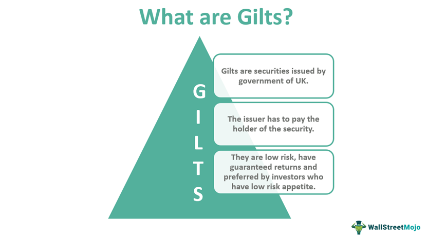

Bonds are a foundational element of the financial investment ecosystem, known for providing a degree of stability and offering predictable returns. Within the bond market, various types of bonds cater to different levels of risk appetite and investment strategies. Among them, gilt-edged bonds possess a hallmark of high credit quality and are often perceived as a safe investment option due to the high probability of timely interest payments and principal return. These bonds are typically issued by governments or entities with robust financial health, contributing to their reputation for security.

In contrast to other bonds that may exhibit a broad range of credit qualities, gilt-edged bonds are distinguished by their consistent quality and lower risk profile. This article aims to dissect the distinctions between gilt-edged bonds and regular bonds, particularly focusing on their utilization within algorithmic trading frameworks. Algorithmic trading, characterized by the use of automated systems to execute trading strategies, has seen growing adoption in bond markets due to its efficiency and ability to swiftly respond to market dynamics.



By examining gilt-edged bonds alongside their counterparts, we will highlight their unique features and the potential risks involved. Understanding these differences is essential for formulating bond trading strategies in an algorithmic context. Through this analysis, investors and traders can better comprehend how these bonds integrate into automated trading systems, potentially optimizing trading outcomes while balancing risk and return.

## Table of Contents

## Understanding Gilt-Edged Bonds

Gilt-edged bonds, commonly known as 'gilts,' represent high-grade securities that boast exceptional credit quality. These bonds are predominantly issued by governments and, on occasion, by corporations exhibiting considerable financial robustness. The hallmark of gilt-edged bonds is their perceived safety, often considered second only to U.S. Treasury bonds in terms of risk and reliability.

The term 'gilt-edged' has its origins in the United Kingdom, where government bonds were once adorned with gilded edges, signifying their superior quality. This historical context underscores the association of gilt-edged bonds with security and trust. The bonds issued by the UK government, commonly referred to as 'gilts,' have retained this nomenclature to this day, illustrating their longstanding reputation for fiscal stability and reliability.

Globally, gilt-edged bonds play a critical role in financial markets, providing a lower-risk investment avenue for conservative investors. The predictability of returns and the relatively low risk of default make these bonds an attractive component of a diversified investment portfolio, fitting the criteria of investors prioritizing capital preservation over high yields.

The current significance of gilt-edged bonds extends beyond the borders of the UK. In various countries, similar high-grade government securities are available, often forming a significant part of institutional investors' portfolios seeking stability in uncertain economic climates. The universal appeal of these bonds lies in their ability to offer a safe haven for capital, especially in times of financial [volatility](/wiki/volatility-trading-strategies).

In summary, gilt-edged bonds serve as a benchmark for security in bond markets worldwide, reflecting their historical roots and ongoing importance in the global financial system. Their role as safe investment vehicles continues to be vital, offering stability and confidence to investors in pursuit of conservative investment strategies.

## Characteristics of Regular Bonds

Regular bonds encompass a wide range of securities issued by various entities, including corporations, municipalities, and those classified as high-yield or speculative. Unlike gilt-edged bonds, which are known for their high credit quality and low risk, regular bonds exhibit significant variability in terms of credit quality and risk profile.

### Credit Quality and Risk

Regular bonds do not adhere to the same high credit standards as gilt-edged bonds, resulting in a spectrum of credit ratings. Investment-grade bonds, typically rated BBB- or higher by credit rating agencies like Standard & Poor's, offer lower risk but also lower yields. On the other end of the spectrum, non-investment grade or high-yield bonds, often called "junk bonds," [carry](/wiki/carry-trading) higher default risk but compensate investors with higher potential returns. The diversity in credit quality means that investors can find bonds catering to various risk appetites, whether they prioritize safety or higher returns.

### Features and Variability

The features of regular bonds add to their variability. Corporate bonds, for example, are influenced heavily by the issuing company's financial performance, industry conditions, and overall economic environment. Municipal bonds, issued by states and local governments, usually offer tax advantages but may be affected by regional economic conditions and governmental policies. High-yield bonds, due to their riskier nature, often provide opportunities for significant capital gains and attract speculative investors seeking higher returns.

### Risk-Return Profile

Regular bonds present a complex risk-return profile. The potential for higher yields compared to more secure bonds like gilts makes them attractive to certain investors, particularly those with a higher risk tolerance. Investors willing to accept greater risk levels can achieve better income streams and capital appreciation opportunities. Conversely, those seeking more stability might opt for investment-grade bonds, accepting lower yields for reduced risk exposure. 

In essence, the variability and diversity of regular bonds play a crucial role in attracting different types of investors, each with unique preferences and investment strategies. This makes them vital components of a comprehensive investment portfolio, allowing for tailored risk management and return optimization strategies.

## Gilt-Edged Bonds vs. Regular Bonds: Key Differences

Gilt-edged bonds, often referred to as "gilts," are highly regarded for their security and lower risk profile. These bonds are typically issued by stable governments, ensuring a high degree of reliability, which makes them attractive to risk-averse investors. As a result, gilt-edged bonds typically offer lower yields compared to other bond types, acting as a trade-off for their perceived safety. This is primarily because the risk of default on gilt-edged bonds is minimal, which substantially reduces the risk premium required by investors.

In contrast, regular bonds encompass a wide array of securities, including corporate, municipal, and high-yield bonds, each varying significantly in credit quality. Corporate bonds, for example, may range from investment-grade to high-yield ("junk") status, reflecting the issuer's financial health and market standing. High-yield bonds, while more speculative, promise higher returns to compensate investors for the increased risk of default and market volatility. This risk-return trade-off is central to the bond market, attracting investors with varying risk appetites.

Investment-grade ratings assigned by credit rating agencies such as Moody’s and Standard & Poor’s play a critical role in differentiating between gilt-edged and regular bonds. Bonds receiving a higher rating are deemed safer and therefore offer lower yields, reflecting the lower credit risk. Conversely, bonds rated lower must provide higher yields to attract investors willing to take on greater risk.

The decision to invest in gilt-edged or regular bonds largely depends on an investor’s risk appetite and income needs. Conservative investors, prioritizing capital preservation and stability, may lean towards gilt-edged bonds despite their lower yields. Meanwhile, those seeking higher income and willing to accept more risk might opt for regular bonds. Ultimately, understanding these key differences helps investors align their bond investments with their broader financial goals and risk management strategies.

## Algorithmic Trading of Bonds

Algorithmic trading, a paradigm shift in modern finance, utilizes automated platforms to implement pre-defined trading strategies with unparalleled speed and precision. This methodology is increasingly prevalent in bond markets, enhancing effectiveness in executing trades and optimizing market opportunities. 

Applying [algorithmic trading](/wiki/algorithmic-trading) to gilt-edged bonds and regular bonds involves similar foundational strategies but with distinct considerations due to their inherent characteristics. Gilt-edged bonds, known for their creditworthiness and lower risk, often feature in strategies focused on stability and predictable outcomes. Algorithms trading these bonds prioritize metrics like interest rates, inflation expectations, and yield spreads. Given their lower yield volatility, the emphasis is on maintaining a balanced portfolio with controlled risk exposure.

Regular bonds, with their broader spectrum ranging from high-grade corporate bonds to high-yield issues, demand more nuanced algorithmic approaches. These bonds involve more complex trading models that consider credit risk, default probabilities, and economic indicators. Algorithms operate on the principle of maximizing returns while managing added risks through techniques like credit spread analysis, duration adjustments, and sensitivity to macroeconomic shifts. 

Bond ratings from agencies such as Moody's and Standard & Poor's are integral to these strategies. Algorithmic models leverage these ratings to quantify the credit risk associated with each bond. Ratings changes can trigger re-evaluation of holdings, prompting buy, hold, or sell decisions within the algorithm's framework. This automated analysis helps traders respond to market movements swiftly and efficiently.

Market movements influence algorithmic trading strategies significantly. Volatility indices, [interest rate](/wiki/interest-rate-trading-strategies) trends, and economic news releases are continuously analyzed to adjust trading positions responsibly. In the case of regular bonds, algorithms adeptly maneuver through fluctuations, while for gilt-edged bonds, they maintain a steady [course](/wiki/best-algorithmic-trading-courses) to ensure stability.

Incorporating these elements, algorithmic trading in the bond markets enhances the decision-making process and optimizes execution efficiency, allowing investors to harness the distinct advantages of both gilt-edged and regular bonds in their portfolios.

## Special Considerations in Bond Trading

Algorithmic trading, when applied to bond markets, faces unique challenges and requires meticulous consideration of specific factors that influence bond performance. One of the primary elements that algorithmic trading systems must account for is bond [liquidity](/wiki/liquidity-risk-premium). Liquidity refers to the ease with which a bond can be bought or sold in the market without affecting its price. Gilt-edged bonds, due to their nature as stable, high-credit securities, generally exhibit higher liquidity compared to more volatile, lower-grade bonds. Algorithmic models must be capable of swiftly determining the liquidity status of a bond, adapting their strategies accordingly to optimize trade execution. Poor liquidity can lead to substantial market impact costs, thereby necessitating robust algorithms capable of mitigating such risks.

Market volatility is another critical [factor](/wiki/factor-investing) in bond trading. While gilt-edged bonds typically demonstrate lower volatility due to their secure backing, regular bonds, especially those on the higher end of the risk spectrum, can display pronounced price fluctuations. Algorithmic trading systems designed to handle bond volatility often incorporate statistical models to predict price movements and adjust trading strategies in real-time. These models might employ standard deviation measures or the VIX (Volatility Index) as indicators to gauge potential market upheavals, executing trades that align with volatility forecasts.

Interest rate changes also pose a significant challenge for algorithmic traders in the bond arena. Bond prices have an inverse relationship with interest rates; as rates rise, bond prices typically fall, and vice versa. Algorithms must incorporate interest rate forecasts to align trading strategies with expected market conditions. For instance, a sudden rise in interest rates can adversely impact long-duration bonds more significantly than short-duration bonds. Therefore, algorithms might utilize duration and convexity measures to evaluate a bond's sensitivity to interest rate changes and adjust the portfolio’s duration accordingly to minimize risk.

Python, as a preferred language for developing trading algorithms, can assist in implementing these strategies. Here is a simplified Python snippet for calculating bond duration, a key factor in understanding interest rate risks:

```python
def bond_duration(face_value, coupon_rate, market_rate, years):
    duration = 0
    price = 0
    for t in range(1, years + 1):
        cash_flow = (face_value * coupon_rate if t < years else face_value * (1 + coupon_rate))
        present_value = cash_flow / ((1 + market_rate) ** t)
        duration += present_value * t
        price += present_value
    return duration / price

# Example
face_value = 1000
coupon_rate = 0.05
market_rate = 0.03
years = 10

duration = bond_duration(face_value, coupon_rate, market_rate, years)
print("Bond Duration:", duration)
```

This code helps in determining the duration of a bond, providing insight into its interest rate risk, thereby allowing algorithmic traders to optimize their strategies in response to expected rate changes.

In conclusion, algorithmic trading in the bond markets necessitates the consideration of liquidity, volatility, and interest rate changes. Each of these factors plays a pivotal role in shaping the performance of algorithmic strategies. By incorporating advanced statistical models and rigorous computational methods, traders can enhance their ability to navigate the complex landscape of bond trading.

## Conclusion

Both gilt-edged and regular bonds are integral parts of diversified investment portfolios, each offering unique benefits and serving distinct roles based on their characteristics. Gilt-edged bonds provide security and stability, appealing to investors seeking low-risk investments. Their high credit quality and government backing make them a cornerstone for conservative strategies.

In contrast, regular bonds encompass a wide spectrum of credit qualities, including corporate, municipal, and high-yield bonds. They cater to investors willing to assume higher risk in pursuit of greater returns. This diversity allows for more flexible allocation, accommodating varied risk appetites and investment objectives.

The evolution of algorithmic trading has further expanded the utilization of both gilt-edged and regular bonds. As these automated systems become increasingly sophisticated, they enhance the efficiency of bond trading by leveraging advanced data analytics and real-time market monitoring. Such advancements have made it imperative for investors to stay informed about technological trends and their implications on market dynamics.

Ultimately, understanding the inherent differences between gilt-edged and regular bonds enables investors to craft strategies that align with their financial goals. As algorithmic trading tools continue to evolve, keeping abreast of these developments ensures that investors can optimize their portfolios in a rapidly changing environment. Staying informed and adaptable is crucial for achieving optimal investment outcomes in the bond market.

## References & Further Reading

[1]: Fabozzi, F. J. (2013). ["Bond Markets, Analysis, and Strategies."](https://books.google.com/books/about/Bond_Markets_Analysis_and_Strategies_ten.html?id=bQpNEAAAQBAJ) Pearson Education.

[2]: Choudhry, M. (2010). ["The Bond and Money Markets: Strategy, Trading, Analysis."](https://www.sciencedirect.com/book/9780750646772/the-bond-and-money-markets) Butterworth-Heinemann.

[3]: Lopez de Prado, M. (2018). ["Advances in Financial Machine Learning."](https://www.amazon.com/Advances-Financial-Machine-Learning-Marcos/dp/1119482089) Wiley.

[4]: Jansen, S. (2020). ["Machine Learning for Algorithmic Trading: Predictive Models to Extract Signals from Market and Alternative Data for Systematic Trading Strategies with Python."](https://github.com/stefan-jansen/machine-learning-for-trading) Packt Publishing.

[5]: Aronson, D. R. (2006). ["Evidence-Based Technical Analysis: Applying the Scientific Method and Statistical Inference to Trading Signals."](https://www.amazon.com/Evidence-Based-Technical-Analysis-Scientific-Statistical/dp/0470008741) John Wiley & Sons.

[6]: Chan, E. P. (2008). ["Quantitative Trading: How to Build Your Own Algorithmic Trading Business."](https://github.com/ftvision/quant_trading_echan_book) Wiley Trading.

[7]: Hull, J. C. (2015). ["Options, Futures, and Other Derivatives."](https://www.semanticscholar.org/paper/Options%2C-Futures%2C-and-Other-Derivatives-Hull/89bdee500c8623864fc9eb7a471546aa713acc44) Pearson Education.

[8]: Stoll, H. R. (2006). ["Electronic Trading in Stock Markets."](https://www.jstor.org/stable/pdf/30033638.pdf) The Journal of Economic Perspectives.

[9]: Perold, A. F. (1988). ["The Implementation Shortfall: Paper Versus Reality."](https://www.hbs.edu/faculty/Pages/item.aspx?num=2083) The Journal of Portfolio Management.