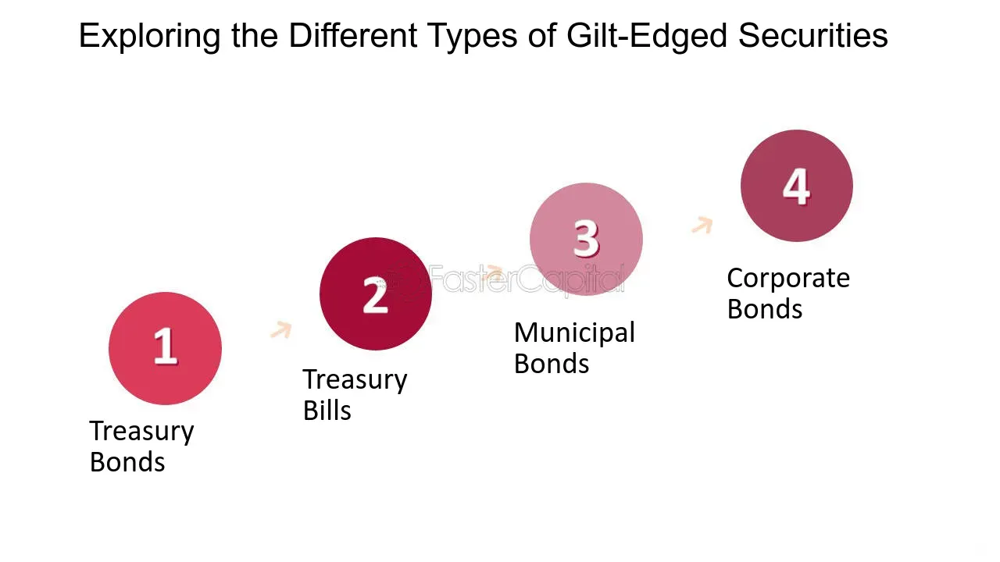

## Table of Contents

## What are gilt-edged bonds?

Gilt-edged bonds, often called gilts, are government-issued securities in the United Kingdom. They are considered very safe investments because they are backed by the government, which means there is a very low risk that the government won't be able to pay back the money it borrows.

These bonds pay interest to the people who buy them, usually twice a year. The interest rate is fixed, which means it stays the same over the life of the bond. Investors like gilts because they provide a steady income and are seen as a secure way to save money.

## What are regular bonds?

Regular bonds are like loans that people or companies can buy from a government or a company. When you buy a bond, you are giving money to the issuer, and in return, they promise to pay you back the money you lent them, plus some extra money as interest, over a certain period of time. This interest is usually paid to you every year or every six months until the bond reaches its end date, which is called the maturity date. At the maturity date, the issuer gives you back the original amount of money you lent them.

Bonds can be issued by governments, like the U.S. Treasury bonds, or by companies, known as corporate bonds. Government bonds are generally seen as safer because governments are less likely to run out of money compared to companies. However, corporate bonds might offer higher interest rates to attract investors because they can be riskier. The interest rate, or the coupon rate, depends on how much the issuer thinks they need to pay to get people to buy their bonds, and it can be affected by things like how well the economy is doing or how much risk people think there is.

## How do the issuers of gilt-edged bonds differ from those of regular bonds?

Gilt-edged bonds are issued only by the UK government. This means that when you buy a gilt-edged bond, you are lending money to the UK government. The UK government uses these bonds to raise money for things like building roads, schools, or paying for public services. Because the UK government is very unlikely to go bankrupt, gilt-edged bonds are seen as very safe investments.

Regular bonds, on the other hand, can be issued by many different types of organizations. Governments from other countries, like the U.S. with its Treasury bonds, can issue them. Also, companies can issue bonds, which are called corporate bonds. When you buy a regular bond, you could be lending money to a foreign government or a company. These bonds might be riskier than gilt-edged bonds because companies and some governments can go bankrupt, but they might also offer higher interest rates to make up for that risk.

## What are the typical interest rates offered by gilt-edged bonds compared to regular bonds?

Gilt-edged bonds usually have lower interest rates compared to many regular bonds. This is because they are seen as very safe investments. Since the UK government is unlikely to go bankrupt, investors don't need as much interest to feel comfortable lending money to them. So, the interest rates on gilt-edged bonds are generally lower than what you might get from other types of bonds.

Regular bonds, like those issued by companies or other governments, often have higher interest rates. This is because they can be riskier. If a company goes bankrupt, it might not be able to pay back the money it borrowed. To attract investors despite this risk, these bonds need to offer higher interest rates. So, if you're looking for a higher return on your investment, you might choose a regular bond, but you also need to be aware that it comes with more risk.

## How does the credit risk associated with gilt-edged bonds compare to that of regular bonds?

Gilt-edged bonds have very low credit risk. This is because they are issued by the UK government, which is considered very stable and unlikely to go bankrupt. So, when you buy a gilt-edged bond, you can feel pretty safe that the government will pay you back the money you lent them, along with the interest. This low risk is why gilt-edged bonds usually offer lower interest rates compared to other bonds.

Regular bonds can have higher credit risk, especially if they are issued by companies. If a company runs into financial trouble, it might not be able to pay back the money it borrowed. This means that if you buy a corporate bond, there's a bigger chance you could lose your money. Because of this higher risk, regular bonds, especially corporate bonds, often offer higher interest rates to make them more attractive to investors.

## What is the impact of market conditions on the prices of gilt-edged bonds versus regular bonds?

Market conditions can affect the prices of both gilt-edged bonds and regular bonds, but the impact can be different because of how safe each type of bond is seen to be. When the economy is doing well and people feel confident, they might want to invest in riskier things that could give them bigger rewards. This can make bond prices go down because fewer people want to buy them. But because gilt-edged bonds are seen as very safe, their prices might not drop as much as regular bonds. If people get scared about the economy, they might want to buy more bonds, especially safe ones like gilt-edged bonds, which can make their prices go up.

Regular bonds, especially corporate bonds, can be more sensitive to changes in the economy. If people think a company might have trouble paying back its debts, the price of its bonds can drop a lot. Also, if interest rates go up, the prices of existing bonds usually go down because new bonds would offer higher interest rates, making the old ones less attractive. Gilt-edged bonds might also see their prices go down when interest rates rise, but because they're backed by the UK government, their prices tend to be more stable than those of regular bonds.

## How do the maturity periods of gilt-edged bonds typically compare to those of regular bonds?

Gilt-edged bonds, which are issued by the UK government, come with different maturity periods. You can find gilt-edged bonds that mature in just a few months, or some that take as long as 50 years to mature. Most often, though, they have maturity periods that range from 5 to 30 years. This variety allows investors to choose bonds that fit their plans for how long they want to keep their money invested.

Regular bonds, which can be issued by other governments or companies, also have a range of maturity periods. Just like gilt-edged bonds, you can find regular bonds that mature in a short time, like a few months, or longer periods, up to 30 years or even more. The main difference is that the maturity periods of regular bonds might depend more on the financial situation and plans of the company or government issuing them. So, while both types of bonds offer a range of maturity options, the specific choices might vary based on who is issuing the bond.

## What are the tax implications of investing in gilt-edged bonds versus regular bonds?

When you invest in gilt-edged bonds, you don't have to pay tax on the interest you earn if you're a UK resident. This is called being exempt from income tax. It makes gilt-edged bonds a good choice for people who want to keep more of their investment earnings. However, if you sell your gilt-edged bonds before they mature and make a profit, you might have to pay capital gains tax on that profit. But there are some exceptions, like if the bonds are in an Individual Savings Account (ISA), where you won't have to pay this tax.

Regular bonds, on the other hand, usually don't have the same tax benefits. The interest you earn from regular bonds is typically subject to income tax. This means you'll have to pay tax on the interest you get every year or every six months, depending on when the bond pays out. If you sell a regular bond before it matures and make a profit, you'll also have to pay capital gains tax on that profit, just like with gilt-edged bonds. Again, if the regular bonds are held in an ISA, you won't have to pay these taxes. So, when choosing between gilt-edged and regular bonds, it's important to think about how taxes might affect your overall earnings.

## How does liquidity in the market for gilt-edged bonds compare to that for regular bonds?

Gilt-edged bonds usually have good liquidity in the market. This means it's pretty easy to buy or sell them without causing a big change in their price. Since they are issued by the UK government, lots of people want to buy them because they are safe. There are also many buyers and sellers in the market, which helps keep things moving smoothly. If you need to sell your gilt-edged bonds quickly, you can usually do it without much trouble.

Regular bonds can have different levels of liquidity depending on who issued them. If they are government bonds from a big country like the U.S., they might be very liquid, similar to gilt-edged bonds. But if they are corporate bonds, especially from smaller or less well-known companies, they might not be as easy to buy or sell. Fewer people might want to trade these bonds, so if you need to sell them quickly, you might have to accept a lower price or wait longer to find a buyer.

## What role do gilt-edged bonds play in a diversified investment portfolio compared to regular bonds?

Gilt-edged bonds can be a good choice for a diversified investment portfolio because they are very safe. They are issued by the UK government, so there's a very low chance they won't pay you back. This makes them a good way to balance out riskier investments in your portfolio. If you have some money in stocks or corporate bonds that might go up and down a lot, gilt-edged bonds can help keep things more stable. Plus, since you don't have to pay tax on the interest from gilt-edged bonds if you live in the UK, they can be a smart way to earn some money without losing much to taxes.

Regular bonds, like those from other governments or companies, can also help diversify your portfolio but in different ways. They might offer higher interest rates, especially if they are from companies, but they come with more risk. If a company has trouble paying its bills, you could lose money on its bonds. So, regular bonds can add both more potential reward and more risk to your portfolio. By mixing gilt-edged bonds with regular bonds, you can find a balance that fits your comfort with risk and your goals for earning money.

## How have historical yields of gilt-edged bonds compared to those of regular bonds?

Historically, gilt-edged bonds have had lower yields compared to many regular bonds. This is because they are seen as very safe investments since they are backed by the UK government. When investors feel that their money is very safe, they don't need as much interest to be happy with their investment. So, over the years, the interest rates, or yields, on gilt-edged bonds have usually been lower than what you might get from other types of bonds.

Regular bonds, like those issued by companies or other governments, often have higher yields. This is because they can be riskier. If a company runs into financial trouble, it might not be able to pay back the money it borrowed. To make up for this risk, these bonds need to offer higher interest rates to attract investors. So, looking back over time, regular bonds have generally offered higher yields than gilt-edged bonds, but with the trade-off of being less safe.

## What are the advanced strategies for trading gilt-edged bonds versus regular bonds?

Trading gilt-edged bonds can be a bit different from trading regular bonds because they are seen as very safe. One advanced strategy for trading gilt-edged bonds is to use them to hedge against other investments. If you have money in stocks or other riskier investments, you can buy gilt-edged bonds to balance out those risks. Because they are backed by the UK government, they don't move up and down in price as much as other bonds, so they can help keep your portfolio stable. Another strategy is to trade them based on interest rate changes. If you think interest rates will go down, buying gilt-edged bonds now could be a good move because their prices usually go up when interest rates drop.

For regular bonds, especially corporate bonds, advanced trading strategies often focus more on the credit risk and the company's financial health. One strategy is to buy bonds from companies that are improving their financial situation. If a company is doing better and looks more likely to pay back its debts, the price of its bonds might go up. Another strategy is to trade based on economic cycles. When the economy is doing well, companies might do better, and their bonds could be a good buy. But if you think the economy might have trouble, selling these bonds before they drop in price could be smart. Regular bonds can be more sensitive to these changes, so watching the company's news and the economy closely is important.

## References & Further Reading

[1]: Fabozzi, F. J. (2013). ["Bond Markets, Analysis, and Strategies."](https://books.google.com/books/about/Bond_Markets_Analysis_and_Strategies_ten.html?id=bQpNEAAAQBAJ) Pearson Education.

[2]: Choudhry, M. (2010). ["The Bond and Money Markets: Strategy, Trading, Analysis."](https://www.sciencedirect.com/book/9780750646772/the-bond-and-money-markets) Butterworth-Heinemann.

[3]: Lopez de Prado, M. (2018). ["Advances in Financial Machine Learning."](https://www.amazon.com/Advances-Financial-Machine-Learning-Marcos/dp/1119482089) Wiley.

[4]: Jansen, S. (2020). ["Machine Learning for Algorithmic Trading: Predictive Models to Extract Signals from Market and Alternative Data for Systematic Trading Strategies with Python."](https://github.com/stefan-jansen/machine-learning-for-trading) Packt Publishing.

[5]: Aronson, D. R. (2006). ["Evidence-Based Technical Analysis: Applying the Scientific Method and Statistical Inference to Trading Signals."](https://www.amazon.com/Evidence-Based-Technical-Analysis-Scientific-Statistical/dp/0470008741) John Wiley & Sons.

[6]: Chan, E. P. (2008). ["Quantitative Trading: How to Build Your Own Algorithmic Trading Business."](https://github.com/ftvision/quant_trading_echan_book) Wiley Trading.

[7]: Hull, J. C. (2015). ["Options, Futures, and Other Derivatives."](https://www.semanticscholar.org/paper/Options%2C-Futures%2C-and-Other-Derivatives-Hull/89bdee500c8623864fc9eb7a471546aa713acc44) Pearson Education.

[8]: Stoll, H. R. (2006). ["Electronic Trading in Stock Markets."](https://www.jstor.org/stable/pdf/30033638.pdf) The Journal of Economic Perspectives.

[9]: Perold, A. F. (1988). ["The Implementation Shortfall: Paper Versus Reality."](https://www.hbs.edu/faculty/Pages/item.aspx?num=2083) The Journal of Portfolio Management.