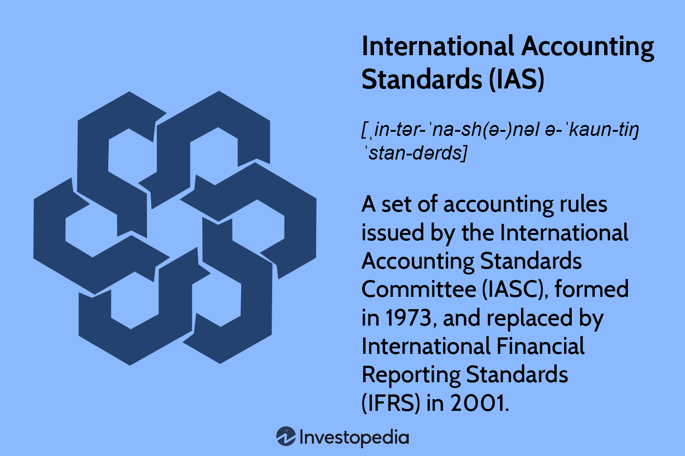

## Table of Contents

## What are accounting standards?

Accounting standards are a set of rules and guidelines that companies must follow when they prepare their financial statements. These standards help make sure that the financial information a company shares is clear, accurate, and useful for people like investors, creditors, and regulators. They help everyone understand a company's financial health in the same way, no matter where the company is located.

There are different sets of accounting standards used around the world. In the United States, companies often use the Generally Accepted Accounting Principles (GAAP). Many other countries use the International Financial Reporting Standards (IFRS). Both sets of standards cover things like how to record revenue, expenses, assets, and liabilities. By following these standards, companies can provide financial statements that are consistent and comparable, which helps people make better decisions about the company.

## Why are global accounting standards important?

Global accounting standards are important because they help make financial information easier to understand and compare across different countries. When companies all over the world use the same rules to report their finances, it's easier for investors, creditors, and regulators to see how well a company is doing, no matter where it is located. This makes it simpler for people to make smart decisions about where to invest their money or whether to lend money to a company.

Having global standards also helps prevent confusion and mistakes that can happen when different countries have different ways of doing things. If everyone follows the same set of rules, there's less chance of misunderstandings or errors in financial reports. This can build more trust in the global market because people know that the financial information they're looking at is reliable and consistent, no matter which country the company is from.

## What is the difference between IFRS and GAAP?

IFRS, or International Financial Reporting Standards, and GAAP, or Generally Accepted Accounting Principles, are two different sets of rules that companies use to prepare their financial statements. IFRS is used by many countries around the world, while GAAP is mainly used in the United States. One big difference is how they handle inventory. Under GAAP, companies can use a method called Last In, First Out (LIFO) to value their inventory, but IFRS does not allow this method. This can make a big difference in how a company reports its profits.

Another difference is in how they treat research and development costs. Under GAAP, most research and development costs have to be expensed right away, which means they show up as expenses on the income statement immediately. But under IFRS, some development costs can be capitalized, which means they can be recorded as an asset on the balance sheet and then expensed over time. This can affect how profitable a company looks. Both sets of standards aim to make financial reporting clear and useful, but they have different rules that can lead to different results.

## Which countries use IFRS?

Many countries around the world use IFRS, or International Financial Reporting Standards, to make their financial reports. Some of the big countries that use IFRS are Canada, Australia, and most countries in the European Union like France, Germany, and the United Kingdom. Also, countries in Asia like Japan, China, and India use IFRS, but they might have their own rules mixed in with it.

In South America, countries like Brazil and Argentina use IFRS. In Africa, South Africa uses IFRS too. Some countries in the Middle East, like the United Arab Emirates and Saudi Arabia, also use IFRS. Overall, more than 140 countries use IFRS in some way, which helps people understand financial reports from different countries more easily.

## Which countries use GAAP?

GAAP, or Generally Accepted Accounting Principles, is mainly used in the United States. This means that companies in the U.S. follow these rules to make their financial reports. It helps make sure that all the financial information from American companies is clear and the same, so people can trust it and make good decisions.

Some other countries also use GAAP, but it's not as common as IFRS outside the U.S. For example, a few countries like Myanmar and some Pacific Island nations use GAAP. But overall, most countries around the world use IFRS instead of GAAP to make their financial reports easier to understand and compare across different countries.

## What are the main differences in financial reporting under IFRS vs. GAAP?

One of the main differences between IFRS and GAAP is how they treat inventory. Under GAAP, companies can use a method called Last In, First Out (LIFO) to value their inventory. This means they can say the most recent items they bought are the first ones they sold. But IFRS does not allow this method. This difference can change how much profit a company shows because LIFO can lower the reported profit during times when prices are going up. So, if a company uses GAAP and LIFO, it might look less profitable than if it used IFRS.

Another big difference is how they handle research and development costs. Under GAAP, most of these costs need to be written off right away, showing up as expenses on the income statement. This can make a company look less profitable in the short term. But under IFRS, some of the development costs can be recorded as an asset on the balance sheet and then spread out over time as expenses. This means a company using IFRS might look more profitable in the short term because it's not showing all the costs right away. Both sets of rules want to make financial reports clear and useful, but these differences can lead to different results when you look at a company's finances.

## How do IFRS and GAAP handle revenue recognition?

Both IFRS and GAAP have rules about how companies should report the money they earn, which is called revenue recognition. Under IFRS, companies follow a standard called IFRS 15, which says they should recognize revenue when they transfer goods or services to a customer, and the customer gets control of those goods or services. This means the company can count the money as revenue when they've done their part of the deal, even if the customer hasn't paid yet. 

GAAP also has rules for revenue recognition, and they're pretty similar to IFRS. In the U.S., companies follow a standard called ASC 606, which also says to recognize revenue when a company transfers goods or services to a customer and the customer gets control. The main idea is the same: count the money as revenue when the company has done what it promised, not when the customer pays. Even though the rules are similar, there might be small differences in how companies apply them, but the goal is to make sure the revenue numbers are fair and clear.

## What are the implications of adopting IFRS for a company previously using GAAP?

When a company that used to follow GAAP switches to IFRS, it needs to change how it reports its finances. This can be a big deal because IFRS has different rules than GAAP. For example, if the company used the LIFO method to value its inventory under GAAP, it can't do that anymore under IFRS. This change can affect how much profit the company shows because LIFO can make profits look lower when prices are going up. Also, the company might have to start treating some development costs differently. Under GAAP, these costs were often written off right away, but under IFRS, they can be recorded as an asset and spread out over time. This means the company might look more profitable in the short term after switching to IFRS.

Switching to IFRS can also make it easier for the company to do business around the world. Since many countries use IFRS, investors and other companies from those places can understand the company's financial reports better. This can help the company attract more investors or do more business with companies in other countries. But the switch can be hard work. The company will need to retrain its accounting team, update its accounting systems, and maybe even change its financial statements from past years to show what they would have looked like under IFRS. It's a big change, but it can help the company fit in better with the global market.

## How do IFRS and GAAP differ in their treatment of inventory?

One key difference between IFRS and GAAP is how they handle inventory. Under GAAP, companies in the U.S. can use a method called Last In, First Out (LIFO) to value their inventory. This means they can say the newest items they bought are the first ones they sold. But IFRS doesn't allow LIFO. Instead, IFRS uses other methods like First In, First Out (FIFO) or weighted average cost. This difference can affect how much profit a company reports, especially when prices are going up. Using LIFO can make profits look lower because the cost of goods sold is higher.

The choice between LIFO and other methods can also impact how a company looks to investors. If a company switches from GAAP to IFRS, it has to stop using LIFO. This can make its inventory value go up on the balance sheet and might make its profits look higher. It's important for companies to understand these differences because they can change how people see the company's financial health. Switching to IFRS means the company's financial reports will be easier to compare with companies in other countries that use IFRS, but it also means a big change in how they report their inventory.

## What challenges do multinational corporations face with different accounting standards?

Multinational corporations face big challenges because they have to deal with different accounting standards in different countries. For example, a company might use GAAP in the U.S. but need to follow IFRS in Europe. This can make it hard to keep their financial reports consistent across all their branches. They might need to keep two sets of [books](/wiki/algo-trading-books), one for each set of standards, which takes a lot of time and can be confusing. It also means they need accountants who understand both sets of rules, which can be expensive and hard to find.

Another challenge is that the differences in standards can make it tough for investors to understand the company's true financial health. For example, if a company uses LIFO under GAAP, it might show lower profits than if it used IFRS. This can make it hard for investors to compare the company with others that use different standards. It's also a problem when the company wants to expand or do business in new countries. They have to learn and follow new rules, which can slow them down and cost more money. Overall, dealing with different accounting standards can be a big headache for multinational corporations.

## How are non-current assets treated differently under IFRS and GAAP?

Non-current assets, like buildings or machinery, are treated a bit differently under IFRS and GAAP. Under IFRS, companies can choose to value these assets at their original cost minus any wear and tear, or they can revalue them to what they're worth now. This means if the value of the building goes up, the company can show that on their books. But under GAAP, companies can only use the original cost minus wear and tear. They can't revalue the asset to show its current value, even if it's worth more now.

These differences can affect how a company looks financially. If a company uses IFRS and decides to revalue its assets, it might look richer on paper because it can show the higher value of its buildings or machinery. But if it uses GAAP, it can't do that, so its financial reports might not show the increase in value. This can be important for investors who want to know how much a company's assets are really worth.

## What future developments can we expect in the convergence of global accounting standards?

In the future, we can expect more work to make global accounting standards the same. Many people want IFRS and GAAP to be more alike so that financial reports from different countries are easier to compare. Groups like the International Accounting Standards Board (IASB) and the Financial Accounting Standards Board (FASB) in the U.S. are already working together to make this happen. They've made some progress, but there's still a lot to do. For example, they've agreed on how to report revenue, but other areas like how to treat inventory or non-current assets are still different.

Even though it's hard, the goal is to keep trying to make the rules more similar. This can help multinational companies because they won't have to keep two sets of books or learn different rules for each country. It also makes life easier for investors who want to understand a company's financial health no matter where it's from. But changes take time, and there might be disagreements about what the rules should be. So, while we can expect more progress, it will probably happen slowly, and we'll need to keep watching to see how things turn out.

## References & Further Reading

[1]: FASB Accounting Standards Codification. ["Generally Accepted Accounting Principles (GAAP)."](https://fasb.org/standards)

[2]: International Financial Reporting Standards Foundation. ["International Financial Reporting Standards (IFRS)."](https://www.ifrs.org/)

[3]: Lopez de Prado, M. (2018). ["Advances in Financial Machine Learning."](https://www.amazon.com/Advances-Financial-Machine-Learning-Marcos/dp/1119482089) Wiley.

[4]: Jansen, S. (2020). ["Machine Learning for Algorithmic Trading."](https://github.com/stefan-jansen/machine-learning-for-trading) Packt Publishing.

[5]: Chan, E. P. (2009). ["Quantitative Trading: How to Build Your Own Algorithmic Trading Business."](https://github.com/ftvision/quant_trading_echan_book) Wiley.