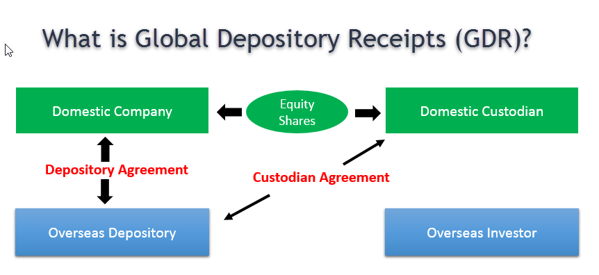

In the global financial markets, investors can access a plethora of financial instruments to diversify their portfolios. Among these are depositary receipts, such as American Depositary Receipts (ADRs) and Global Depositary Receipts (GDRs), which play pivotal roles in facilitating cross-border investments. ADRs enable U.S. investors to hold shares in foreign companies through receipts issued by U.S. depositary banks. Similarly, GDRs offer a mechanism for corporations to raise capital outside their home markets, making their shares accessible to global investors.

These depositary receipts simplify investing in foreign equities by mitigating the challenges associated with direct market investments—such as currency conversion, varying regulations, and complex tax structures. ADRs and GDRs thus serve as crucial tools for investors seeking exposure to international markets. The ability to participate in global economic growth through these instruments can lead to portfolio diversification and the potential for enhanced returns.



Concurrently, the rise of algorithmic trading has significantly transformed the landscape of global finance. Algorithmic trading involves using computer algorithms to execute trades at speeds and frequencies beyond human capability. This evolution in trading technology facilitates efficient and swift responses to market opportunities and risks. Algorithms can process vast amounts of market data to identify trading signals, manage risk, and execute orders with minimal delay.

The integration of algorithmic trading in the transaction of ADRs and GDRs has ushered in a new era of efficiency and precision. This integration enables investors to capitalize on inefficiencies, such as arbitrage opportunities arising from disparities between depositary receipt prices and their underlying securities. As a result, understanding the role of technology in trading is imperative for investors navigating modern financial markets.

Overall, depositary receipts and advancements in trading technology illustrate the dynamic nature of global financial markets. Both ADRs and GDRs expand access to foreign equities, while algorithmic trading enhances the ability to act on market movements efficiently. These elements underscore the importance of staying informed about the mechanisms and opportunities that characterize contemporary investing environments.

## Table of Contents

## Understanding Financial Instruments: ADRs and GDRs

Depositary receipts are a type of financial instrument designed to simplify the process of investing in foreign companies. They represent shares in a non-domestic entity, enabling investors to partake in the foreign company's economic performance and equity benefits without directly dealing with the complexities inherent in managing foreign shares. These instruments serve as a bridge between domestic investors and international markets, facilitating portfolio diversification and expanding investment horizons.

American Depositary Receipts (ADRs) cater specifically to the U.S. market, allowing American investors to purchase shares of foreign companies in a manner more aligned with their local trading systems. ADRs are issued by U.S. depository banks, which hold the underlying foreign shares and facilitate trading on American exchanges. These receipts comply with U.S. regulations and are denominated in U.S. dollars, thereby eliminating the need for U.S. investors to engage with foreign currencies or comply with foreign trading practices.

On the other hand, Global Depositary Receipts (GDRs) offer companies a more flexible approach to raise capital across multiple international markets. By listing GDRs on various global exchanges, companies can reach a diverse group of investors beyond any single country's borders. This not only increases the company's visibility on the international stage but also broadens the investor base, potentially leading to enhanced [liquidity](/wiki/liquidity-risk-premium) and valuation. GDRs are typically issued by international depository banks, allowing for trading in multiple currencies and exchanges, thus appealing to global investors looking for exposure to foreign equities.

Both ADRs and GDRs streamline international investing by mitigating the complexities of foreign exchanges, regulatory discrepancies, and currency conversion concerns. They offer an efficient pathway for investors seeking to diversify their portfolios with international assets, benefiting from growth opportunities within foreign markets while largely adhering to their home market protocols.

## Differences Between ADRs and GDRs

American Depositary Receipts (ADRs) and Global Depositary Receipts (GDRs) both function as vehicles for facilitating investment in foreign equities, yet they are optimized for different markets and abide by distinct regulatory standards. 

ADRs are tailored exclusively for the United States market, allowing U.S. investors to engage with non-U.S. companies without the complexities involved in transacting directly in international stock exchanges. These instruments are issued in collaboration with U.S. banks and are designed to comply rigorously with U.S. securities laws. As a result, ADRs align with the trading practices and regulatory requirements of the U.S. Securities and Exchange Commission (SEC), ensuring that American investors have access to foreign securities that meet U.S. financial reporting standards and corporate governance policies.

In contrast, GDRs possess a broader international focus, facilitating [capital raising](/wiki/hedge-fund-capital-raising) and investment opportunities across multiple global markets. GDRs are commonly issued in several international financial centers such as London and Luxembourg, thus offering a wider geographical reach compared to ADRs. Consequently, GDRs must navigate a more complex regulatory environment. They are required to comply not only with the regulations of the major international exchanges on which they are listed but also with the legal and financial frameworks of the issuing company's home country. This means that GDR issuers must meet the listing requirements in each jurisdiction, which may vary significantly in terms of disclosure, compliance, and investor protection standards.

Ultimately, the choice between ADRs and GDRs for investors or issuing companies hinges on the strategic objectives concerning market access and regulatory considerations. While ADRs provide a straightforward path for American investors seeking exposure to foreign equities within a familiar regulatory setting, GDRs offer companies the advantage of tapping into a diverse pool of global investors, albeit with added regulatory complexities. Understanding these differences is crucial for investors and companies to align their investment strategies or capital-raising activities with their regulatory and market access goals.

## Benefits and Risks

Investing in American Depositary Receipts (ADRs) and Global Depositary Receipts (GDRs) presents investors with an opportunity to gain exposure to international markets, contributing significantly to portfolio diversification. These financial instruments enable investors to access and invest in foreign companies without the complexities associated with transacting directly on international stock exchanges. This access can provide avenues for potential growth that might not be available through domestic investment opportunities alone, allowing investors to benefit from the economic performance and market trends of foreign regions.

However, investing in ADRs and GDRs is not without its challenges. One of the primary risks associated with these instruments is foreign exchange risk. Since ADRs and GDRs represent shares in foreign companies, their value is often affected by fluctuations in currency exchange rates. For example, if an investor holds an ADR of a European company and the Euro depreciates against the US Dollar, the value of the ADR in Dollar terms may decrease even if the company's stock has increased in its home market currency.

Moreover, these instruments come with intricate tax implications due to the involvement of multiple jurisdictions. Investors need to be aware of tax treaties between the host country of the depositary receipt and their home country, which can affect dividend taxation and capital gains. Compliance with tax regulations across different countries can add layers of complexity to the investment process.

Political and economic risks are also significant considerations. The performance of ADRs and GDRs is inherently tied to the economic stability and political environment of the issuing company's home country. Political instability, changes in government policies, or economic downturns can negatively impact the underlying companies, thereby affecting the value of the depositary receipts. For instance, if a country undergoes a coup, nationalization of industries, or faces debilitating economic sanctions, companies based in that country might suffer, leading to depreciation in their ADRs or GDRs.

In summary, while ADRs and GDRs offer valuable opportunities for international market participation and portfolio diversification, investors must carefully evaluate the associated risks, including foreign exchange [volatility](/wiki/volatility-trading-strategies), complex tax arrangements, and the political and economic conditions of the issuing companies' countries. Being well-informed and strategically prepared can help investors navigate these challenges effectively.

## Algorithmic Trading in International Markets

Algorithmic trading has revolutionized the landscape of international markets by allowing investors to execute trades with speed and precision that were previously unattainable. This advanced trading method leverages computer algorithms to automate the execution of trades, functioning with minimal human intervention. In the context of American Depositary Receipts (ADRs) and Global Depositary Receipts (GDRs), [algorithmic trading](/wiki/algorithmic-trading) enhances efficiency by responding swiftly to fluctuating market trends and optimizing execution costs.

By utilizing mathematical models and complex algorithms, traders can identify lucrative trading opportunities, including [arbitrage](/wiki/arbitrage) possibilities. Arbitrage in depositary receipts arises when price discrepancies exist between the ADRs or GDRs and their underlying foreign shares. Algorithmic trading systems can be programmed to detect such discrepancies and execute trades almost instantaneously to capitalize on these opportunities.

A classic strategy for profit generation in this context involves [statistical arbitrage](/wiki/statistical-arbitrage). The algorithm monitors price correlations between ADRs/GDRs and their underlying shares, identifying deviations that fall outside statistically determined norms. When such deviations are identified, the algorithm can perform simultaneous buy and sell trades – buying the undervalued asset and selling the overvalued one to eventually make a profit when prices converge.

Algorithmic trading platforms also employ high-frequency trading ([HFT](/wiki/high-frequency-trading-strategies)) techniques to further increase efficiency. These platforms can process large volumes of data in real time, adjusting strategies dynamically as market conditions evolve. For instance, Python can be employed for [backtesting](/wiki/backtesting) trading algorithms, ensuring strategies are robust before they are applied in live trading environments. 

Here is a simplified example of a Python function that might represent part of a strategy for detecting arbitrage opportunities between depositary receipts and their underlying shares:

```python
def detect_arbitrage(adrs_price, foreign_price, threshold):
    # Calculate the price difference
    price_diff = adrs_price - foreign_price

    # Check if the difference exceeds a given threshold
    if abs(price_diff) > threshold:
        if price_diff > 0:
            return "Sell ADR, Buy Foreign"
        else:
            return "Buy ADR, Sell Foreign"
    return "No Arbitrage Opportunity"

# Example usage
adrs_price = 50.5
foreign_price = 49.0
threshold = 0.5

result = detect_arbitrage(adrs_price, foreign_price, threshold)
print(result)  # Output: 'Sell ADR, Buy Foreign'
```

The effectiveness of algorithmic trading in international markets underscores its role in enhancing liquidity and reducing transaction costs while enabling traders to manage large portfolios with precision. As the integration of global markets continues to grow, traders who harness the power of algorithmic trading are better equipped to navigate the complexities of depositary receipts and leverage opportunities inherent in these cross-border investments.

## Conclusion

ADRs and GDRs have significantly enhanced cross-border investment opportunities by simplifying the process for investors to hold foreign stocks. These financial instruments eliminate certain barriers traditionally associated with investing in international markets, such as currency conversion complexities and varied regulatory environments. As a result, they provide a streamlined pathway for investors seeking to diversify their portfolios with global equities. 

The ongoing evolution of algorithmic trading has further transformed the international trading landscape. By leveraging advanced algorithms and computational power, this technology facilitates efficient trade execution for instruments like ADRs and GDRs. Traders can quickly adjust their positions in response to real-time market conditions, offering an agility previously unattainable.

Understanding the specific characteristics and implications of both ADRs and GDRs and the sophisticated trading technologies used to execute trades is crucial. These insights enable investors to navigate global markets more effectively, optimizing potential returns and managing risks. As global markets grow increasingly interconnected, maintaining an informed perspective on these mechanisms can provide a significant edge in pursuing and managing investment opportunities.

Staying current with the regulatory changes, technological advancements, and market dynamics associated with depositary receipts and algorithmic trading positions investors to capitalize on the expanding horizon of international investments. This knowledge equips them to not only leverage the advantages but also mitigate the inherent risks associated with these financial instruments, ensuring that they are well-positioned for success in a rapidly changing global financial environment.

## References & Further Reading

[1]: Karolyi, G. A. (1998). ["Why Do Companies List Shares Abroad? A Survey of the Evidence and Its Managerial Implications."](https://onlinelibrary.wiley.com/doi/abs/10.1111/1468-0416.00018) Financial Markets, Institutions & Instruments.

[2]: DeGennaro, R. P. (2005). ["The Pricing of Exchange-Rate Risk in U.S. Multinationals: The Case of ADRs."](https://scholar.google.com/citations?user=4DQ5ERUAAAAJ&hl=en) Journal of International Money and Finance.

[3]: Heffernan, S. A. (2003). ["Modern Banking."](https://books.google.com/books/about/Modern_Banking.html?id=s6JliwPbk0QC) Wiley.

[4]: Gagnon, L., & Karolyi, G. A. (2010). ["Multinational Financial Management."](https://www.cambridge.org/core/journals/journal-of-financial-and-quantitative-analysis/article/abs/volume-dynamics-and-multimarket-trading/24A77F7CC0A4FF8D308D29221B3537A5) Wiley.

[5]: Aldridge, I. (2013). ["High-Frequency Trading: A Practical Guide to Algorithmic Strategies and Trading Systems."](https://books.google.com/books/about/High_Frequency_Trading.html?id=6l0DDQAAQBAJ) Wiley.

[6]: Hull, J. C. (2017). ["Options, Futures, and Other Derivatives."](https://www.semanticscholar.org/paper/Options%2C-Futures%2C-and-Other-Derivatives-Hull/89bdee500c8623864fc9eb7a471546aa713acc44) Pearson.

[7]: Lopez de Prado, M. (2018). ["Advances in Financial Machine Learning."](https://www.amazon.com/Advances-Financial-Machine-Learning-Marcos/dp/1119482089) Wiley.