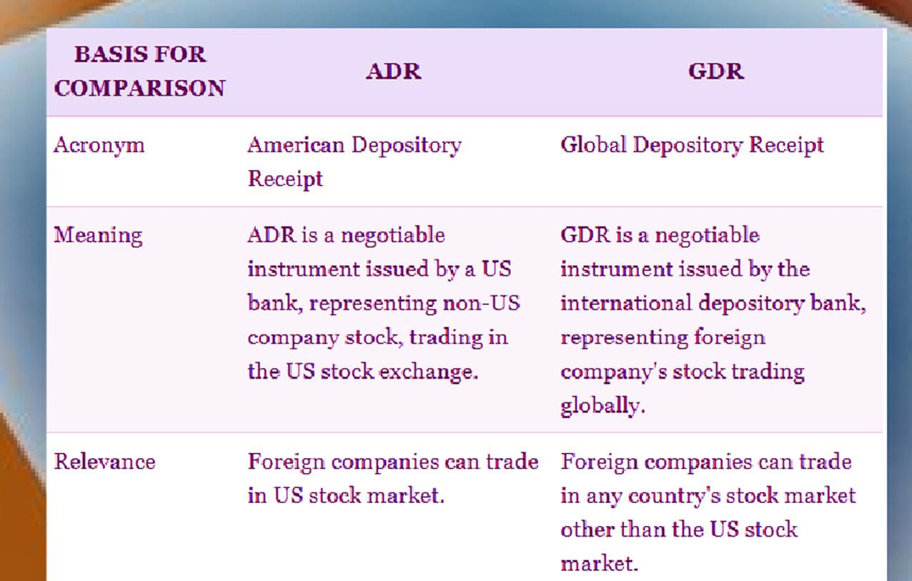

## Table of Contents

## What is a Global Depositary Receipt (GDR)?

A Global Depositary Receipt (GDR) is a type of financial instrument that allows a company to raise money in different countries at the same time. It represents shares in a foreign company and is traded on stock exchanges outside the company's home country. This makes it easier for investors from around the world to buy and sell shares in that company without dealing with different currencies and regulations.

GDRs are often used by companies that want to expand their investor base and raise capital internationally. They are typically issued by banks, which hold the actual shares of the company in a trust or custodian account. Investors then buy the GDRs, which are denominated in a major currency like the US dollar or the Euro, making them more accessible to a global audience.

## What is an American Depositary Receipt (ADR)?

An American Depositary Receipt (ADR) is a way for people in the United States to invest in foreign companies. It's like a certificate that represents a certain number of shares in a company from another country. These shares are held by a bank in the United States, and the ADR makes it easier for Americans to buy and sell these foreign stocks without dealing with different currencies or foreign stock markets.

ADRs are traded on major U.S. stock exchanges, just like regular stocks. This means that if you want to invest in a company from, say, Japan or Germany, you can do it through an ADR without having to figure out how to buy stocks on a foreign exchange. It's a simple and convenient way to diversify your investments and gain exposure to international markets.

## How do GDRs and ADRs differ in terms of their geographical focus?

GDRs and ADRs are both ways for companies to let people from other countries invest in them, but they focus on different parts of the world. GDRs, or Global Depositary Receipts, are used when a company wants to raise money from investors all around the world. They can be traded on many different stock exchanges outside the company's home country, not just in one specific place.

On the other hand, ADRs, or American Depositary Receipts, are more specific. They are designed for people in the United States who want to invest in foreign companies. ADRs are only traded on U.S. stock exchanges, which makes it easier for Americans to buy and sell shares in companies from other countries without leaving the U.S. market.

## What are the key benefits of investing in GDRs?

Investing in GDRs can help you spread your money across different countries. This means you're not just putting all your money into one place, which can be risky. If one country's economy isn't doing well, your investments in other countries might still be doing okay. This can help keep your money safer and potentially earn you more in the long run.

Another good thing about GDRs is that they make it easier to buy shares in companies from other countries. You don't have to worry about different currencies or learning how to use foreign stock markets. GDRs are traded in major currencies like the US dollar or the Euro, and they can be bought and sold on many stock exchanges around the world. This makes it simpler for you to invest in companies you believe in, no matter where they're from.

## What are the key benefits of investing in ADRs?

Investing in ADRs lets you put your money into companies from other countries without leaving the U.S. stock market. This is great because it's easy to buy and sell these shares just like you would with any other stock in the U.S. You don't have to worry about different currencies or figuring out how to use foreign stock markets. This makes it simpler and more convenient for you to invest in international companies.

Another benefit of ADRs is that they help you spread your investments across different countries. This is important because it reduces the risk of losing money if one country's economy has problems. By investing in companies from different parts of the world, you can keep your money safer and potentially earn more in the long run. ADRs give you a way to diversify your portfolio and gain exposure to global markets without much hassle.

## How do the regulatory environments for GDRs and ADRs differ?

The regulatory environment for GDRs can be a bit tricky because they are traded on many different stock exchanges around the world. Each country has its own rules and regulations for stocks, so companies that issue GDRs have to make sure they follow all these different rules. This can be complicated, but it also means that GDRs can be more flexible and available to a wider range of investors from different countries. The banks that issue GDRs need to keep track of all these regulations and make sure everything is done correctly.

On the other hand, ADRs are much simpler when it comes to regulations because they are only traded on U.S. stock exchanges. This means that companies issuing ADRs need to follow the rules set by the U.S. Securities and Exchange Commission (SEC). The SEC has strict rules about how companies can issue stocks and what information they need to share with investors. This makes it easier for companies to know exactly what they need to do, but it also means that ADRs are only available to investors who can use U.S. stock markets.

## What are the typical costs associated with buying and selling GDRs and ADRs?

When you buy or sell GDRs, you might have to pay a few different costs. One cost is the fee that the bank charges for holding the shares and issuing the GDRs. This is called a depositary fee, and it can be a small percentage of the value of the GDRs you're buying or selling. Another cost is the trading fee, which is what the stock exchange charges for making the trade happen. These fees can be different depending on which stock exchange you're using. Also, if you're buying GDRs in a different currency, you might have to pay a fee for changing your money into that currency.

For ADRs, the costs are a bit similar but focused on the U.S. market. You'll also have to pay a depositary fee to the bank that holds the shares and issues the ADRs. This fee can be charged as a percentage of the ADR's value or as a flat fee. Then, there's the trading fee from the U.S. stock exchange where the ADRs are traded. If the ADR is for a company from a country with different currency, you might have to pay a fee for converting your money. But since ADRs are traded in U.S. dollars, this might not always be necessary.

## How do the dividend payment processes compare between GDRs and ADRs?

When you own GDRs, you can get dividends from the foreign company, but the process can be a bit tricky. The company pays dividends in its home currency, and then the bank that issued the GDRs converts that money into the currency the GDRs are traded in, like the US dollar or Euro. After that, the bank sends the dividends to you, but they might take a small fee for handling the payment. Because GDRs can be traded on many different stock exchanges, the exact process and fees can be different depending on where you bought your GDRs.

For ADRs, the dividend process is a bit simpler because everything happens in the U.S. The foreign company pays dividends in its home currency, and the U.S. bank that issued the ADRs converts that money into U.S. dollars. Then, the bank sends the dividends to you, but they might also take a small fee for their work. Since ADRs are only traded on U.S. stock exchanges, the process is more straightforward, and you don't have to worry about different rules from different countries.

## What are the tax implications for investors in GDRs versus ADRs?

When you invest in GDRs, you need to think about taxes from different countries. The company that issued the GDRs might withhold some taxes on the dividends they pay out. This is called withholding tax, and the amount can be different depending on the country the company is from. You also have to pay taxes on your GDR investments in your own country. This can be tricky because you might have to deal with tax treaties between countries, which can change how much tax you pay. It's a good idea to talk to a tax advisor to understand all the taxes you might have to pay.

For ADRs, the tax situation is a bit simpler because you're dealing mostly with U.S. taxes. The foreign company might still withhold some taxes on the dividends, but you'll mainly be worried about U.S. taxes. The U.S. has tax treaties with many countries that can affect how much tax you pay on your ADR dividends. You'll need to report your ADR investments on your U.S. tax return and might have to pay capital gains tax if you sell your ADRs for a profit. It's still a good idea to talk to a tax advisor to make sure you're doing everything right and not paying more tax than you need to.

## How do the liquidity levels of GDRs compare to those of ADRs?

The liquidity of GDRs can vary a lot because they are traded on many different stock exchanges around the world. If a GDR is popular and traded a lot on one exchange, it might be easy to buy and sell it there. But if it's not traded as much on another exchange, it could be harder to find someone to trade with. This means that the ease of buying and selling GDRs can depend on which exchange you're using and how popular the GDR is in that market.

ADRs, on the other hand, are only traded on U.S. stock exchanges, so their liquidity is more straightforward. If an ADR is listed on a major U.S. exchange like the NYSE or NASDAQ, it's usually easier to buy and sell because there are a lot of investors in the U.S. market. This can make ADRs more liquid compared to GDRs, especially if the GDR is not as popular on the exchanges where it's traded.

## What are the risks associated with investing in GDRs and ADRs?

Investing in GDRs and ADRs can be a bit risky because you're putting your money into companies from other countries. One big risk is that the value of your investment can go up and down a lot because of changes in the foreign company's country. Things like political problems, economic troubles, or even natural disasters can affect the company's stock price. Also, if the currency of the country where the company is from changes a lot compared to your own currency, it can make your investment worth more or less money.

Another risk is that you might not know as much about the foreign company as you would about a company in your own country. This can make it harder to understand how well the company is doing and what might happen to its stock price in the future. Plus, if you're investing in GDRs, you have to deal with different rules and regulations from different countries, which can be confusing and might lead to unexpected costs or problems. With ADRs, you mostly have to follow U.S. rules, but you still need to understand how the foreign company works and what might affect its performance.

## How do GDRs and ADRs impact the global investment strategy of multinational corporations?

GDRs and ADRs help multinational corporations reach more investors from around the world. When a company issues GDRs, it can raise money from investors in many different countries at the same time. This is good because it lets the company get money from a bigger group of people, which can help it grow and do more business in different places. GDRs are traded on many stock exchanges, so investors from all over the world can buy them easily. This makes it easier for the company to become well-known and trusted in different markets.

ADRs are a bit different because they focus on investors in the U.S. When a multinational corporation issues ADRs, it can attract American investors who might not want to deal with foreign stock markets or different currencies. This is important because the U.S. has a lot of investors with a lot of money to spend, so getting their attention can help the company raise a lot of money. By using ADRs, the company can grow its business in the U.S. and use the money to expand even more around the world. Both GDRs and ADRs help companies spread their reach and get the money they need to keep growing.

## References & Further Reading

[1]: Karolyi, G. A. (1998). ["Why Do Companies List Shares Abroad? A Survey of the Evidence and Its Managerial Implications."](https://onlinelibrary.wiley.com/doi/abs/10.1111/1468-0416.00018) Financial Markets, Institutions & Instruments.

[2]: DeGennaro, R. P. (2005). ["The Pricing of Exchange-Rate Risk in U.S. Multinationals: The Case of ADRs."](https://scholar.google.com/citations?user=4DQ5ERUAAAAJ&hl=en) Journal of International Money and Finance.

[3]: Heffernan, S. A. (2003). ["Modern Banking."](https://books.google.com/books/about/Modern_Banking.html?id=s6JliwPbk0QC) Wiley.

[4]: Gagnon, L., & Karolyi, G. A. (2010). ["Multinational Financial Management."](https://www.cambridge.org/core/journals/journal-of-financial-and-quantitative-analysis/article/abs/volume-dynamics-and-multimarket-trading/24A77F7CC0A4FF8D308D29221B3537A5) Wiley.

[5]: Aldridge, I. (2013). ["High-Frequency Trading: A Practical Guide to Algorithmic Strategies and Trading Systems."](https://books.google.com/books/about/High_Frequency_Trading.html?id=6l0DDQAAQBAJ) Wiley.

[6]: Hull, J. C. (2017). ["Options, Futures, and Other Derivatives."](https://www.semanticscholar.org/paper/Options%2C-Futures%2C-and-Other-Derivatives-Hull/89bdee500c8623864fc9eb7a471546aa713acc44) Pearson.

[7]: Lopez de Prado, M. (2018). ["Advances in Financial Machine Learning."](https://www.amazon.com/Advances-Financial-Machine-Learning-Marcos/dp/1119482089) Wiley.